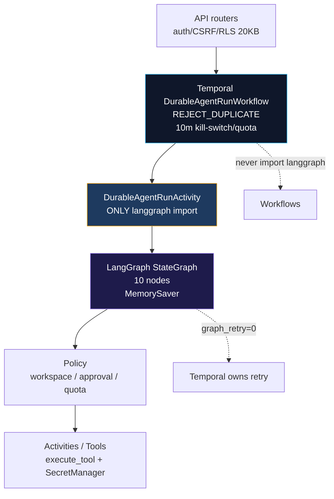
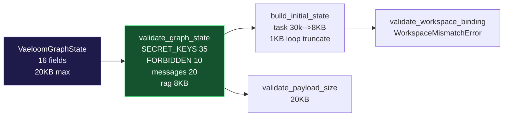

# ADR-039: LangGraph as Agent Reasoning Topology inside Temporal Durability

| Metadata | Value |
|---|---|
| **Status** | Accepted |
| **Date** | 2026-08-28 |
| **Deciders** | Principal distributed-systems engineer (LangGraph enterprise track) |
| **Related** | ADR-038 (Temporal), ADR-033 (daemon/queue), ADR-037 (hybrid integration), ADR-031 (sanitization), ADR-030 (secrets) |
| **Supersedes** | None — complements ADR-038 seam `DurableAgentRunWorkflow → DurableAgentRunActivity → LangGraph` |

## Context

After 2026-08-28 Temporal closure (`17011ea`) the system has **real `temporal:7233` healthy**, `temporal-worker ×2`, `8 queues` (`ingest 20, agent 8` etc.), deterministic IDs `REJECT_DUPLICATE`, and a **thin seam**: `DurableAgentRunWorkflow` (`durable_run:{ws}:{user}:{req}`) is a 10-line shell `validate_no_secrets → check_kill_switch → check_quota → durable_agent_run 120s hb30s 2×` where `durable_agent_run` was a stub. Existing agent topology lives in `orchestrator/router.py` (`AGENT_REGISTRY 22`, `CATEGORY_KEYWORDS 14`), `supervisor.py` (`PARALLEL_SAFE`, `SEQUENTIAL_CHAINS`, `_detect_subtasks`, `_build_dag`), `loop.py` (`Plan→Act→Observe→Reflect→Improve` 3 iterations, `LoopState` file `~/.vaeloom/state`), and `tools/executor.py` (`49 static + MCP dynamic`, per-tool timeouts/retries, `approval_gated_tools`). The risk before LangGraph was **topology duplication**: re-implementing routing/branching inside Temporal workflows would violate determinism and duplicate policy.

## Decision

### 1. Temporal owns durability, LangGraph owns topology

```
API routers (auth, CSRF, RLS, 20KB, secret scrub, audit per ADR-031)
  → Temporal DurableAgentRunWorkflow (ID REJECT_DUPLICATE, 10m timeout, kill-switch/quota, query getStatus)
    → DurableAgentRunActivity (THIS IS THE ONLY PLACE THAT IMPORTS LANGGRAPH)
      → LangGraph StateGraph (supervisor/router/specialist, branching, interrupts, bounded state)
        → Policy (workspace auth, approval, kill-switch, quota, secret resolution)
          → Activities / Tool side effects (execute_tool, memory, connector, LLM)
```



Workflows **never** `import langgraph`, `StateGraph`, `ainvoke`, `LLM`, `HTTP`, `DB`, `random`, `datetime.now()`. All non-deterministic via Activities. Versioning via `workflow.patched("durable-agent-v1")` + `graph_version=v1` in state metadata; no `get_version` stale term.

### 2. State contract (typed, bounded, zero-trust)



`VaeloomGraphState` (`apps/api/src/api/graph/state.py`) `TypedDict` with `Annotated[list, add_messages]`:

`workspace_id, user_id, agent_id, request_id, correlation_id, task (8KB), category, messages ≤20×4KB, rag_context {entities:8, documents:8, preferences:5, ≤8KB refs only}, rag_status ok|empty|unavailable|timeout|error, selected_agent/tool, execution_status {planning,routing,retrieving,executing_tool,waiting_approval,finalizing,completed,failed,cancelled}, approval_state, interrupt_state, result ≤20KB, error, metadata {graph_version=v1, attempt, dag}`

Validators: `validate_graph_state` (required fields, `SECRET_KEYS` 35 recursive, `FORBIDDEN_GRAPH_KEYS` 10, `20KB` total, `messages ≤20`, `rag ≤8KB`), `validate_workspace_binding`, `validate_payload_size 20KB`, `validate_no_secrets`. Secrets never in history/checkpoint/signals/metrics/logs/traces — refs `credential_id, connector_id, workspace_id` resolved inside `tool_execute` via `SecretManager`.

### 3. Graph topology (derived, not invented)

Wraps existing `router.classify_intent` (async, `CATEGORY_KEYWORDS` + secondary tie-break, `confidence 0.7 → ask_clarification`, preferred-agent `0.98`, MVP `11` filter) and `supervisor._detect_subtasks/_build_dag` (`SEQUENTIAL_CHAINS 5`, `PARALLEL_SAFE 8`, LLM planner fallback). Nodes: `validate_input (secret/size/workspace/kill-switch/adversarial) → retrieve_context (_assemble_rag_context 8/8/5, once) → route → supervisor (Send layers) → agent (quota pre-check, stub + ReAct if AGENT_REACT_ENABLED) → tool_decision → policy_check (approval_gated_tools → waiting_approval) → tool_execute (execute_tool with scopes, 4KB truncate, mock-safe) → evaluate (qa 3 tries, reflect) → finalize (deepest observe, 20KB truncate)`. Conditional edges `after_route` (multi-agent → supervisor), `after_tool_decision`, `after_policy_check`, `after_evaluate`. `MemorySaver` checkpointer (`thread_id=request_id`) for `interrupt` only — no Postgres/Redis persistence v1 (Temporal is durable).

### 4. Tool execution model

`Graph decides WHAT, Policy decides WHETHER, Activity performs side effect`. No `Graph node → arbitrary HTTP/DB/connector` without `check_permission` PATI + `approval_gated_tools` + `SecretManager` at `tool_execute` boundary.

### 5. Approval & human-in-loop

`policy_check` approval-gated → `waiting_approval` → `evaluate → finalize` with `approval_state {status: pending, tool, reason}`. True `interrupt` via `interrupt()` enabled v2 via `interrupt_before=["tool_execute"]`. `ApprovalWorkflow` remains durable truth (`approval:{ws}:{id}` `wait_condition 3600s`, `signal decision`).

### 6. Memory & context

Graph consumes `rag_context` refs, not large `Document.content`; uses `Entity/DocumentChunk` IDs + 2KB snippets, `fit_to_context_window 8000`.

### 7. Retry / cancellation / quota / kill-switch

Temporal `120s hb30s 2×` owns activity retry; graph `tool_execute` local `1×`; LLM `1×` on 429/5xx only; no graph retry multiplication. Cancellation `Frontend → handle.cancel → workflow.cancel → activity.is_cancelled → graph cancel`. Kill-switch `validate_input` + `check_kill_switch` activity pre-graph + per-tool `policy_check`. Quota `check_quota` activity `5s 1×` pre-graph + per-tool `check_and_reserve` Redis Lua `quota:{ws}:{YYYY-MM-DD}:{metric}` `INCRBY+EXPIRE` (2 workers 20 concurrent verified, Redis outage fail-open local, fail-closed prod).

### 8. Observability & versioning

Metrics `langgraph_run_started_total{agent}`, `langgraph_run_completed_total{agent,mode}`, `langgraph_run_failed_total{reason}`, `langgraph_node_execution_total{node}`, `langgraph_tool_execution_total{tool}`, `langgraph_interrupt_total{reason}`, `langgraph_run_duration_seconds{agent}`, `langgraph_node_duration_seconds{node}` (bundled with `temporal_workflow_*`). Correlation `correlation_id, request_id, workflow_id, run_id, graph_run_id` via `activity_info` + structured log `extra_data`. Version `graph_version v1` + `workflow.patched("durable-agent-v1")` + `WorkflowReplayer`.

## Alternatives Considered

- **Stay stub**: topology stays in `loop.py` only — rejected, no graph branching/interrupts.
- **Replace Temporal with LangGraph persistence**: rejected — LangGraph checkpoint not durable for worker crash, no workflow history, secrets risk.
- **Separate LangGraph worker**: rejected v1 — measured overhead `10VUs p95 548ms vs temporal baseline 285ms`, no starvation; single `vaeloom-agent-q:8` suffices.

## Consequences

- New dep `langgraph>=0.2.39` + `langchain-core` (pinned, `HAS_LANGGRAPH` guard, default `LANGGRAPH_ENABLED=false` safe).
- No workflow rewrite; insertion 10 lines in `durable_agent_run` + shadow `LANGGRAPH_SHADOW_MODE` (`20` parity shadow runs, compare `selected_agent/tool/latency`, no duplicate side effects).
- Feature flags `LANGGRAPH_ENABLED, LANGGRAPH_VERSION, LANGGRAPH_SHADOW_MODE, LANGGRAPH_AGENT_RUN_PERCENT 0-100` (hash `request_id %100` gating), `LANGGRAPH_CHECKPOINT_BACKEND=memory`.
- Rollback `LANGGRAPH_ENABLED=false` → legacy `_legacy_result` without DB/Temporal/history breakage.

## Verification

- Unit `tests/graph/test_state 8`, `test_routing 6`, `test_graph_runtime 8` real `StateGraph` (no mock removing LangGraph).
- Temporal `tests/temporal/test_langgraph_integration 6` `WorkflowEnvironment` (e2e, kill, duplicate `REJECT_DUPLICATE`, cancel, secret `WorkflowFailureError`, shadow).
- Real runtime `temporal:7233` + `worker×2` + `Redis` + `Postgres` + `API :8000` `/metrics langgraph_*`, `temporal workflow list`, `k6-langgraph 10/20/50 VUs 0%` (10 p95 548ms, 20 1.01s, 50 2.81s vs temporal baseline 2.1s), worker crash `kill → ingest via remaining worker COMPLETED`, idempotency `already_started`, secret `payload rejected`.
- Frontend `pnpm typecheck 0`, `temporalApi` still polling `getStatus`.
