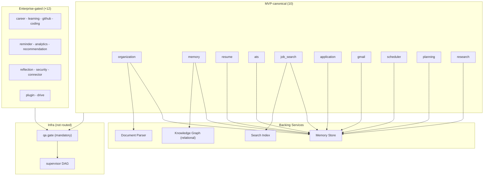

# MVP Agent Inventory

> **Purpose:** Define the MVP AI agents, their capabilities, and execution
> patterns **Status:** ✅ Upgraded to enterprise quality (code-aligned
> 2026-09-15) **Owner:** AI Team **Version:** 2.1 **Last Updated:** 2026-09-15
> **Code truth:** `apps/api/src/api/orchestrator/router.py:64-87,416-437`
> **Note:** v2.0 names (Document Ingestion, Auto-Organization, Deadline
> Detection, Tailored Application, Master Resume, Memory Graph, Gmail Digest)
> were conceptual and do not match handler modules. The table below maps
> concepts → actual routable agents. MVP-canonical = 10; full registry = 22.

## Agent Architecture

## Agent Summary (concept → code mapping)

| #   | Routable agent | Concept mapping      | Handler                                |
| --- | -------------- | -------------------- | -------------------------------------- |
| 1   | organization   | Auto-Organization    | `agents/organization_agent/handler.py` |
| 2   | memory         | Memory Graph         | `agents/memory_agent/handler.py`       |
| 3   | resume         | Master Resume        | `agents/resume_agent/handler.py`       |
| 4   | ats            | ATS scoring          | `agents/ats_agent/handler.py`          |
| 5   | job_search     | Job Search           | `agents/job_search_agent/handler.py`   |
| 6   | application    | Tailored Application | `agents/application_agent/handler.py`  |
| 7   | gmail          | Gmail Digest         | `agents/gmail_agent/handler.py`        |
| 8   | scheduler      | Deadline Detection   | `agents/scheduler_agent/handler.py`    |
| 9   | planning       | planning support     | `agents/memory/planning_agent.py`      |
| 10  | research       | research support     | `agents/research_agent/handler.py`     |

> Model/schedule columns from v2.0 (Claude Sonnet/Haiku, Daily/Hourly/Weekly)
> are not in code — runtime uses `llm_service` + `model_router` + scheduler
> agent. Per-agent model pinning is unresolved; do not treat v2.0 values as
> truth.
