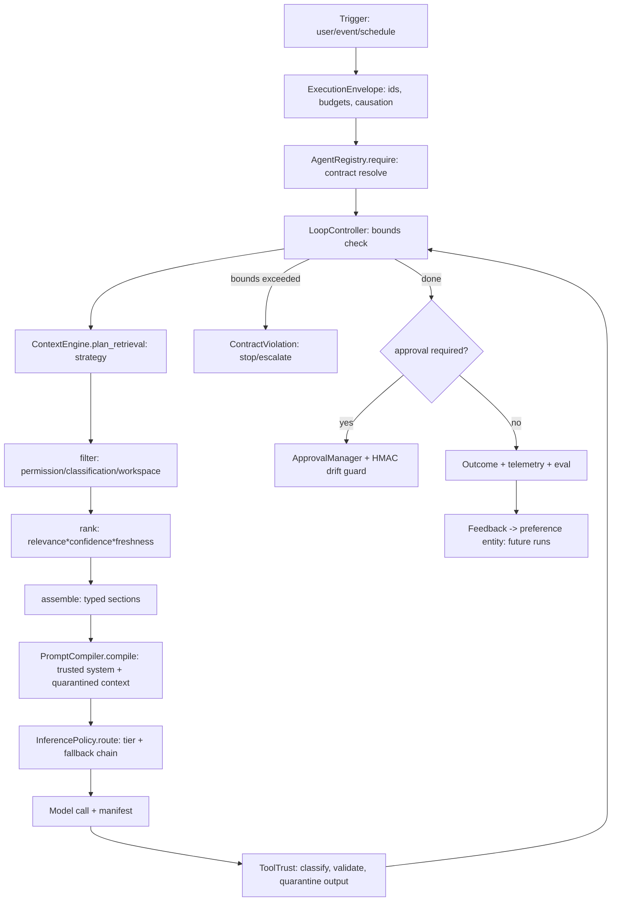

# Agent Harness — Enterprise Intelligence Runtime (Canonical)

> **Status:** ✅ IMPLEMENTED (v1: deterministic control plane) | **Owner:** AI
> Team **Implements:** PromptCompiler · ContextEngine · AgentContracts ·
> LoopController · InferencePolicy · ToolTrust **Code:**
> `apps/api/src/api/services/{prompt_compiler,context_engine,agent_contracts,inference_policy}.py`
> **Tests:** `apps/api/tests/test_harness_v1.py` (20/20 pass) **Companions:**
> `docs/ai/{Prompt-Engineering,Agentic-RAG,Model-Routing,Tool-Calling,Evaluation,Guardrails}.md`
> (existing, still canonical for their slices)

## 1. What this is

The Harness is the **control plane for intelligence**: the deterministic
envelope around every probabilistic agent step. Memory+Context is the knowledge
plane, Agents+Loops+Graphs the execution plane, Tools+MCP the capability plane,
Inference the compute plane, Eval+Learning the improvement plane,
Policy+Approval+Audit the trust plane, Observability+Cost the operations plane.

## 2. Execution lifecycle (actual)

## 3. Prompt compilation (IMPLEMENTED)

`PromptCompiler.compile()` enforces layer authority
(platform>safety>agent>task>output>intent>state>evidence>memory>tool>observations),
quarantines all UNTRUSTED layers in `<untrusted-data>` with an explicit guard
sentence when override markers fire, truncates low-priority layers first under
token budget, and emits a manifest (prompt_id/version, compiler v1.0.0,
agent/version, task_type, model, generation_config, context_manifest,
token_estimate, content_hash). System block is never truncated — constraints are
sacred.

## 4. Context engineering (IMPLEMENTED as policy layer)

`plan_retrieval()` picks vector/keyword/graph/temporal/hybrid/iterative by cheap
legible heuristics (LLM re-ranker stays downstream in `search_ranking`).
`filter_items()` enforces permission scopes, classification ceiling, confidence
/ freshness floors, and `ws:` provenance workspace binding.
`rank/compress/assemble/validate` produce typed `## kind` sections with (conf,
src) annotations — never one blob — and `validate_assembly()` blocks
cross-workspace leaks and SECRET-to-external-provider egress.

## 5. Contracts + loops (IMPLEMENTED)

`AgentContract` carries mission, responsibilities + non-responsibilities,
allowed/forbidden tools (MCP `mcp__*` deny-by-default), memory read/write
scopes, autonomy (OBSERVE..AUTO), risk class, approval list, LoopPolicy,
model/timeout/budget, version/status lifecycle. `AgentRegistry` (8 seeded
contracts; gmail forbids `gmail_send`, scheduler/github APPROVAL_REQUIRED)
rejects unknown/DEPRECATED agents. `LoopController` enforces max
iterations/tool-calls/sub-agents/tokens/cost/duration, 3x duplicate-action loop
guard, A→B→A delegation-cycle detection, and `ExecutionEnvelope.child()`
propagates only a share of _remaining_ budget to sub-agents. PARTIAL: hot-path
`agent_service.execute_agent` (system_prompt+tools) and `orchestrator/loop.py`
5-phase loop do not yet resolve contracts — tracked as next wiring step.

## 6. Inference + tool trust (IMPLEMENTED as additive policy)

`route()` escalates high/critical risk to powerful tier, simple/fast to fast
tier, complex/>6k context to powerful, reroutes around unhealthy providers with
a recorded fallback chain + pre-call cost estimate. `classify_tool()` maps
READ..DESTRUCTIVE (unknown MCP → ACT). `sanitize_tool_output()` quarantines,
`validate_tool_output()` checks required fields/types, `idempotency_key()` binds
(execution, tool, params) so retries never replay a different action.

## 7. What remains (honest labels)

| Area                                                                       | Status                        | Next                                                                                            |
| -------------------------------------------------------------------------- | ----------------------------- | ----------------------------------------------------------------------------------------------- |
| Wire contracts into `agent_service.execute_agent` + `orchestrator/loop.py` | PLANNED                       | resolve contract, `check_tool` pre-dispatch, contract→PromptLayers                              |
| True hybrid BM25+RRF+rerank on hot path                                    | PARTIAL                       | retrieval.py is hybrid-lite; planner ready, ranker exists but uncalled                          |
| Prompt caching, per-phase OTel spans                                       | NOT IMPLEMENTED               | needs infra change, not policy                                                                  |
| Reflection/consolidation cron (learning closes the loop)                   | DESIGNED, NOT OPERATIONALIZED | schedule ReflectionAgent; eval_harness is mock-scored                                           |
| Durable checkpoints cross-process                                          | PARTIAL                       | LoopState is file-local; Temporal owns durability when enabled (`temporal_enabled=False` today) |

## 8. Zero-trust answers

Can an agent exceed its mission? Contract layer says no; hot path not yet wired
→ guard at review until wired. Unauthorized tools? `check_tool` + MCP
deny-by-default (new) + existing scope check + approval gate. External tool
privilege escalation? ACT-by-default + quarantine. Canonical memory corruption?
`check_memory_write` scopes + supersession (new gate, storage already
versioned). Stale context dominating? Budget + ranking + truncation order.
Retrieved data overriding policy? Quarantine + guard sentence + flagged
manifest. Infinite loop? LoopController ceilings + cycle guards (adopt in
loop.py next). Deadlock? Delegation-chain detection; supervisor DAG bounded.
Resume after failure? Envelope is serializable; durable resume needs Temporal.
Model failure? Fallback chain recorded. Self-modification without eval? Registry
status lifecycle; no auto-promote path exists. Cross-tenant leak? Workspace
binding at filter + validate + RLS 42/42. Unlimited spend? Envelope budgets +
spend/quota gate in loop.py + pre-call estimate. Explainability? Manifest +
snapshot + approval HMAC + audit trail.
