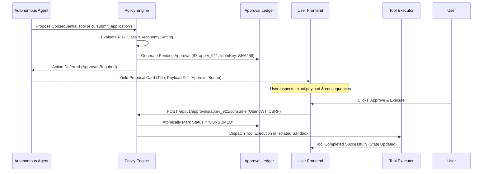

# Deterministic Policy Engine & Security Authorization Boundary

**Document Identifier**: `ARCH-POLICY-01`  
**Version**: `1.0.0`  
**Status**: APPROVED DESIGN SPECIFICATION

---

## 1. Zero-Trust Security Boundary

The AI model operates inside a strict **Untrusted Execution Domain**. The policy
engine operates inside the **Trusted Kernel Domain**.

```
┌────────────────────────────────────────────────────────────────────────┐
│                     UNTRUSTED EXECUTION DOMAIN                         │
│                                                                        │
│   User Prompt (Untrusted Input)                                        │
│   Retrieved Documents (Untrusted Data)                                 │
│   Tool Observations (Untrusted External State)                         │
│   AI Model Reasoning (Untrusted Generative Text)                       │
│                                                                        │
│   Model can only emit: PROPOSALS (Intent, ToolName, Arguments)         │
└───────────────────────────────────┬────────────────────────────────────┘
                                    │
                         Cryptographic Barrier
                                    │
┌───────────────────────────────────▼────────────────────────────────────┐
│                       TRUSTED KERNEL DOMAIN                            │
│                                                                        │
│   TenantMiddleware & RLS GUCs (app.tenant_id, app.workspace_id)        │
│   Deterministic Policy Engine (Permissions, Rate Limits, Entitlements) │
│   Human-in-the-Loop (HITL) Cryptographic Approval Gate                 │
│   PostgreSQL Row-Level Security (RLS) Enforced at Engine Layer         │
│   Sandboxed Tool Executor (Subprocess Isolation, SSRF Guard)           │
│   Immutable Audit Ledger (Cryptographic Hash Chaining)                 │
└────────────────────────────────────────────────────────────────────────┘
```

---

## 2. Autonomy Tiers & Action Classification

Every tool and agent capability is strictly mapped to an autonomy tier:

| Action Level | Description                                   | Execution Policy                                       | Example Tools                                         |
| :----------- | :-------------------------------------------- | :----------------------------------------------------- | :---------------------------------------------------- |
| **READ**     | Non-mutating state inspection                 | Auto-executes within rate quota                        | `search_documents`, `query_graph`, `fetch_job_status` |
| **SUGGEST**  | Formulates candidate recommendation           | Returns proposal card to user                          | `suggest_next_step`, `recommend_career_path`          |
| **DRAFT**    | Creates non-destructive draft artifact        | Writes draft to temporary staging                      | `draft_cover_letter`, `compile_resume_variant`        |
| **WRITE**    | Mutates reversible workspace data             | Auto-executes if within daily limit; logged            | `create_folder`, `update_resume_section`              |
| **ACT**      | Consequential, irreversible external mutation | **HARD APPROVAL GATE**: Must receive user signed token | `apply_job_online`, `delete_document`, `send_email`   |

---

## 3. Approval Gate Lifecycle



---

## 4. Multi-Tenant Isolation & IDOR Guards

1. **Context Derivation**: Tenant ID and User ID are extracted strictly from
   cryptographically signed JWT tokens or session state. Headers like
   `X-Tenant-ID` or JSON body payloads are verified against the token claims. If
   a mismatch is detected, the request fails closed (`HTTP 403 Forbidden`).
2. **PostgreSQL RLS Session Injection**:
   ```sql
   SELECT set_config('app.tenant_id', :tenant_id, true);
   SELECT set_config('app.workspace_id', :workspace_id, true);
   SELECT set_config('app.user_id', :user_id, true);
   ```
   All database queries execute within these transaction-scoped settings.
   Attempting to query or mutate a row belonging to another workspace returns 0
   rows or triggers a database constraint error.
3. **SSRF Guard**: All external connector and HTTP requests pass through
   `utils/url_guard.py`:
   - HTTPS scheme enforced.
   - Private, loopback, and cloud metadata IPs (`169.254.169.254`, `127.0.0.1`,
     `10.0.0.0/8`) are rejected before socket connection.
