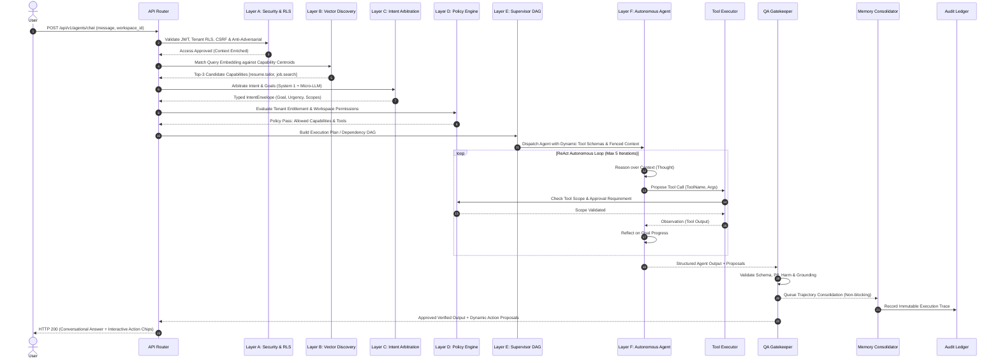
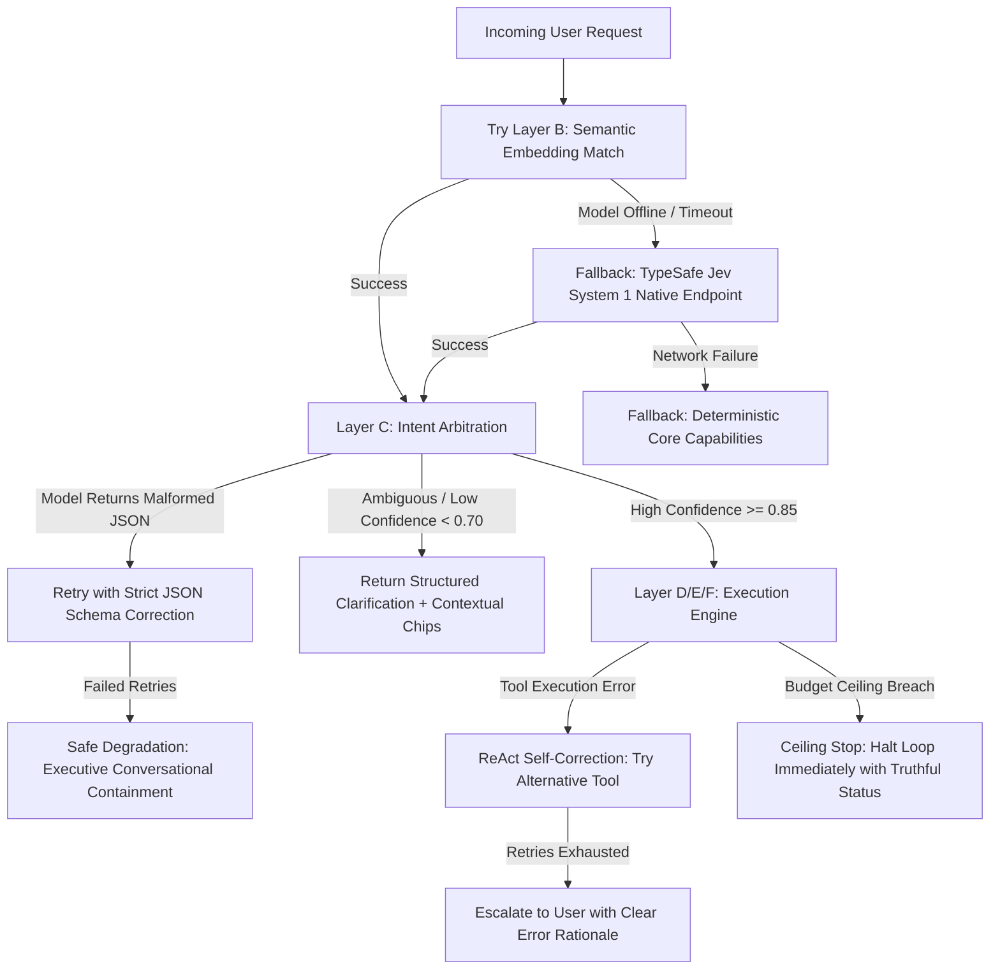

# Enterprise Agentic Routing & Cognitive Orchestration Architecture

**Document Identifier**: `ARCH-ROUTING-01`  
**Version**: `1.0.0`  
**Classification**: Enterprise Core Architecture  
**Status**: APPROVED DESIGN SPECIFICATION

---

## 1. Architectural Philosophy

Vaeloom enforces a strict separation between **Semantic Intelligence** (the
LLM/embeddings) and **Deterministic Governance** (policies, permissions, tenant
boundaries, budgets).

The LLM is responsible for **understanding**, **planning**, and
**synthesizing**.  
The deterministic engine is responsible for **authorizing**, **gating**, and
**accounting**.

Under no circumstances may an AI model or prompt alter an authorization rule,
execute a tool outside workspace scopes, fabricate permissions, or bypass
human-in-the-loop (HITL) approval gates.

---

## 2. The 6-Layer Hybrid Architecture

```mermaid
flowchart TD
    UI["1. User Request (Input, WorkspaceID, Identity)"] --> LA["Layer A: Deterministic Security & IDOR Gate"]

    subgraph LayerA["Layer A — Deterministic Safety & Context"]
        LA --> CSRF["CSRF Verification"]
        CSRF --> RLS["Tenant & Workspace Access Verification (RLS)"]
        RLS --> ADV["Adversarial Prompt & Injection Pre-Screen"]
    end

    ADV --> LB["Layer B — Cheap Semantic Candidate Generation"]

    subgraph LayerB["Layer B — Fast Semantic Candidate Retrieval"]
        LB --> EMB["Generate 1536-dim Intent Vector"]
        EMB --> CENT["Cosine Match against Agent Capability Centroids"]
        CENT --> CANDS["Extract Top-K Candidate Capabilities"]
    end

    CANDS --> LC["Layer C — Semantic Intent & Goal Arbitration"]

    subgraph LayerC["Layer C — Cognitive Arbitration & Intent Envelope"]
        LC --> JEV["System 1 Deterministic Fast-Choice (<50ms)"]
        JEV --> AMB{"Ambiguous or Novel?"}
        AMB -- "Yes" --> LLMARB["Micro-LLM Semantic Arbitrator (Pydantic RoutingDecision)"]
        AMB -- "No" --> ENV["Assemble IntentEnvelope"]
        LLMARB --> ENV
    end

    ENV --> LD["Layer D — Deterministic Policy & Entitlement Gate"]

    subgraph LayerD["Layer D — Policy, Entitlement & Permission Gate"]
        LD --> ENT["Entitlement / Tier Check (MVP vs Enterprise)"]
        ENT --> PERM["Workspace Permission & Capability Allowlist"]
        PERM --> BUDG["Workspace & User Execution Budget Validation"]
    end

    BUDG --> LE["Layer E — Execution & Tool Planning"]

    subgraph LayerE["Layer E — Execution & Tool Planning"]
        LE --> DAG["Task Decomposition & Dependency DAG (Supervisor)"]
        DAG --> TPLAN["Tool Plan & Autonomy Level (READ/SUGGEST/WRITE/ACT)"]
        TPLAN --> APPR{"Consequential Action?"}
        APPR -- "Requires Approval" --> PROPOSAL["Generate Approval Proposal Card"]
        APPR -- "Pre-Approved" --> LF["Layer F — Agentic Execution Engine"]
    end

    PROPOSAL --> UI_WAIT["Surface Proposal to User (Awaiting Approval)"]

    subgraph LayerF["Layer F — Autonomous Agentic Execution"]
        LF --> REACT["ReAct Dynamic Reasoning Loop (Ollama Cloud Gemma 4 31B)"]
        REACT --> TOOL_EXEC["Sandboxed Tool Executor (SSRF & Rate-Guarded)"]
        TOOL_EXEC --> OBS["Observe Tool Results & Format Feedback"]
        OBS --> REFLECT["Self-Reflection & Progress Verification"]
    end

    REFLECT --> QA["Layer G — QA Gatekeeper & Groundedness"]

    subgraph LayerG["Layer G — Verification & Memory Consolidation"]
        QA --> SCHEMA_CHK["Pydantic Schema & PII Scrubbing"]
        SCHEMA_CHK --> FENCE_CHK["Grounding & Provenance Verification"]
        FENCE_CHK --> MEM_WRITE["Trajectory Consolidation into Memory Graph"]
        MEM_WRITE --> AUDIT["Immutable Audit Ledger Recording"]
    end

    AUDIT --> RESP["Final Sanitized Response + Dynamic Action Proposals"]
```

---

## 3. Strict Separation of Responsibilities

| Responsibility Area           | Deterministic System (Code / DB / Rules)                          | Semantic Layer (LLM / Embeddings)                               |
| :---------------------------- | :---------------------------------------------------------------- | :-------------------------------------------------------------- |
| **User Identity & Tenant**    | **100% Deterministic** (JWT, PostgreSQL RLS, GUCs)                | Forbidden from altering or guessing                             |
| **Tool Execution Rights**     | **100% Deterministic** (Workspace scopes, permissions)            | Proposes tool invocation; cannot execute directly               |
| **Destructive Action Safety** | **100% Deterministic** (HITL Approval Gate, cryptographic tokens) | Identifies risk; cannot approve its own proposal                |
| **Execution Budgets**         | **100% Deterministic** (Max tokens, loop timeouts, dollar limits) | Bound by budgets; halts on ceiling breach                       |
| **Intent Understanding**      | Fallback for known deterministic commands (`/reset`)              | **Primary Authority** (extracts semantic goals, entities, tone) |
| **Task Decomposition**        | Validates dependency DAG cycles and topology                      | **Primary Authority** (breaks complex goals into sub-tasks)     |
| **Content Synthesis**         | Fences untrusted data; enforces Jinja2 schemas                    | **Primary Authority** (drafts resumes, letters, answers)        |
| **Grounding Verification**    | Asserts citation references against retrieved doc IDs             | Self-critiques statements against source evidence               |

---

## 4. End-to-End Execution Sequence

---

## 5. Failure Modes & Graceful Degradation Hierarchy

---

## 6. Observability & Audit Traceability

Every execution cycle emits an OpenTelemetry span containing:

- `vaeloom.request_id`: UUIDv4
- `vaeloom.tenant_id`: UUIDv4
- `vaeloom.workspace_id`: UUIDv4
- `vaeloom.routing_version`: SemVer string (e.g. `2.0.0`)
- `vaeloom.intent_confidence`: Float `[0.0, 1.0]`
- `vaeloom.selected_capability`: String identifier (e.g. `career.resume.tailor`)
- `vaeloom.tool_calls_count`: Integer
- `vaeloom.iteration_count`: Integer
- `vaeloom.total_latency_ms`: Float
- `vaeloom.tokens_used`: Integer
- `vaeloom.estimated_cost_usd`: Float
