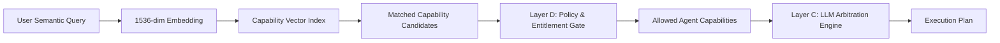

# Capability-Based Agent Discovery & Capability Registry Specification

**Document Identifier**: `ARCH-CAPABILITY-01`  
**Version**: `1.0.0`  
**Status**: APPROVED DESIGN SPECIFICATION

---

## 1. Architectural Philosophy: Capabilities over Identifiers

In legacy systems, routing maps queries to static string identifiers (e.g.
`"resume"`, `"job_search"`). This tightly couples the router to specific agent
names, making the addition of plugins, multi-tenant custom agents, or dynamic
MCP tools impossible without editing router code.

In Vaeloom's enterprise architecture:

- **Agents and Tools publish machine-readable Capability Manifests**.
- The router discovers and arbitrates **Capabilities**, not agent names.
- Multiple agents may implement or collaborate on a single capability.
- Capability availability is filtered deterministically by workspace
  entitlements, licenses, and permissions before execution.

---

## 2. Core Schemas

### 2.1 `AgentCapabilityManifest` (v1.0.0)

Every agent registers a declarative manifest:

```python
class RiskClass(str, Enum):
    LOW = "low"            # Read-only document retrieval, analytics
    MEDIUM = "medium"      # Document drafting, classification
    HIGH = "high"          # File reorganization, external email drafting
    CRITICAL = "critical"  # Account deletion, irreversible credential rotation

class AutonomyLevel(str, Enum):
    READ = "read"          # Passive inspection only
    SUGGEST = "suggest"    # Proposes actions; requires user click to execute
    DRAFT = "draft"        # Prepares candidate artifact for human review
    WRITE = "write"        # Modifies workspace resources within quota
    ACT = "act"            # Fully autonomous multi-step execution

class AgentCapabilityManifest(BaseModel):
    capability_id: str = Field(..., description="Unique reverse-DNS capability identifier (e.g. 'career.resume.tailor')")
    agent_id: str = Field(..., description="Agent registry identifier (e.g. 'resume_agent')")
    display_name: str = Field(..., description="Human-readable title")
    description: str = Field(..., description="Detailed semantic description used for embedding centroid matching")
    semantic_exemplars: list[str] = Field(default_factory=list, description="High-dimensional embedding exemplars")

    # Tool Requirements & Boundaries
    required_tools: list[str] = Field(default_factory=list)
    optional_tools: list[str] = Field(default_factory=list)
    forbidden_tools: list[str] = Field(default_factory=list)

    # Memory & Context Scopes
    supported_memory_scopes: list[str] = Field(default_factory=list)  # e.g. ['career', 'skills', 'timeline']
    required_context: list[str] = Field(default_factory=list)         # e.g. ['active_resume_id', 'target_role']

    # Governance & Safety
    risk_class: RiskClass = RiskClass.LOW
    default_autonomy: AutonomyLevel = AutonomyLevel.SUGGEST
    requires_approval_above: AutonomyLevel = AutonomyLevel.SUGGEST
    rate_limit_per_minute: int = 30

    # Cost & Performance Classes
    latency_class: str = "interactive"  # 'interactive' (<2s), 'standard' (<10s), 'batch' (>30s)
    cost_class: str = "standard"        # 'low', 'standard', 'high'
    tier_requirement: str = "mvp"       # 'mvp' vs 'enterprise'
```

---

## 3. Capability Resolution Lifecycle



---

## 4. Canonical Capability Mapping

| Capability ID                  | Description                       | Default Agent       | Required Memory Scopes           | Risk Class | Tier       |
| :----------------------------- | :-------------------------------- | :------------------ | :------------------------------- | :--------- | :--------- |
| `career.resume.tailor`         | Tailor CV to target role          | `ResumeAgent`       | `career`, `skills`, `experience` | MEDIUM     | MVP        |
| `career.resume.ats_audit`      | Semantic ATS keyword audit        | `ATSAgent`          | `skills`, `document`             | LOW        | MVP        |
| `career.job.search`            | Discover and filter job postings  | `JobSearchAgent`    | `preference`, `location`         | LOW        | MVP        |
| `career.application.draft`     | Prepare application submission    | `ApplicationAgent`  | `career`, `profile`              | MEDIUM     | MVP        |
| `workspace.doc.organize`       | Deduplicate and organize files    | `OrganizationAgent` | `document`, `organization`       | HIGH       | MVP        |
| `workspace.calendar.plan`      | Meeting and deadline scheduling   | `SchedulerAgent`    | `timeline`, `event`              | MEDIUM     | MVP        |
| `executive.companion.scaffold` | Empathy, containment, OARS        | `ConversationAgent` | `preference`, `profile`          | LOW        | MVP        |
| `developer.code.review`        | Technical code and interview prep | `CodingAgent`       | `project`, `skills`              | LOW        | Enterprise |
