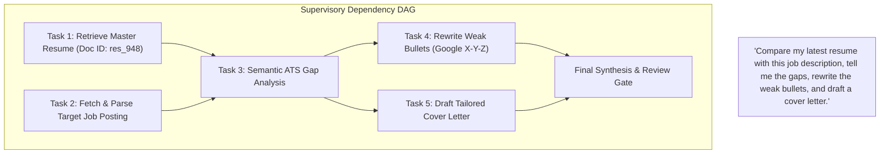

# Execution Planning, Dynamic DAGs & Procedural Ladder Eradication

**Document Identifier**: `ARCH-EXEC-PLAN-01`  
**Version**: `1.0.0`  
**Status**: APPROVED DESIGN SPECIFICATION

---

## 1. Eradication of the Procedural Ladder (`loop.py:2340-2700`)

### 1.1 The Legacy Anti-Pattern

In the legacy orchestrator, `act_phase()` in `loop.py` contained a 345-line
hardcoded procedural dispatcher:

```python
# LEGACY PROCEDURAL LADDER (DEPRECATED):
if agent_type == "OrganizationAgent" or registry_key == "organization":
    return _dispatch_with_approval(request, agent, "file_organize", ...)
if agent_type == "ResumeAgent" or registry_key == "resume":
    return agent.tailor_resume(...)
if agent_type == "CareerAgent" or registry_key == "career":
    return agent.analyze_career_path(...)
```

**Why this is an architectural failure**:

1. The orchestrator must know the domain-specific Python method signatures of
   every agent.
2. It bypasses autonomous LLM reasoning—the orchestrator forces which
   sub-function executes based on keywords.
3. Adding a new agent, dynamic plugin, or MCP tool requires surgical edits to
   `loop.py`.

### 1.2 The Enterprise Replacement Architecture

The procedural ladder is replaced by **Universal Autonomous ReAct Execution**:

```
ExecutionPlan
     ↓
AgentExecutor.execute_plan()
     ↓
LLM ReAct Loop (Dynamic Tool Invocations via JSON Schema)
     ↓
Sandboxed Tool Dispatcher (SSRF & Permission-Guarded)
     ↓
Observation -> Reflection -> Termination Check
```

Every agent implements a standard, uniform contract:

```python
class BaseAgent(ABC):
    @abstractmethod
    async def execute(self, plan: ExecutionPlan, context: AgentExecutionContext) -> AgentExecutionResult:
        pass
```

The agent inspects its allowed tools (provided dynamically as JSON schemas in
the system prompt), uses the LLM to decide tool invocations, and returns
structured results.

---

## 2. Multi-Agent Semantic Task Decomposition (Supervisor Dynamic DAG)

### 2.1 The Legacy Anti-Pattern

In `router.py:53`:

```python
# LEGACY HEURISTIC (DEPRECATED):
def _is_complex_multi_agent(message: str) -> bool:
    if len(message.split()) < 8: return False
    cats = sum(1 for kws in CATEGORY_KEYWORDS.values() if any(kw in msg_lower for kw in kws))
    return cats >= 2
```

Counting words and category hits is not semantic decomposition. A 7-word
multi-step command is missed, while a wordy single-intent question is falsely
decomposed.

### 2.2 Enterprise Dynamic Dependency DAG

When the Semantic Intent Arbitrator detects multiple dependent or parallel
goals, the **Supervisor Engine** builds a validated execution DAG:



### 2.3 DAG Execution Invariants

1. **Parallel Execution**: Independent nodes (`Task 1` and `Task 2`) execute
   concurrently via `asyncio.gather()` within workspace rate limits.
2. **Sequential Dependency**: Dependent nodes (`Task 3`) block until required
   inputs from parent nodes are verified and schema-validated.
3. **Cycle Prevention**: Topological sort validates the graph before execution.
   Cyclic graphs fail fast with `CycleDetectedError`.
4. **Failure Containment**: If a non-critical leaf task fails (e.g.
   `Task 5: Cover Letter`), the DAG returns a partial success containing the
   completed resume and gap analysis, with clear degraded status.
