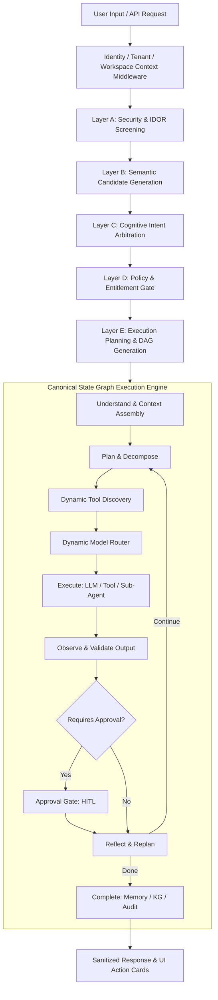
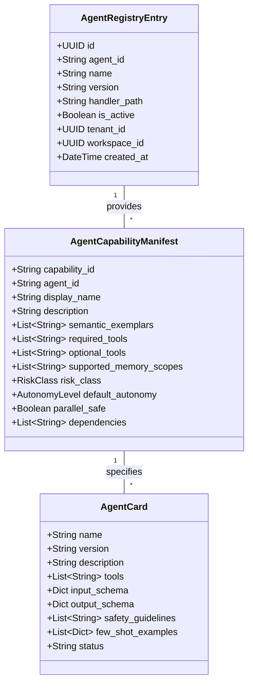
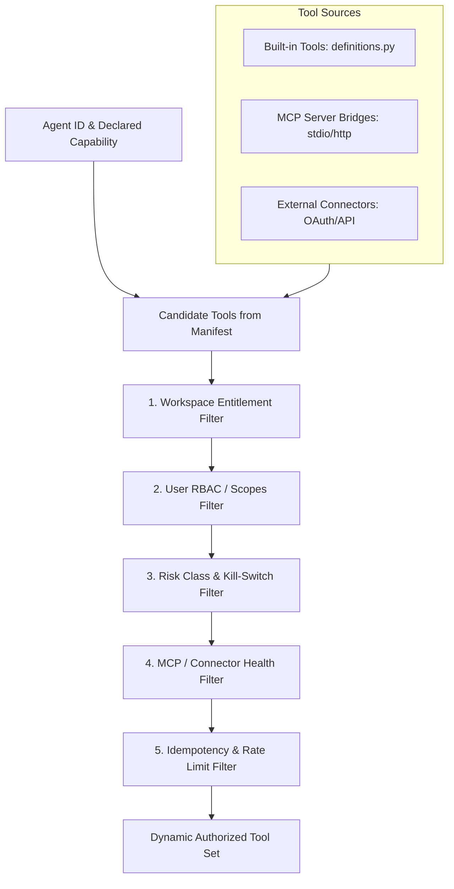
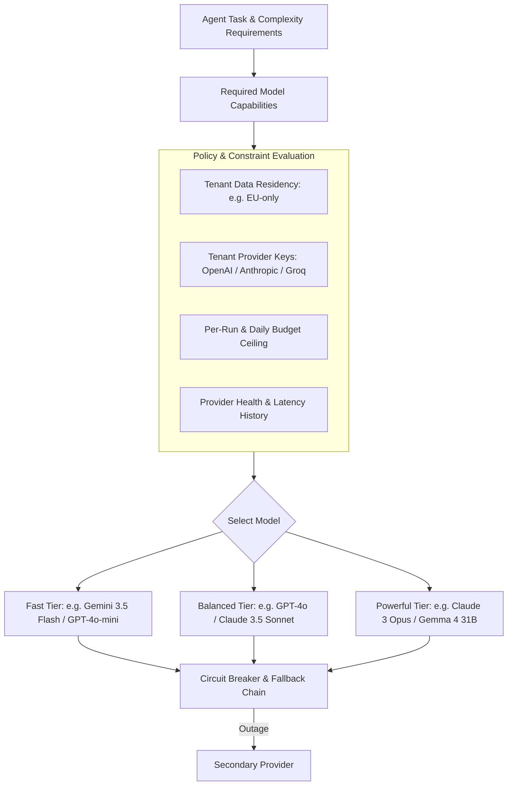
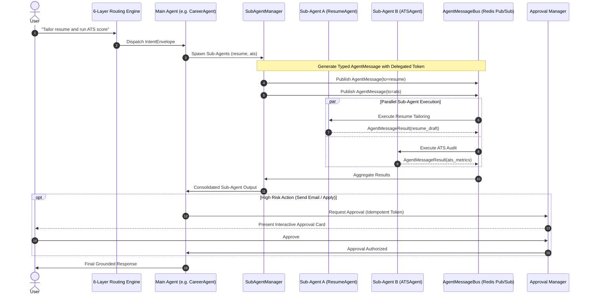
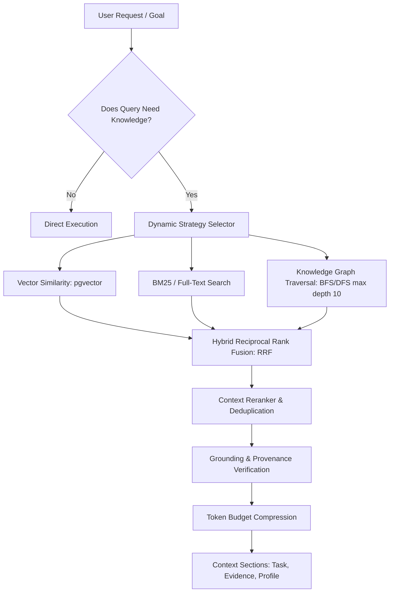
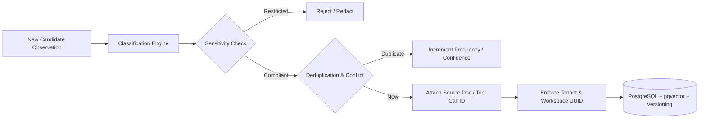
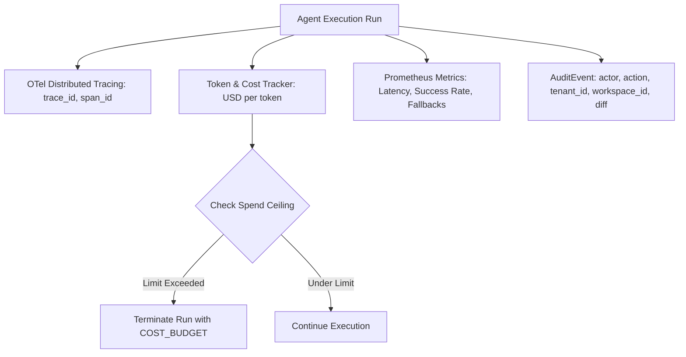

# Vaeloom Enterprise Dynamic Agent Architecture

**Standard**: Zero-Trust Implementation & Verification Standard (Phase 4)  
**Version**: 2.0.0-Enterprise  
**Date**: 2026-09-24  
**Status**: APPROVED DESIGN

---

## 1. Architectural Philosophy: Deterministic Authority, Dynamic Intelligence

In an enterprise-grade AI-native architecture, there is a fundamental separation
of concerns:

```
+-------------------------------------------------------------------------+
|                  ENTERPRISE PLATFORM (DETERMINISTIC)                   |
| Identity • Authority • Policy • RBAC/ABAC • State • Approvals • Audit   |
+-------------------------------------------------------------------------+
                                   ▲
                                   │ Constrains & Authorizes
                                   ▼
+-------------------------------------------------------------------------+
|                    COGNITIVE RUNTIME (DYNAMIC)                          |
| Intent Resolution • Agent Discovery • Tool Selection • Model Routing   |
| Reasoning • Execution Sequencing • Memory Synthesis • Reflection        |
+-------------------------------------------------------------------------+
```

The Large Language Model (LLM) is an engine of **probabilistic reasoning and
synthesis**, NEVER the authority for security, identity, tenancy, or
permissions.

---

## 2. High-Level End-to-End Architecture



---

## 3. Subsystem 1: Dynamic Intent Resolution (6-Layer Pipeline)

```mermaid
flowchart LR
    subgraph Input
        Q[User Query]
        T[Tenant / Workspace ID]
        U[User Permissions]
    end

    subgraph Layer_A["Layer A: Perimeter Security"]
        Sanitize[Input Sanitization]
        Adversarial[Adversarial Injection Scanner]
        IDOR[IDOR / Boundary Filter]
    end

    subgraph Layer_B["Layer B: Semantic Matcher"]
        Embed[Vector Embeddings]
        Cosine[Cosine Similarity to Exemplars]
        TopK[Top-K Candidate Capabilities]
    end

    subgraph Layer_C["Layer C: Cognitive Arbitration"]
        JevS1[TypeSafe AI Jev S1 <50ms]
        GemmaS2[Gemma 4 31B S2 Synthesizer]
        Arbitrate[Intent Envelope Construction]
    end

    subgraph Layer_D["Layer D: Policy Gate"]
        Entitle[Workspace Tier Entitlement]
        RBAC[User RBAC Authorization]
        Rate[Quota & Rate Check]
    end

    subgraph Layer_E["Layer E: Planner"]
        DAG[Task DAG Decomposition]
        AgentSel[Dynamic Agent Selection]
    end

    Input --> Layer_A --> Layer_B --> Layer_C --> Layer_D --> Layer_E
```



---

## 4. Subsystem 2: Dynamic Agent & Capability Registries

Agents and Capabilities are decoupled:

- **Capability**: Machine-readable contract defining input schema, output
  schema, required tools, risk class, and semantic exemplars.
- **Agent**: Implementation provider for one or more capabilities.



---

## 5. Subsystem 3: Dynamic Tool Discovery & Least-Privilege Filtering

An agent does NOT receive all tools indiscriminately. Tools are discovered
dynamically at execution time through 5 filtering stages:



---

## 6. Subsystem 4: Dynamic Model Routing



---

## 7. Subsystem 5: Agent-to-Agent Orchestration & Sub-Agent Spawning

Main agents can spawn specialist sub-agents for concurrent task execution. All
agent-to-agent interactions are governed by typed, cryptographically traceable
contracts:



---

## 8. Subsystem 6: Adaptive RAG & Knowledge Graph Pipeline



---

## 9. Subsystem 7: Memory Architecture & Write Policy



---

## 10. Subsystem 8: Observability, Governance & Telemetry



---

## 11. Security Invariants (INV-001 through INV-012)

Every component must enforce and prove the 12 core security invariants:

1. **INV-001**: Tenant boundary cannot be crossed under any prompt or tool
   payload.
2. **INV-002**: Workspace isolation is strictly enforced via PostgreSQL RLS and
   session variables.
3. **INV-003**: Agent permissions are least-privilege and enforced at runtime.
4. **INV-004**: Tool cannot exceed caller authorization.
5. **INV-005**: Memory writes and reads are scoped to authoritative
   authenticated context.
6. **INV-006**: RAG context injection filters by tenant and workspace IDs.
7. **INV-007**: Cache keys include tenant, workspace, and authorization hash.
8. **INV-008**: Background jobs serialize and re-validate security envelopes.
9. **INV-009**: Agent-to-agent delegation preserves security context and
   descends in privilege.
10. **INV-010**: LLM generated output is never an authority for security
    decisions.
11. **INV-011**: Approvals are single-use, time-bound, user-bound, and
    cryptographic.
12. **INV-012**: External connector secrets are encrypted at rest with envelope
    encryption and never logged.
