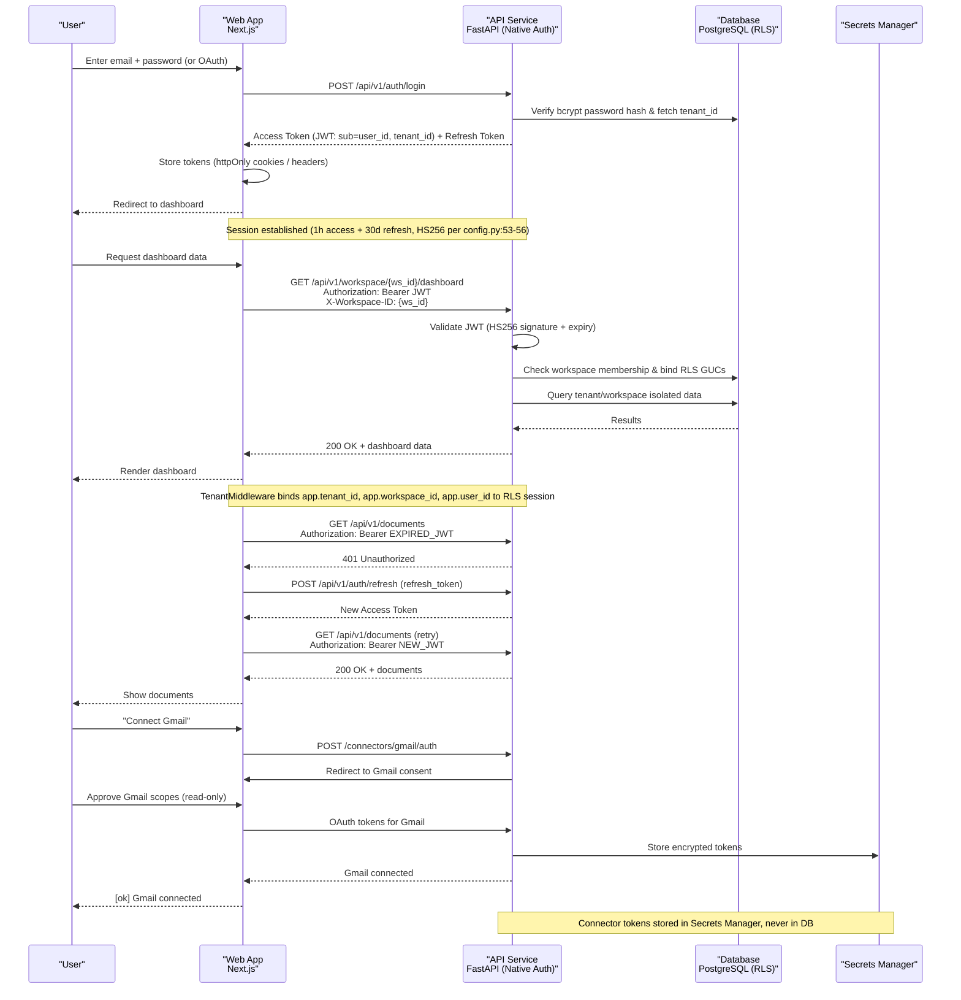
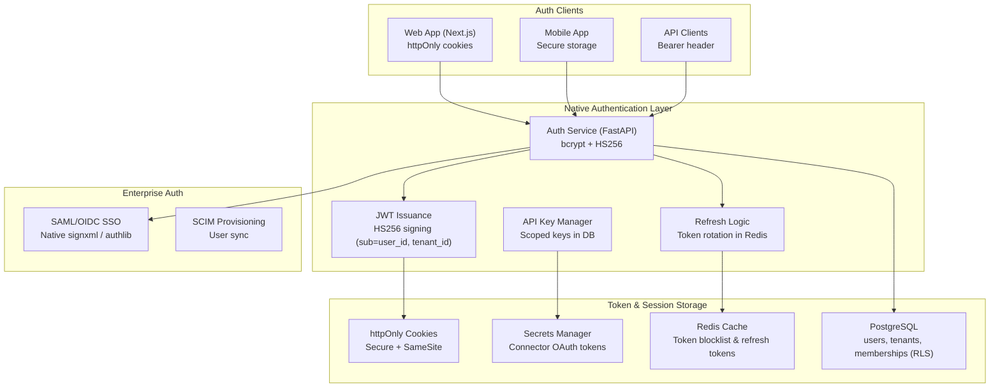

# Authentication

> **Purpose:** Define the authentication strategy for Vaeloom **Canonical
> source:**
> [`/docs/06-Vaeloom-Enterprise-Paper.md#191-authentication--access`](../../docs/06-Vaeloom-Enterprise-Paper.md#191-authentication--access)

## Auth Strategy

| Environment | Method                 | Provider                                                                                |
| ----------- | ---------------------- | --------------------------------------------------------------------------------------- |
| MVP         | Email/password + OAuth | Self-issued bcrypt + JWT, HS256 (`config.py:53-56`); Google/Microsoft OAuth via authlib |
| Enterprise  | + SAML/OIDC SSO        | Native `services/saml.py` (`signxml`) + Enterprise IdP federation                       |

## Auth Flows

### Login & API Call Flow

The following sequence diagram shows the complete authentication flow — from
user login through native auth, JWT issuance, to an authenticated API call with
workspace authorization via RLS:



### Flow Descriptions

| Flow                | Step-by-Step                                                             | Key Detail                                                                                                   |
| ------------------- | ------------------------------------------------------------------------ | ------------------------------------------------------------------------------------------------------------ |
| **Login**           | Email/password or OAuth → Verify bcrypt / IdP → Token Exchange → Session | Self-issued HS256 JWT; tokens stored in httpOnly cookies or returned in response                             |
| **API Call**        | JWT in Authorization header → Validate → RLS Binding → Response          | `tenant_id` from JWT; `workspace_id` from `X-Workspace-ID`/path checked in DB and enforced by PostgreSQL RLS |
| **Token Refresh**   | 401 → Refresh endpoint (`/api/v1/auth/refresh`) → New JWT → Retry        | Refresh token rotation; old token invalidated in Redis on use                                                |
| **Connector OAuth** | UI trigger → Initiate → User consent → Token storage                     | Scoped per-connector tokens; read-only by default; stored encrypted in Secrets Manager                       |

## Session Management

| Type                  | Duration                                         | Storage                              | Rotation             |
| --------------------- | ------------------------------------------------ | ------------------------------------ | -------------------- |
| Access token (JWT)    | 1 hour (`jwt_token_ttl=3600`, `config.py:53-56`) | HTTP-only cookie, `SameSite=Strict`  | None (short-lived)   |
| Refresh token         | 30 days                                          | Secure, httpOnly cookie              | Rotated on each use  |
| API key               | Custom                                           | Header `Authorization: Bearer <key>` | Manual revoke        |
| Connector OAuth token | Varies per provider                              | Secrets Manager (encrypted)          | Per-provider refresh |

## Security Considerations

| Concern              | Mitigation                                                                                                                                                    |
| -------------------- | ------------------------------------------------------------------------------------------------------------------------------------------------------------- |
| Passwords            | Hashed with bcrypt (cost factor >= 12) + per-user salt in PostgreSQL `users` table; never in plaintext or logs                                                |
| OAuth tokens         | Stored in Secrets Manager (encrypted per-key), never in plaintext DB or logs                                                                                  |
| Session hijacking    | httpOnly + Secure + SameSite cookies; short-lived JWTs (1h)                                                                                                   |
| Token leakage        | Bearer tokens never in URL params; only in headers                                                                                                            |
| Cross-tenant access  | `tenant_id` validated from JWT; `workspace_id` validated against DB membership and bound to PostgreSQL session RLS GUCs (`app.tenant_id`, `app.workspace_id`) |
| Privilege escalation | Session rotated on role/permission change                                                                                                                     |
| Brute force          | Rate limiting on all auth endpoints                                                                                                                           |

## Common Mistakes

| Mistake                                   | Consequence                                                                                                                                                  |
| ----------------------------------------- | ------------------------------------------------------------------------------------------------------------------------------------------------------------ |
| Storing JWTs in localStorage              | Accessible to XSS attacks — use httpOnly, Secure, SameSite cookies for web clients                                                                           |
| Not rotating refresh tokens               | A leaked refresh token gives permanent access — rotate on each use and invalidate the previous one                                                           |
| Extracting workspace_id from request body | A user could tamper with another workspace's ID — `workspace_id` must come from header/path validated against DB membership and bound to PostgreSQL RLS GUCs |
| Skipping rate limiting on auth endpoints  | Login endpoints without rate limiting are vulnerable to brute force attacks — apply strict per-IP and per-account limits                                     |

## Best Practices

| Practice                                               | Why                                                                                                         |
| ------------------------------------------------------ | ----------------------------------------------------------------------------------------------------------- |
| Use OAuth PKCE flow for SPA clients                    | The authorization code with PKCE prevents authorization code interception attacks — never use implicit flow |
| Short-lived access tokens, longer-lived refresh tokens | 24h access + 30d refresh with rotation limits the blast radius of a leaked token                            |
| Issue a new session on role/permission changes         | Old tokens with stale permissions must be invalidated — force re-login on privilege changes                 |
| Log all authentication events                          | Successful logins, failed attempts, and token refreshes should all be logged for security auditing          |

## Performance

| Concern                                   | Mitigation                                                                                                                                                                     |
| ----------------------------------------- | ------------------------------------------------------------------------------------------------------------------------------------------------------------------------------ |
| JWT verification latency on every request | Asymmetric key (RS256) verification is 10-100x slower than symmetric (HS256) — cache the JWKS response and verify with the local public key to avoid network calls per request |
| Token refresh creating write contention   | Every token refresh triggers a DB write to rotate the refresh token — batch rotations during quiet hours and use Redis for refresh token storage to reduce DB load             |
| Session lookup on every API call          | If session state is stored in the database, every API call incurs a 2-5ms query — cache session metadata in Redis with a short TTL to eliminate this round trip                |

---

## Goals

1. **Seamless user authentication** — Provide a frictionless login experience
   via OAuth (Google, Microsoft, GitHub) with automatic token refresh
2. **Multi-environment auth strategy** — Support email/password + OAuth for MVP
   and SAML/OIDC SSO for enterprise tenants
3. **Secure session management** — Ensure tokens are stored with httpOnly
   cookies, rotated on use, and revoked on permission changes
4. **Audit-ready authentication** — Log every login, token refresh, and failed
   attempt for security analysis

---

## Scope

### In Scope

- User login via OAuth providers (Google, Microsoft, GitHub) with PKCE flow
- JWT access token (24h) + refresh token (30d with rotation) session management
- API key authentication for automated/CI integrations
- Enterprise SAML/OIDC SSO integration (Phase 7)
- Connector OAuth token lifecycle (scoped, encrypted storage)

### Out of Scope

- Password management (delegated entirely to auth provider)
- Multi-factor authentication (planned for enterprise phase)
- Biometric authentication (device-level, handled by client)
- Custom identity provider hosting

---

## Functional Requirements

| ID    | Requirement                                                                             | Priority |
| ----- | --------------------------------------------------------------------------------------- | -------- |
| F-001 | System SHALL authenticate users via OAuth 2.0 with PKCE flow                            | P0       |
| F-002 | System SHALL issue JWT access tokens with 24h expiry and refresh tokens with 30d expiry | P0       |
| F-003 | System SHALL support Bearer token authentication via `Authorization` header             | P0       |
| F-004 | System SHALL rotate refresh tokens on each use, invalidating the previous token         | P0       |
| F-005 | System SHALL support API key authentication with configurable expiry (30d–1yr)          | P1       |
| F-006 | System SHALL integrate with SAML/OIDC SSO providers for enterprise tenants              | P2       |

---

## Non-Functional Requirements

| ID     | Requirement                      | Target                                     |
| ------ | -------------------------------- | ------------------------------------------ |
| NF-001 | JWT verification time            | < 5ms p95 (RS256 with cached JWKS)         |
| NF-002 | Token refresh latency            | < 200ms p95                                |
| ID     | Requirement                      | Target                                     |
| ------ | -------------------------------- | ------------------------------------------ |
| NF-001 | JWT verification time            | < 1ms p95 (HS256 local HMAC validation)    |
| NF-002 | Token refresh latency            | < 50ms p95 (Redis rotation lookup)         |
| NF-003 | Auth service availability        | 99.99% uptime (Stateless FastAPI nodes)    |
| NF-004 | Session invalidation propagation | < 1 second across all API nodes via Redis  |
| NF-005 | Login flow completion time       | < 200ms p95 (local bcrypt + token issue)   |

---

## Architecture



> **Diagram:** Authentication architecture — Web and mobile clients authenticate
> via native FastAPI auth service (`/api/v1/auth/login`) with email/password
> (bcrypt) or OAuth; API clients use JWT access tokens. Enterprise layer adds
> SAML/OIDC SSO (`services/saml.py`). Tokens stored in httpOnly cookies (web),
> secure storage (mobile), or Secrets Manager (connector tokens). Session
> metadata and revocation blocklist cached in Redis for instantaneous lookup.

---

## Components

| Component       | Technology                            | Responsibility                                                  |
| --------------- | ------------------------------------- | --------------------------------------------------------------- |
| Auth Service    | FastAPI + bcrypt + PyJWT              | Credential verification, HS256 token issuance, password hashing |
| Refresh Service | FastAPI + Redis                       | Token rotation, revocation blocklist, refresh grant             |
| API Key Manager | FastAPI + PostgreSQL                  | Key generation, scope assignment, rotation                      |
| Enterprise SSO  | Native `services/saml.py` + authlib   | Identity federation (SAML 2.0 via `signxml`, Google, MS OAuth)  |
| Secrets Manager | Infisical / AES-256-GCM               | Encrypted storage of connector OAuth tokens                     |
| Tenant Context  | FastAPI TenantMiddleware + PostgreSQL | Extracts `X-Workspace-ID`, validates membership, sets RLS GUCs  |

---

## Data Flow

```text
1. User submits credentials (email + password) or completes OAuth callback
2. FastAPI auth service verifies bcrypt hash against PostgreSQL users table
3. Auth service issues JWT (sub=user_id, tenant_id) + refresh token (stored in Redis)
4. Web app receives tokens in httpOnly cookies (or response payload for mobile)
5. For API calls: JWT sent in Authorization: Bearer header + X-Workspace-ID header
6. TenantMiddleware validates JWT signature and verifies user workspace membership in DB
7. Database connection executes set_rls_session_vars(tenant_id, workspace_id, user_id)
8. API executes query safely isolated within tenant and workspace RLS boundary
9. On 401 / expiry: client calls /api/v1/auth/refresh with refresh token
10. On logout / password change: token JTI added to Redis blocklist; refresh token deleted
```

---

## APIs

| Endpoint                | Method | Description                                   |
| ----------------------- | ------ | --------------------------------------------- |
| `/v1/auth/login`        | POST   | Authenticate email + password, returns tokens |
| `/v1/auth/register`     | POST   | Register new user account                     |
| `/v1/auth/refresh`      | POST   | Refresh access token using refresh token      |
| `/v1/auth/logout`       | POST   | Invalidate current session and blocklist JTI  |
| `/v1/auth/api-keys`     | POST   | Generate new API key                          |
| `/v1/auth/api-keys`     | GET    | List user's API keys                          |
| `/v1/auth/api-keys/:id` | DELETE | Revoke an API key                             |
| `/v1/auth/saml/login`   | GET    | Initiate enterprise SAML SP flow              |
| `/v1/auth/saml/acs`     | POST   | SAML Assertion Consumer Service callback      |

---

## Database

| Table               | Purpose                               | Key Columns                                                     |
| ------------------- | ------------------------------------- | --------------------------------------------------------------- |
| `users`             | User identities & credentials         | id, email, hashed_password, tenant_id, created_at               |
| `workspaces`        | Workspace isolation units             | id, tenant_id, name, created_at                                 |
| `workspace_members` | User workspace membership & roles     | workspace_id, user_id, role, created_at                         |
| `api_keys`          | Scoped API keys                       | id, user_id, key_hash, name, scopes[], expires_at, last_used_at |
| `connector_tokens`  | Encrypted OAuth tokens for connectors | id, connector_id, encrypted_token, token_type, expires_at       |

---

## Scalability

| Dimension          | Current Limit | 10x Strategy                                  | 100x Strategy                               |
| ------------------ | ------------- | --------------------------------------------- | ------------------------------------------- |
| Concurrent logins  | 500/s         | Horizontal scaling of stateless FastAPI nodes | Dedicated auth microservice cluster         |
| Active sessions    | 100K          | Redis standalone / cluster                    | Redis cluster with read replicas per region |
| API key operations | 1K/s          | PostgreSQL read replicas for key validation   | Local key cache with periodic sync          |
| Token refresh rate | 1000/s        | Refresh token rotation in Redis (no DB write) | Distributed refresh with idempotency keys   |

---

## Error Handling

| Scenario                    | Detection                                  | Mitigation                                      | Recovery                                  |
| --------------------------- | ------------------------------------------ | ----------------------------------------------- | ----------------------------------------- |
| Expired JWT                 | 401 response from API                      | Client triggers refresh flow automatically      | New access token issued; request retried  |
| Invalid refresh token       | Refresh endpoint returns 400/401           | Clear all client-side tokens; redirect to login | User re-authenticates                     |
| Redis outage                | Connection timeout to Redis                | Fallback to stateless JWT expiry validation     | Redis auto-reconnects; cache repopulates  |
| Token replay (stolen token) | Same token used from different IP/location | Force session invalidation; blocklist JTI       | User re-authenticates; audit log reviewed |

---

## Monitoring

| Metric                         | Alert Threshold        | Severity | Dashboard                    |
| ------------------------------ | ---------------------- | -------- | ---------------------------- |
| Login success rate             | < 95%                  | Critical | Auth > Login Success Rate    |
| Token refresh failure rate     | > 5%                   | Warning  | Auth > Token Refresh         |
| Auth endpoint latency          | > 500ms p95            | Warning  | Auth > Endpoint Latency      |
| Session creation rate          | > 1000/min             | Info     | Auth > Session Volume        |
| Failed login attempts per user | > 10 in 5 min          | Warning  | Auth > Brute Force Detection |
| API key usage by key           | > 1000 req/min per key | Info     | Auth > API Key Usage         |

---

## Deployment

| Environment | Method                                      | Trigger                  | Verification                                                       |
| ----------- | ------------------------------------------- | ------------------------ | ------------------------------------------------------------------ |
| Development | Local FastAPI + SQLite/Postgres + Redis     | Git push                 | Login flow works with test credentials                             |
| Staging     | Staging FastAPI + Supabase Postgres + Redis | PR merged to main        | Automated auth test suite passes (login → call → refresh → logout) |
| Production  | Multi-region FastAPI + HA Postgres + Redis  | Tagged release via CI/CD | Canary: 10% traffic verify login success rate > 99%                |

---

## Configuration

| Variable                 | Purpose                                                                                                                                                  | Default | Required                                                             |
| ------------------------ | -------------------------------------------------------------------------------------------------------------------------------------------------------- | ------- | -------------------------------------------------------------------- |
| `JWT_SECRET`             | HS256 signing secret (code truth: `config.py` `jwt_secret`; `validate_settings()` refuses to boot when empty, shorter than 32 chars, or a known default) | —       | Yes (production, min 32 chars; generate with `openssl rand -hex 32`) |
| `JWT_TOKEN_TTL`          | Access token lifetime in seconds (`config.py:53`)                                                                                                        | 3600    | Yes                                                                  |
| `JWT_REFRESH_TTL`        | Refresh token lifetime in seconds (`config.py:54`)                                                                                                       | 2592000 | Yes                                                                  |
| `AUTH_API_KEY_MAX_AGE`   | Max API key validity                                                                                                                                     | 365d    | No                                                                   |
| `AUTH_SESSION_CACHE_TTL` | Redis cache TTL for session data                                                                                                                         | 300s    | No                                                                   |

---

## Limitations

| Limitation                                   | Impact                                             | Workaround                                        | Future Resolution                                             |
| -------------------------------------------- | -------------------------------------------------- | ------------------------------------------------- | ------------------------------------------------------------- |
| No MFA support in MVP                        | Accounts protected only by OAuth provider security | Rely on auth provider's built-in MFA if available | Add TOTP/WebAuthn MFA in enterprise phase                     |
| Session invalidation is eventual (up to 30s) | Revoked user retains access briefly                | Set short JWT expiry (24h) and cache TTL          | Add WebSocket push for immediate invalidation                 |
| No SCIM provisioning in MVP                  | Enterprise user provisioning is manual             | Admin can invite users via workspace UI           | Add SCIM 2.0 for automated user provisioning                  |
| Connector tokens stored per-provider schema  | Token refresh logic varies by provider             | Abstract token refresh behind common interface    | Standardize OAuth token storage with provider-agnostic schema |

---

## Examples

```typescript
// Authenticate with API key
import { VaeloomAuth } from '@vaeloom/auth';

const auth = new VaeloomAuth();
const token = await auth.loginWithApiKey({
  apiKey: process.env.Vaeloom_API_KEY,
});
```

```python
# OAuth 2.0 token exchange
from Vaeloom.auth import OAuthClient

oauth = OAuthClient(
    client_id="...",
    client_secret="...",
    token_url="https://auth.Vaeloom.ai/oauth/token",
)
token = oauth.get_token(scope="workspace:read documents:write")
```

```bash
# Get access token using client credentials
curl -X POST "https://auth.Vaeloom.ai/oauth/token" \
  -H "Content-Type: application/x-www-form-urlencoded" \
  -d "grant_type=client_credentials&client_id=$CLIENT_ID&client_secret=$CLIENT_SECRET"
```

## Future Improvements

| Improvement                                                       | Priority | Complexity | Timeline |
| ----------------------------------------------------------------- | -------- | ---------- | -------- |
| Multi-factor authentication (TOTP, WebAuthn)                      | High     | Medium     | Q1 2027  |
| SCIM 2.0 user provisioning for enterprise                         | High     | Medium     | Q4 2026  |
| Session management dashboard (view active sessions, force logout) | Medium   | Low        | Q3 2026  |
| Biometric authentication for mobile clients                       | Low      | Medium     | Q2 2027  |
| Passwordless magic link login                                     | Medium   | Low        | Q3 2026  |

---

## Related Documents

- [Authorization.md](./Authorization.md)
- [Security Architecture](../Security/Security-Architecture.md)
- [`/docs/06-Vaeloom-Enterprise-Paper.md#191-authentication--access`](../../docs/06-Vaeloom-Enterprise-Paper.md#191-authentication--access)

> _Last verified: 2026-09-15 — fixed `AUTH_JWT_SECRET` → `JWT_SECRET` (32-char
> `validate_settings()` boot rule)._
