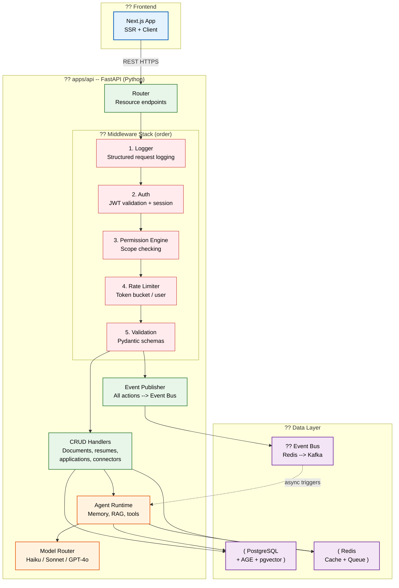

# Backend Architecture

> **Purpose:** Define the backend architecture for Vaeloom **Status:** ?
> Upgraded to enterprise quality **Owner:** Backend Team **Last Updated:**
> 2026-07-13 **Canonical source:**
> [`/docs/Vaeloom-Complete-Documentation.md#43-backend`](../../docs/Vaeloom-Complete-Documentation.md#43-backend)

## Architecture Overview



> **Diagram:** The backend is a single monolithic FastAPI (Python) application
> at `apps/api/`. It runs a 5-layer middleware stack � Logger ? Auth ?
> Permission ? Rate Limit ? Validation � before routing to CRUD handlers or
> agent tasks. Agent runtime, memory, RAG, and model routing all run within the
> same FastAPI app. Everything shares PostgreSQL, Redis, and the event bus.

---

The backend is a single monolithic FastAPI application:

| Component  | Technology       | Responsibility                                                                |
| ---------- | ---------------- | ----------------------------------------------------------------------------- |
| `apps/api` | FastAPI + Python | Auth, CRUD, permissions, event publishing, agents, memory, RAG, model routing |

```text
Frontend ? apps/api (REST)
              ?
        PostgreSQL + Redis + Claude API
```

## Request Lifecycle

```text
1. HTTP Request ? FastAPI Router
2. Auth Middleware (JWT validation)
3. Permission Engine (check scope, agent, action)
4. Route to handler (CRUD or agent request)
5. Response ? client
6. Event published to event bus
```

## Middleware Stack

| Middleware | Order | Purpose                    |
| ---------- | ----- | -------------------------- |
| Logger     | 1     | Structured request logging |
| Auth       | 2     | JWT validation, session    |
| Permission | 3     | Scope checking             |
| Rate Limit | 4     | Per-user rate limiting     |
| Validation | 5     | Input schema validation    |

## Common Mistakes

| Mistake                                     | Consequence                                                                                                                                       |
| ------------------------------------------- | ------------------------------------------------------------------------------------------------------------------------------------------------- |
| Tight coupling between modules              | Direct function calls between unrelated modules create synchronization dependencies � changes to one module can break others without warning      |
| Letting the middleware stack grow unchecked | Adding middleware for "one-off" concerns creates a bloated pipeline � every request pays the latency cost of all middleware, even irrelevant ones |
| Using the database as a message queue       | Polling the database for new work creates contention and misses � use Redis/BullMQ for queues, PostgreSQL for data                                |
| Ignoring the event bus until it's critical  | Events like "document.ingested" are consumed by multiple agents � skipping events from the start means retrofitting them later at high cost       |

## Best Practices

| Practice                                                | Why                                                                                                                                            |
| ------------------------------------------------------- | ---------------------------------------------------------------------------------------------------------------------------------------------- |
| Communicate between modules via well-defined interfaces | Keep module boundaries clean with explicit public APIs � internal implementation details should not leak across module boundaries              |
| Keep the middleware stack lean and ordered              | Only add middleware that applies to every request � endpoint-specific logic belongs in guards or interceptors, not the global middleware stack |
| Use the event bus for cross-module communication        | API publishes events ? modules subscribe � this decouples modules and allows multiple consumers without API changes                            |
| Separate read and write workloads                       | Commands (writes) and queries (reads) have different scaling requirements � separate them early to avoid contention                            |

## Security

| Concern                                 | Mitigation                                                                                                                                                                                  |
| --------------------------------------- | ------------------------------------------------------------------------------------------------------------------------------------------------------------------------------------------- |
| Unauthenticated internal calls          | Without proper auth on internal endpoints, any compromised code can call sensitive functions � enforce authentication on all internal routes                                                |
| Event bus injection attacks             | If events published by one module are consumed by another without validation, an attacker can inject malicious events via compromised endpoints � validate event payloads at every consumer |
| Data layer access without authorization | Backend code accessing PostgreSQL or Redis directly bypasses the Permission Engine � enforce row-level security and separate service accounts per module                                    |

## Performance

| Concern                                        | Mitigation                                                                                                                                                                                             |
| ---------------------------------------------- | ------------------------------------------------------------------------------------------------------------------------------------------------------------------------------------------------------ |
| JSON serialization overhead for small payloads | N/A � single FastAPI app, no inter-service serialization cost                                                                                                                                          | N/A |
| Database connection pool contention            | A single connection pool shared across all modules � if agent tasks hold connections during LLM calls (500ms+), CRUD operations starve. Use separate read/write pools with dedicated connection limits |
| Inter-module call overhead                     | Direct function calls between modules add minimal overhead (< 1ms) � no RPC serialization cost                                                                                                         | N/A |

## Goals

- Establish a modular monolithic architecture (apps/api) with clear module
  boundaries for auth, CRUD, permissions, agents, memory, and RAG
- Maintain sub-200ms p95 response time for CRUD operations through optimized
  middleware and database access
- Achieve 99.95% uptime through redundant service instances and automated
  failover
- Enable asynchronous event-driven communication between modules to decouple
  concerns
- Provide a consistent middleware stack that enforces security, validation, and
  observability for every request

## Scope

**In Scope:**

- FastAPI (Python) backend architecture at `apps/api/` for auth, CRUD,
  permissions, agents, memory, RAG, and model routing
- 5-layer middleware stack (Logger, Auth, Permission, Rate Limiter, Validation)
- Redis-backed event bus for asynchronous cross-module communication
- PostgreSQL data layer shared across all modules

**Out of Scope:**

- Frontend application logic and UI rendering
- Third-party connector implementations (Gmail, GitHub, Slack)
- Database migration tooling and schema design
- Client-side caching and offline support
- Multi-region active-active deployment

## Functional Requirements

| ID     | Requirement                                                                   | Priority |
| ------ | ----------------------------------------------------------------------------- | -------- |
| FR-001 | System shall validate JWT tokens on every authenticated request               | Critical |
| FR-002 | System shall enforce permission scopes before executing any operation         | Critical |
| FR-003 | System shall rate-limit requests per user using token bucket algorithm        | High     |
| FR-004 | System shall publish an event for every state-changing operation              | High     |
| FR-005 | System shall route agent requests within the FastAPI application              | High     |
| FR-006 | System shall log structured request data including method, path, and duration | Medium   |
| FR-007 | System shall validate input payloads against Pydantic schemas                 | Medium   |
| FR-008 | System shall support paginated list endpoints with sort and filter parameters | Medium   |

## Non-Functional Requirements

| ID      | Requirement                                                        | Target              | Measurement                          |
| ------- | ------------------------------------------------------------------ | ------------------- | ------------------------------------ |
| NFR-001 | API response time for CRUD endpoints shall not exceed 200ms        | p95 < 200ms         | Request latency percentile           |
| NFR-002 | API service shall remain available 99.95% of uptime                | 99.95% uptime       | Monthly uptime percentage            |
| NFR-003 | Middleware stack shall not add more than 50ms overhead per request | < 50ms              | Span timing per middleware           |
| NFR-004 | Event publishing latency shall not exceed 100ms                    | p99 < 100ms         | Event bus write latency              |
| NFR-005 | Inter-module call latency shall be negligible                      | < 1ms               | Direct function call timing          |
| NFR-006 | System shall handle 1000 concurrent authenticated users            | Latency p95 < 500ms | Load test with 1000 concurrent users |

## Components

| Component        | Responsibility                                        | Technology           | Scale Strategy                      |
| ---------------- | ----------------------------------------------------- | -------------------- | ----------------------------------- |
| API Router       | Resource endpoint routing, HTTP handling              | FastAPI + Uvicorn    | Horizontal scale via load balancer  |
| Middleware Stack | Logging, auth, permissions, rate limiting, validation | FastAPI middleware   | Stateless � scales horizontally     |
| CRUD Handlers    | Document, resume, application, connector operations   | FastAPI + SQLAlchemy | Horizontal with connection pooling  |
| Event Publisher  | Publish all actions to event bus                      | Redis                | Cluster Redis for higher throughput |
| Agent Runtime    | Agent execution, memory, RAG, model routing           | FastAPI + Python     | Horizontal with session affinity    |

## Data Flow

1. **Client Request** � Frontend sends HTTPS request to api.Vaeloom.dev/v1/...
   with JWT Bearer token in Authorization header
2. **Middleware Processing** � Request passes through Logger (structured
   capture), Auth (JWT validation), Permission (scope check), Rate Limiter
   (token consumption), Validation (schema check) in fixed order
3. **Handler Routing** � FastAPI router matches URI to handler; CRUD requests
   query PostgreSQL via SQLAlchemy; agent requests execute within the same app
4. **Event Publication** � Handler publishes a domain event to the Redis event
   bus after successful processing (e.g., document.ingested,
   application.submitted)
5. **Response Assembly** � Handler serializes response as JSON, adds
   X-Request-Id header, and returns HTTP status 200/201 with payload or error
   envelope

## Scalability

| Dimension              | Current Limit              | 10x Strategy                       | 100x Strategy                                  |
| ---------------------- | -------------------------- | ---------------------------------- | ---------------------------------------------- |
| API instances          | 6 Fly.io instances         | 20 ECS tasks with auto-scaling     | 100+ Kubernetes pods with HPA                  |
| PostgreSQL connections | 25 connections per service | 100 connections with PgBouncer     | 400 connections with read replicas + PgBouncer |
| Redis throughput       | 10K events/sec             | 50K events/sec with Redis Cluster  | 500K events/sec with Redis Cluster + sharding  |
| Request throughput     | 500 req/s per instance     | 5000 req/s with connection pooling | 50000 req/s with load balancing                |
| Event backlog          | 1000 events in queue       | 10000 events with increased memory | 100000 events with Kafka migration             |

## Error Handling

| Error Scenario                      | Detection                                    | Mitigation                                              | Recovery                                                 |
| ----------------------------------- | -------------------------------------------- | ------------------------------------------------------- | -------------------------------------------------------- |
| Internal module connection failure  | Health check timeout, service unavailable    | Return 503 to client, queue request for retry           | Reconnect with exponential backoff, alert if >3 failures |
| Database connection pool exhaustion | Connection timeout, pool exhausted metric    | Reject non-critical requests, throttle incoming traffic | Scale connection pool, add read replica                  |
| Event bus write failure             | Redis write timeout or connection refused    | Log locally, store event in fallback Redis list         | Retry on reconnection, drain backlog                     |
| Auth token validation failure       | JWT decode exception, expired claim          | Return 401 to client, log failed attempt                | Client must refresh token and retry                      |
| Middleware configuration error      | Startup probe failure, middleware init error | Deny all requests, return 500                           | Pod restart, configuration validation                    |

## Monitoring

| Metric                         | Alert Threshold                 | Severity | Dashboard                      |
| ------------------------------ | ------------------------------- | -------- | ------------------------------ |
| p95 request latency            | > 500ms for 5 minutes           | Critical | API Performance Dashboard      |
| Error rate (5xx)               | > 1% of requests over 5 minutes | Critical | API Error Dashboard            |
| Inter-module call latency      | > 10ms for 5 minutes            | Warning  | Module Communication Dashboard |
| Database connection pool usage | > 80% for 5 minutes             | Warning  | Database Pool Dashboard        |
| Event bus queue depth          | > 1000 unprocessed events       | Warning  | Event Bus Dashboard            |
| Middleware per-layer latency   | Any layer > 50ms for 5 minutes  | Info     | Middleware Profiling Dashboard |

## Configuration

| Variable          | Purpose                          | Default                             | Required |
| ----------------- | -------------------------------- | ----------------------------------- | -------- |
| PORT              | HTTP server listen port          | 8000                                | Yes      |
| DATABASE_URL      | PostgreSQL connection string     | postgresql://localhost:5432/Vaeloom | Yes      |
| REDIS_URL         | Redis connection string          | redis://localhost:6379              | Yes      |
| JWT_SECRET        | Token signing secret             | �                                   | Yes      |
| RATE_LIMIT_MAX    | Max requests per user per window | 100                                 | No       |
| RATE_LIMIT_WINDOW | Rate limit window in seconds     | 60                                  | No       |
| LOG_LEVEL         | Structured logging verbosity     | info                                | No       |
| INTERNAL_API_URL  | Internal API endpoint            | localhost:8000                      | No       |
| CORS_ORIGINS      | Allowed CORS origins             | <http://localhost:3000>             | No       |

## Risks

| Risk                                                 | Likelihood | Impact   | Mitigation                                                                               |
| ---------------------------------------------------- | ---------- | -------- | ---------------------------------------------------------------------------------------- |
| Tight coupling between modules via shared state      | Medium     | High     | Enforce module boundaries via explicit public interfaces; add architecture linting in CI |
| Database connection pool contention between services | Medium     | High     | Dedicated pools per service with separate connection limits                              |
| Event bus becoming single point of failure           | Low        | Critical | Redis Cluster with sentinel failover, fallback local queue                               |
| Middleware stack latency growth                      | Medium     | Medium   | Per-layer latency monitoring, periodic optimization sprints                              |
| Secrets leak via CI/CD pipeline                      | Low        | Critical | Temporary credentials, secrets manager, audit logging                                    |

## Limitations

| Limitation                             | Impact                                             | Workaround                     | Future Resolution                          |
| -------------------------------------- | -------------------------------------------------- | ------------------------------ | ------------------------------------------ |
| Single-region deployment               | Latency for non-US users, no regional failover     | CDN for static assets          | Multi-region active-active deployment      |
| Shared PostgreSQL across modules       | Contention under high load, no independent scaling | Separate connection pools      | Module-specific read replicas              |
| No streaming for large agent responses | Memory pressure on large agent responses           | Paginate responses             | Implement SSE or WebSocket streaming       |
| No message persistence beyond Redis    | Events lost if Redis goes down before consumption  | Fallback log file per instance | Migrate to Kafka for durable event storage |

## Examples

```typescript
// Module-to-module communication via event bus
import { EventBus } from '@vaeloom/events';

const bus = new EventBus();
await bus.publish('document.processed', {
  documentId: 'doc_99',
  status: 'completed',
});
```

```python
# Subscribe to an event stream
from Vaeloom.events import EventStream

stream = EventStream("document.*")
for event in stream.subscribe():
    print(f"Received: {event.type} \u2192 {event.data}")
```

```yaml
# Docker Compose for local Vaeloom backend
services:
  api-gateway:
    image: Vaeloom/api-gateway:latest
    ports:
      - '8080:8080'
    environment:
      - REDIS_URL=redis://redis:6379
      - DATABASE_URL=postgres://Vaeloom:pass@db:5432/Vaeloom
```

## Future Improvements

| Improvement                                    | Priority | Complexity | Timeline |
| ---------------------------------------------- | -------- | ---------- | -------- |
| Migrate to Kafka for durable event streaming   | High     | High       | Q4 2026  |
| Multi-region active-active deployment          | High     | High       | Q1 2027  |
| Service-specific database read replicas        | Medium   | Medium     | Q3 2026  |
| Streaming for agent responses (SSE/WebSocket)  | Medium   | Low        | Q2 2026  |
| Circuit breaker pattern for external API calls | Medium   | Low        | Q2 2026  |
| GraphQL federation for complex queries         | Low      | High       | Q1 2027  |

## Related Documents

- [API Architecture.md](./API-Architecture.md)
- [Authentication.md](./Authentication.md)
- [`/docs/Vaeloom-Complete-Documentation.md#43-backend`](../../docs/Vaeloom-Complete-Documentation.md#43-backend)
