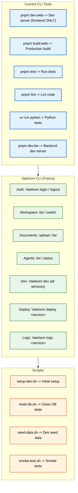

# CLI Tools

> **Purpose:** Define CLI tools and usage for Vaeloom development **Status:** 🆕
> New

## CLI Architecture



> **Diagram:** CLI architecture — **current tools** (pnpm/uv/pytest) ? **planned
> Vaeloom CLI** (auth, workspace, documents, agents, dev, deploy, logs) ?
> **scripts directory** (setup, reset, seed, smoke-test).
>
> **Never run `pnpm dev`** — it fans out via Nx across all 25 workspace packages
> and hangs. Frontend: **`pnpm dev:web`** (or `make dev-web`, fastest). Backend:
> **`pnpm dev:be`**.

---

## Available CLI Tools

| Command                                      | Service  | Purpose                                                        |
| -------------------------------------------- | -------- | -------------------------------------------------------------- |
| `pnpm dev:web`                               | Frontend | Start development server (repo root; Nx → `@vaeloom/web` only) |
| `make dev-web`                               | Frontend | Fastest dev server (`apps/web` directly)                       |
| `pnpm build:web`                             | Frontend | Production build                                               |
| `pnpm test`                                  | Frontend | Run tests                                                      |
| `pnpm lint`                                  | Frontend | Lint code                                                      |
| `pnpm dev:be`                                | Backend  | Development server (uvicorn via uv)                            |
| `uv run --project apps/api python -m pytest` | Backend  | Run Python tests                                               |
| `alembic upgrade head`                       | Backend  | Run database migrations                                        |

## Vaeloom CLI (Future)

A dedicated CLI tool `Vaeloom-cli` is planned:

```bash
# Authentication
Vaeloom login
Vaeloom logout

# Workspace management
Vaeloom workspace list
Vaeloom workspace switch <id>

# Document operations
Vaeloom document upload <path>
Vaeloom document list

# Agent interactions
Vaeloom agent list
Vaeloom agent status <name>

# Development
Vaeloom dev               # Start all services
Vaeloom deploy <service>   # Deploy single service
Vaeloom logs <service>     # View logs
```

## Scripts Directory

| Script                  | Purpose                               |
| ----------------------- | ------------------------------------- |
| `scripts/setup-dev.sh`  | Initial development environment setup |
| `scripts/reset-db.sh`   | Reset database to clean state         |
| `scripts/seed-data.sh`  | Load development seed data            |
| `scripts/smoke-test.sh` | Run smoke tests against environment   |

## Common Mistakes

| Mistake                                                      | Consequence                                                                                                                                                            |
| ------------------------------------------------------------ | ---------------------------------------------------------------------------------------------------------------------------------------------------------------------- |
| Running `pnpm dev` instead of `pnpm dev:web`                 | `pnpm dev` runs Nx across 25 packages and hangs forever — always `pnpm dev:web` (or `make dev-web`)                                                                    |
| Running `npm start` / `npm run dev` in development           | This repo is pnpm-only; `npm` bypasses the workspace lockfile. Use `pnpm dev:web` (dev) — `pnpm start` semantics are production builds                                 |
| Forgetting to use `uv run` before running backend commands   | Running bare `pytest` or `uvicorn` uses the system Python — missing dependencies cause import errors that look like setup failures. Always `uv run --project apps/api` |
| Using production environment variables in local CLI commands | A `--env production` flag or production `DATABASE__URL` in a local terminal can accidentally modify production data — always verify the active environment             |
| Running destructive commands without a dry-run               | Commands like `reset-db.sh` drop all data — running without confirming the target environment causes irreversible data loss in staging or production                   |

## Best Practices

| Practice                                                | Why                                                                                                                                                             |
| ------------------------------------------------------- | --------------------------------------------------------------------------------------------------------------------------------------------------------------- |
| Use `pnpm dev:web` for all local frontend development   | Dev mode includes hot reload, debug logging, and double rate limits — it's the only mode suitable for active development. Never `pnpm dev` (Nx × 25 pkgs hangs) |
| Always use `uv run --project apps/api` for backend work | uv selects the pinned Python 3.12 venv — bare `python`/`pip`/`requirements.txt` are not supported in this repo                                                  |
| Prefix environment-specific commands with the target    | `STAGING=1 ./scripts/reset-db.sh` or `NODE_ENV=production pnpm build:web` — explicit environment markers prevent cross-environment accidents                    |
| Add a confirmation prompt to destructive scripts        | Scripts that drop databases or delete resources should require `--confirm` or `--force` flags — never run destructive operations without explicit confirmation  |

## Security Considerations

| Consideration                     | Mitigation                                                                                                                                       |
| --------------------------------- | ------------------------------------------------------------------------------------------------------------------------------------------------ |
| CLI tool credential storage       | A future Vaeloom CLI will store auth tokens locally — use the system keychain (or encrypted config file), never plaintext config files           |
| Script secrets in command history | Commands with inline secrets (`ANTHROPIC_API_KEY=sk-... pnpm dev:web`) are stored in shell history — use `.env` files or secrets manager instead |

## Error Handling

| Scenario                              | Detection                     | Mitigation                                              | Recovery                                                                      |
| ------------------------------------- | ----------------------------- | ------------------------------------------------------- | ----------------------------------------------------------------------------- |
| pnpm dev:web fails with port conflict | EADDRINUSE on :3000           | Leftover Node process holding the port                  | `Get-Process -Name "node" \| Stop-Process -Force`, then retry                 |
| Python venv not activated             | ModuleNotFoundError on import | Bare `python` used instead of `uv run`                  | Use `uv run --project apps/api` for every backend command                     |
| Database connection refused           | ConnectionError               | Docker container not running or port mapped incorrectly | `docker compose up -d postgres redis` and retry                               |
| Migration state mismatch              | Alembic migration error       | Local schema out of sync with migration history         | `alembic downgrade base` then `alembic upgrade head` (with data loss warning) |

## Risks

| Risk                                             | Likelihood | Impact   | Mitigation                                                                          |
| ------------------------------------------------ | ---------- | -------- | ----------------------------------------------------------------------------------- |
| Destructive script run against wrong environment | Medium     | Critical | Add environment confirmation prompt; check `NODE_ENV` before destructive operations |
| CLI tool credentials stored in plaintext         | Medium     | High     | Use system keychain or encrypted config for future `Vaeloom login`                  |
| Scripts fail silently on errors                  | High       | Medium   | Use `set -euo pipefail` in all shell scripts; verify exit codes in CI               |

## Limitations

| Limitation                                 | Impact                                                         | Workaround                                                                            | Future Resolution                                |
| ------------------------------------------ | -------------------------------------------------------------- | ------------------------------------------------------------------------------------- | ------------------------------------------------ |
| No dedicated Vaeloom CLI tool (MVP)        | Developers use pnpm/uv/pytest directly with inconsistent flags | Standardize on `pnpm dev:web` / `pnpm dev:be` and documented scripts for all services | `Vaeloom-cli` with unified commands (v1.5)       |
| Shell scripts are platform-specific (bash) | Windows developers cannot run scripts natively                 | Use Git Bash, WSL, or PowerShell equivalents                                          | Cross-platform scripts or Node.js-based CLI (V2) |

## Overview

The CLI Tools document catalogs all command-line interfaces available for
Vaeloom development — npm scripts for the frontend, Python/uvicorn commands for
the backend, Alembic for database migrations, shell scripts for operations, and
the planned Vaeloom CLI tool. It defines conventions for script safety,
environment-aware execution, and cross-platform compatibility.

---

## Goals

- Document all available CLI commands across frontend and backend
- Define the roadmap for the dedicated Vaeloom CLI tool
- Establish script safety conventions (idempotency, confirmation prompts, error
  handling)
- Prevent environment-crossing accidents with explicit flags and checks
- Enable Windows development through cross-platform alternatives

---

## Scope

### In Scope

- Current CLI tools (pnpm, uv, pytest, alembic)
- Planned Vaeloom CLI features
- Scripts directory conventions and usage
- Shell script safety best practices
- Environment-specific command patterns

### Out of Scope

- CI/CD pipeline commands (covered in DevOps documentation)
- IDE-specific debugger configurations
- Database migration commands in detail (covered in Database docs)
- Third-party CLI tools for infrastructure management

---

## Future Improvements

| Improvement                                      | Priority | Complexity | Timeline          |
| ------------------------------------------------ | -------- | ---------- | ----------------- |
| Dedicated `Vaeloom-cli` with unified commands    | High     | Medium     | v1.5 (2027 H1)    |
| Cross-platform scripts (PowerShell alternatives) | Medium   | Low        | V2 (2027 H2)      |
| Interactive `Vaeloom dev` with service selection | Medium   | Medium     | v1.5 (2027 H1)    |
| `Vaeloom deploy` for one-command deployments     | Low      | High       | Enterprise (2028) |

## Performance Considerations

| Consideration             | Approach                                                                                                                                                     |
| ------------------------- | ------------------------------------------------------------------------------------------------------------------------------------------------------------ |
| CLI startup time          | The planned Vaeloom CLI should load in under 500ms — lazy-load subcommands and dependencies rather than importing everything at startup                      |
| pnpm dev:web memory usage | Running all services (frontend + backend + Docker) consumes 2-4GB RAM — start only the services needed for a specific task (`pnpm dev:web` vs `pnpm dev:be`) |

## Examples

### Starting all services locally

```bash
# Start infrastructure
docker compose up -d postgres redis

# Start Backend (terminal 1) — uv manages the venv, no activation needed
uv run --project apps/api python -m uvicorn api.main:app --reload --port 8000
# (or: pnpm dev:be)

# Start Frontend (terminal 2, repo root — never `pnpm dev`)
pnpm dev:web
# (or fastest: make dev-web)
```

### Running tests for a specific service

```bash
# Frontend
pnpm test -- --testPathPattern=DocumentService

# Backend
uv run --project apps/api python -m pytest tests/test_memory_agent.py -v
```

### Database reset and seed

```bash
# Reset database (dev only)
./scripts/reset-db.sh --confirm

# Seed test data
./scripts/seed-data.sh --minimal

# Verify
alembic heads
```

### AI evaluation runner

```bash
# Run all agent evals
uv run --project apps/api python -m eval.run_all

# Run single agent eval
uv run --project apps/api python -m eval.run_single memory_agent --document_id=doc_abc123

# Test prompt directly
uv run --project apps/api python -m agents.test_prompt memory_agent --prompt_version=v2
```

---

## Related Documents

- [Setup.md](./Setup.md)
- [Developer Guide.md](./Developer-Guide.md)
- [Scripts.md](./Scripts.md)
- [Environment.md](./Environment.md)
- [Contributing.md](./Contributing.md)
- [API Examples.md](./API-Examples.md)
