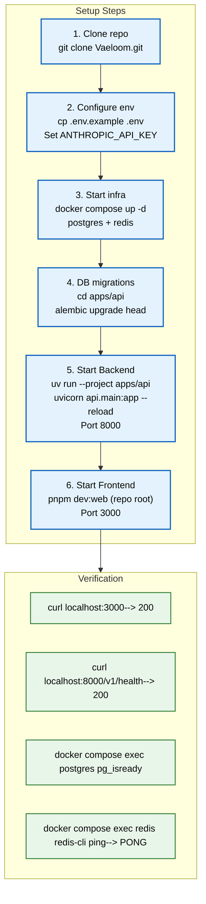

# Setup Guide

> **Purpose:** Complete setup guide for new Vaeloom developers — from cloning to
> running all services locally **Status:** ✅ Upgraded to enterprise quality
> **Owner:** Engineering Team **Last Updated:** 2026-07-12

---

## Overview



> **Diagram:** Complete setup workflow — **6 sequential steps** (clone →
> configure → infra → migrations → backend → frontend) → **4 verification
> checks** (services returning 200 + DB/Redis reachable).

---

This guide walks through setting up a local Vaeloom development environment. By
the end, you'll have two services running locally: the Next.js frontend and the
FastAPI backend, backed by PostgreSQL and Redis.

**Estimated setup time:** 15-30 minutes (depending on download speeds)

## Prerequisites

| Software       | Version                 | Purpose                                     | Check Installation       |
| -------------- | ----------------------- | ------------------------------------------- | ------------------------ |
| Node.js        | v20.14.0 (see `.nvmrc`) | Frontend runtime                            | `node --version`         |
| pnpm           | 9+                      | Package manager (ONLY — do not use npm)     | `pnpm --version`         |
| Python         | 3.12+                   | Backend runtime (via `uv`, not pip venvs)   | `python --version`       |
| uv             | Latest                  | Python runner / venv manager for `apps/api` | `uv --version`           |
| Docker         | Latest                  | PostgreSQL, Redis containers                | `docker --version`       |
| Docker Compose | v2+                     | Service orchestration                       | `docker compose version` |
| Git            | Latest                  | Version control                             | `git --version`          |

> **Package managers:** frontend uses **pnpm** (`pnpm install`, ~2.2s; `.npmrc`
> sets `auto-install-peers=true, strict-peer-dependencies=false`). Backend uses
> **uv** (`uv run --project apps/api ...`) — there is no `requirements.txt`
> workflow. Pin Node with `nvm use` (`.nvmrc` = `v20.14.0`).

> **CRITICAL — never run `pnpm dev`:** the root `dev` script runs
> `nx run-many --target=dev --parallel` across all 25 workspace packages (most
> have no `dev` script) and hangs forever. Always use **`pnpm dev:web`** (Nx,
> runs only `@vaeloom/web`, 2-5s) or the fastest path **`make dev-web`**
> (`cd apps/web && pnpm next dev` directly). Backend only: **`pnpm dev:be`**.

### Installing Prerequisites

**Windows (using winget):**

```powershell
winget install OpenJS.NodeJS.LTS
winget install Docker.DockerDesktop
winget install Git.Git
```

**macOS (using Homebrew):**

```bash
brew install node@20
brew install python@3.12
brew install --cask docker
```

**Linux (Ubuntu/Debian):**

```bash
curl -fsSL https://deb.nodesource.com/setup_20.x | sudo -E bash -
sudo apt-get install -y nodejs python3.12 python3.12-venv docker.io docker-compose-v2
```

## Step-by-Step Setup

### Step 1: Clone the Repository

```bash
git clone https://github.com/Vaeloom/Vaeloom.git
cd Vaeloom
```

### Step 2: Configure Environment

```bash
# Copy the example environment file (WARNING: cp overwrites .env
# without asking — back up any local secrets first)
cp .env.example .env

# For local development, most defaults work out of the box.
# You only need to set the Anthropic API key for AI features:
# Edit .env and set:
ANTHROPIC_API_KEY=sk-ant-your-key-here

# To get an API key:
# 1. Go to https://console.anthropic.com/
# 2. Create an account (free tier available)
# 3. Navigate to API Keys
# 4. Create a new key
# 5. Copy it to .env
```

### Step 3: Start Infrastructure Services

```bash
# Start PostgreSQL and Redis via Docker Compose
docker compose up -d postgres redis

# Verify they're running
docker compose ps
# Output should show both services as "Up"
```

### Step 4: Run Database Migrations

```bash
cd apps/api
alembic upgrade head
# This creates tables: users, workspaces, documents, memory_records, etc.

# Optional: Seed test data
python scripts/seed.py
```

### Step 5: Start the Backend

```bash
# Backend runs via uv (managed .venv, Python 3.12) — no pip, no requirements.txt.
# Set vars BEFORE python (Pydantic model_config has no env_file, so .env
# files are NOT auto-read). Nested settings use DOUBLE underscores:
#   DATABASE__URL (not DATABASE_URL), e.g.
#   sqlite+aiosqlite:///./dev.db for local dev
$env:JWT_SECRET="<32+ random chars — openssl rand -hex 32; startup refuses <32>"
$env:ENCRYPTION_KEY="<base64 32-byte key>"
$env:DATABASE__URL="sqlite+aiosqlite:///./dev.db"
$env:LLM_API_KEY="mock-key"
$env:OTEL_SDK_DISABLED="true"
uv run --project apps/api python -m uvicorn api.main:app --host 0.0.0.0 --port 8000
# Backend runs on http://localhost:8000
# Verify: curl http://localhost:8000/v1/health
```

### Step 6: Start the Frontend

```bash
# From the REPO ROOT (never `pnpm dev` — see trap note above):
pnpm install   # ~2.2s
pnpm dev:web   # Nx → @vaeloom/web only, 2-5s startup
# Fastest alternative: make dev-web
# Frontend runs on http://localhost:3000
```

> **Port 3000 already in use?** A leftover Node process is holding it. Fix:
> `Get-Process -Name "node" | Stop-Process -Force`, then retry.

> **Frontend ↔ API gotchas (read before debugging):**
>
> - **CSP:** `middleware.ts:54` + `next.config.js:43-50` only allow
>   `http://localhost:8000` in `connect-src` when `NODE_ENV === 'development'`
>   (or `ALLOW_LOCAL_API=true`). If API calls are blocked in the browser
>   console, check you started the frontend via the dev server, not a production
>   build.
> - **snake_case ↔ camelCase:** the backend serializes `access_token`; the
>   frontend expects `accessToken`. `api.ts:27-39` (`transformKeys`) converts
>   **responses only** — request bodies stay `snake_case`. Any new API client
>   must reuse `transformKeys`.
> - **CSRF:** `middleware/csrf.py` skips only `/api/v1/auth` prefixes and
>   `/csrf-token` is public. Mutating requests send
>   `X-CSRF-Token: <getCsrfToken()>` with `credentials: 'include'`; on a 403 the
>   client refreshes the token (`resetCsrfToken` + retry). Auth POSTs failing
>   with 403/500 usually mean this wiring was bypassed.

## Verify Everything Works

```bash
# Run the verification script
./scripts/verify-setup.sh

# Or verify manually:
echo "1. Frontend: $(curl -s -o /dev/null -w '%{http_code}' http://localhost:3000)"
echo "2. Backend: $(curl -s -o /dev/null -w '%{http_code}' http://localhost:8000/v1/health)"
echo "3. DB: $(docker compose exec postgres pg_isready -U Vaeloom -d Vaeloom_db)"
echo "4. Redis: $(docker compose exec redis redis-cli ping)"
```

**Expected output:**

```text
1. Frontend: 200
2. Backend: 200
3. DB: /var/run/postgresql:5432 - accepting connections
4. Redis: PONG
```

## Directory Structure

```text
Vaeloom/
├── apps/
│   ├── web/              # Next.js frontend (port 3000)
│   └── backend/          # FastAPI backend (port 8000)
├── packages/
│   ├── shared-types/     # Shared type definitions
│   └── ui-kit/           # Shared UI components
├── infra/
│   ├── docker/           # Docker configuration
│   └── migrations/       # Database migrations (Alembic)
└── docs/                 # Documentation
```

## Troubleshooting

### Common Issues

| Issue                                        | Likely Cause                        | Solution                                                                |
| -------------------------------------------- | ----------------------------------- | ----------------------------------------------------------------------- |
| `docker compose up` fails with port conflict | PostgreSQL or Redis already running | Stop existing instances: `sudo systemctl stop postgresql`               |
| `alembic upgrade head` fails                 | Database not ready                  | Wait 10s and retry, or check `docker compose logs postgres`             |
| `pnpm install` fails with permissions        | Node.js version mismatch            | `nvm use` (`.nvmrc` = v20.14.0)                                         |
| `uvicorn` can't find module                  | Wrong runner                        | Always `uv run --project apps/api` (never bare `python`/`pip`)          |
| Backend returns 401                          | Missing API key                     | Check `ANTHROPIC_API_KEY` in `.env`                                     |
| Backend refuses to start (JWT error)         | Weak/missing secret                 | Set `JWT_SECRET` to 32+ chars (`openssl rand -hex 32`)                  |
| Backend ignores `.env` values                | Pydantic has no `env_file`          | Export vars in shell; use `DATABASE__URL` (double underscore)           |
| Frontend shows loading spinner               | Backend not running or CSP block    | Start backend; check `connect-src` allows `localhost:8000` in dev       |
| Frontend shows snake_case fields             | Bypassed `transformKeys`            | Route reads through `api.ts`/`api-client.ts`, not raw `fetch`           |
| Auth POSTs return 403                        | Missing CSRF token                  | Send `X-CSRF-Token` from `getCsrfToken()` with `credentials: 'include'` |

### Docker Issues

```bash
# Reset Docker state
docker compose down -v  # Removes volumes (data loss!)
docker compose up -d

# View logs
docker compose logs -f postgres
docker compose logs -f redis

# Check resource usage
docker stats
```

## Best Practices

| Practice                                                     | Why                                                                    |
| ------------------------------------------------------------ | ---------------------------------------------------------------------- |
| Keep `.env` out of version control                           | Secrets in git = security incident                                     |
| Run migrations in a separate terminal                        | See migration output clearly                                           |
| Use `uv run --project apps/api ... --reload` for backend dev | Dev mode has hot reload; uv picks the pinned 3.12 venv                 |
| Use `pnpm dev:web` (never `pnpm dev`) for frontend           | `pnpm dev` spawns Nx across 25 packages and hangs                      |
| Check `docker compose logs` first                            | Most issues visible in logs                                            |
| Format code before committing                                | `ruff format` (Python) / `pnpm format` (frontend) avoids lint failures |

## Common Mistakes

| Mistake                                                      | Fix                                                             |
| ------------------------------------------------------------ | --------------------------------------------------------------- |
| Using bare `python`/`pip`/`requirements.txt` for the backend | Always `uv run --project apps/api` (`.venv` is uv-managed)      |
| Running `pnpm dev`                                           | Hangs (Nx × 25 packages) — use `pnpm dev:web` or `make dev-web` |
| Running `npm install` / `npm run dev`                        | This repo is pnpm-only — use `pnpm install` / `pnpm dev:web`    |
| Editing `docker-compose.yml` for local changes               | Use `docker-compose.override.yml` instead                       |
| Skipping database migrations                                 | Always run `alembic upgrade head` after pulling new code        |

## Security Considerations

| Consideration                         | Mitigation                                                                                                                                                          |
| ------------------------------------- | ------------------------------------------------------------------------------------------------------------------------------------------------------------------- |
| API key exposure in local development | Store `ANTHROPIC_API_KEY` in `.env` with permissions `600` — never paste API keys directly into terminal commands where they appear in shell history                |
| Docker container access               | PostgreSQL and Redis containers run without authentication in local dev — don't expose Docker ports to the public internet or use default credentials in production |
| OAuth credentials in source code      | Gmail and GitHub OAuth client secrets must never be committed — use `.env.example` with placeholder values and keep real credentials in secrets manager             |

## Error Handling

| Scenario                                    | Detection                                        | Mitigation                                                                                   | Recovery                                                                      |
| ------------------------------------------- | ------------------------------------------------ | -------------------------------------------------------------------------------------------- | ----------------------------------------------------------------------------- |
| Docker port conflict on startup             | `docker compose up` fails with port in use error | Document common conflicting services (PostgreSQL, Redis) in troubleshooting table            | Stop conflicting service or change mapped port in docker-compose.override.yml |
| pnpm install fails with dependency conflict | Peer dependency version mismatch                 | Lock file (`pnpm-lock.yaml` + `.npmrc` auto-install-peers) should resolve most conflicts     | Clear `node_modules` and reinstall; check for major version mismatches        |
| Alembic migration fails on first run        | Schema validation error or timeout               | Check Alembic configuration and database connection                                          | Fix migration script and re-run `alembic upgrade head`                        |
| Python dependency install fails             | uv exits with error                              | Use `uv run --project apps/api` (pinned Python 3.12); check OS-specific package requirements | `uv sync --project apps/api`, retry                                           |

## Risks

| Risk                                                  | Likelihood | Impact | Mitigation                                                                                          |
| ----------------------------------------------------- | ---------- | ------ | --------------------------------------------------------------------------------------------------- |
| Docker Desktop resource exhaustion slows all services | Medium     | Medium | Allocate minimum 4GB RAM to Docker; use `docker stats` to monitor usage                             |
| API key exposed in terminal history                   | High       | High   | Use `.env` file (never inline); add shell history exclusion for `.env` sourcing commands            |
| Setup instructions become outdated between releases   | Medium     | High   | Version-specific setup guides tied to release tags; test setup on clean machine before each release |

## Limitations

| Limitation                                               | Impact                                               | Workaround                                                             | Future Resolution                                               |
| -------------------------------------------------------- | ---------------------------------------------------- | ---------------------------------------------------------------------- | --------------------------------------------------------------- |
| Windows setup requires additional steps (WSL2, Git Bash) | Windows developers face higher setup friction        | Provide detailed Windows-specific instructions in Appendix             | Cross-platform dev container with VS Code Dev Containers (v1.5) |
| Initial setup takes 15-30 minutes                        | New developers cannot start contributing immediately | Provide pre-built dev environment (GitHub Codespaces config)           | One-command setup with dev container (v1.5)                     |
| Backend requires Anthropic API key                       | Some features unavailable without key                | Core features (file organization, document viewer) work without AI key | Evaluation-only mode with mock LLM responses (v1.5)             |

## Goals

- Enable a new developer to go from zero to running all services locally in
  under 30 minutes
- Provide clear, copy-paste commands for every setup step across Windows, macOS,
  and Linux
- Include working verification commands so developers can confirm each service
  is running
- Anticipate common setup failures and provide troubleshooting guidance
- Establish environment best practices that prevent credential leaks and
  configuration drift

---

## Scope

### In Scope

- Prerequisites installation (Node.js, Python, Docker, Docker Compose, Git)
- Repository cloning and environment configuration
- Infrastructure startup (PostgreSQL, Redis via Docker Compose)
- Database migration execution
- All services startup (Backend, Frontend)
- Verification commands and troubleshooting

### Out of Scope

- Production deployment setup (covered in DevOps docs)
- Development container configuration
- IDE and editor configuration
- Advanced debugging and profiling setup
- Connector and integration configuration

---

## Future Improvements

| Improvement                                                | Priority | Complexity | Timeline       |
| ---------------------------------------------------------- | -------- | ---------- | -------------- |
| Dev container (VS Code Dev Containers / GitHub Codespaces) | High     | Medium     | v1.5 (2027 H1) |
| Pre-built dev environment snapshot                         | High     | Low        | v1.5 (2027 H1) |
| Mock LLM mode for offline development                      | Medium   | Medium     | v1.5 (2027 H1) |
| Windows native support (PowerShell equivalents)            | Low      | Low        | V2 (2027 H2)   |

## Performance Considerations

| Consideration              | Approach                                                                                                                                                                                          |
| -------------------------- | ------------------------------------------------------------------------------------------------------------------------------------------------------------------------------------------------- |
| Docker resource allocation | PostgreSQL and Redis containers share system resources — allocate at least 4GB RAM to Docker for smooth development, or use lightweight alternatives (SQLite for dev)                             |
| First migration speed      | Running `alembic upgrade head` for the first time creates all tables at once — this can take 30-60 seconds even on fast machines. Consider a pre-built dev database snapshot for new contributors |
| Dependency install time    | `pnpm install` takes ~2.2s; `uv sync --project apps/api` caches wheels — first backend sync can take 2-5 minutes depending on network                                                             |

## Examples

### Quick verification after setup

```bash
# Verify all services are running
echo "Frontend: $(curl -s -o /dev/null -w '%{http_code}' http://localhost:3000)"
echo "Backend: $(curl -s -o /dev/null -w '%{http_code}' http://localhost:8000/v1/health)"
echo "DB: $(docker compose exec postgres pg_isready -U Vaeloom -d Vaeloom_db)"
echo "Redis: $(docker compose exec redis redis-cli ping)"
```

### Seeding test data

```python
# apps/api/scripts/seed.py
from sqlalchemy.ext.asyncio import AsyncSession
from api.models import Workspace, Document

async def main(session: AsyncSession):
    workspace = Workspace(name="Test Workspace")
    session.add(workspace)
    await session.flush()
    document = Document(name="resume.pdf", workspace_id=workspace.id)
    session.add(document)
    await session.commit()
    print(f"Seeded workspace {workspace.id}")
```

### Docker troubleshooting

```bash
# Reset Docker state
docker compose down -v
docker compose up -d

# View service logs
docker compose logs -f postgres
docker compose logs -f redis

# Check resource usage
docker stats
```

### Migration management

```bash
# Create new migration
cd apps/api
alembic revision --autogenerate -m "add_resume_table"

# Apply migrations
alembic upgrade head

# Rollback last migration
alembic downgrade -1
```

---

## Related Documents

- [Environment.md](./Environment.md)
- [Developer Guide.md](./Developer-Guide.md)
- [Debugging.md](./Debugging.md)
- [CLI.md](./CLI.md)
- [Scripts.md](./Scripts.md)
- [Contributing.md](./Contributing.md)
- [`/docs/Engineering/Implementation/01-foundation-infra.md`](../../docs/Engineering/Implementation/01-foundation-infra.md)
