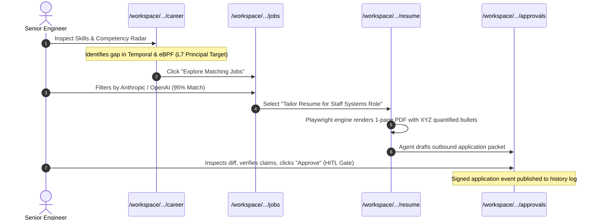
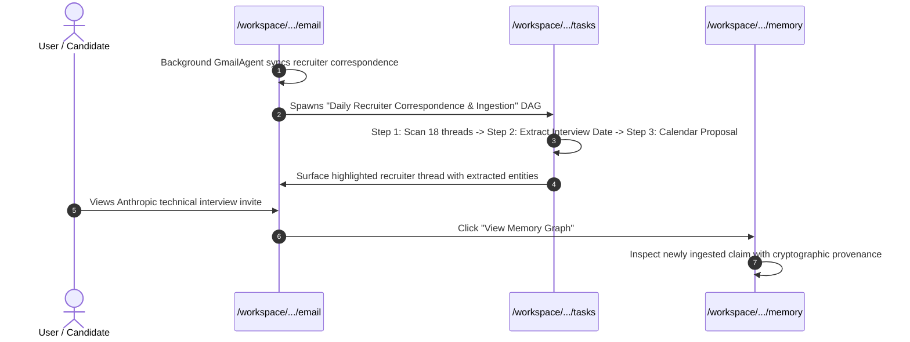

# Vaeloom End-to-End UX Journeys & Operational Workflows

**Audit Date**: September 24, 2026  
**Auditor**: Principal Product Designer & Staff Frontend Architect

---

## Journey 1: Strategic Job Seeker (Career Strategy to Tailored Application)

1. **Orientation**: User lands on `/career` and reviews the **Target Role
   Benchmark** (L7 Principal Systems Architect, \$380k - \$480k, 88% overall
   alignment).
2. **Gap Analysis**: In the "Skills & Competency Radar", the user inspects
   development areas (Temporal Orchestration, eBPF Kernel Telemetry) and
   verified evidence.
3. **Tactical Discovery**: User transitions seamlessly to `/jobs` filtered by
   target companies from the career strategy.
4. **Precision Tailoring**: Selecting a high-affinity role redirects to
   `/resume`, invoking the semantic ATS optimizer. Missing keywords are
   incorporated into bullet points following the XYZ accomplishment formula.
5. **Human-in-the-Loop Consent**: Destructive or outbound actions generate an
   approval card in `/approvals`. The user approves the transmission with a
   single keystroke (`A`) or rejects with (`R`).

---

## Journey 2: Autonomous Intelligence Monitoring (Email Triage to Memory Graph)

1. **Background Ingestion**: `GmailAgent` monitors incoming threads via the
   connected Google Workspace connector.
2. **Workflow Telemetry**: `/tasks` displays the active DAG execution trace
   (`wf-career-sync-842`). Subtask completion bars and duration telemetry update
   in real time.
3. **Triage Feed**: On `/email`, the recruiter reach-out is classified as
   `INTERVIEW_INVITE`. The AI extraction panel highlights stage name,
   interviewers, and scheduling deadlines with high confidence scores (98%).
4. **Memory Integration**: Clicking "View Memory Graph" navigates to `/memory`,
   where the entity node is linked to the candidate's active application records
   and career roadmap.

---

## Journey 3: Zero-Trust Security & Identity Hardening

1. **Configuration**: User navigates to `/settings/security` to harden identity
   posture.
2. **Two-Factor Authentication**:
   - The user inspects the secret key or scans the TOTP URI QR code with Google
     Authenticator or 1Password.
   - User inputs a 6-digit test code to verify real-time server time
     synchronization.
   - User downloads the emergency backup recovery codes in an encrypted `.txt`
     bundle.
3. **Session Telemetry**: User audits active sessions across desktop and mobile
   devices, identifying IP locations, and clicks "Revoke All Other Sessions" to
   rotate JWT refresh tokens.
4. **Inactivity Policy**: Configures auto-lock thresholds (15m, 1h, 8h) matching
   enterprise compliance requirements.
5. **Lockout Recovery**: In the event of an anomalous lockout, `/account-locked`
   provides an actionable, transparent recovery path via verified email and
   incident reference IDs.

---

## Journey 4: Enterprise Administration & Tenant Governance

1. **Console Access**: Enterprise admins access `/admin` and `/organizations`
   with RBAC authorization.
2. **Audit Verification**: Review immutable system audit logs with cryptographic
   deletion receipts, verifying that all tenant records comply with PostgreSQL
   Row-Level Security (RLS).
3. **Marketplace & Extensions**: Browse verified agent templates on
   `/marketplace` and configure dynamic Composio MCP tool bridges on
   `/connectors/dynamic`.
4. **Feature Toggles**: Admin manages staged canary rollouts via
   `/feature-flags`.
