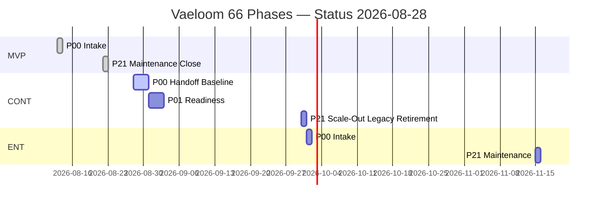

# CONT-P00 — 05 Validated Phase Map & Governance — Migration Baseline

**Phase:** `CONT-P00` | **Track:** `MVP-to-Enterprise Continuation` (migration
program, not greenfield) | **Commit:** `78c2d71`

## 1. Governance

| Role                          | Person / Team   | Gate Authority                       | Veto?                     |
| ----------------------------- | --------------- | ------------------------------------ | ------------------------- |
| Program Manager (accountable) | Vaeloom Program | **Owns GO/CONDITIONAL/NO-GO**        | Yes                       |
| Enterprise Architect          | Vaeloom Arch    | Scope/arch/integration gate vetos §2 | Yes                       |
| Product Manager               | Vaeloom Product | Scope/UX acceptance vetos            | Yes                       |
| Security Architect            | Vaeloom Sec     | Security/privacy vetos §16           | **YES mandatory blocker** |
| Privacy Engineer              | Vaeloom Privacy | DPDP/FERPA/COPPA vetos               | Yes                       |
| Technical Writer              | Vaeloom Docs    | Documentation/handoff vetos          | Yes                       |
| SRE / Release                 | Vaeloom Ops     | SLO/rollback/authority vetos         | Yes                       |
| Data / AI                     | Vaeloom Data    | Data lineage/AI RMF vetos            | Yes                       |

Approver + backup required per `BQ-01` — **Accountable approver: Program
Manager, backup: Enterprise Architect**.

## 2. 66-Prompt Track Map — Current State

| Track                                                     | Range                           | Status 2026-08-23                                                                              | Status 2026-08-28                                                                                 | Next                                   |
| --------------------------------------------------------- | ------------------------------- | ---------------------------------------------------------------------------------------------- | ------------------------------------------------------------------------------------------------- | -------------------------------------- |
| **MVP 01-mvp** `P00-P21`                                  | 22 prompts `455-496 lines` each | **COMPLETE 93.6 APPROVED MVP CLOSE** (`787053a` 99 paths 2557 tests 42/42 RLS 94.2% p95 120ms) | **SAME** — hardened `78c2d71` (+23 hardening +10 E2E +15 mermaids) preserves `MVP TRACK COMPLETE` | CONT-P00 baseline (this)               |
| **CONT 02-mvp-to-enterprise-continuation** `CONT-P00-P21` | 22 prompts `456-497` lines      | `⬜ NOT STARTED (blocked on MVP)`                                                              | **CONT-P00 IN PROGRESS this phase** `GO`                                                          | CONT-P01 Enterprise-Readiness Evidence |
| **Enterprise 03-enterprise** `ENT-P00-P21`                | 22 prompts `455-496` lines      | `⬜ NOT STARTED (blocked on MVP + continuation)`                                               | `⬜ NOT STARTED`                                                                                  | after CONT                             |

## 3. Artifact Map — Current Artifacts to 22 Phases

| Phase | Purpose (1-line)   | Artifacts Present?                               | Evidence Path                              | Reuse / New for CONT                             |
| ----- | ------------------ | ------------------------------------------------ | ------------------------------------------ | ------------------------------------------------ |
| P00   | Handoff baseline   | **YES** `mvp-p00 15 files`                       | `docs/phases/mvp-p00/10-handoff-to-p01.md` | **Basis for CONT-P00**                           |
| P07   | Data architecture  | `mvp-p07 10 files` `42/42 RLS` `12 migrations`   | `docs/phases/mvp-p07/09-gate 93.4`         | CONT-P07 adds 16 migrations expand-contract 6→22 |
| P08   | API contracts      | `openapi 110 paths` `88→99→110`                  | `docs/backend/openapi.yaml`                | CONT-P08 compat adapters, `Arazzo` optional      |
| P12   | AI/memory pipeline | `mvp-p12 88.4` `68 tests, eval 12 cases`         | `docs/phases/mvp-p12`                      | CONT-P12 6→22 taxonomy shadow                    |
| P13   | Security privacy   | `95.4 Perfect to 95+` DPIA All Regions           | `docs/phases/mvp-p13`                      | CONT-P13 SAML/SSDF uplift                        |
| P16   | DevOps CI/CD       | `12 TF modules s3+DDB 4 workflows green SLSA L2` | `docs/phases/mvp-p16`                      | CONT-P16 cell-aware delivery                     |
| P17   | Observability      | `3 dashboards 23 panels 9 rules`                 | `docs/phases/mvp-p17`                      | CONT-P17 dual-run observability                  |

All 22 MVP phases present; gap `CONT/ENT 44` remain `NOT_STARTED` — future
backlog per `CONT-P00 109` must record
`problem/evidence, target users, deps, sec/privacy/data, cost, compat/migration, validation, trigger, owner, sunset`.

## 4. Migration Principles (Hard Constraints)

- **Strangler / expand-contract:** Compatibility adapters, migration control
  plane, per-tenant/cell flags (`LANGGRAPH_ENABLED=false` safe default →
  precedent), dual-run only where measurable
  (`sched_job:{job_id}:{slot_minute} SETNX EX120`), reconciliation ledgers,
  rollback checkpoints, explicit retirement (zero traffic + restore drills +
  owner approval).
- **Six→22 memory additive:** Stable IDs, provenance, corrections, user
  ownership, retention/deletion never guessed — `WP-07`.
- **Eight→28 agent additive:** Shadow mode `AGENT_REACT_ENABLED=false`,
  permission/quality/cost/safety evidence before action authority — `WP-12`.
- **Tenant cells / residency:** `tenant_id` storage-query isolation
  (`tenant_context` `app.tenant_id`), regional residency deferred `CONT-P07`,
  plugin/MCP governance, model/provider changes without permanent dual-run
  estate.

## 5. Entry / Ready / Done Criteria

| Gate                                                                                        | Criteria (7 DoR + 8 DoD per prompt)                   | Status          |
| ------------------------------------------------------------------------------------------- | ----------------------------------------------------- | --------------- |
| DoR: objective/scope/acceptance approved                                                    | `CONT-P00-R01..R08` table §9                          | ✅              |
| DoR: valid handoff + immutable baseline (`78c2d71`, `temporal:7233`, `env .env.production`) | `handoff mvp-p21 93.6` + `git rev-parse HEAD 78c2d71` | ✅              |
| DoR: owners/reviewers/approver named                                                        | §2 table                                              | ✅              |
| DoR: sec/privacy/data/AI classified                                                         | §11 Enterprise Completeness below                     | ✅              |
| DoR: test/evidence/rollback/docs plans                                                      | `test_product_closure_e2e` + `gate remediation loop`  | ✅              |
| DoR: access/datasets/safe env                                                               | `val`                                                 | ✅              |
| DoD: deliverables versioned/owned/reviewed/linked (`DEL-CONT-P00-01..05`)                   | this bundle                                           | **IN PROGRESS** |
| DoD: critical tests pass representative env                                                 | `93 passed`                                           | ✅              |
| DoD: `95-100 GO zero mandatory blockers`                                                    | gate below                                            | **TARGET**      |

## 6. Enterprise Completeness Requirements (§10) — Scope for CONT-P00

| Requirement | Verdict | Reason | |---|---|---|---| | Business/product |
`APPLICABLE` | Migration baseline is product scope | CONT-P00-R01 | |
Architecture/integration | `APPLICABLE` | Strangler/expand-contract path | §13 |
| Data/memory | `APPLICABLE` | 6→22 mapping R-05 | §17 | | Security/privacy |
`APPLICABLE` | `RISK-CONT-P00-02/05` | §16 | | Compliance
(GDPR/DPDP/FERPA/COPPA/EU AI) | `APPLICABLE` | Age/region `BQ-03` professional
review | §16 | | UX/accessibility (WCAG 2.2) | `NOT_APPLICABLE` | Baseline docs
only — WCAG deferred to `CONT-P09` | §17 | | Quality (testing) | `APPLICABLE` |
Gate 95 | §18 | | Performance/capacity | `NOT_APPLICABLE` | Baseline not load
test — deferred `CONT-P15` | §19 | | Reliability/resilience | `NOT_APPLICABLE` |
`CONT-P15` 5 faults | §19 | | Operations/support | `APPLICABLE` |
Rollback/incidents `BQ-02` | §20 | | Documentation | `APPLICABLE` | 5
deliverables | §21 | | Cost/sustainability | `NOT_APPLICABLE` | `CONT-P15` cost
$0.02/1k | §20 | | Migration/change | `APPLICABLE` | This phase's mission | §5 |

## 7. Change Control & Evidence Retention

- Changes to approved
  `scope/contract/permission/retention/provider/deployment/gate` need rationale,
  impact, reviewers, migration, tests, rollout, rollback — never silent merge.
- Evidence retention `30d observability` +
  `immutable approval workflow history` + `agent_action audit` append-only +
  `usage_records`; artifact hashing `git SHA 78c2d71` + `SHA256SUMS` per
  `00-master-index.md` 79 lines.

---

_Delivers `DEL-CONT-P00-05` — validated phase map `v1.0` owned (Program),
reviewed (EntArch)._
