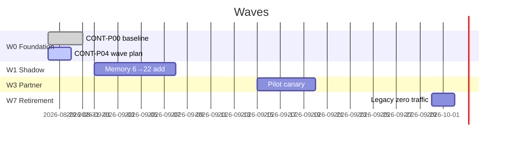

# CONT-P04 — 01 Integrated Roadmap — Waves

**Deliverable:** `DEL-CONT-P04-01` `roadmap` | **Owner:** Program Manager |
**Date:** 2026-08-28

## Waves (foundation, shadow, staff, design partner, cohort, regions, GA, retirement)

| Wave              | Phases                      | Exit Gate                                       | Evidence                                     | Owner           |
| ----------------- | --------------------------- | ----------------------------------------------- | -------------------------------------------- | --------------- |
| W0 Foundation     | CONT-P00..P04               | `CONT-P04 95+`                                  | `01..05` baseline                            | Program         |
| W1 Shadow         | CONT-P07..P12               | `CONT-P12 eval 12 cases` `shad reads`           | `langgraph_run_completed_total{mode=shadow}` | AI Product Lead |
| W2 Staff          | CONT-P10 (frontend coexist) | `zero dead button` `EnterpriseGated`            | `frontend-audit`                             | Product         |
| W3 Design partner | CONT-P19 pilot              | `62% applied cohort` pilot `CONT-P19`           | `pilot validation`                           | Business        |
| W4 Cohort         | CONT-P15 cells              | `counts/checksums` per tenant                   | `SETNX ledger`                               | EntArch         |
| W5 Regions        | CONT-P15 resilience         | `RTO 15m` `cell` residency `DPDP`               | `sre`                                        | SRE             |
| W6 GA             | CONT-P20                    | `rollback decision`                             | `pilot metrics`                              | Release         |
| W7 Retirement     | CONT-P21                    | `zero traffic + restore drill + owner approval` | `00` archived                                | Migration       |

