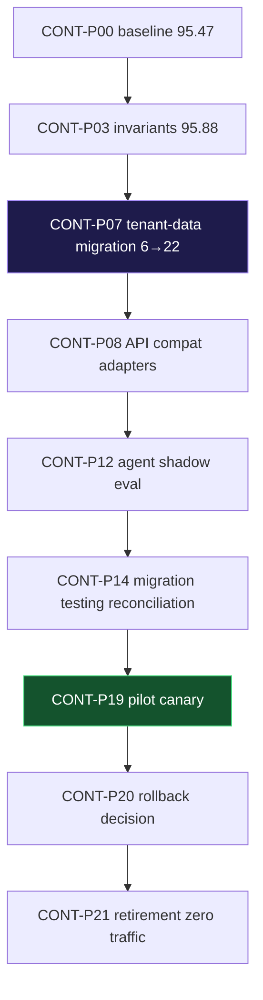

# CONT-P04 — 02 Dependency Graph — Critical Path

**Deliverable:** `DEL-CONT-P04-02` | **Owner:** Engineering Manager

## Critical Path

## Dependencies

| Dependency             | Blocks           | Gate             |
| ---------------------- | ---------------- | ---------------- |
| `01 8 REQ +6 INV`      | `CONT-P04 waves` | `CONT-P03 95.88` |
| `6→22 mapping_version` | `CONT-P12 eval`  | `CONT-P07 42/42` |
| `42/42 RLS`            | `tenant cells`   | `787053a`        |
| `temporal 8 queues`    | `pilot`          | `worker×2`       |

Resource: no procurement values invented — `BWS-02.2 deferred` per
`05-non-goals horizon`.
