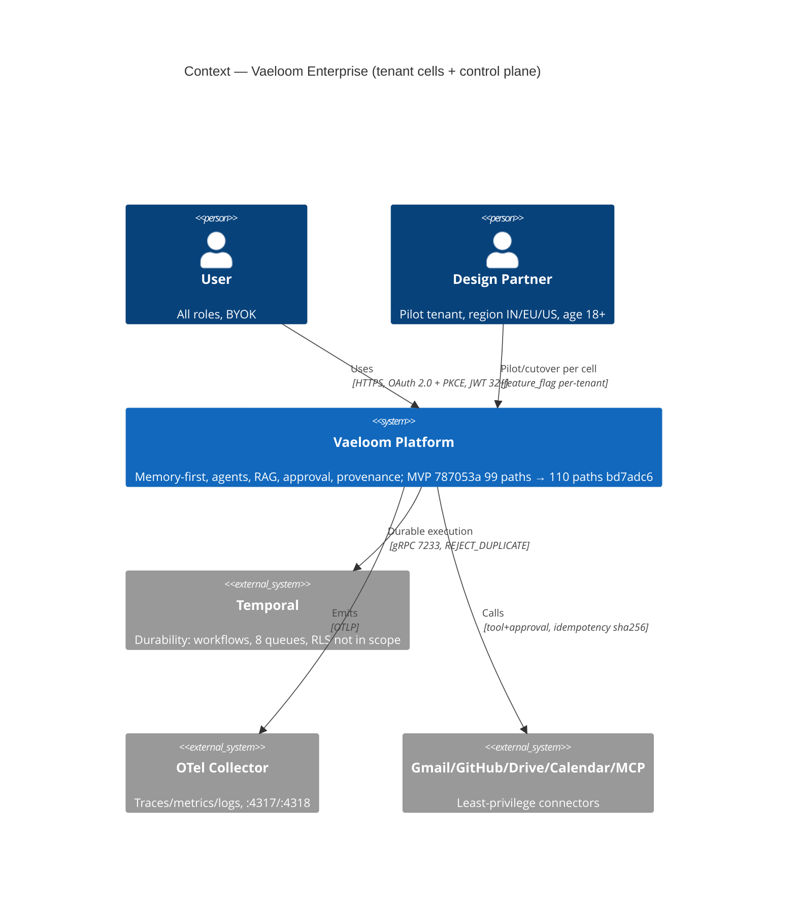
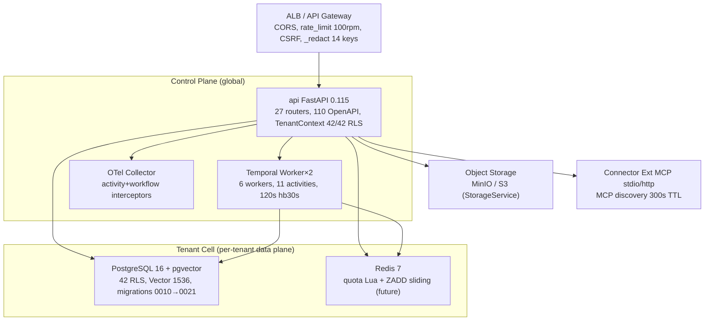
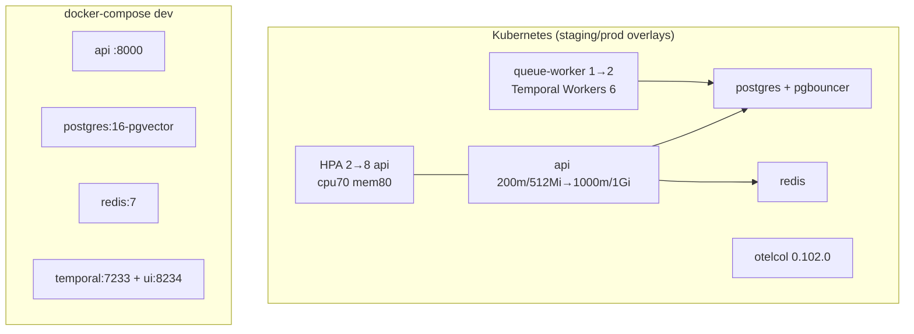
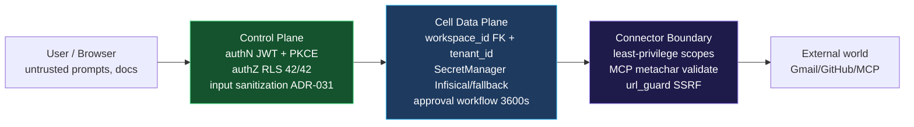

# CONT-P05 — 01 C4 / Deployment / Trust-Boundary / Data-Flow

**Deliverable:** `DEL-CONT-P05-01` | **Version:** 1.0 | **Date:** 2026-08-29 |
**Commit:** `bd7adc6` | **Owners:** Enterprise Architect + Cloud Architect + SRE

## 1 C4 Context (L1)

## 2 C4 Container (L2)

## 3 C4 Component (L3) — Request Path

```mermaid
flowchart LR
  Req["User request"] --> Gateway["Gateway<br/>JWT 32+, CSRF, rate_limit"]
  Gateway --> AuthZ["TenantContext<br/>app.workspace_id/user_id<br/>42/42 RLS SET"]
  AuthZ --> Router["orchestrator.router<br/>classify_intent + MVP scope 10"]
  Router --> Super["supervisor<br/>PARALLEL_SAFE 8 CHAINS 5 DAG ≤5/8/20"]
  Super --> Graph["LangGraph StateGraph 10<br/>MemorySaver thread_id<br/>validate→retrieve→route→supervisor→agent→tool→policy→evaluate→finalize"]
  Graph --> Policy["policy_check<br/>approval_gated 13+dynamic<br/>forged→pending"]
  Policy --> Tool["tool_execute<br/>execute_tool 40+dynamic<br/>4KB/20KB truncate + secret scrub"]
  Tool --> Mem["memory_service / KG<br/>hybrid retrieval vector→LIKE→graph"]
```

## 4 Deployment

**Validated:** `terraform validate 12` `kustomize build … overlays/staging` 60
yamls, `docker-compose config` valid, `infra/terraform` 12 modules s3+DDB.

## 5 Trust Boundary

**Enforcement:** `validate_no_secrets` 35 keys recursive
(`temporal/validation` + `graph/state` single source),
`validate_workspace_binding` at graph entry + handoff + evaluate, `kill_switch`
fail-closed non-local, `[UNTRUSTED]` tagging.

## 6 Data Flow (write → projection)

```mermaid
flowchart LR
  Doc["Document upload"] --> Parse["parse_document 60s hb15s 3×"]
  Parse --> Extract["extract_entities via LLM → Entity 22 types"]
  Extract --> Write["write_memory 10s 3×<br/>canonical_name dedup 0.85<br/>Entity + Memory row + pgvector"]
  Write --> Index["index_graph 10s 2×"]
  Index --> Hybrid["hybrid retrieval<br/>vector <=> → LIKE %query% → graph traversal<br/>rerank + fit_to_context 8000"]
  Hybrid --> RAG["rag_context 8/8/5 8KB<br/>rag_status ok/empty/unavail/timeout/error"]
  RAG --> Graph["LangGraph retrieve_context 5s wait_for"]
  Graph --> Provenance["provenance memory_candidate + rag_status + evaluation_score"]
```

**Projections rebuildable:** `document_chunk` + `embedding` +
`knowledge_nodes/edges` are rebuildable via `reindex` from `Entity/Memory`
truth; never guess missing `canonical_name`.

---

_Version 1.0 2026-08-29 — validated via `terraform validate`, `kustomize`,
`rg tenant_id 42 RLS`, `graph 64` tests. Reviewers: Enterprise/Security/Data
Architects._
