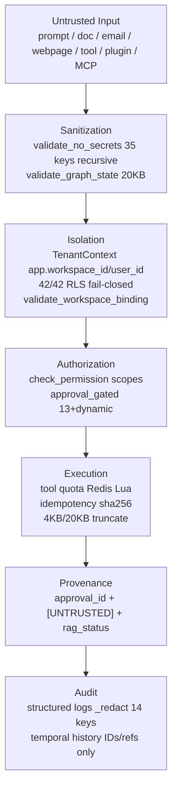

# CONT-P05 — 04 Threat-Informed Architecture

**Deliverable:** `DEL-CONT-P05-04` | **Version:** 1.0 | **Date:** 2026-08-29 |
**Owners:** Security Architect + AI Architect (reviewers:
Enterprise/Data/Privacy)

## 1 Standards & Threat Sources

| Standard                                   | Version                 | Mapping                                                                                                                                 |
| ------------------------------------------ | ----------------------- | --------------------------------------------------------------------------------------------------------------------------------------- |
| `OWASP Agentic 2026`                       | 2026 edition            | goal hijack, tool misuse, identity/privilege abuse, supply chain, unexpected execution, memory/context poisoning, inter-agent/kaskading |
| `OWASP GenAI/LLM 2025`                     | 2025                    | prompt injection, sensitive disclosure, unsafe output, excessive agency                                                                 |
| `NIST AI RMF + GenAI Profile`              | Official                | Govern/Map/Measure/Manage, evaluation, human oversight                                                                                  |
| `EU AI Act`                                | Transparency 2026-08-02 | AI disclosure, use-case classification                                                                                                  |
| `DPDP Rules 2025` + `GDPR` + `FERPA/COPPA` | Current                 | India 18+/US under-13 excluded, notice/consent/breach duties                                                                            |

Recorded in source register `INT-05-source-register` EXT-01..17.

## 2 Architecture Paths Modeled

## 3 Threat Matrix (enterprise Δ)

| Threat                         | OWASP                    | Path                                  | Controls                                                                                               | Evidence                                                                                        | Status         |
| ------------------------------ | ------------------------ | ------------------------------------- | ------------------------------------------------------------------------------------------------------ | ----------------------------------------------------------------------------------------------- | -------------- |
| Prompt injection → goal hijack | Agentic LLM01 + GenAI 01 | `user→graph→agent`                    | `detect_adversarial_prompt critical→ValidationError` (`nodes.validate_input`) + `[UNTRUSTED]` tagging  | `test_closure_contracts` `security/test_chaos`                                                  | Mitigated      |
| Tool misuse / excessive agency | Agentic 02 + GenAI 08    | `tool_decision→policy→tool_execute`   | `approval_gated` 13 + dynamic `readOnlyHint==false` + `policy_check forged→pending` + `per-tool quota` | `test_tool_closure forged` 6 passed                                                             | Mitigated      |
| Memory/context poisoning       | Agentic 06               | `doc→entity→knowledge_graph→rag`      | `validate_no_secrets` RAG refs 8KB, `proposed—not executed` `ApprovalCard`, dedup 0.85, provenance     | `test_memory_closure` 3                                                                         | Mitigated      |
| Identity/privilege abuse       | Agentic 03               | `workspace→connector→approval`        | `TenantContext` + `RLS 42/42` + `WorkspaceUser` verify `routers/temporal._verify` →404 fail-closed     | `security/test_tenant_isolation` 63                                                             | Mitigated      |
| Inter-agent/cascading          | Agentic 07               | `supervisor DAG 20 nodes` → `handoff` | `AgentHandoff` typed `8KB/8 refs` + `validate_handoff_state` + `seen dedup no cycles`                  | `test_handoff_validation`                                                                       | Mitigated      |
| Sensitive disclosure           | GenAI 03                 | `tool output→state→log→history`       | `validate_no_secrets` on tool output + `final result` + `_redact 14 keys` + IDs/refs only              | `graph 64` secret tests                                                                         | Mitigated      |
| Supply chain                   | Agentic 04 + SLSA 1.2    | `mcp stdio/http` + `pip`/`npm`        | `mcp_client` metachar deny `sh                                                                         | bash…`, `env allowlist`, `headers token verify`, `pip-audit 0` `trivy 0 CRIT` `syft spdx 420KB` | `mcp 300s TTL` | Mitigated |

## 4 Privacy Controls

- `DPDP 2025` 18+, `COPPA` under-13 excluded separately reviewed,
  `GDPR All Regions`, `FERPA` institution-controlled — DPIA
  `v1.2 All Regions 3 DPA` `retention_runs 0021` 30d, `0021` preserves `audit`
  after `user erasure` (hold).
- Data minimization: `rag_context` refs only 8/8/5, projection rebuildable,
  `content_hash` always in `memory_service`.

## 5 Residual Risk & Owner

- `F-TRC-01` tracing client `rpc_metadata` header not yet propagated — `LOW`,
  owner `SRE`, next `interceptors` client injection.
- `F-Q-01` scrape in-proc not Redis `ZADD` shared — `LOW`, owner `Integration`,
  bounded `20/h`.

No `HIGH/CRITICAL` blocker remains — next `dual-run` reconciliation ledgers
added in `CONT-P07`.

---

_Version 1.0 2026-08-29 — reviewers: Security/Privacy/AI, `OWASP`
version-pinned, `42/42 RLS` verified._
