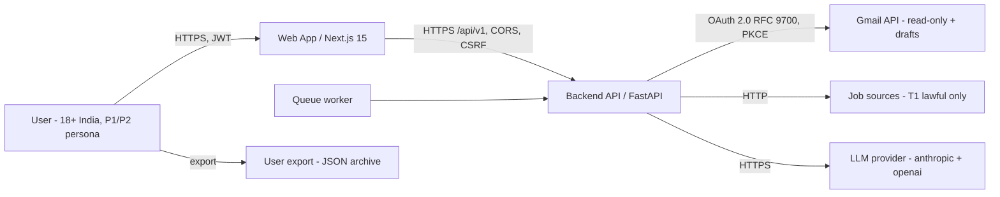
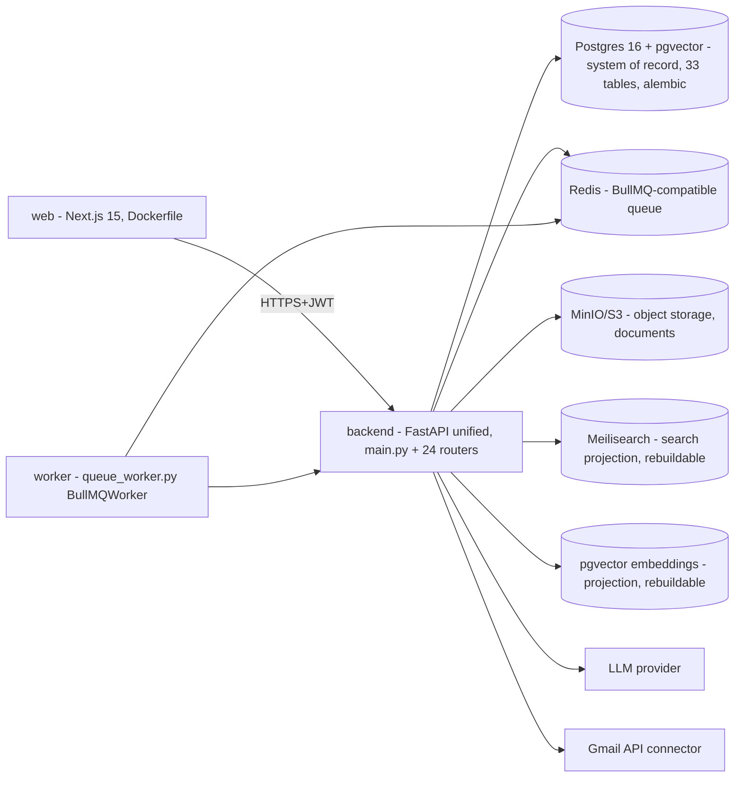

# MVP-P05 — 03. C4 / Trust Boundaries / Data Flows (DEL-MVP-P05-01)

> Owner: Enterprise Architect · Grounded in live repo inspection (`662052e`).
> Mermaid renders on GitHub. Design intent; implementation status tracked at
> P10–P12.

## 1. Context diagram



- Single-user product experience; every artifact workspace-scoped (INT-02 §1).
- Gmail draft-only, no send (DEC-P01-03); job submission only via approval
 contract (ADR-021). T2/T3 gated (DEC-P02-05).

## 2. Container diagram



- Dev: `docker-compose.yml` (postgres, redis, web, backend, minio, pgbouncer).
- PaaS-first MVP target per P04 cost scenarios (nearest region, BQ-P05-02).
- No NestJS app in repo — TS packages (service-auth, observability, queue) are
 libraries, not deployed services (CF-P05-01).

## 3. Trust boundaries

| Boundary | Path | Trust model | Controls (existing → gap) |
| ------------------------- | ---------------------- | -------------------------- | ------------------------------------------------------------------------------------------------------ |
| B1 Browser ↔ API | HTTPS /api/v1 | User identity (JWT) | Auth middleware (JWT→tenant_id), CSRF, rate limit, IP filter, security headers ✅ → pin versioning P08 |
| B2 User ↔ Workspace | X-Tenant-ID + JWT | Workspace-scoped | tenant middleware + app-level WHERE filters ✅ → RLS hardening P07 (ADR-023) |
| B3 Backend ↔ Gmail | OAuth 2.0 refresh | Least-privilege delegated | gmail_client OAuth2, read-only + drafts, mock fallback ✅ → PKCE/RFC 9700 P08 |
| B4 Backend ↔ LLM | API key | Vendor untrusted | llm_service httpx + tenacity; prompt_injection middleware ✅ → model/prompt version registry P12 |
| B5 Worker ↔ Redis | internal | Service identity | Redis URL secret ✅ → workload identity P08 (ADR-025) |
| B6 Backend ↔ Object store | S3 creds | Service identity | MinIO/S3 vars ✅ → ADR-025 |
| B7 User ↔ approval | In-app propose/approve | User = sole decision-maker | **GAP: no approval persistence (ADR-021)** |

## 4. Identity & authorization architecture

- **AuthN:** JWT access + rotating refresh (ADR-007), password + optional SSO
 (backend SSO exists; SSO UI = enterprise, out of MVP).
- **AuthZ:** tenant/workspace scoping via middleware + service filters; RBAC
 middleware exists (MVP = owner-only role).
- **Workload identity:** FastAPI service tokens (ADR-025) for worker↔API,
 API↔connectors; no user credentials in workers.
- **Approval:** proposal/action separation (INT-02 §3): proposal is
 user-visible, payload-hash-bound, expiring; action is idempotent (ADR-021).

## 5. Core data flows

### F1 Ingest (documents, Gmail, job links)

```text
Upload/link → connector (gmail_client fetch_emails | job url fetch) →
ingestion pipeline (parsers, dedup) → Document/DocumentVersion (authoritative)
→ embeddings (projection) → Memory extraction (agent) → QA gate → memory rows
```

- Untrusted content never changes policy (prompt §16).

### F2 Organize → remember

```text
Extracted facts → Memory (entity-typed, provenance, supersession) →
Entity/Relationship (graph projection) + Embedding (vector projection)
→ retrieval (>=80% hit, BQ-P02-03) → RAG for agents
```

- Relational authoritative; graph/vector/search rebuildable (INT-02 §5,
 ADR-024).

### F3 Assist (proposal → approval → action)

```text
Agent proposes (request_approval exists in application_agent) →
approval_request persisted: payload hash, expiry, scope (NEW, ADR-021) →
user approves/rejects (immutable, replay-safe) → action executes with
idempotency key → audit log (audit service, exists)
```

### F4 Reminders & deadlines

```text
Gmail polling watcher (NEW, FR-40, DEC-P02-01) → extract deadline facts
(FR-41, >=90%) → ScheduleEvent → Scheduler agent → notification (app,
optional email) → reminders (FR-43)
```

### F5 Export / erasure

```text
Export: gather workspace rows + projections → JSON archive (NFR-23) →
receipt. Erasure: primary deletion + backup expiry + legal hold distinction
(FR-61/62, NFR-20); projection rebuild after change
```

## 6. Degradation model (BQ-P05-01: 99% best-effort, no SLA)

| Failure | Mode | Degraded behavior | Recovery |
| -------------------- | ------------------- | --------------------------------------------------------------------- | ----------------------------------------- |
| LLM provider down | Assist-only | Retrieval + facts still serve; generation returns error, queued | Retry w/ backoff; alerts (OTel exists) |
| Gmail API down/quota | Connector isolation | Deadline extraction paused; reminders paused; app remains usable | Watch polling retry; backoff; user notice |
| Redis down | Queue degraded | Jobs dead-letter (DeadLetterEvent exists); sync fallback for critical | Reconnect; replay DLQ |
| Postgres down | Unavailable | Health check 503; no silent partial reads | Restore per DR runbook |

- No synchronized retries (INT-02 §5); tenacity exponential + jitter; timeouts
 defined at P08; kill switches AUTO-01..03 (DEC-P02-05).
