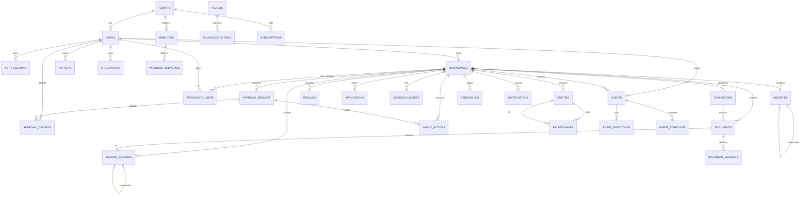

# MVP-P07 — 03. Data Models & Dictionary

> **Owner:** Data Architect · **Source of truth:**
> `apps/api/src/api/models/schema.py` **Audit date:** 2026-08-17 · **ORM
> classes:** 38 · **Unique `__tablename__`:** 38
>
> **Migration chain:** 0001 (initial 25) → 0002 (microservice tables) → 0003
> (approval tables) → 0004 (memory taxonomy) → 0005 (RLS expanded) → 0006
> (provenance) → **0007 (missing tables)** → **0008 (schema gaps)** → **0009
> (memory domain CHECK)** → **0010 (RLS force + roles)** → **0011 (HNSW index)**
> → **0012 (fix broken RLS policies)**

---

## 1. Migration Gap Audit — RESOLVED 2026-08-17

### Tables with ORM model but NO Alembic migration — RESOLVED

| Table | ORM class | Resolution |
| --------------------- | ------------------- | -------------------------------- |
| `agent_approvals` | `AgentApproval` | ✅ Created by migration **0007** |
| `idempotency_records` | `IdempotencyRecord` | ✅ Created by migration **0007** |
| `gmail_watches` | `GmailWatch` | ✅ Created by migration **0007** |

### Columns with ORM but NO Alembic migration — RESOLVED

| Table | Column | Resolution |
| ------------------ | ------------------ | -------------------------------------------------- |
| `agent_executions` | `tenant_id` | ✅ Added by migration **0008** |
| `agent_executions` | `user_id` | ✅ Added by migration **0008** |
| `agent_executions` | `response_time_ms` | ✅ Added by migration **0008** |
| `connectors` | `name` | ✅ Added by migration **0008** (NOT NULL, default) |
| `connectors` | `tenant_id` | ✅ Added by migration **0008** |
| `gmail_watches` | _(all columns)_ | ✅ Created by migration **0007** |

### CHECK constraints — RESOLVED

| Table | Column | Expected values | Resolution |
| ---------- | -------- | -------------------------------------------------------- | -------------------------------------------- |
| `memories` | `domain` | profile, document, career, episodic, preference, working | ✅ Added by migration **0009** with backfill |

### RLS coverage — HARDENED

**Migration 0005** enables RLS on 31 tables. **Migration 0007** extends RLS to 3
newly created tables (`agent_approvals`, `idempotency_records`,
`gmail_watches`), bringing total to **34 tables**.

**Migration 0010** adds:

- `FORCE ROW LEVEL SECURITY` on all 34 tables (prevents table-owner bypass)
- `vaeloom_migrator` role with `BYPASSRLS` (for schema migrations)
- `vaeloom_readonly` role for analytics
- Revokes `BYPASSRLS` from `vaeloom_app` (application role)

**Tables WITHOUT RLS:** `tenants`, `users`, `agents`, `permissions`
(self-referential/global tables — no tenant scoping needed)

---

## 2. Logical Model — Authoritative Stores

| Store | Table(s) | Role | Authoritative |
| ---------------- | ------------------------------------------------------------------------ | ------------------------------ | -------------- |
| System of record | Postgres: all 38 ORM-mapped tables + 14 microservice tables | All persisted truth | ✅ |
| Object storage | documents files (MinIO/S3) | Binary content | ✅ (files) |
| Projections | embeddings (pgvector), entities/relationships (graph), Meilisearch index | Derived, rebuildable (ADR-024) | ❌ rebuildable |
| Queue | Redis (BullMQ-compatible) | Transient jobs | ❌ ephemeral |

---

## 3. Data Dictionary — All 38 ORM Tables

---

### `tenants`

| Field | Value |
| ----------------- | ----------------------------------------------------------------------------------------- |
| Owner | Platform ops |
| Description | Multi-tenant root entity. Every user, workspace, and scoped resource belongs to a tenant. |
| Tenant-scoped | NO (self-referential; tenant_id column absent) |
| Sensitivity | internal |
| Retention | Indefinite; soft-delete via status |
| RLS policy | NONE — table is not tenant-scoped |
| Alembic migration | 0001 |

**Columns:**

| Column | Type | Nullable | Default | FK | Index | Sensitive | Description |
| ---------- | -------------- | -------- | ----------------- | --- | ------ | --------- | ---------------------------- |
| id | UUID PK | NO | gen_random_uuid() | — | — | — | Primary key |
| name | VARCHAR(255) | NO | — | — | — | NO | Human-readable tenant name |
| slug | VARCHAR(255) | NO | — | — | UNIQUE | NO | URL-safe identifier; unique |
| domain | VARCHAR(500) | YES | — | — | — | NO | Custom domain for SSO |
| status | VARCHAR(20) | NO | 'ACTIVE' | — | — | — | ACTIVE / SUSPENDED / DELETED |
| isolation | VARCHAR(50) | NO | 'pooled' | — | — | — | pooled / dedicated |
| plan | VARCHAR(50) | NO | 'free' | — | — | — | free / pro / enterprise |
| settings | JSONB | NO | {} | — | — | NO | Tenant-specific config |
| limits | JSONB | NO | {} | — | — | NO | Rate limits, quotas |
| features | VARCHAR(255)[] | NO | [] | — | — | NO | Enabled feature flags |
| created_at | TIMESTAMPTZ | NO | now() | — | — | — | Creation timestamp |
| updated_at | TIMESTAMPTZ | NO | now() | — | — | — | Last update timestamp |

**Constraints:**

- UNIQUE(slug)

**Indexes:**

- None beyond PK/unique

**Relationships:**

- has_many → users
- has_many → workspaces (via users)
- has_many → webhooks

---

### `users`

| Field | Value |
| ----------------- | --------------------------------------------------------------- |
| Owner | Platform |
| Description | End-user accounts. Supports email/password and OAuth providers. |
| Tenant-scoped | YES (tenant_id) |
| Sensitivity | PII (email, display_name, avatar_url) |
| Retention | User-driven; soft-delete via status |
| RLS policy | NONE — not in 0005 SCOPED_TABLES |
| Alembic migration | 0001, 0006 (+consent columns) |

**Columns:**

| Column | Type | Nullable | Default | FK | Index | Sensitive | Description |
| ------------------ | ------------- | -------- | ----------------- | ------------ | ------ | --------- | ---------------------------------------- |
| id | UUID PK | NO | gen_random_uuid() | — | — | — | Primary key |
| email | VARCHAR(255) | NO | — | — | UNIQUE | PII | Login email; unique |
| password_hash | VARCHAR(255) | YES | — | — | — | PII | Bcrypt hash; NULL for OAuth-only |
| display_name | VARCHAR(255) | NO | — | — | — | PII | User display name |
| avatar_url | VARCHAR(1000) | YES | — | — | — | PII | Profile image URL |
| auth_provider | VARCHAR(50) | NO | 'email' | — | — | — | email / google / microsoft |
| status | VARCHAR(20) | NO | 'ACTIVE' | — | — | — | ACTIVE / SUSPENDED / DELETED |
| preferences | JSONB | NO | {} | — | — | NO | UI/app preferences |
| tenant_id | UUID | YES | — | → tenants.id | — | — | Tenant FK (nullable for platform admins) |
| consent_version | VARCHAR(20) | YES | — | — | — | — | DPDP consent notice version |
| consent_granted_at | TIMESTAMPTZ | YES | — | — | — | — | When consent was given |
| created_at | TIMESTAMPTZ | NO | now() | — | — | — | Creation timestamp |
| updated_at | TIMESTAMPTZ | NO | now() | — | — | — | Last update timestamp |

**Constraints:**

- UNIQUE(email)

**Relationships:**

- belongs_to → tenant (optional)
- has_many → auth_sessions
- has_many → workspaces (as owner)
- has_many → workspace_users
- has_many → memories
- has_many → agents
- has_many → api_keys

---

### `auth_sessions`

| Field | Value |
| ----------------- | -------------------------------------------------------------- |
| Owner | Platform |
| Description | Active login sessions. Tracks JWT + refresh tokens per device. |
| Tenant-scoped | YES (via user → tenant) |
| Sensitivity | PII (token, refresh_token, ip_address) |
| Retention | TTL-based; expires_at |
| RLS policy | p_auth_sessions_workspace (0005) |
| Alembic migration | 0001 |

**Columns:**

| Column | Type | Nullable | Default | FK | Index | Sensitive | Description |
| ------------- | ------------ | -------- | ----------------- | -------------------- | ------ | --------- | ---------------------------- |
| id | UUID PK | NO | gen_random_uuid() | — | — | — | Primary key |
| user_id | UUID | NO | — | → users.id (CASCADE) | — | — | Session owner |
| provider | VARCHAR(50) | NO | 'email' | — | — | — | Auth provider used |
| status | VARCHAR(20) | NO | 'ACTIVE' | — | — | — | ACTIVE / REVOKED / EXPIRED |
| token | VARCHAR(500) | NO | — | — | UNIQUE | PII | JWT access token (hashed) |
| refresh_token | VARCHAR(500) | NO | — | — | UNIQUE | PII | Refresh token (hashed) |
| expires_at | TIMESTAMPTZ | NO | — | — | — | — | Token expiry |
| last_activity | TIMESTAMPTZ | NO | now() | — | — | — | Last request timestamp |
| device_info | JSONB | YES | — | — | — | PII | User-agent / device metadata |
| ip_address | VARCHAR(45) | YES | — | — | — | PII | Client IP (IPv4/IPv6) |
| created_at | TIMESTAMPTZ | NO | now() | — | — | — | Session creation time |

**Constraints:**

- UNIQUE(token)
- UNIQUE(refresh_token)

**Relationships:**

- belongs_to → user

---

### `api_keys`

| Field | Value |
| ----------------- | ------------------------------------------------------------------------------- |
| Owner | Platform |
| Description | Programmatic API keys for service accounts and integrations. Supports rotation. |
| Tenant-scoped | YES (tenant_id) |
| Sensitivity | PII (key_hash) |
| Retention | User-driven; expires_at + enabled flag |
| RLS policy | p_api_keys_workspace (0005) |
| Alembic migration | 0001 |

**Columns:**

| Column | Type | Nullable | Default | FK | Index | Sensitive | Description |
| ------------ | ------------ | -------- | ----------------- | -------------------- | ------ | --------- | ---------------------------------------------- |
| id | UUID PK | NO | gen_random_uuid() | — | — | — | Primary key |
| name | VARCHAR(255) | NO | — | — | — | NO | Human-readable label |
| key_prefix | VARCHAR(20) | NO | — | — | — | NO | First chars for identification (e.g. `vk_...`) |
| key_hash | VARCHAR(512) | NO | — | — | UNIQUE | PII | SHA-256 hash of full key |
| permissions | JSONB | NO | [] | — | — | NO | Allowed scopes |
| tenant_id | UUID | YES | — | — | — | — | Tenant scope |
| user_id | UUID | NO | — | → users.id (CASCADE) | — | — | Key owner |
| expires_at | TIMESTAMPTZ | YES | — | — | — | — | Optional expiry |
| last_used | TIMESTAMPTZ | YES | — | — | — | — | Last successful auth |
| enabled | BOOLEAN | NO | true | — | — | — | Active flag |
| version | INTEGER | NO | 1 | — | — | — | Rotation version |
| rotated_at | TIMESTAMPTZ | YES | — | — | — | — | When key was rotated |
| rotated_from | UUID | YES | — | — | — | — | Previous key ID |
| created_at | TIMESTAMPTZ | NO | now() | — | — | — | Creation timestamp |

**Constraints:**

- UNIQUE(key_hash)

**Relationships:**

- belongs_to → user

---

### `workspaces`

| Field | Value |
| ----------------- | ------------------------------------------------------------------------------------------- |
| Owner | Platform |
| Description | Top-level data scope. All user data (documents, memories, agents) is scoped to a workspace. |
| Tenant-scoped | YES (via user → tenant; no direct tenant_id column) |
| Sensitivity | PII (name, description) |
| Retention | User-driven |
| RLS policy | p_workspaces_workspace (0005) |
| Alembic migration | 0001, 0006 (+consent columns) |

**Columns:**

| Column | Type | Nullable | Default | FK | Index | Sensitive | Description |
| ------------------ | ------------ | -------- | ----------------- | -------------------- | ---------------------- | --------- | ---------------------- |
| id | UUID PK | NO | gen_random_uuid() | — | — | — | Primary key |
| user_id | UUID | NO | — | → users.id (CASCADE) | idx_workspaces_user_id | — | Workspace owner |
| name | VARCHAR(255) | NO | — | — | — | NO | Workspace name |
| description | TEXT | YES | — | — | — | NO | Optional description |
| consent_version | VARCHAR(20) | YES | — | — | — | — | DPDP consent version |
| consent_granted_at | TIMESTAMPTZ | YES | — | — | — | — | When consent was given |
| created_at | TIMESTAMPTZ | NO | now() | — | — | — | Creation timestamp |
| updated_at | TIMESTAMPTZ | NO | now() | — | — | — | Last update timestamp |

**Indexes:**

- idx_workspaces_user_id (user_id) — lookup by owner

**Relationships:**

- belongs_to → user (owner)
- has_many → workspace_users (members)
- has_many → documents
- has_many → memories
- has_many → memory_records
- has_many → entities
- has_many → resumes
- has_many → applications
- has_many → schedule_events
- has_many → agent_actions
- has_many → permissions
- has_many → connectors
- has_many → agents
- has_many → notifications

---

### `workspace_users`

| Field | Value |
| ----------------- | --------------------------------------------------------- |
| Owner | Platform |
| Description | Many-to-many join between users and workspaces with role. |
| Tenant-scoped | YES (via workspace → user → tenant) |
| Sensitivity | internal |
| Retention | Tied to workspace/user lifecycle |
| RLS policy | p_workspace_users_workspace (0005) |
| Alembic migration | 0001 |

**Columns:**

| Column | Type | Nullable | Default | FK | Index | Sensitive | Description |
| ------------ | ----------- | -------- | ----------------- | ------------------------- | ----- | --------- | ------------------------------- |
| id | UUID PK | NO | gen_random_uuid() | — | — | — | Primary key |
| workspace_id | UUID | NO | — | → workspaces.id (CASCADE) | — | — | Workspace FK |
| user_id | UUID | NO | — | → users.id (CASCADE) | — | — | User FK |
| role | VARCHAR(20) | NO | 'MEMBER' | — | — | — | OWNER / ADMIN / MEMBER / VIEWER |
| joined_at | TIMESTAMPTZ | NO | now() | — | — | — | Membership timestamp |

**Constraints:**

- UNIQUE(workspace_id, user_id)

**Relationships:**

- belongs_to → workspace
- belongs_to → user

---

### `connectors`

| Field | Value |
| ----------------- | -------------------------------------------------------------------------------------------- |
| Owner | Platform |
| Description | External service integrations (Gmail, Calendar, etc.). One connector per type per workspace. |
| Tenant-scoped | YES (workspace_id) |
| Sensitivity | PII (token_ref — encrypted OAuth tokens) |
| Retention | User-driven; disconnect removes |
| RLS policy | p_connectors_workspace (0005) |
| Alembic migration | 0001, 0006 (+oauth_scopes, refresh_token_rotated_at) |

**Columns:**

| Column | Type | Nullable | Default | FK | Index | Sensitive | Description |
| ------------------------ | -------------- | -------- | ----------------- | ------------------------- | --------------------------- | --------- | -------------------------------- |
| id | UUID PK | NO | gen_random_uuid() | — | — | — | Primary key |
| workspace_id | UUID | NO | — | → workspaces.id (CASCADE) | idx_connectors_workspace_id | — | Workspace scope |
| type | VARCHAR(50) | NO | — | — | — | — | gmail / calendar / github / etc. |
| name | VARCHAR(255) | NO | — | — | — | NO | Display name |
| tenant_id | UUID | YES | — | — | — | — | Tenant scope |
| scopes | VARCHAR(255)[] | YES | — | — | — | — | Granted OAuth scopes |
| status | VARCHAR(20) | NO | 'DISCONNECTED' | — | — | — | CONNECTED / DISCONNECTED / ERROR |
| token_ref | VARCHAR(1000) | YES | — | — | — | PII | Encrypted token reference |
| last_synced_at | TIMESTAMPTZ | YES | — | — | — | — | Last successful sync |
| oauth_scopes | JSONB | YES | — | — | — | — | RFC 9700 scope details |
| refresh_token_rotated_at | TIMESTAMPTZ | YES | — | — | — | — | When refresh token was rotated |
| config | JSONB | NO | {} | — | — | NO | Connector-specific config |
| created_at | TIMESTAMPTZ | NO | now() | — | — | — | Creation timestamp |
| updated_at | TIMESTAMPTZ | NO | now() | — | — | — | Last update timestamp |

**Constraints:**

- UNIQUE(workspace_id, type) — one connector per type per workspace

**Indexes:**

- idx_connectors_workspace_id (workspace_id) — workspace lookups

**Relationships:**

- belongs_to → workspace
- has_many → documents

---

### `documents`

| Field | Value |
| ----------------- | ----------------------------------------------------------------------------------------- |
| Owner | Platform |
| Description | Uploaded or ingested documents (resumes, cover letters, etc.). Binary stored in MinIO/S3. |
| Tenant-scoped | YES (workspace_id) |
| Sensitivity | PII (path, summary — may contain personal data) |
| Retention | user_driven (default); configurable per retention_policy |
| RLS policy | p_documents_workspace (0005) |
| Alembic migration | 0001, 0006 (+retention_policy, deleted_at) |

**Columns:**

| Column | Type | Nullable | Default | FK | Index | Sensitive | Description |
| ------------------- | ------------- | -------- | ----------------- | ------------------------- | --------------------------------- | --------- | -------------------------------------------- |
| id | UUID PK | NO | gen_random_uuid() | — | — | — | Primary key |
| workspace_id | UUID | NO | — | → workspaces.id (CASCADE) | idx_documents_workspace_id | — | Workspace scope |
| source_connector_id | UUID | YES | — | → connectors.id | idx_documents_source_connector_id | — | Origin connector |
| path | VARCHAR(1000) | NO | — | — | — | PII | Logical path / filename |
| type | VARCHAR(50) | NO | — | — | — | — | resume / cover_letter / email / etc. |
| raw_storage_key | VARCHAR(1000) | YES | — | — | — | — | S3/MinIO object key |
| summary | TEXT | YES | — | — | — | PII | LLM-generated summary |
| retention_policy | VARCHAR(50) | NO | 'user_driven' | — | — | — | user_driven / fixed / compliance |
| deleted_at | TIMESTAMPTZ | YES | — | — | — | — | Soft-delete timestamp |
| metadata_ | JSONB | NO | {} | — | — | NO | Arbitrary metadata (column name: "metadata") |
| created_at | TIMESTAMPTZ | NO | now() | — | — | — | Creation timestamp |
| updated_at | TIMESTAMPTZ | NO | now() | — | — | — | Last update timestamp |

**Indexes:**

- idx_documents_workspace_id (workspace_id) — workspace lookups
- idx_documents_source_connector_id (source_connector_id) — connector origin
 lookups

**Relationships:**

- belongs_to → workspace
- belongs_to → connector (optional)
- has_many → document_versions
- has_many → memory_records (as source)

---

### `document_versions`

| Field | Value |
| ----------------- | --------------------------------------------------------------------------- |
| Owner | Platform |
| Description | Immutable version history for documents. Each upload creates a new version. |
| Tenant-scoped | YES (via document → workspace) |
| Sensitivity | internal |
| Retention | Tied to parent document |
| RLS policy | p_document_versions_workspace (0005) |
| Alembic migration | 0001 |

**Columns:**

| Column | Type | Nullable | Default | FK | Index | Sensitive | Description |
| -------------- | ------------- | -------- | ----------------- | ------------------------ | ----- | --------- | -------------------------- |
| id | UUID PK | NO | gen_random_uuid() | — | — | — | Primary key |
| document_id | UUID | NO | — | → documents.id (CASCADE) | — | — | Parent document |
| version_number | INTEGER | NO | — | — | — | — | Sequential version |
| storage_key | VARCHAR(1000) | NO | — | — | — | — | S3/MinIO object key |
| superseded_by | UUID | YES | — | — | — | — | Next version ID |
| checksum | VARCHAR(256) | YES | — | — | — | — | SHA-256 of file content |
| size_bytes | INTEGER | YES | — | — | — | — | File size in bytes |
| created_at | TIMESTAMPTZ | NO | now() | — | — | — | Version creation timestamp |

**Constraints:**

- UNIQUE(document_id, version_number)

**Relationships:**

- belongs_to → document

---

### `memories`

| Field | Value |
| ----------------- | ---------------------------------------------------------------------------------------------------------------------------- |
| Owner | Platform |
| Description | High-level memory entries. Indexed by pgvector for semantic search. Supports domain taxonomy, supersession, and soft-delete. |
| Tenant-scoped | YES (workspace_id, tenant_id) |
| Sensitivity | PII (title, content, summary — personal knowledge) |
| Retention | user-driven; soft-delete via deleted_at |
| RLS policy | p_memories_workspace (0005) |
| Alembic migration | 0001, 0004 (+domain, supersedes_id, deleted_at) |

**Columns:**

| Column | Type | Nullable | Default | FK | Index | Sensitive | Description |
| ------------- | -------------- | -------- | ----------------- | --------------- | ----------------------------------- | --------- | ------------------------------------------------------------- |
| id | UUID PK | NO | gen_random_uuid() | — | — | — | Primary key |
| type | VARCHAR(50) | NO | — | — | — | — | Memory type |
| domain | VARCHAR(100) | YES | — | — | idx_memories_tenant_domain | — | profile / document / career / episodic / preference / working |
| status | VARCHAR(20) | NO | 'PROCESSING' | — | idx_memories_tenant_status | — | PROCESSING / ACTIVE / ARCHIVED |
| title | VARCHAR(500) | NO | — | — | — | PII | Human-readable title |
| summary | TEXT | YES | — | — | — | PII | LLM-generated summary |
| content | TEXT | YES | — | — | — | PII | Full content text |
| content_hash | VARCHAR(256) | NO | — | — | — | — | SHA-256 for dedup |
| size | INTEGER | NO | 0 | — | — | — | Content size in chars |
| embedding | VECTOR(1536) | YES | — | — | — | — | pgvector embedding |
| metadata_ | JSONB | NO | {} | — | — | NO | Arbitrary metadata (column: "metadata") |
| tags | VARCHAR(255)[] | NO | [] | — | — | NO | User/system tags |
| tenant_id | UUID | YES | — | — | idx_memories_tenant_type | — | Tenant scope |
| user_id | UUID | YES | — | → users.id | — | — | Owner user |
| workspace_id | UUID | YES | — | → workspaces.id | idx_memories_workspace_id | — | Workspace scope |
| source_type | VARCHAR(100) | YES | — | — | — | — | resume / gmail / manual / etc. |
| source_uri | VARCHAR(1000) | YES | — | — | — | — | Original source URI |
| source_label | VARCHAR(255) | YES | — | — | — | — | Human-readable source |
| connector_id | UUID | YES | — | — | — | — | Origin connector |
| vector_id | VARCHAR(255) | YES | — | — | — | — | External vector store ID |
| graph_node_id | UUID | YES | — | — | — | — | Knowledge graph node ID |
| supersedes_id | UUID | YES | — | → memories.id | idx_memories_supersedes | — | Previous version this replaces |
| deleted_at | TIMESTAMPTZ | YES | — | — | idx_memories_workspace_type_deleted | — | Soft-delete timestamp |
| created_at | TIMESTAMPTZ | NO | now() | — | — | — | Creation timestamp |
| updated_at | TIMESTAMPTZ | NO | now() | — | — | — | Last update timestamp |

**Indexes:**

- idx_memories_tenant_type (tenant_id, type) — tenant-scoped type queries
- idx_memories_tenant_status (tenant_id, status) — tenant-scoped status queries
- idx_memories_tenant_domain (tenant_id, domain) — tenant-scoped domain queries
- idx_memories_workspace_id (workspace_id) — workspace lookups
- idx_memories_workspace_type_deleted (workspace_id, type, deleted_at) WHERE
 deleted_at IS NULL — active memories
- idx_memories_supersedes (workspace_id, supersedes_id) WHERE supersedes_id IS
 NOT NULL — supersession chain

**Relationships:**

- belongs_to → user (optional)
- belongs_to → workspace (optional)
- self-referential → supersedes (Memory.id)
- self-referential → superseded_by (Memory.id)

---

### `memory_records`

| Field | Value |
| ----------------- | ------------------------------------------------------------------------------------- |
| Owner | Platform |
| Description | Granular fact records extracted from documents/memories. Lower-level than `memories`. |
| Tenant-scoped | YES (workspace_id) |
| Sensitivity | PII (content JSON — extracted personal facts) |
| Retention | user-driven; soft-delete via deleted_at |
| RLS policy | p_memory_records_workspace (0005) |
| Alembic migration | 0001, 0004 (+supersedes_id, deleted_at) |

**Columns:**

| Column | Type | Nullable | Default | FK | Index | Sensitive | Description |
| ------------------ | ----------- | -------- | ----------------- | -------------------------------------- | --------------------------------- | --------- | ------------------------------ |
| id | UUID PK | NO | gen_random_uuid() | — | — | — | Primary key |
| workspace_id | UUID | NO | — | → workspaces.id (CASCADE) | idx_memory_records_workspace_type | — | Workspace scope |
| type | VARCHAR(50) | NO | — | — | — | — | Record type |
| content | JSONB | NO | — | — | — | PII | Structured fact content |
| confidence | FLOAT | NO | 1.0 | — | — | — | Extraction confidence 0..1 |
| importance | FLOAT | NO | 0.5 | — | — | — | Importance weight 0..1 |
| freshness_at | TIMESTAMPTZ | NO | now() | idx_memory_records_workspace_freshness | — | — | When fact was last refreshed |
| source_document_id | UUID | YES | — | → documents.id | — | — | Source document |
| supersedes_id | UUID | YES | — | → memory_records.id | — | — | Previous version this replaces |
| deleted_at | TIMESTAMPTZ | YES | — | — | — | — | Soft-delete timestamp |
| created_at | TIMESTAMPTZ | NO | now() | — | — | — | Creation timestamp |
| updated_at | TIMESTAMPTZ | NO | now() | — | — | — | Last update timestamp |

**Indexes:**

- idx_memory_records_workspace_type (workspace_id, type) — type queries
- idx_memory_records_workspace_freshness (workspace_id, freshness_at) —
 freshness排序

**Relationships:**

- belongs_to → workspace
- belongs_to → source_document (optional)
- self-referential → supersedes (MemoryRecord.id)

---

### `entities`

| Field | Value |
| ----------------- | ------------------------------------------------------------------------------------------ |
| Owner | Platform |
| Description | Knowledge graph entities (people, companies, skills, etc.). Derived from memories via NER. |
| Tenant-scoped | YES (workspace_id) |
| Sensitivity | PII (canonical_name — may be personal names) |
| Retention | Rebuildable from memories |
| RLS policy | p_entities_workspace (0005) |
| Alembic migration | 0001 |

**Columns:**

| Column | Type | Nullable | Default | FK | Index | Sensitive | Description |
| -------------- | -------------- | -------- | ----------------- | --------------------------- | ------------------------- | --------- | --------------------------------------- |
| id | UUID PK | NO | gen_random_uuid() | — | — | — | Primary key |
| workspace_id | UUID | NO | — | → workspaces.id (CASCADE) | idx_entities_workspace_id | — | Workspace scope |
| type | VARCHAR(100) | NO | — | idx_entities_workspace_type | — | — | person / company / skill / etc. |
| canonical_name | VARCHAR(500) | NO | — | — | — | PII | Canonical entity name |
| aliases | VARCHAR(255)[] | YES | — | — | — | PII | Alternative names |
| embedding_id | UUID | YES | — | — | — | — | Reference to embeddings table |
| metadata_ | JSONB | NO | {} | — | — | NO | Arbitrary metadata (column: "metadata") |
| created_at | TIMESTAMPTZ | NO | now() | — | — | — | Creation timestamp |
| updated_at | TIMESTAMPTZ | NO | now() | — | — | — | Last update timestamp |

**Indexes:**

- idx_entities_workspace_id (workspace_id) — workspace lookups
- idx_entities_workspace_type (workspace_id, type) — typed queries

**Relationships:**

- belongs_to → workspace
- has_many → relationships (as from_entity)
- has_many → relationships (as to_entity)

---

### `relationships`

| Field | Value |
| ----------------- | ------------------------------------------------------- |
| Owner | Platform |
| Description | Directed edges between entities in the knowledge graph. |
| Tenant-scoped | YES (workspace_id) |
| Sensitivity | internal |
| Retention | Rebuildable from entities/memories |
| RLS policy | p_relationships_workspace (0005) |
| Alembic migration | 0001 |

**Columns:**

| Column | Type | Nullable | Default | FK | Index | Sensitive | Description |
| ---------------- | ------------ | -------- | ----------------- | ----------------------- | ----------------------------- | --------- | --------------------------------------- |
| id | UUID PK | NO | gen_random_uuid() | — | — | — | Primary key |
| workspace_id | UUID | NO | — | — | — | — | Workspace scope |
| from_entity_id | UUID | NO | — | → entities.id (CASCADE) | idx_relationships_from_entity | — | Source entity |
| to_entity_id | UUID | NO | — | → entities.id (CASCADE) | idx_relationships_to_entity | — | Target entity |
| relation_type | VARCHAR(100) | NO | — | — | — | — | works_at / knows / has_skill / etc. |
| confidence | FLOAT | NO | 1.0 | — | — | — | Relationship confidence 0..1 |
| source_memory_id | UUID | YES | — | — | — | — | Memory that produced this edge |
| metadata_ | JSONB | NO | {} | — | — | NO | Arbitrary metadata (column: "metadata") |
| created_at | TIMESTAMPTZ | NO | now() | — | — | — | Creation timestamp |

**Indexes:**

- idx_relationships_from_entity (from_entity_id) — outgoing edges
- idx_relationships_to_entity (to_entity_id) — incoming edges

**Relationships:**

- belongs_to → entity (from_entity)
- belongs_to → entity (to_entity)

---

### `embeddings`

| Field | Value |
| ----------------- | ------------------------------------------------------------------ |
| Owner | Platform |
| Description | Vector embeddings for semantic search. Supports pgvector indexing. |
| Tenant-scoped | YES (workspace_id) |
| Sensitivity | internal (derived from PII source) |
| Retention | Rebuildable; follows source |
| RLS policy | p_embeddings_workspace (0005) |
| Alembic migration | 0001, 0006 (+dimensions, source_table) |

**Columns:**

| Column | Type | Nullable | Default | FK | Index | Sensitive | Description |
| ------------- | ------------ | -------- | ------------------------ | --- | --------------------------- | --------- | ----------------------------- |
| id | UUID PK | NO | gen_random_uuid() | — | — | — | Primary key |
| workspace_id | UUID | NO | — | — | idx_embeddings_workspace_id | — | Workspace scope |
| source_type | VARCHAR(50) | NO | — | — | — | — | memory / document / entity |
| source_id | UUID | NO | — | — | idx_embeddings_source | — | Source record ID |
| vector | VECTOR(1536) | YES | — | — | — | — | pgvector embedding |
| model_version | VARCHAR(100) | NO | 'text-embedding-3-small' | — | — | — | Embedding model identifier |
| dimensions | INTEGER | YES | — | — | — | — | Vector dimensions |
| source_table | VARCHAR(100) | YES | — | — | — | — | Source table name for rebuild |
| created_at | TIMESTAMPTZ | NO | now() | — | — | — | Creation timestamp |

**Indexes:**

- idx_embeddings_workspace_id (workspace_id) — workspace lookups
- idx_embeddings_source (source_type, source_id) — source lookups

**Relationships:**

- None (polymorphic source via source_type + source_id)

---

### `resumes`

| Field | Value |
| ----------------- | ------------------------------------------------------------------------------- |
| Owner | Platform |
| Description | Generated resume variants. Each variant is a JSON representation of the resume. |
| Tenant-scoped | YES (workspace_id) |
| Sensitivity | PII (content — full resume data) |
| Retention | User-driven |
| RLS policy | p_resumes_workspace (0005) |
| Alembic migration | 0001 |

**Columns:**

| Column | Type | Nullable | Default | FK | Index | Sensitive | Description |
| ----------------------- | ------------ | -------- | ----------------- | ------------------------- | ------------------------ | --------- | -------------------------------------- |
| id | UUID PK | NO | gen_random_uuid() | — | — | — | Primary key |
| workspace_id | UUID | NO | — | → workspaces.id (CASCADE) | idx_resumes_workspace_id | — | Workspace scope |
| variant_type | VARCHAR(50) | NO | — | — | — | — | standard / tailored / executive / etc. |
| content | JSONB | NO | — | — | — | PII | Full resume JSON structure |
| version | INTEGER | NO | 1 | — | — | — | Version counter |
| generated_from_snapshot | VARCHAR(500) | YES | — | — | — | — | Snapshot ID used for generation |
| created_at | TIMESTAMPTZ | NO | now() | — | — | — | Creation timestamp |
| updated_at | TIMESTAMPTZ | NO | now() | — | — | — | Last update timestamp |

**Indexes:**

- idx_resumes_workspace_id (workspace_id) — workspace lookups

**Relationships:**

- belongs_to → workspace

---

### `applications`

| Field | Value |
| ----------------- | -------------------------------------------------------------------- |
| Owner | Platform |
| Description | Job application tracking. Links to resumes, platforms, and outcomes. |
| Tenant-scoped | YES (workspace_id) |
| Sensitivity | PII (cover_letter, platform, job_external_id) |
| Retention | User-driven |
| RLS policy | p_applications_workspace (0005) |
| Alembic migration | 0001, 0003 (+idempotency_key + partial unique index) |

**Columns:**

| Column | Type | Nullable | Default | FK | Index | Sensitive | Description |
| ----------------- | ------------ | -------- | ----------------- | ------------------------- | ------------------------------------- | --------- | ------------------------------------------------ |
| id | UUID PK | NO | gen_random_uuid() | — | — | — | Primary key |
| workspace_id | UUID | NO | — | → workspaces.id (CASCADE) | idx_applications_workspace_id | — | Workspace scope |
| job_external_id | VARCHAR(500) | YES | — | — | — | — | External job board ID |
| platform | VARCHAR(100) | YES | — | — | — | — | LinkedIn / Greenhouse / etc. |
| status | VARCHAR(20) | NO | 'DRAFT' | — | idx_applications_workspace_status | — | DRAFT / SUBMITTED / INTERVIEW / OFFER / REJECTED |
| resume_version_id | UUID | YES | — | — | — | — | Resume variant used |
| cover_letter | TEXT | YES | — | — | — | PII | Cover letter content |
| submitted_at | TIMESTAMPTZ | YES | — | — | — | — | Submission timestamp |
| outcome | VARCHAR(50) | YES | — | — | — | — | hired / rejected / withdrawn / pending |
| outcome_at | TIMESTAMPTZ | YES | — | — | — | — | Outcome timestamp |
| idempotency_key | VARCHAR(255) | YES | — | — | uq_applications_idempotency (partial) | — | Replay-safe submission key |
| metadata_ | JSONB | NO | {} | — | — | NO | Arbitrary metadata (column: "metadata") |
| created_at | TIMESTAMPTZ | NO | now() | — | — | — | Creation timestamp |
| updated_at | TIMESTAMPTZ | NO | now() | — | — | — | Last update timestamp |

**Indexes:**

- idx_applications_workspace_id (workspace_id) — workspace lookups
- idx_applications_workspace_status (workspace_id, status) — filtered queries
- uq_applications_idempotency (idempotency_key) WHERE idempotency_key IS NOT
 NULL — partial unique

**Relationships:**

- belongs_to → workspace

---

### `schedule_events`

| Field | Value |
| ----------------- | ------------------------------------------------------------------ |
| Owner | Platform |
| Description | Calendar events extracted from Gmail/Calendar or created manually. |
| Tenant-scoped | YES (workspace_id) |
| Sensitivity | PII (title, description — event content) |
| Retention | User-driven |
| RLS policy | p_schedule_events_workspace (0005) |
| Alembic migration | 0001 |

**Columns:**

| Column | Type | Nullable | Default | FK | Index | Sensitive | Description |
| ------------- | ------------ | -------- | ----------------- | ------------------------- | ---------------------------------- | --------- | ----------------------------------------- |
| id | UUID PK | NO | gen_random_uuid() | — | — | — | Primary key |
| workspace_id | UUID | NO | — | → workspaces.id (CASCADE) | idx_schedule_events_workspace_id | — | Workspace scope |
| source | VARCHAR(50) | NO | — | — | — | — | gmail / calendar / manual |
| title | VARCHAR(500) | NO | — | — | — | PII | Event title |
| description | TEXT | YES | — | — | — | PII | Event description |
| date | TIMESTAMPTZ | NO | — | — | idx_schedule_events_workspace_date | — | Event start time |
| end_date | TIMESTAMPTZ | YES | — | — | — | — | Event end time |
| type | VARCHAR(50) | NO | — | — | — | — | interview / deadline / meeting / reminder |
| conflict_flag | BOOLEAN | NO | false | — | — | — | Overlaps with another event |
| metadata_ | JSONB | NO | {} | — | — | NO | Arbitrary metadata (column: "metadata") |
| created_at | TIMESTAMPTZ | NO | now() | — | — | — | Creation timestamp |
| updated_at | TIMESTAMPTZ | NO | now() | — | — | — | Last update timestamp |

**Indexes:**

- idx_schedule_events_workspace_id (workspace_id) — workspace lookups
- idx_schedule_events_workspace_date (workspace_id, date) — time-range queries

**Relationships:**

- belongs_to → workspace

---

### `agents`

| Field | Value |
| ----------------- | --------------------------------------------------------------------------- |
| Owner | Platform |
| Description | AI agent definitions. Each agent has capabilities, permissions, and config. |
| Tenant-scoped | YES (workspace_id, tenant_id) |
| Sensitivity | internal |
| Retention | Indefinite |
| RLS policy | NONE — not in 0005 SCOPED_TABLES |
| Alembic migration | 0001 |

**Columns:**

| Column | Type | Nullable | Default | FK | Index | Sensitive | Description |
| ------------ | -------------- | -------- | ----------------- | --------------- | ----------------------- | --------- | ------------------------------------- |
| id | UUID PK | NO | gen_random_uuid() | — | — | — | Primary key |
| name | VARCHAR(255) | NO | — | — | — | NO | Agent display name |
| description | TEXT | YES | — | — | — | NO | Agent description |
| category | VARCHAR(100) | NO | — | — | — | — | scheduler / extractor / writer / etc. |
| status | VARCHAR(20) | NO | 'IDLE' | — | — | — | IDLE / RUNNING / ERROR / DISABLED |
| version | VARCHAR(50) | NO | '0.1.0' | — | — | — | Semantic version |
| config | JSONB | NO | {} | — | — | NO | Agent-specific configuration |
| capabilities | VARCHAR(255)[] | NO | [] | — | — | NO | Capability tags |
| permissions | JSONB | NO | {} | — | — | NO | Required permission set |
| workspace_id | UUID | YES | — | → workspaces.id | idx_agents_workspace_id | — | Workspace scope |
| tenant_id | UUID | YES | — | — | — | — | Tenant scope |
| user_id | UUID | YES | — | → users.id | — | — | Owner user |
| created_at | TIMESTAMPTZ | NO | now() | — | — | — | Creation timestamp |
| updated_at | TIMESTAMPTZ | NO | now() | — | — | — | Last update timestamp |

**Indexes:**

- idx_agents_workspace_id (workspace_id) — workspace lookups

**Relationships:**

- belongs_to → user (optional)
- belongs_to → workspace (optional)
- has_many → agent_executions
- has_many → agent_schedules

---

### `agent_executions`

| Field | Value |
| ----------------- | --------------------------------------------------------------------- |
| Owner | Platform |
| Description | Individual agent run records. Tracks input, output, timing, and cost. |
| Tenant-scoped | YES (via agent → workspace; also has tenant_id column) |
| Sensitivity | internal |
| Retention | Audit retention (DPDP-aligned) |
| RLS policy | p_agent_executions_workspace (0005) |
| Alembic migration | 0001 |

**Columns:**

| Column | Type | Nullable | Default | FK | Index | Sensitive | Description |
| ---------------- | ----------- | -------- | ----------------- | --------------------- | ----------------------------- | --------- | ------------------------------------------ |
| id | UUID PK | NO | gen_random_uuid() | — | — | — | Primary key |
| agent_id | UUID | NO | — | → agents.id (CASCADE) | idx_agent_executions_agent_id | — | Agent FK |
| tenant_id | VARCHAR(36) | YES | — | — | — | — | Tenant scope (ORM-only, no migration) |
| user_id | VARCHAR(36) | YES | — | — | — | — | User scope (ORM-only, no migration) |
| status | VARCHAR(20) | NO | 'PENDING' | — | — | — | PENDING / RUNNING / COMPLETED / FAILED |
| input | JSONB | NO | {} | — | — | NO | Execution input payload |
| output | JSONB | YES | — | — | — | NO | Execution output payload |
| error | TEXT | YES | — | — | — | — | Error message if failed |
| tokens_used | INTEGER | YES | — | — | — | — | LLM token count |
| cost | FLOAT | YES | — | — | — | — | Estimated cost ($) |
| duration_ms | INTEGER | YES | — | — | — | — | Total wall-clock time |
| response_time_ms | INTEGER | YES | — | — | — | — | LLM response time (ORM-only, no migration) |
| created_at | TIMESTAMPTZ | NO | now() | — | — | — | Creation timestamp |
| started_at | TIMESTAMPTZ | YES | — | — | — | — | Execution start |
| completed_at | TIMESTAMPTZ | YES | — | — | — | — | Execution end |

**Indexes:**

- idx_agent_executions_agent_id (agent_id) — agent lookups

**Relationships:**

- belongs_to → agent

---

### `agent_actions`

| Field | Value |
| ----------------- | ------------------------------------------------------------------------------------------ |
| Owner | Platform |
| Description | Consequential actions taken by agents (send email, submit application, etc.). Audit-grade. |
| Tenant-scoped | YES (workspace_id) |
| Sensitivity | internal (action metadata) |
| Retention | Audit retention (DPDP-aligned) |
| RLS policy | p_agent_actions_workspace (0005) |
| Alembic migration | 0001, 0003 (+idempotency_key, approval_request_id) |

**Columns:**

| Column | Type | Nullable | Default | FK | Index | Sensitive | Description |
| ------------------- | ------------- | -------- | ----------------- | --------------------------------- | ----------------------------------- | --------- | -------------------------------------- |
| id | UUID PK | NO | gen_random_uuid() | — | — | — | Primary key |
| workspace_id | UUID | NO | — | → workspaces.id (CASCADE) | idx_agent_actions_workspace_created | — | Workspace scope |
| agent_name | VARCHAR(100) | NO | — | idx_agent_actions_workspace_agent | — | — | Agent identifier |
| action_type | VARCHAR(100) | NO | — | — | — | — | gmail_send / job_submit / etc. |
| input_ref | VARCHAR(1000) | YES | — | — | — | — | Reference to input data |
| output_ref | VARCHAR(1000) | YES | — | — | — | — | Reference to output data |
| status | VARCHAR(20) | NO | 'STARTED' | — | — | — | STARTED / COMPLETED / FAILED / BLOCKED |
| error | TEXT | YES | — | — | — | — | Error message if failed |
| duration_ms | INTEGER | YES | — | — | — | — | Execution time |
| tokens_used | INTEGER | YES | — | — | — | — | LLM token count |
| cost | FLOAT | YES | — | — | — | — | Estimated cost |
| idempotency_key | VARCHAR(255) | YES | — | — | — | — | Replay-safe key |
| approval_request_id | UUID | YES | — | — | — | — | Link to approval_request |
| created_at | TIMESTAMPTZ | NO | now() | — | — | — | Creation timestamp |

**Indexes:**

- idx_agent_actions_workspace_created (workspace_id, created_at) — chronological
 queries
- idx_agent_actions_workspace_agent (workspace_id, agent_name) — per-agent
 queries

**Relationships:**

- belongs_to → workspace
- belongs_to → approval_request (optional, no FK constraint in ORM)

---

### `idempotency_records`

| Field | Value |
| ----------------- | ------------------------------------------------------------------------------- |
| Owner | Platform |
| Description | Request idempotency cache. Prevents duplicate processing of identical requests. |
| Tenant-scoped | NO (no workspace_id/tenant_id) |
| Sensitivity | internal |
| Retention | TTL-based; expires_at |
| RLS policy | NONE — not in 0005 SCOPED_TABLES |
| Alembic migration | NONE (ORM-only) |

**Columns:**

| Column | Type | Nullable | Default | FK | Index | Sensitive | Description |
| --------------- | ------------ | -------- | ----------------- | ----------------------- | ----- | --------- | ------------------------------- |
| id | UUID PK | NO | gen_random_uuid() | — | — | — | Primary key |
| idempotency_key | VARCHAR(255) | NO | — | — | — | — | Client-provided idempotency key |
| request_path | VARCHAR(255) | NO | — | — | — | — | API endpoint path |
| request_hash | VARCHAR(64) | NO | — | — | — | — | SHA-256 of request body |
| status_code | INTEGER | NO | — | — | — | — | Cached response status |
| response_body | TEXT | NO | — | — | — | — | Cached response body |
| created_at | TIMESTAMPTZ | NO | now() | — | — | — | Cache entry creation |
| expires_at | TIMESTAMPTZ | NO | — | idx_idempotency_expires | — | — | TTL expiry |

**Constraints:**

- UNIQUE(idempotency_key, request_path) — uq_idempotency_key_path

**Indexes:**

- idx_idempotency_expires (expires_at) — TTL cleanup

**Relationships:**

- None (standalone cache table)

---

### `agent_approvals`

| Field | Value |
| ----------------- | ---------------------------------------------------------------------------------- |
| Owner | Platform |
| Description | Agent action approval requests. Gates consequential actions behind human approval. |
| Tenant-scoped | YES (workspace_id) |
| Sensitivity | internal |
| Retention | Audit retention |
| RLS policy | NONE — not in 0005 SCOPED_TABLES |
| Alembic migration | NONE (ORM-only) |

**Columns:**

| Column | Type | Nullable | Default | FK | Index | Sensitive | Description |
| ------------- | ------------ | -------- | ----------------- | ------------------------------------- | ------------------------------------ | --------- | --------------------------------------- |
| id | UUID PK | NO | gen_random_uuid() | — | — | — | Primary key |
| workspace_id | UUID | YES | — | → workspaces.id (CASCADE) | idx_agent_approvals_workspace_status | — | Workspace scope |
| agent_name | VARCHAR(100) | NO | — | — | — | — | Requesting agent |
| action_type | VARCHAR(100) | NO | — | — | — | — | Action to approve |
| payload | JSONB | NO | {} | — | — | NO | Action payload |
| reason | TEXT | YES | — | — | — | — | Justification |
| status | VARCHAR(20) | NO | 'PENDING' | — | idx_agent_approvals_workspace_status | — | PENDING / APPROVED / REJECTED / EXPIRED |
| requested_by | UUID | YES | — | — | — | — | Requester user ID |
| decided_by | UUID | YES | — | — | — | — | Approver user ID |
| decision_note | TEXT | YES | — | — | — | — | Approval/rejection note |
| expires_at | TIMESTAMPTZ | YES | — | — | — | — | Approval window expiry |
| created_at | TIMESTAMPTZ | NO | now() | idx_agent_approvals_workspace_created | — | — | Creation timestamp |
| updated_at | TIMESTAMPTZ | NO | now() | — | — | — | Last update timestamp |
| decided_at | TIMESTAMPTZ | YES | — | — | — | — | Decision timestamp |

**Indexes:**

- idx_agent_approvals_workspace_status (workspace_id, status) — filtered queries
- idx_agent_approvals_workspace_created (workspace_id, created_at) —
 chronological

**Relationships:**

- belongs_to → workspace (optional)

---

### `approval_request`

| Field | Value |
| ----------------- | --------------------------------------------------------------------------------------------------------------- |
| Owner | Platform |
| Description | Structured approval requests with TTL, idempotency, and payload hashing. Replacement for ad-hoc approval flows. |
| Tenant-scoped | YES (workspace_id, tenant_id) |
| Sensitivity | internal |
| Retention | Audit retention (DPDP-aligned) |
| RLS policy | p_approval_request_workspace (0005) |
| Alembic migration | 0003 |

**Columns:**

| Column | Type | Nullable | Default | FK | Index | Sensitive | Description |
| --------------- | ------------ | -------- | ----------------- | ------------------------- | ------------------------------------ | --------- | -------------------------------------------------- |
| id | UUID PK | NO | gen_random_uuid() | — | — | — | Primary key |
| workspace_id | UUID | NO | — | → workspaces.id (CASCADE) | idx_approval_workspace_status_expiry | — | Workspace scope |
| tenant_id | UUID | NO | — | — | — | — | Tenant scope |
| action_type | VARCHAR(50) | NO | — | — | — | — | gmail_send / job_submit / reminder_send / etc. |
| payload | JSONB | NO | — | — | — | NO | Intended action (immutable) |
| payload_hash | VARCHAR(64) | NO | — | — | — | — | SHA-256 binding |
| scope_claims | JSONB | YES | — | — | — | — | Read/write scopes |
| ttl_seconds | INTEGER | NO | 300 | — | — | — | TTL in seconds |
| expires_at | TIMESTAMPTZ | NO | — | — | — | — | Computed expiry |
| status | VARCHAR(20) | NO | 'pending' | — | — | — | pending / approved / rejected / expired / replayed |
| idempotency_key | VARCHAR(255) | NO | — | — | — | — | Unique per workspace |
| created_at | TIMESTAMPTZ | NO | now() | — | — | — | Creation timestamp |

**Constraints:**

- UNIQUE(workspace_id, idempotency_key) — uq_approval_workspace_idempotency

**Indexes:**

- idx_approval_workspace_status_expiry (workspace_id, status, expires_at) —
 filtered queries + expiry sweep

**Relationships:**

- belongs_to → workspace
- has_many → approval_decision
- has_many → agent_actions (via approval_request_id)

---

### `approval_decision`

| Field | Value |
| ----------------- | --------------------------------------------------------------- |
| Owner | Platform |
| Description | Human decisions on approval requests. One decision per request. |
| Tenant-scoped | YES (via approval_request → workspace) |
| Sensitivity | internal |
| Retention | Audit retention (DPDP-aligned) |
| RLS policy | p_approval_decision_workspace (0005) |
| Alembic migration | 0003 |

**Columns:**

| Column | Type | Nullable | Default | FK | Index | Sensitive | Description |
| ------------------- | ----------- | -------- | ----------------- | ------------------------------- | ----- | --------- | -------------------------------------- |
| id | UUID PK | NO | gen_random_uuid() | — | — | — | Primary key |
| approval_request_id | UUID | NO | — | → approval_request.id (CASCADE) | — | — | Parent request |
| decision | VARCHAR(20) | NO | — | — | — | — | approved / rejected |
| decided_by | UUID | NO | — | → users.id | — | — | Deciding user |
| decided_at | TIMESTAMPTZ | NO | now() | — | — | — | Decision timestamp |
| client_context | JSONB | YES | — | — | — | — | Device/redirect info (privacy-minimal) |

**Relationships:**

- belongs_to → approval_request
- belongs_to → user (decided_by)

---

### `permissions`

| Field | Value |
| ----------------- | ---------------------------------------------------------------------- |
| Owner | Platform |
| Description | Agent-to-connector permission grants. Controls what agents can access. |
| Tenant-scoped | YES (workspace_id) |
| Sensitivity | internal |
| Retention | Tied to workspace lifecycle |
| RLS policy | NONE — not in 0005 SCOPED_TABLES |
| Alembic migration | 0001 |

**Columns:**

| Column | Type | Nullable | Default | FK | Index | Sensitive | Description |
| ------------ | ------------ | -------- | ----------------- | ------------------------------- | ---------------------------- | --------- | -------------------- |
| id | UUID PK | NO | gen_random_uuid() | — | — | — | Primary key |
| workspace_id | UUID | NO | — | → workspaces.id (CASCADE) | idx_permissions_workspace_id | — | Workspace scope |
| connector_id | UUID | YES | — | — | — | — | Target connector |
| agent_name | VARCHAR(100) | NO | — | idx_permissions_workspace_agent | — | — | Agent identifier |
| action_type | VARCHAR(100) | NO | — | — | — | — | Action type |
| scope | VARCHAR(50) | NO | — | — | — | — | read / write / admin |
| granted_at | TIMESTAMPTZ | NO | now() | — | — | — | Grant timestamp |
| revoked_at | TIMESTAMPTZ | YES | — | — | — | — | Revocation timestamp |

**Indexes:**

- idx_permissions_workspace_id (workspace_id) — workspace lookups
- idx_permissions_workspace_agent (workspace_id, agent_name) — per-agent queries

**Relationships:**

- belongs_to → workspace

---

### `events`

| Field | Value |
| ----------------- | -------------------------------------------------------------------------------------------------------------------------- |
| Owner | Platform |
| Description | Domain event log. Append-only audit trail for all system events. |
| Tenant-scoped | YES (tenant_id) |
| Sensitivity | internal |
| Retention | DPDP-aligned retention |
| RLS policy | p_events_workspace (0005) — NOTE: policy uses workspace_id + tenant_id but events has no workspace_id column; may be a bug |
| Alembic migration | 0001 |

**Columns:**

| Column | Type | Nullable | Default | FK | Index | Sensitive | Description |
| -------------- | ------------ | -------- | ----------------- | ------------------------- | ------------------------ | --------- | --------------------------------------- |
| id | UUID PK | NO | gen_random_uuid() | — | — | — | Primary key |
| type | VARCHAR(100) | NO | — | — | idx_events_tenant_type | — | Event type |
| source | VARCHAR(100) | NO | — | — | — | — | Emitting service |
| category | VARCHAR(50) | NO | — | — | — | — | domain / integration / system |
| status | VARCHAR(20) | NO | 'PUBLISHED' | — | idx_events_tenant_status | — | PUBLISHED / FAILED / RETRYING |
| priority | VARCHAR(20) | NO | 'NORMAL' | — | — | — | LOW / NORMAL / HIGH / CRITICAL |
| correlation_id | UUID | NO | — | idx_events_correlation_id | — | — | Request correlation |
| causation_id | UUID | YES | — | — | — | — | Causation event ID |
| payload | JSONB | NO | {} | — | — | NO | Event payload |
| metadata_ | JSONB | NO | {} | — | — | NO | Arbitrary metadata (column: "metadata") |
| tenant_id | UUID | YES | — | — | idx_events_tenant_type | — | Tenant scope |
| user_id | UUID | YES | — | — | — | — | Actor user |
| retry_count | INTEGER | NO | 0 | — | — | — | Current retry count |
| max_retries | INTEGER | NO | 3 | — | — | — | Max retries |
| created_at | TIMESTAMPTZ | NO | now() | — | — | — | Creation timestamp |
| published_at | TIMESTAMPTZ | YES | — | — | — | — | Publication timestamp |

**Indexes:**

- idx_events_tenant_type (tenant_id, type) — typed queries
- idx_events_tenant_status (tenant_id, status) — status queries
- idx_events_correlation_id (correlation_id) — request tracing

**Relationships:**

- None (standalone event log)

---

### `event_subscriptions`

| Field | Value |
| ----------------- | ------------------------------------------------------------------------------------------------- |
| Owner | Platform |
| Description | Event handler registrations. Maps event types to handler functions. |
| Tenant-scoped | NO (no workspace_id/tenant_id) |
| Sensitivity | internal |
| Retention | Indefinite |
| RLS policy | p_event_subscriptions_workspace (0005) — NOTE: table has no workspace_id; policy will never match |
| Alembic migration | 0001 |

**Columns:**

| Column | Type | Nullable | Default | FK | Index | Sensitive | Description |
| ------------ | ------------ | -------- | ----------------- | --- | ----- | --------- | ---------------------------- |
| id | UUID PK | NO | gen_random_uuid() | — | — | — | Primary key |
| event_type | VARCHAR(100) | NO | — | — | — | — | Event type to subscribe to |
| handler_id | UUID | NO | — | — | — | — | Handler identifier |
| handler_type | VARCHAR(50) | NO | 'service' | — | — | — | service / webhook / internal |
| config | JSONB | NO | {} | — | — | NO | Handler configuration |
| filters | JSONB | YES | — | — | — | — | Event filter conditions |
| enabled | BOOLEAN | NO | true | — | — | — | Active flag |
| created_at | TIMESTAMPTZ | NO | now() | — | — | — | Creation timestamp |

**Relationships:**

- None (polymorphic handler reference)

---

### `dead_letter_events`

| Field | Value |
| ----------------- | ------------------------------------------------------------------------------------------------ |
| Owner | Platform |
| Description | Events that failed all retry attempts. Requires manual intervention or auto-cleanup. |
| Tenant-scoped | NO (no workspace_id/tenant_id) |
| Sensitivity | internal |
| Retention | DPDP-aligned retention; auto-cleanup after N days |
| RLS policy | p_dead_letter_events_workspace (0005) — NOTE: table has no workspace_id; policy will never match |
| Alembic migration | 0001 |

**Columns:**

| Column | Type | Nullable | Default | FK | Index | Sensitive | Description |
| ----------------- | ----------- | -------- | ----------------- | --- | ----- | --------- | ---------------------- |
| id | UUID PK | NO | gen_random_uuid() | — | — | — | Primary key |
| original_event_id | UUID | NO | — | — | — | — | Failed event ID |
| error | TEXT | NO | — | — | — | — | Error message |
| error_count | INTEGER | NO | 1 | — | — | — | Total failure count |
| last_error_at | TIMESTAMPTZ | NO | now() | — | — | — | Last failure timestamp |
| payload | JSONB | NO | — | — | — | NO | Original event payload |
| created_at | TIMESTAMPTZ | NO | now() | — | — | — | Creation timestamp |

**Relationships:**

- None (standalone dead-letter queue)

---

### `subscriptions`

| Field | Value |
| ----------------- | ---------------------------------------------------------------------------------------------- |
| Owner | Platform |
| Description | Stripe billing subscriptions. Links tenants to plans. |
| Tenant-scoped | YES (tenant_id — unique) |
| Sensitivity | PII (stripe_customer_id, stripe_subscription_id) |
| Retention | Indefinite; tied to billing |
| RLS policy | p_subscriptions_workspace (0005) — NOTE: table has no workspace_id; policy uses tenant_id only |
| Alembic migration | 0001 |

**Columns:**

| Column | Type | Nullable | Default | FK | Index | Sensitive | Description |
| ---------------------- | ------------ | -------- | ----------------- | --- | ------ | --------- | --------------------------------------- |
| id | UUID PK | NO | gen_random_uuid() | — | — | — | Primary key |
| tenant_id | UUID | YES | — | — | UNIQUE | — | Tenant (unique) |
| user_id | UUID | YES | — | — | — | — | Subscriber user |
| plan | VARCHAR(100) | NO | — | — | — | — | free / pro / enterprise |
| status | VARCHAR(20) | NO | 'active' | — | — | — | active / canceled / past_due / trialing |
| current_period_start | TIMESTAMPTZ | NO | now() | — | — | — | Billing period start |
| current_period_end | TIMESTAMPTZ | NO | — | — | — | — | Billing period end |
| cancel_at_period_end | BOOLEAN | NO | false | — | — | — | Cancellation flag |
| stripe_customer_id | VARCHAR(255) | YES | — | — | — | PII | Stripe customer ID |
| stripe_subscription_id | VARCHAR(255) | YES | — | — | — | PII | Stripe subscription ID |
| created_at | TIMESTAMPTZ | NO | now() | — | — | — | Creation timestamp |
| updated_at | TIMESTAMPTZ | NO | now() | — | — | — | Last update timestamp |

**Constraints:**

- UNIQUE(tenant_id)

**Relationships:**

- None (standalone billing table)

---

### `webhooks`

| Field | Value |
| ----------------- | ------------------------------------------------------------------------------------------- |
| Owner | Platform |
| Description | Outbound webhook registrations. Receives event notifications via HTTP. |
| Tenant-scoped | YES (tenant_id) |
| Sensitivity | PII (url, secret) |
| Retention | User-driven; delete to remove |
| RLS policy | p_webhooks_workspace (0005) — NOTE: table uses tenant_id, not workspace_id; policy mismatch |
| Alembic migration | 0001 |

**Columns:**

| Column | Type | Nullable | Default | FK | Index | Sensitive | Description |
| ----------- | ------------- | -------- | ----------------- | ------------ | ----- | --------- | ---------------------- |
| id | UUID PK | NO | gen_random_uuid() | — | — | — | Primary key |
| tenant_id | UUID | NO | — | → tenants.id | — | — | Tenant scope |
| name | VARCHAR(255) | NO | — | — | — | NO | Webhook name |
| url | VARCHAR(2048) | NO | — | — | — | PII | Target URL |
| secret | VARCHAR(512) | NO | — | — | — | PII | HMAC signing secret |
| events | JSONB | NO | [] | — | — | NO | Subscribed event types |
| active | BOOLEAN | NO | true | — | — | — | Active flag |
| retry_count | INTEGER | NO | 3 | — | — | — | Max retry attempts |
| timeout_ms | INTEGER | NO | 5000 | — | — | — | HTTP timeout |
| created_at | TIMESTAMPTZ | NO | now() | — | — | — | Creation timestamp |
| updated_at | TIMESTAMPTZ | NO | now() | — | — | — | Last update timestamp |

**Relationships:**

- belongs_to → tenant
- has_many → webhook_deliveries

---

### `webhook_deliveries`

| Field | Value |
| ----------------- | -------------------------------------------------------------------------------------------------- |
| Owner | Platform |
| Description | Individual webhook delivery attempts. Tracks success/failure and retries. |
| Tenant-scoped | YES (via webhook → tenant) |
| Sensitivity | internal |
| Retention | TTL-based; auto-cleanup |
| RLS policy | p_webhook_deliveries_workspace (0005) — NOTE: inherits from webhook via FK but has no workspace_id |
| Alembic migration | 0001 |

**Columns:**

| Column | Type | Nullable | Default | FK | Index | Sensitive | Description |
| ------------- | ------------ | -------- | ----------------- | ----------------------- | ----- | --------- | --------------------------------------- |
| id | UUID PK | NO | gen_random_uuid() | — | — | — | Primary key |
| webhook_id | UUID | NO | — | → webhooks.id (CASCADE) | — | — | Parent webhook |
| event_type | VARCHAR(255) | NO | — | — | — | — | Event type delivered |
| payload | JSONB | NO | {} | — | — | NO | Event payload |
| status | VARCHAR(20) | NO | 'PENDING' | — | — | — | PENDING / DELIVERED / FAILED / RETRYING |
| status_code | INTEGER | YES | — | — | — | — | HTTP response code |
| response_body | TEXT | YES | — | — | — | — | HTTP response body |
| attempt | INTEGER | NO | 1 | — | — | — | Current attempt number |
| max_attempts | INTEGER | NO | 3 | — | — | — | Max retry attempts |
| next_retry_at | TIMESTAMPTZ | YES | — | — | — | — | Scheduled retry time |
| completed_at | TIMESTAMPTZ | YES | — | — | — | — | Completion timestamp |
| created_at | TIMESTAMPTZ | NO | now() | — | — | — | Creation timestamp |

**Relationships:**

- belongs_to → webhook

---

### `usage_records`

| Field | Value |
| ----------------- | ------------------------------------------------------------------------------- |
| Owner | Platform |
| Description | Metered usage tracking for billing and quotas. Append-only. |
| Tenant-scoped | YES (tenant_id) |
| Sensitivity | internal |
| Retention | DPDP-aligned retention |
| RLS policy | p_usage_records_workspace (0005) — NOTE: table uses tenant_id, not workspace_id |
| Alembic migration | 0001 |

**Columns:**

| Column | Type | Nullable | Default | FK | Index | Sensitive | Description |
| --------- | ------------ | -------- | ----------------- | ------------------------------- | ------------------------------- | --------- | ----------------------------------- |
| id | UUID PK | NO | gen_random_uuid() | — | — | — | Primary key |
| tenant_id | UUID | YES | — | — | idx_usage_records_tenant_metric | — | Tenant scope |
| user_id | UUID | YES | — | — | — | — | User scope |
| metric | VARCHAR(100) | NO | — | — | — | — | api_calls / tokens / storage / etc. |
| value | FLOAT | NO | — | — | — | — | Usage value |
| timestamp | TIMESTAMPTZ | NO | now() | idx_usage_records_tenant_metric | — | — | Measurement timestamp |

**Indexes:**

- idx_usage_records_tenant_metric (tenant_id, metric, timestamp) — billing
 queries

**Relationships:**

- None (standalone metering table)

---

### `notifications`

| Field | Value |
| ----------------- | --------------------------------------------------------------------------------------------- |
| Owner | Platform |
| Description | In-app and external notifications. Supports multi-channel delivery. |
| Tenant-scoped | YES (workspace_id) |
| Sensitivity | PII (recipient, subject — email addresses) |
| Retention | User-driven |
| RLS policy | p_notifications_workspace (0005) |
| Alembic migration | 0001, 0002 (+user_id, channel, recipient, subject, status, updated_at; workspace_id nullable) |

**Columns:**

| Column | Type | Nullable | Default | FK | Index | Sensitive | Description |
| ------------ | ------------ | -------- | ----------------- | -------------------------------- | ------------------------------ | --------- | --------------------------------------- |
| id | UUID PK | NO | gen_random_uuid() | — | — | — | Primary key |
| workspace_id | UUID | YES | — | → workspaces.id (CASCADE) | idx_notifications_workspace_id | — | Workspace scope (nullable) |
| user_id | UUID | YES | — | — | — | — | Target user |
| type | VARCHAR(50) | NO | — | idx_notifications_workspace_type | — | — | approval / reminder / alert / etc. |
| channel | VARCHAR(20) | YES | — | — | — | — | in_app / email / push |
| title | VARCHAR(500) | NO | — | — | — | NO | Notification title |
| message | TEXT | YES | — | — | — | NO | Notification body |
| recipient | VARCHAR(500) | YES | — | — | — | PII | Delivery address (email, etc.) |
| subject | VARCHAR(500) | YES | — | — | — | PII | Email subject line |
| priority | VARCHAR(20) | NO | 'medium' | — | — | — | low / medium / high / critical |
| status | VARCHAR(20) | NO | 'pending' | — | — | — | pending / sent / delivered / failed |
| read | BOOLEAN | NO | false | idx_notifications_workspace_read | — | — | Read status |
| metadata_ | JSONB | NO | {} | — | — | NO | Arbitrary metadata (column: "metadata") |
| created_at | TIMESTAMPTZ | NO | now() | — | — | — | Creation timestamp |
| updated_at | TIMESTAMPTZ | NO | now() | — | — | — | Last update timestamp |

**Indexes:**

- idx_notifications_workspace_id (workspace_id) — workspace lookups
- idx_notifications_workspace_read (workspace_id, read) — unread queries
- idx_notifications_workspace_type (workspace_id, type) — typed queries

**Relationships:**

- belongs_to → workspace (optional)

---

### `integrations`

| Field | Value |
| ----------------- | ----------------------------------------------------------------- |
| Owner | Platform |
| Description | User-level third-party integrations (Google, Microsoft, etc.). |
| Tenant-scoped | YES (tenant_id) |
| Sensitivity | PII (provider-specific tokens in config) |
| Retention | User-driven |
| RLS policy | p_integrations_workspace (0005) — NOTE: table has no workspace_id |
| Alembic migration | 0001 |

**Columns:**

| Column | Type | Nullable | Default | FK | Index | Sensitive | Description |
| ------------ | ------------ | -------- | ----------------- | -------------------- | ----- | --------- | ---------------------------------- |
| id | UUID PK | NO | gen_random_uuid() | — | — | — | Primary key |
| name | VARCHAR(255) | NO | — | — | — | NO | Integration display name |
| provider | VARCHAR(100) | NO | — | — | — | — | google / microsoft / github / etc. |
| config | JSONB | NO | {} | — | — | PII | Provider-specific config |
| status | VARCHAR(20) | NO | 'disconnected' | — | — | — | connected / disconnected / error |
| tenant_id | UUID | YES | — | — | — | — | Tenant scope |
| user_id | UUID | NO | — | → users.id (CASCADE) | — | — | Owner user |
| last_sync_at | TIMESTAMPTZ | YES | — | — | — | — | Last sync timestamp |
| created_at | TIMESTAMPTZ | NO | now() | — | — | — | Creation timestamp |
| updated_at | TIMESTAMPTZ | NO | now() | — | — | — | Last update timestamp |

**Constraints:**

- UNIQUE(user_id, provider) — one integration per provider per user

**Relationships:**

- belongs_to → user

---

### `plugins`

| Field | Value |
| ----------------- | ------------------------------------------------------------------------- |
| Owner | Platform |
| Description | Installed plugin registry. Plugins run in sandboxed subprocess isolation. |
| Tenant-scoped | YES (tenant_id) |
| Sensitivity | internal |
| Retention | Indefinite; uninstall to remove |
| RLS policy | p_plugins_workspace (0005) — NOTE: table has no workspace_id |
| Alembic migration | 0002 |

**Columns:**

| Column | Type | Nullable | Default | FK | Index | Sensitive | Description |
| --------------- | -------------- | -------- | ----------------- | ------------------------- | ------------------------- | --------- | -------------------------------------- |
| id | UUID PK | NO | gen_random_uuid() | — | — | — | Primary key |
| name | VARCHAR(255) | NO | — | — | — | NO | Plugin name |
| version | VARCHAR(50) | NO | — | — | — | — | Semantic version |
| author | VARCHAR(255) | NO | — | — | — | NO | Plugin author |
| description | TEXT | NO | '' | — | — | NO | Plugin description |
| license | VARCHAR(100) | NO | '' | — | — | — | License identifier |
| status | VARCHAR(20) | NO | 'REGISTERED' | — | idx_plugins_tenant_status | — | REGISTERED / ACTIVE / DISABLED / ERROR |
| permissions | JSONB | NO | {} | — | — | NO | Required permissions |
| capabilities | VARCHAR(255)[] | NO | [] | — | — | NO | Capability tags |
| hooks | VARCHAR(255)[] | NO | [] | — | — | NO | Lifecycle hooks |
| tags | VARCHAR(255)[] | NO | [] | — | — | NO | Search tags |
| entry_point | VARCHAR(500) | NO | — | — | — | — | Python entry point |
| tenant_id | VARCHAR(255) | YES | — | idx_plugins_tenant_status | — | — | Tenant scope |
| homepage | VARCHAR(1000) | YES | — | — | — | — | Plugin homepage URL |
| repository | VARCHAR(1000) | YES | — | — | — | — | Source repository URL |
| icon | VARCHAR(1000) | YES | — | — | — | — | Plugin icon URL |
| config_schema | JSONB | YES | — | — | — | — | JSON Schema for config |
| code | TEXT | YES | — | — | — | — | Plugin source code (sandboxed) |
| min_app_version | VARCHAR(50) | YES | — | — | — | — | Minimum app version |
| created_at | TIMESTAMPTZ | NO | now() | — | — | — | Creation timestamp |
| updated_at | TIMESTAMPTZ | NO | now() | — | — | — | Last update timestamp |

**Indexes:**

- idx_plugins_tenant_status (tenant_id, status) — tenant-scoped queries

**Relationships:**

- has_many → plugin_executions

---

### `plugin_executions`

| Field | Value |
| ----------------- | ---------------------------------------------------------------------- |
| Owner | Platform |
| Description | Plugin execution audit log. Tracks run status, duration, and errors. |
| Tenant-scoped | YES (via plugin → tenant_id) |
| Sensitivity | internal |
| Retention | Audit retention |
| RLS policy | p_plugin_executions_workspace (0005) — NOTE: table has no workspace_id |
| Alembic migration | 0002 |

**Columns:**

| Column | Type | Nullable | Default | FK | Index | Sensitive | Description |
| ------------- | ----------- | -------- | ----------------- | ---------------------- | ------------------------------- | --------- | -------------------------------------- |
| id | UUID PK | NO | gen_random_uuid() | — | — | — | Primary key |
| plugin_id | UUID | NO | — | → plugins.id (CASCADE) | idx_plugin_executions_plugin_id | — | Plugin FK |
| status | VARCHAR(20) | NO | 'PENDING' | — | — | — | PENDING / RUNNING / COMPLETED / FAILED |
| duration_ms | INTEGER | YES | — | — | — | — | Execution time |
| output | JSONB | YES | — | — | — | NO | Plugin output |
| error_message | TEXT | YES | — | — | — | — | Error if failed |
| created_at | TIMESTAMPTZ | NO | now() | — | — | — | Creation timestamp |

**Indexes:**

- idx_plugin_executions_plugin_id (plugin_id) — plugin lookups

**Relationships:**

- belongs_to → plugin

---

### `agent_schedules`

| Field | Value |
| ----------------- | -------------------------------------------------------------------- |
| Owner | Platform |
| Description | Cron-based agent schedules. Triggers agent runs on a schedule. |
| Tenant-scoped | YES (via agent → workspace) |
| Sensitivity | internal |
| Retention | Indefinite; disable to remove |
| RLS policy | p_agent_schedules_workspace (0005) — NOTE: table has no workspace_id |
| Alembic migration | 0002 |

**Columns:**

| Column | Type | Nullable | Default | FK | Index | Sensitive | Description |
| ---------- | ------------ | -------- | ----------------- | --------------------- | ---------------------------- | --------- | --------------------- |
| id | UUID PK | NO | gen_random_uuid() | — | — | — | Primary key |
| agent_id | UUID | NO | — | → agents.id (CASCADE) | idx_agent_schedules_agent_id | — | Agent FK |
| cron | VARCHAR(100) | NO | — | — | — | — | Cron expression |
| input | JSONB | NO | {} | — | — | NO | Default input payload |
| enabled | BOOLEAN | NO | true | — | — | — | Active flag |
| created_at | TIMESTAMPTZ | NO | now() | — | — | — | Creation timestamp |
| updated_at | TIMESTAMPTZ | NO | now() | — | — | — | Last update timestamp |

**Indexes:**

- idx_agent_schedules_agent_id (agent_id) — agent lookups

**Relationships:**

- belongs_to → agent

---

### `gmail_watches`

| Field | Value |
| ----------------- | ---------------------------------------------------------------------------- |
| Owner | Platform |
| Description | Gmail push notification watch channels. Tracks active Pub/Sub subscriptions. |
| Tenant-scoped | YES (workspace_id, user_id) |
| Sensitivity | PII (channel_id, resource_id) |
| Retention | TTL-based; expiration |
| RLS policy | NONE — not in 0005 SCOPED_TABLES |
| Alembic migration | NONE (ORM-only) |

**Columns:**

| Column | Type | Nullable | Default | FK | Index | Sensitive | Description |
| ------------------ | ------------ | -------- | ----------------- | ----------------------------------- | ------ | --------- | ------------------------- |
| id | UUID PK | NO | gen_random_uuid() | — | — | — | Primary key |
| workspace_id | VARCHAR(36) | NO | — | — | UNIQUE | — | Workspace scope |
| user_id | VARCHAR(36) | NO | — | — | — | — | User scope |
| topic | VARCHAR(512) | NO | — | — | — | — | Pub/Sub topic name |
| channel_id | VARCHAR(255) | NO | — | idx_gmail_watches_channel_id | — | — | Push channel UUID |
| resource_id | VARCHAR(255) | YES | — | — | — | — | Gmail history resource |
| history_id | VARCHAR(64) | YES | — | — | — | — | Last processed history ID |
| expiration | TIMESTAMPTZ | YES | — | idx_gmail_watches_status_expiration | — | — | Watch expiration |
| status | VARCHAR(20) | NO | 'ACTIVE' | idx_gmail_watches_status_expiration | — | — | ACTIVE / EXPIRED / ERROR |
| last_reconciled_at | TIMESTAMPTZ | YES | — | — | — | — | Last reconciliation |
| created_at | TIMESTAMPTZ | NO | now() | — | — | — | Creation timestamp |
| updated_at | TIMESTAMPTZ | NO | now() | — | — | — | Last update timestamp |

**Constraints:**

- UNIQUE(workspace_id) — one active watch per workspace

**Indexes:**

- idx_gmail_watches_channel_id (channel_id) — Pub/Sub callback lookups
- idx_gmail_watches_status_expiration (status, expiration) — expiry sweep

**Relationships:**

- None (standalone push notification table)

---

## 4. Microservice Tables (ORM-less, migration 0002 only)

These tables exist in the database via migration 0002 but have NO corresponding
ORM class. They are managed by dedicated microservices.

| Table | Purpose | Tenant-scoped | RLS |
| ---------------------------- | ------------------------------------ | --------------------------- | ---- |
| `analytics_events` | Product analytics (Mixpanel-style) | tenant_id (VARCHAR) | NONE |
| `audit_events` | Security/compliance audit log | tenant_id (VARCHAR) | NONE |
| `iam_users` | IAM identity store (SSO) | tenant_id (VARCHAR) | NONE |
| `iam_user_roles` | IAM role assignments | via iam_users | NONE |
| `knowledge_nodes` | Knowledge graph nodes (microservice) | tenant_id (VARCHAR) | NONE |
| `knowledge_edges` | Knowledge graph edges (microservice) | via knowledge_nodes | NONE |
| `notification_templates` | Notification template registry | NONE | NONE |
| `notification_subscribers` | Push notification subscriber URLs | tenant_id (VARCHAR) | NONE |
| `notification_device_tokens` | Device push tokens | NONE | NONE |
| `recommendations` | ML recommendation engine output | tenant_id/user_id (VARCHAR) | NONE |
| `recommendation_feedback` | Recommendation feedback signals | tenant_id/user_id (VARCHAR) | NONE |
| `user_preference_vectors` | User preference embeddings | user_id/tenant_id (VARCHAR) | NONE |
| `scheduled_jobs` | Generic cron job scheduler | tenant_id (VARCHAR) | NONE |
| `job_executions` | Scheduler execution history | via scheduled_jobs | NONE |

---

## 5. Data Classification Summary

| Classification | Tables |
| ---------------- | ---------------------------------------------------------------------------------------------------------------------------------------------------------------------------------------------------------------------------------------------------------------------------------------------------------------------------------------------------------------------------------------------------------------------------------------------------------------------------------------------------- |
| **PII** | users (email, display_name, avatar_url), auth_sessions (token, refresh_token, ip_address, device_info), api_keys (key_hash), documents (path, summary), memories (title, content, summary), memory_records (content), entities (canonical_name, aliases), resumes (content), applications (cover_letter), schedule_events (title, description), webhooks (url, secret), notifications (recipient, subject), integrations (config), subscriptions (stripe_*), gmail_watches (channel_id, resource_id) |
| **Confidential** | connectors (token_ref), approvals (payload) |
| **Internal** | All remaining tables (agents, events, usage, permissions, plugins, etc.) |
| **Public** | None |

---

## 6. Entity Relationships (Mermaid)

---

## 7. Open Issues

| # | Issue | Severity | Table(s) |
| --- | ---------------------------------------------------------------------------------------------------------------------------------------------------------------------------------------------------------------------- | -------- | --------------------------------------------------- |
| 1 | `agent_approvals`, `idempotency_records`, `gmail_watches` have ORM but NO Alembic migration | HIGH | agent_approvals, idempotency_records, gmail_watches |
| 2 | `approval_request` and `approval_decision` have ORM + migration but `AgentAction.approval_request_id` FK is not enforced in ORM (no `ForeignKey` arg) | MEDIUM | agent_actions |
| 3 | `Memory.domain` CHECK constraint for 6-value enum not enforced | MEDIUM | memories |
| 4 | RLS policies on tables without `workspace_id` column (events, event_subscriptions, dead_letter_events, subscriptions, integrations, plugins, plugin_executions, agent_schedules) will never match — effectively no RLS | HIGH | 8 tables |
| 5 | `agent_executions.tenant_id` and `user_id` are VARCHAR(36) not UUID — type mismatch with other tables | LOW | agent_executions |
| 6 | `gmail_watches.workspace_id` and `user_id` are VARCHAR(36) not UUID — type mismatch | LOW | gmail_watches |
| 7 | No `NOT NULL` on `memories.domain` despite intended 6-value enum constraint | LOW | memories |
| 8 | 17 microservice tables from migration 0002 have no ORM models — drift risk if schema changes | MEDIUM | analytics_events, audit_events, iam_users, etc. |
