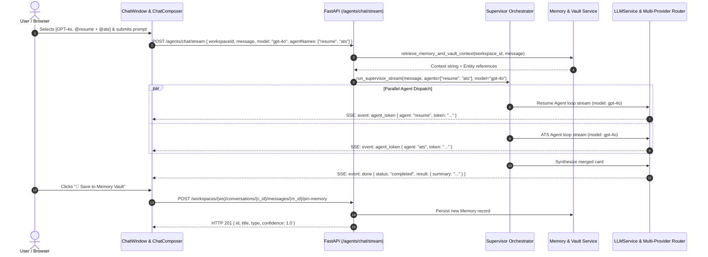

# Design Spec: Enterprise Chat System Overhaul (Dynamic Multi-Agent & LLM Selection)

**Date**: 2026-10-06  
**Status**: Validated Design Spec  
**Target Subsystem**: `apps/web/src/components/chat`, `apps/web/src/app/workspace/[workspaceId]/chat`, `apps/api/src/api/routers/agents.py`, `apps/api/src/api/orchestrator/supervisor.py`, `apps/api/src/api/services/llm_service.py`

---

## 1. Executive Summary & Intent
The Vaeloom Workspace Chat is upgraded from a single-agent linear chat into an enterprise-grade conversational intelligence hub. Key capabilities include:
- **Enterprise LLM Selection**: Users can choose foundation models across OpenAI, Anthropic, Google Gemini, Groq, and Ollama with live visibility into reasoning tiers (Fast, Balanced, Powerful), context window limits, estimated token costs, and temperature.
- **Parallel Multi-Agent Squad Execution**: Users can dispatch requests either via autonomous Supervisor DAG or by picking explicit parallel squads (e.g. `[Resume, ATS, Job Search]`). Streams are rendered side-by-side in responsive multi-agent cards on desktop (stacked tabs on mobile) followed by a merged synthesis card.
- **Agent Memory & Context Engineering**: Bidirectional integration with Vaeloom's Second Brain memory and Obsidian Vault notes. Chat responses feature a one-click "📌 Save to Memory Vault" action, while the UI displays recalled memories with similarity scores and context window compaction indicators.
- **Subpage Navigation & Design System Consistency**: Unified tabs for Live Chat, Agent Squads, Model Matrix, and Grounding Vault, styled with dark/light design tokens and WCAG 2.1 AA accessibility.

---

## 2. Architecture & Data Flow



---

## 3. UI Component Breakdown & Interactions

### 3.1 ChatHeader (`ChatHeader.tsx`)
- Embeds `ChatModelSelector`: Shows active model (e.g., `⚡ Gemini 3.5 Flash` or `⚖️ GPT-4o`) with quick-switch popup showing tiers and token pricing.
- Embeds `ChatAgentSquadSelector`: Shows active agent or multi-agent squad badge (`Auto` or `2 Specialists active`).
- Subpage Switcher Tabs: `Chat Stream`, `Agent Squads`, `Model Matrix`, `Memory Grounding`.
- Memory Grounding Badge: Displays recalled context items (e.g., `🧠 3 Memories Linked`) with click-to-view in `ChatMemoryDrawer`.

### 3.2 ChatComposer (`ChatComposer.tsx`)
- Mentions popup supports multi-select `@agents` allowing natural multi-agent dispatch (e.g. `@resume @ats analyze my profile`).
- Inline parameter adjustments: quick toggle for Temperature (Deterministic 0.2 vs Creative 0.7) and streaming mode.
- File attachment preview with document parsing metadata.

### 3.3 ChatMessageList & Parallel Cards (`ChatMessageList.tsx` & `ParallelAgentStreamCard.tsx`)
- Standard messages render via `ChatMessageItem.tsx`.
- Parallel turns render `ParallelAgentStreamCard.tsx`:
  - Desktop: Multi-column grid (`grid-cols-2` or `grid-cols-3`) with individual agent avatars, status dots, live phase pill (e.g., `act: browse_job_page`), and auto-scrolling token stream.
  - Mobile: Interactive tabbed view switching between agent outputs with swipe or tab click.
  - Bottom Section: Merged synthesis card with actionable proposals and recommendations.
- Message Actions:
  - Copy to clipboard
  - Retry / Re-run
  - Edit user turn
  - **"📌 Save to Memory Vault"**: One-click extraction of key insights into the workspace memory repository.

### 3.4 ChatMemoryDrawer (`ChatMemoryDrawer.tsx`)
- Sliding slide-over panel displaying:
  1. Recalled workspace memories with similarity distance and timestamps.
  2. Vault documents referenced during retrieval.
  3. Token economy & context window meter (KV cache ratio, prompt length, estimated turn cost).

### 3.5 Chat Subpage Views (`ChatSubpages.tsx`)
- **Agent Squads View**: Visual directory of canonical agents, tool capabilities, memory read/write scopes, and squad presets.
- **Model Matrix View**: Real-time table of configured foundation models, health status from `ProviderCircuitBreaker`, cost per 1K tokens, and latency benchmarks.
- **Memory & Grounding Vault View**: Audit trail of memories created from chat conversations, with search and category tags (`decision`, `fact`, `preference`, `insight`).

---

## 4. Backend Specifications & Schema

### 4.1 Schema Updates
In `apps/api/src/api/routers/agents.py`:
```python
class ChatMessage(BaseModel):
    workspaceId: str
    message: str
    agentName: str | None = None
    agentNames: list[str] | None = None  # Explicit multi-agent squad
    model: str | None = None             # Chosen foundation model
    temperature: float | None = 0.7     # Sampling temperature
    maxTokens: int | None = 4096        # Response token ceiling
```

### 4.2 Router & Supervisor Dispatch
- `POST /api/v1/agents/chat/stream`:
  - Detects `dto.agentNames`: If single, invokes standard single-agent loop. If multiple (or supervisor multi-intent detected), delegates to `run_supervisor_stream(..., forced_agents=dto.agentNames, model=dto.model, temperature=dto.temperature)`.
  - Dispatches parallel agents via `asyncio.gather` while emitting tagged SSE events:
    - `event: agent_start`: `{"agent_name": str}`
    - `event: agent_token`: `{"agent_name": str, "token": str}`
    - `event: agent_phase`: `{"agent_name": str, "phase": dict}`
    - `event: agent_done`: `{"agent_name": str, "summary": str}`
    - `event: done`: Final consolidated synthesis with action proposals and telemetry.

### 4.3 Model Catalog API
- `GET /api/v1/agents/models` (or `/registries/models`):
  - Returns model entries with `id`, `name`, `provider`, `tier`, `max_tokens`, `cost_per_1k_input`, `cost_per_1k_output`, `health_status`.

### 4.4 Chat-to-Memory Persistence API
- `POST /api/v1/workspaces/{workspace_id}/conversations/{conversation_id}/messages/{message_id}/pin-memory`:
  - Verifies workspace access (fail-closed IDOR guard).
  - Retrieves target message text.
  - Automatically extracts key concepts and creates a `Memory` entity (`memory_type="insight"`, `confidence=1.0`).
  - Returns `MemoryResponse`.

---

## 5. Security & Invariants
- **Multi-Tenant RLS & IDOR Enforcement**: All endpoints verify workspace membership and fail-closed with HTTP 404 (preventing workspace ID enumeration).
- **Zero Hallucinated Telemetry**: Latency and confidence metrics are wire-backed only. No client-side artificial numbers.
- **SSRF & Token Isolation**: Model and agent execution respect encrypted provider credentials and sandbox boundaries.

---

## 6. Verification & Test Strategy
1. **Frontend Unit & Component Tests (`apps/web/src/components/chat/__tests__/`)**:
   - `chat-model-selector.test.tsx`: Model switching, provider grouping, parameter adjustments.
   - `chat-agent-squad.test.tsx`: Multi-agent squad selection and parallel card rendering.
   - `chat-memory-pin.test.tsx`: Memory pinning action and toast confirmation.
   - Target: `npx jest --testPathPattern="chat"` -> 100% PASS.
2. **Backend Integration Tests (`apps/api/tests/`)**:
   - `test_chat_multi_agent.py`: Validates parallel multi-agent stream execution, model parameter passing, and chat message memory pinning.
   - Target: `uv run --project apps/api python -m pytest apps/api/tests/test_chat_multi_agent.py -v -o addopts=""` -> 100% PASS.
