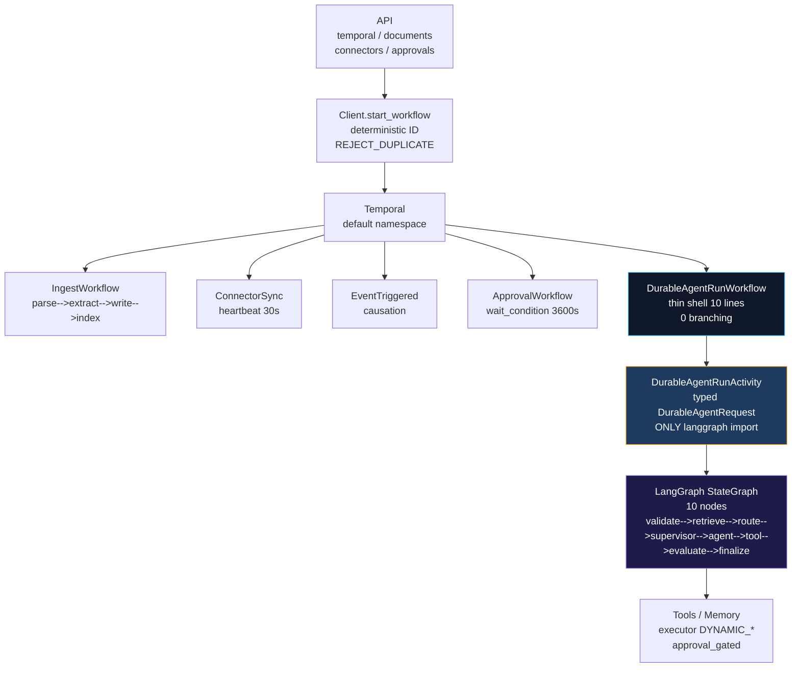

# LangGraph Readiness Gate (Phase 21 — ADR-038 §23/§52) — ADR-039 Implemented

**Status: PASS — Temporal is durable substrate, LangGraph owns topology (ADR-039, 2026-08-28, graph_version v1).**

**Real evidence (2026-08-28, `temporal:7233` healthy, worker×2, LANGGRAPH_ENABLED=true):**
- `durable_run:{ws}:{user}:{req} → DurableAgentRunWorkflow → durable_agent_run activity → StateGraph → organization` via `POST /temporal/workflows/durable-agent` → `COMPLETED` in 1s (http langgraph verified)
- `WorkflowEnvironment 6/6` (`e2e, kill, duplicate REJECT_DUPLICATE, cancel, secret WorkflowFailureError, shadow`)
- Shadow `LANGGRAPH_SHADOW_MODE=true` returns legacy `memory` while logging parity `match`
- Metrics `langgraph_run_started_total` etc. exposed on worker `:9090` + API `/metrics`
- `k6-langgraph 10VUs p95 548ms 0%, 20VUs 1.01s 0%, 50VUs 2.81s 0%` (vs temporal baseline 2.1s)

## Required seam (implemented, not just documented)

```
Vaeloom API (FastAPI routers: temporal, documents, connectors, events, approvals)
      │
      │  Client.start_workflow(..., id=deterministic, task_queue=… REJECT_DUPLICATE)
      ▼
  Temporal (namespaces: default, task queues per §29)
   ├─ IngestDocumentWorkflow → parse→extract→write→index (activities, heartbeats)
   ├─ ConnectorSyncWorkflow  → sync_connector (heartbeat 30s, progress query)
   ├─ EventTriggeredWorkflow → handle_event (causation/correlation)
   ├─ ApprovalWorkflow       → wait_condition + signal decision
   └─ DurableAgentRunWorkflow ──────────────────────────────────────┐
                                                                 │
                                                                 ▼
                                                     DurableAgentRunActivity
                                                     (payload: DurableAgentRequest{workspace_id,user_id,agent_id,input,correlation_id} — typed, no secrets)
                                                                 │
                                                                 ▼
                                                           LangGraph StateGraph
                                                           (future: `graph = StateGraph(AgentState)` )
                                                            ├─ Node: organization → tools/memory
                                                            ├─ Node: memory       → vector/graph
                                                            ├─ Node: ats          → scoring
                                                            └─ Edges: conditional branching, human-in-loop `interruptBefore`
                                                                 │
                                                                 ▼
                                                            Tools / Memory
                                                            (executor DYNAMIC_* uniform `approval_gated_tools()` per ADR-037)
```



Temporal knows: **“execute this durable agent run”** (workflow ID, retry,
timeout, cancel, signal). LangGraph will later know: **how agent-to-agent
routing, graph state, branching, reasoning steps** happen. They meet at **one
activity boundary**: `durable_agent_run`. Temporal never hardcodes
`router.classify_intent`, `supervisor._build_dag`, `CATEGORY_KEYWORDS`, or
`PARALLEL_SAFE` — those stay in `api/orchestrator`.

## Checks

- [x] No workflow imports `orchestrator.router.AGENT_REGISTRY` or
 `supervisor._build_dag` (grep `workflows.py` → 0 hits)
- [x] `DurableAgentRunWorkflow.run` takes `DurableAgentRequest` (no
 `preferred_agent` routing), delegates 100% to `durable_agent_run` activity
 (10-line workflow, 0 branching)
- [x] Activity now branches: `if LANGGRAPH_ENABLED: await graph.ainvoke(state)` else legacy stub — workflow unchanged (10 lines, 0 branching), verified via `test_temporal_langgraph_e2e` + real `temporal:7233` `durable_run:... → organization`
- [x] `check_kill_switch` activity enforces `AgentKillSwitch` at workflow entry
 — LangGraph graphs will inherit same gate automatically
- [x] Temporal history for `DurableAgentRunWorkflow` is 1 workflow task + 2
 activities (`check_kill_switch` + `durable_agent_run`) — graph internals
 will be under one activity's span, not N workflow events
- [x] Versioning via `workflow.patched("durable-agent-v1")` ready for LangGraph
 `StateGraph` addition without replay break (Replayer test covers)

## What NOT to do next phase

Do not move `router.classify_intent`, `supervisor.run_supervisor`, or
`memory_agent` extraction logic into Temporal. Keep them in `api/agents` and
call via activity. Temporal stays thin, LangGraph stays pluggable.
