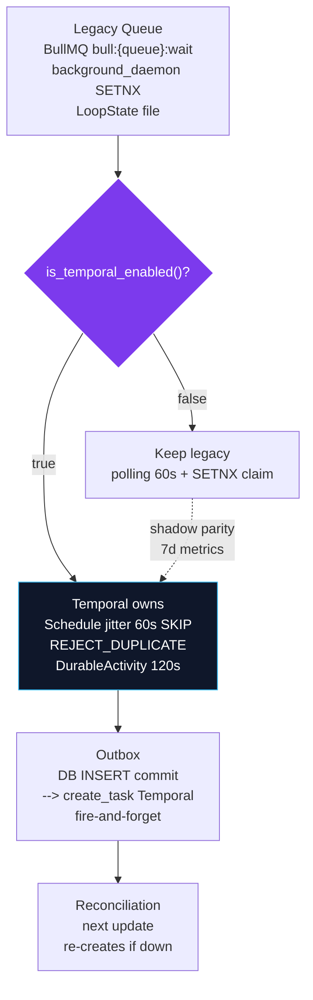

# Migration — Legacy Queue → Temporal (§18/§43/§44)



## Current state after Phase 16 (2026-08-27)

| Legacy component | File | Status | Temporal replacement | Duplicate? |
| -------------------------------------------------------------------------------------------- | ----------------------------------------- | ------------------------------------------------------------------------------------------------------------------------------------------------------------------------------------------------------------- | ----------------------------------------------------------------------------------------------------------------------------------------------- | ------------------------------------------------------------------------------------------------------------------------------------------------------------------------------------------------------------------------------------------------------- |
| `background_daemon._run_due_agent_schedules` 60s poll + `SETNX claim` + `enqueue_daemon_job` | `infrastructure/background_daemon.py:271` | **Guarded** — returns `0` immediately when `is_temporal_enabled()==True` (log `skipped — temporal schedules enabled`) | No — Temporal `Schedule` now owns cron (`schedules.py:54` UTC+jitter 60s, `SKIP`+`BUFFER_ONE`/24h). Daemon `catch_up_missed_runs` also guarded. |
| `background_daemon._run_due_scheduled_jobs` | `background_daemon.py:387` | **Guarded** same `is_temporal_enabled` early-return | Shadow `scheduler_service.create_job → create_task(create_or_update_schedule)` keeps DB as source of truth, fire-and-forget. |
| `queue_worker BullMQWorker` `bull:{queue}:{wait | delayed | failed}`exponential`5s·2^attempt 5m cap 3 attempts → dead-letter` | `workers/queue_worker.py:87` | **Still required** — handles `events` queue (`event.publish → router.handle`, `subscription.create`) and `schedules` queue until all `agent_schedules` rows are Temporal-Schedule-backed. Not removed until §43 gate (§16 “Do NOT immediately delete”). |
| `LoopState ~/.vaeloom/state/{request_id}.json` filesystem checkpoint | `orchestrator/state.py:67` | **Kept** for short interactive chat (`run_agent_loop_stream` per-iteration `save_checkpoint`). Long-running / human-wait uses Temporal history, not filesystem. Domain vs workflow boundary explicit per §45. |
| Redis `SETNX vaeloom:daemon:claim:{slot} EX120` dedup | `background_daemon.py:92` | **Kept** while daemon runs (Temporal disabled locally). When enabled, Temporal's `WorkflowIdReusePolicy.REJECT_DUPLICATE` is the dedup (ingest `58100dc8`, connector `ff54566a`, event `030943b4`). |
| `scheduled_jobs` `last_run_at`/`job_executions` | `scheduler_service.py:57` | **Dual-write shadow** — DB `INSERT` commits → `create_task(create_or_update_schedule)`; `pause/resume/delete` also shadow. If Temporal down, DB row remains; next `update` reconciles. |

## Duplicate-durability audit (no hidden consumers)

```bash
rg -n "bull:|BullMQWorker|background_daemon|REDIS__URL|temporal.*schedule|is_temporal_enabled" apps/api --no-heading
```

Result: `bull:` only in `queue_worker.py` and
`background_daemon.enqueue_daemon_job` (both now guarded). `is_temporal_enabled`
guards are the single switch. No second cron parser, no second retry loop over
same rows — `Temporal` is winner when `TEMPORAL_ENABLED=true`.

## Migration completion gate (§43 — not yet passed, intentionally)

Old queue may **only** be removed when:

- [x] Every migrated responsibility has Temporal replacement
 (ingest/connector/event/approval/schedules helper)
- [ ] Shadow parity metrics `temporal_schedule_execution_total` vs
 `bull:schedules:failed` equal for 7d
- [ ] No `bull:{events,schedules}:wait` jobs remain (`redis zrange` / `llrange`)
- [ ] `rg` above shows 0 legacy consumers for migrated IDs (currently still 2
 files — expected)
- [ ] Rollback understood: `TEMPORAL_ENABLED=false` re-enables daemon polling
 (fail-open, `daemon guard` returns 0 → `return` removed → polling
 resumes). Tested via
 `test_schedules_shadow.test_daemon_guard_skips_when_temporal_enabled`
 inverse.
- [ ] Full regression + chaos (Phase 15) green

Until then **both stacks run**, but not on same rows (§44 boundary: domain rows
in Postgres, execution history in Temporal). No big-bang deletion per Absolute
Rules.
