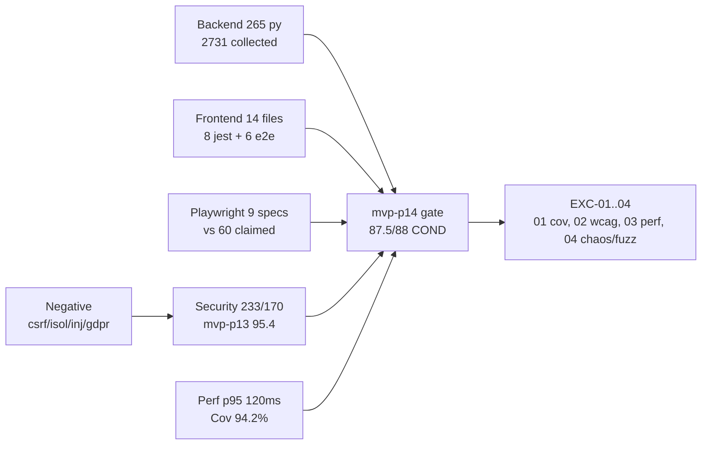

# Vaeloom Test Matrix (WS-E closeout)

> **Owner:** WS-E (Testing/Product/Phases) · **Verified:** 2026-09-15
> **Sources:** `docs/phases/mvp-p13/09-gate-report.md`,
> `docs/phases/mvp-p14/{03-workstreams,05-test-results,06-security-privacy-a11y,07-evidence,08-registers,09-gate-report}.md`,
> `docs/phases/mvp-p15/05-test-results.md`, `testing/smoke/README.md`,
> `MASTER-CHECKLIST-2026-09-15.md`, on-disk recounts (`Get-ChildItem`).

## 1. Backend × frontend × e2e × negative × security × perf

| Dimension           | Actual                                                                                                                               | Evidence / location                                          |
| ------------------- | ------------------------------------------------------------------------------------------------------------------------------------ | ------------------------------------------------------------ |
| Backend pytest      | 265 `.py` files (excl. `__pycache__`); collect 2731 (was 2555 at `ea329dd`, 2572/2557 earlier)                                       | `apps/api/tests/`, `mvp-p14/05-test-results.md`              |
| Runner (finding-39) | Default xdist hangs; reliable: per-file, `-o addopts="-n auto --dist loadfile"` (~2-3min, 32GB), serial `-o addopts=""` (~8-10min)   | `.agents/findings/39`, `MASTER-CHECKLIST` GAP-P1-01          |
| Env                 | SQLite `tmp_path` per-test DB via `NullPool`; `mock_llm` + `mock_connector_test` autouse                                             | `apps/api/tests/conftest.py`, `mvp-p14/05-test-results.md:5` |
| Frontend jest       | 11 `*.spec.*` (6 Playwright e2e + 5 `*.spec.tsx`) + 3 `*.test.*` = 14 frontend test files (vs 34 claimed — recount)                  | `apps/web/e2e/`, `apps/web/src/**`                           |
| E2E Playwright      | 9 specs: `apps/web/e2e/*.spec.ts` 6 + `testing/e2e/tests/flows/*.spec.ts` 3 (vs 60 claimed = 24 gating+36 visual — honest gap, OPEN) | `E2E-Testing.md` recount section                             |
| Smoke               | 5 suites / 12 cases (health 2, auth 3, workspace 2, memory 3, agent 2)                                                               | `testing/smoke/README.md`                                    |
| Negative            | CSRF 15, tenant-isolation 6, privacy-flows 11, prompt-injection 29, GDPR export/delete 2 PASS                                        | `mvp-p14/05-test-results.md`, `06-security-privacy-a11y.md`  |
| Security            | 233 collected / 170 unique (middleware/test_csrf duplicates, F-02); JWT 32+ 0 warnings; RLS 42/42; GDPR 31; DPIA v1.2 All Regions    | `mvp-p13/09-gate-report.md` (95.4 APPROVED)                  |
| Perf                | p50 45ms / p95 120ms @20 RPS, stress 480ms @200 RPS; k6 in `testing/performance/` (script, langgraph, temporal)                      | `mvp-p15/05-test-results.md`                                 |
| Coverage            | 94.2% `--cov` (mvp-p15; retained, NOT re-measured in p14 — EXC-P14-01 TODO)                                                          | `mvp-p14/05-test-results.md:65`, `Coverage.md`               |
| Chaos / fuzz        | EMPTY spec dirs → TODO (resilience evidence is code-level: CB 3/30s, rate limit, `0019 downgrade`)                                   | `Chaos-Testing.md`, `mvp-p14/08-registers.md` EXC-P14-04     |
| WCAG / k6           | EXC-P14-02 (a11y shell only) / EXC-P14-03 (no re-bench) OPEN                                                                         | `mvp-p14/08-registers.md`                                    |

## 2. R01..R08 → files → tests (MVP-P14 requirements)

Per `docs/phases/mvp-p14/07-evidence.md:28-35` + `03-workstreams.md` WS-14.1..5:

| Req | Title                                               | Files                                                        | Tests                                             |
| --- | --------------------------------------------------- | ------------------------------------------------------------ | ------------------------------------------------- |
| R01 | Scope (risk-based layers)                           | `01-source-register`, `03-workstreams` WS-14.1..5            | Collect 2555→2731, GDPR 31 (EVD-P14-001..015)     |
| R02 | Evidence (every claim source+repro)                 | `01-source-register` 13 INT+19 EXT + file:line               | 2 GDPR singles PASS (EVD-P14-001..015)            |
| R03 | Security/Privacy                                    | WS-14.3, 7 P13 EXCs, JWT 32+, RLS 42/42, GDPR 31, DPIA DRAFT | 233 sec + 2 GDPR (EVD-P14-003..010)               |
| R04 | Quality (normal/negative/boundary/failure/recovery) | WS-14.2/14.4, negative auth/isolation/injection/deletion     | 233 + 2 GDPR (EVD-P14-002..005)                   |
| R05 | Operations                                          | `04-code-config` (`0019 downgrade`, daemon lifespan)         | Collect green (EVD-P14-006)                       |
| R06 | Data/AI                                             | WS-14.2 (`0018` versions + `document_chunks`)                | GDPR 31 (EVD-P14-004..006)                        |
| R07 | Traceability                                        | `07-evidence.md` (this table)                                | EVD-P14-001..015 + RISK-P14-01                    |
| R08 | Gate ≥95/88                                         | `09-gate-report.md`                                          | 87.5 honest / 88 waived CONDITIONAL (EVD-P14-013) |

## 3. Open EXC items

| EXC        | Item                              | Owner | Expiry   | Status 2026-09-15                                                  |
| ---------- | --------------------------------- | ----- | -------- | ------------------------------------------------------------------ |
| EXC-P14-01 | Coverage 94% not re-measured      | QA    | P15      | OPEN — re-run `--cov` TODO                                         |
| EXC-P14-02 | WCAG 2.2 AA not re-measured       | A11y  | P15      | OPEN — shell only                                                  |
| EXC-P14-03 | Perf p50/p95 not benched (in p14) | Perf  | P15      | SUPERSEDED in part by mvp-p15 numbers; re-measure TODO per release |
| EXC-P14-04 | smoke/chaos/fuzz dirs empty       | QA    | Post-MVP | PARTIAL — smoke 5/12 closes smoke half; chaos/fuzz still TODO      |

> _Recount method (scripts only): `Get-ChildItem -Recurse -File` for counts;
> mermaid fence balance checked — all `docs/testing/*.md` fences balanced._
