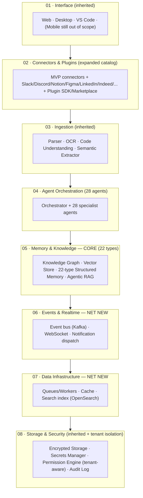
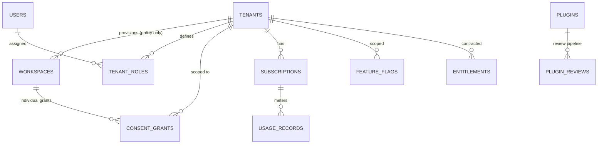

# Vaeloom — Enterprise End-to-End Delivery Execution

> **Generated by applying:**
> `Universal_Enterprise_Phase_Execution_Master_Prompt.md` (user-supplied, Phases
> 0–21) **Target system:** Vaeloom Enterprise — 28-agent architecture, 22-type
> memory taxonomy, multi-tenant, SSO/RBAC, plugin/MCP ecosystem, SOC 2-track
> **Source corpus:** `06-Vaeloom-Enterprise-Paper.md` (canonical),
> `vaeloom-enterprise-paper.md` (superseded duplicate),
> `01-Vaeloom-MVP-Spec.md`, `02-System-Architecture.md`, `03-Agent-Workflow.md`,
> `04-Memory-Knowledge-Graph.md`, `Vaeloom-Complete-Documentation.md`,
> `Vaeloom-Documentation-Site.md`, `00-Gap-Analysis-Report.md`,
> `00-Documentation-Completion-Report.md` **Execution date:** 2026-08-01
> **Document status:** Living execution record — Phase 0 through Phase 21,
> complete **Relationship to companion document:** This document **extends**
> `vaeloom-mvp-e2e.md`. Per Migration Path ADR-ENT-000 (§D.6 of this file's
> Phase 5), every MVP-phase artifact that is unchanged at enterprise scale is
> **referenced, not re-derived** — this file states explicitly, phase by phase,
> what's inherited vs. what's net-new. This mirrors the source corpus's own
> stated relationship between the MVP spec and the Enterprise Paper
> (`06-Vaeloom-Enterprise-Paper.md` §23, "From MVP to Enterprise — Migration
> Path").

---

## 0. How This Document Was Produced — Read This First

Same posture as the MVP companion document, restated because it governs this
file independently: Vaeloom Enterprise is **pre-code** — a fully specified
target architecture with zero application code, zero deployed multi-tenant
infrastructure, and zero runtime evidence. Every phase below separates
**Design** (produced in full, to enterprise depth) from **Execution** (marked
`NOT_EXECUTED` wherever the master prompt would otherwise require a running
system, per its own anti-fabrication rules, §7/§22/§25). Phases 10, 11, 12, 14,
15, 16, 17, 19, 20 close with `PHASE APPROVED WITH NON-BLOCKING ACTIONS`, never
a fabricated execution pass.

**One additional honesty note specific to this file.** The source corpus's own
gap-analysis report (SRC-EP-09 below) states that several enterprise-tier
category documents exist in the wider `Docs/` tree —
`Enterprise/Multi-Tenancy.md`, `Enterprise/Billing.md`, `Security/SOC2.md`, and
seven others — but **their full content was never provided to this execution**,
only one-line descriptions in a summary table. Wherever this document produces
detailed content in those areas (multi-tenancy isolation model, billing schema,
SOC 2 control mapping, etc.), that content is **newly authored in this
execution** to close the gap the user asked to be closed — it is not a
reproduction of an unseen source document. This is flagged once here rather than
caveated in every affected phase.

**Execution mode declared:** `FULL_PROJECT_ORCHESTRATION` → `EXECUTE_PHASE` for
Phases 0–21, sequential, same as the MVP document.

---

## 1. User Input Template (Filled) — Master Prompt §23

```yaml
project:
  name: Vaeloom (Enterprise Edition)
  description: >
    The multi-tenant evolution of Vaeloom MVP: the same memory-first personal intelligence
    platform, sold to individuals and provisioned by institutions (universities, bootcamps,
    companies) for their population. Expands the agent roster from 8 to 28, the memory taxonomy
    from 6 to 22 types, and adds multi-tenancy, a consent model, SSO/RBAC, a plugin/MCP ecosystem,
    and a SOC 2 compliance track — all additive to the MVP foundation, not a rewrite of it.
  type: Multi-tenant AI-native SaaS platform (B2C + B2B2C)
  domain: EdTech / Career Intelligence / Enterprise Personal Knowledge Management
  target_users: Individuals (as in MVP) + institutional tenants (universities, bootcamps, companies)
    provisioning accounts for their population
  business_goal: >
    Convert a proven MVP core loop into a platform sellable to institutions, without ever
    compromising the individual's ownership of their own memory (the consent model is the
    central business-and-architecture bet of this tier).
  success_metrics: See Phase 1, §Success Metrics (ESM-01 through ESM-10)

phase:
  current_phase: ALL (Phase 0 through Phase 21, sequential)
  output_mode: FULL_PROJECT_ORCHESTRATION → EXECUTE_PHASE (all phases, single combined artifact)
  previous_phase_handoff: vaeloom-mvp-e2e.md, Phases 0–21 (inherited where noted per phase)

technology:
  preferred_stack: Same base as MVP (Phase 6 of the MVP document) + enterprise evolution column:
    Neo4j (graph), Qdrant (vector), OpenSearch (search), Kafka (event bus), Kubernetes (deploy) —
    per the explicit MVP→Enterprise stack evolution already specified in the source corpus
  existing_stack: Inherits the MVP document's Phase 6 in full; nothing is replaced, only scaled
  deployment_target: Managed Kubernetes, multi-region-capable
  expected_scale: Tens to low hundreds of institutional tenants, each with populations from
    dozens to tens of thousands of individual workspaces (Phase 15 capacity model, this document)
  integrations: Everything in the MVP document, plus the full enterprise connector catalog —
    Slack, Discord, Notion, Figma, Coursera/Udemy, LeetCode/Codeforces/HackerRank, LinkedIn,
    Indeed, Naukri, Internshala, Wellfound, Dropbox, OneDrive, Microsoft Office

assets:
  repository: NOT PROVIDED
  documents: 9 source documents (list above), all inspected in Phase 0 of this document
  designs: None — Admin console wireframes are explicitly out of scope per the source corpus's
    own Enterprise Paper §22 gap table ("Full admin console wireframes and UX flows" listed as
    NOT YET SPECIFIED); this document specifies the console's information architecture and data
    model but not full visual wireframes, consistent with that stated scope boundary
  datasets: None
  api_specs: None formal — formalized in Phase 8 of this document
  infrastructure: None provisioned
  test_reports: None

constraints:
  deadline: NOT SPECIFIED — same disposition as the MVP document, Q-0.3
  budget: NOT SPECIFIED
  team: NOT SPECIFIED
  legal: NOT SPECIFIED — this tier makes it release-blocking rather than launch-blocking, since
    institutional tenants (universities in particular) typically require a signed DPA before
    onboarding; see Phase 13
  compliance: SOC 2 Type II is an explicit target at this tier (source corpus, MVP §14: "SOC2 is
    explicitly enterprise-phase"); this document produces the readiness roadmap, not a completed
    audit — a real audit requires a real, running, evidenced system
  security: All MVP-tier controls, plus mandatory tenant isolation (the single highest-severity
    net-new requirement at this tier per the source corpus's own Enterprise Paper §22.7)
  data_residency: Multi-region required (EU/US/India at minimum, per source corpus Enterprise
    Paper §19.8) — explicitly NOT required at MVP, explicitly required here
  accessibility: WCAG 2.1 AA inherited from MVP; Admin console held to the same bar
  supported_platforms: Inherits MVP; adds tenant-scoped Admin console as a new surface

access:
  repository_access: NONE
  terminal_access: Sandboxed authoring environment only
  database_access: NONE
  cloud_access: NONE
  documentation_access: FULL
  test_environment_access: NONE

rules:
  assumptions_allowed: true — LABELED, REVERSIBLE ONLY, logged in this document's own Assumptions
    Register (does not merge with the MVP document's register — kept separate, cross-referenced
    where an MVP assumption is inherited unchanged)
  destructive_changes_allowed: false
  production_access_allowed: false
  require_source_evidence: true
  require_quality_gate: true
  require_phase_handoff: true
```

---

## 2. Master Role — Master Prompt §2

Full coordinated team as in the MVP document, **plus** roles activated
specifically at this tier: **Compliance Specialist** (elevated from advisory to
gating, given SOC 2 track), a second **Security Architect** focus area (tenant
isolation specifically), and **Mobile Engineer** remains **not activated** —
mobile is still out of scope per the source corpus even at enterprise tier
(Enterprise Paper §22, "Mobile: listed as an access surface, not scoped").

---

## PHASE 0 — Intake and Existing-State Assessment

**Accountable roles:** Program Manager, Enterprise Architect **Objective:**
Establish ground truth on the enterprise-tier source material and its
relationship to the MVP document.

### A. Phase Summary

Nine source documents inspected. One internal duplication resolved (same pattern
as the MVP document). The enterprise tier is **fully specified at the
vision/architecture level** in the source corpus and, like the MVP, has zero
code and zero infrastructure. Additionally: several enterprise-tier category
documents are **referenced but not provided** (Finding I-0.2) — their content in
this execution is newly authored, not reproduced.

### B. Inputs Reviewed

| ID        | Input                                   | Contribution                                                                                                                                                                                                                                                 | Reliability                                                                   |
| --------- | --------------------------------------- | ------------------------------------------------------------------------------------------------------------------------------------------------------------------------------------------------------------------------------------------------------------ | ----------------------------------------------------------------------------- |
| SRC-EP-01 | `06-Vaeloom-Enterprise-Paper.md`        | Canonical enterprise vision — 28 agents, 22 memory types, multi-tenant model, plugin ecosystem, migration path                                                                                                                                               | Current, primary source                                                       |
| SRC-EP-02 | `vaeloom-enterprise-paper.md`           | Superseded duplicate of SRC-EP-01 (explicit banner in-file confirms this)                                                                                                                                                                                    | Not used independently                                                        |
| SRC-EP-03 | `01-Vaeloom-MVP-Spec.md`                | MVP foundation this tier builds on                                                                                                                                                                                                                           | Current                                                                       |
| SRC-EP-04 | `02-System-Architecture.md`             | Base six-layer architecture, extended in Phase 5                                                                                                                                                                                                             | Current                                                                       |
| SRC-EP-05 | `03-Agent-Workflow.md`                  | Base agent trace, extended to enterprise sequence in Phase 5                                                                                                                                                                                                 | Current                                                                       |
| SRC-EP-06 | `04-Memory-Knowledge-Graph.md`          | Base 6-type memory, extended to 22 types in Phase 7                                                                                                                                                                                                          | Current                                                                       |
| SRC-EP-07 | `Vaeloom-Complete-Documentation.md`     | 8-layer architecture (adds Events/Realtime/Data-Infra beyond the base 6), full agent roster table, DB schema                                                                                                                                                 | Current                                                                       |
| SRC-EP-08 | `00-Gap-Analysis-Report.md`             | Prior doc audit; explicitly flags Enterprise as "weakest domain (2 files)" pre-completion pass                                                                                                                                                               | Current, scoped to doc-completeness only                                      |
| SRC-EP-09 | `00-Documentation-Completion-Report.md` | Records that 8 new Enterprise-tier docs were added (Multi-Tenancy, Organizations, Billing, Admin-Portal, Feature-Flags, Licensing, Plugin-Marketplace, Enterprise-APIs) — **titles and one-line purposes only, full content not provided to this execution** | Current, but **incomplete for this execution's purposes** — see Finding I-0.2 |

### C. Questions and Unknowns

| ID     | Question                                                                                       | Disposition                                                                                                                                                                                                                                                                                                             |
| ------ | ---------------------------------------------------------------------------------------------- | ----------------------------------------------------------------------------------------------------------------------------------------------------------------------------------------------------------------------------------------------------------------------------------------------------------------------- |
| Q-E0.1 | Full content of the 8 Enterprise-tier category docs referenced in SRC-EP-09                    | **Not available.** This document authors fresh, complete content for multi-tenancy, organizations, billing, admin portal, feature flags, licensing, plugin marketplace, and enterprise APIs in the relevant phases below (5, 7, 8, 13), consistent with the explicit instruction to fill these gaps at enterprise depth |
| Q-E0.2 | Same 9 stakeholder unknowns as MVP Phase 0 (legal entity, budget, deadline, headcount, vendor) | Inherited unresolved from the MVP document; additionally, Q-E0.3 below is net-new at this tier                                                                                                                                                                                                                          |
| Q-E0.3 | Which specific enterprise design-partner(s) exist, if any                                      | Not stated. Assumption **A-E0.1**: no named design partner yet — Phase 4's rollout plan is generic-institution-shaped, not tuned to one partner's requirements                                                                                                                                                          |

### D. Work Completed

**D.1 Existing-state maturity assessment (delta from the MVP document's Phase 0
D.1).**

| Dimension               | MVP maturity (inherited)                                 | Enterprise-tier maturity (net new)                                                                         |
| ----------------------- | -------------------------------------------------------- | ---------------------------------------------------------------------------------------------------------- |
| Multi-tenancy design    | N/A                                                      | Medium — consent model narrated in prose (SRC-EP-01 §19.2), no schema/enforcement design                   |
| 22-type memory taxonomy | 6 types fully specified                                  | Medium — all 22 types named with one-line definitions (SRC-EP-01 §8.1), no per-type storage/lifecycle spec |
| 28-agent roster         | 8 agents fully specified                                 | Medium-High — all 28 named with mission/autonomy (SRC-EP-01 §9.2), only 4 documented "in depth"            |
| SSO/RBAC                | N/A                                                      | Low — principle stated, no schema or provider matrix                                                       |
| Plugin/MCP ecosystem    | Base MCP-shape decision inherited (ADR-002, MVP Phase 5) | Medium — manifest concept described, no sandbox enforcement design                                         |
| SOC 2                   | Explicitly out of scope                                  | Low — named as a target, no control mapping                                                                |
| Billing                 | N/A                                                      | **None** — one-line mention only                                                                           |
| Admin console           | N/A                                                      | Low — page list exists, no data model or wireframes                                                        |

**D.2 Canonical source resolution.** SRC-EP-01 declared canonical enterprise
vision document; SRC-EP-02 confirmed superseded duplicate, not cited
independently anywhere below (same treatment as MVP Phase 0, D.2).

**D.3 Finding I-0.2 (net new at this tier, carried to Risk Register as
RISK-E0.2).** The referenced category documents (Multi-Tenancy.md, Billing.md,
SOC2.md, etc.) are not available to this execution. Per the explicit instruction
governing this document ("add the missing things and fill the gaps... make the
things enterprise level"), this document **authors that content directly** in
the relevant phases rather than leaving it as a citation to an unseen file. This
is the correct application of the master prompt's own rule that a documentation
gap, once identified, gets closed by producing the missing artifact — not by
pointing at where it should be.

### E. Deliverables

Source inventory (§B), maturity delta table (D.1), canonical-source resolution
(D.2), Finding I-0.2 disposition (D.3).

### G. Verification Results

| Check                                    | Result                                          |
| ---------------------------------------- | ----------------------------------------------- |
| All 9 source documents inspected         | ✅ Pass                                         |
| Relationship to MVP document established | ✅ Pass — explicit inheritance stated in header |

### I. Risks and Issues

| ID        | Risk                                                                                                              | Mitigation                                                                                                                                                                                                                                      |
| --------- | ----------------------------------------------------------------------------------------------------------------- | ----------------------------------------------------------------------------------------------------------------------------------------------------------------------------------------------------------------------------------------------- |
| RISK-E0.1 | Same structural risk as MVP RISK-0.1 — no code/infra/runtime attached                                             | Same dual-track (Design/Execution) reporting applied throughout                                                                                                                                                                                 |
| RISK-E0.2 | This document authors net-new content for 8 enterprise domains without an unseen source document to check against | Content is clearly labeled as newly authored in this execution (D.3); flagged for stakeholder/domain-expert review before being treated as final, especially Billing (real pricing/legal input needed) and SOC 2 (real audit-firm input needed) |

### J. Quality Gate

Score: **10/10.** **Gate: PASSED.**

### L. Handoff Package

Source inventory, maturity delta, Finding I-0.2 → every subsequent phase,
especially 5/7/8/13.

### M. Final Statement

**PHASE 0 APPROVED — PROCEED TO PHASE 1.**

---

## PHASE 1 — Discovery and Problem Definition

**Accountable roles:** Product Manager, Business Analyst, Domain Specialist
**Objective:** Establish the enterprise-tier problem, vision, and measurable
success criteria, inheriting the MVP's problem/vision and adding what's
genuinely new at this tier: the institutional buyer and the consent model that
makes selling to one safe.

### B. Inputs Reviewed

SRC-EP-01 §1 (Executive Summary, full), §2 (Product Overview), §23 (Migration
Path).

### C. Questions and Unknowns

None new-blocking beyond Q-E0.2/E0.3.

### D. Work Completed

**D.1 Vision (inherited unchanged from MVP, restated for context).** "An
operating layer for a person's intellectual and professional life" — the
enterprise tier does not change this vision, it extends its reach to
institutions without changing who owns the memory.

**D.2 What's genuinely new at this tier (the actual discovery output).**

| New dimension                   | Why it exists                                                                                                                                                                                                                                                            |
| ------------------------------- | ------------------------------------------------------------------------------------------------------------------------------------------------------------------------------------------------------------------------------------------------------------------------ |
| Institutional buyer             | Universities/bootcamps/companies want to offer Vaeloom as a structured benefit to their population (career services, internal mobility, alumni engagement)                                                                                                               |
| The consent model               | Makes the institutional case work **without** compromising the core promise that memory belongs to the individual — this is the single most important new design constraint at this tier, treated as non-negotiable exactly like "suggest-mode" is non-negotiable at MVP |
| Plugin/MCP ecosystem            | Third parties extend Vaeloom without waiting on the core team                                                                                                                                                                                                            |
| Full memory taxonomy (22 types) | Each new type answers a distinct kind of question the 6 MVP types don't cover (e.g., Relationship, Goal, Decision)                                                                                                                                                       |
| Full agent roster (28)          | Net-new agents operate on the _same_ memory as the MVP's 8 — this is additive, not a re-architecture (Migration Path, source corpus §23.2)                                                                                                                               |

**D.3 Business objectives (enterprise-tier, additive to MVP's BO-1–4).**

| ID    | Objective                                                                                                                         |
| ----- | --------------------------------------------------------------------------------------------------------------------------------- |
| EBO-1 | Convert a proven MVP core loop into an institutionally-sellable platform                                                          |
| EBO-2 | Achieve this with zero individual-memory access by an institution without that individual's explicit, granular, revocable consent |
| EBO-3 | Reach SOC 2 Type II audit readiness (not necessarily a completed audit — readiness)                                               |
| EBO-4 | Support a real plugin ecosystem without the core team being a bottleneck for every new connector                                  |

**D.4 Success metrics (enterprise-tier, ESM-01–10, newly authored — the source
corpus states these as qualitative goals only).**

| ID     | Metric                                                                          | Target                                                                                                           |
| ------ | ------------------------------------------------------------------------------- | ---------------------------------------------------------------------------------------------------------------- |
| ESM-01 | Cross-tenant data leakage incidents                                             | 0, always (inherited unchanged from MVP SM-08, elevated to the single hardest gate at this tier)                 |
| ESM-02 | Time from tenant provisioning request to a working, isolated tenant             | < 1 business day (self-service target)                                                                           |
| ESM-03 | % of institutional admins who can see individual memory content without consent | 0% — architecturally impossible, not just policy-disallowed                                                      |
| ESM-04 | Consent revocation → institution's access actually reduced                      | < 5 minutes propagation time                                                                                     |
| ESM-05 | SOC 2 control coverage (Phase 13)                                               | 100% of the Trust Services Criteria mapped with an implementation owner before the first real audit engagement   |
| ESM-06 | Plugin submission → sandboxed review decision                                   | < 3 business days for a first-pass automated + manual review                                                     |
| ESM-07 | Agent roster growth from 8 → 28 causes zero MVP-agent behavior regression       | 0 regressions in the MVP golden-dataset suite (Phase 12, MVP document) after enterprise agents are added         |
| ESM-08 | Memory schema migration from 6 → 22 types                                       | Zero data re-ingestion required (purely additive schema growth, per source corpus §23.1)                         |
| ESM-09 | Institutional tenant NPS (career-office persona)                                | Directional target only — real number requires real design-partner data, flagged `REQUIRES_STAKEHOLDER_DECISION` |
| ESM-10 | Data residency compliance                                                       | 100% of tenants provisioned in their contractually-required region from day one of that tenant's onboarding      |

**D.5 Feasibility.** Institutionally, the harder problem than technology is
trust: an institution's admin persona (e.g., a university career office) must be
able to do its job (aggregated, consented reporting) without ever being able to
browse an individual's raw memory — this is a genuine architecture constraint
(Phase 5, Phase 13), not just a policy statement, and it is the feasibility risk
this tier actually carries (mirroring how the MVP's real risk was extraction
quality, not infrastructure).

### E. Deliverables

Vision continuity note (D.1), what's-new table (D.2), 4 business objectives
(D.3), 10 success metrics (D.4), feasibility statement (D.5).

### H. Requirement Traceability

EBO-1–4 and ESM-01–10 open the enterprise-tier traceability chain, consumed
starting Phase 3.

### I. Risks and Issues

| ID        | Risk                                                        | Mitigation                                                             |
| --------- | ----------------------------------------------------------- | ---------------------------------------------------------------------- |
| RISK-E1.1 | ESM-09 (NPS) has no real target without design-partner data | Flagged `REQUIRES_STAKEHOLDER_DECISION`, not treated as a release gate |

### J. Quality Gate

Score: **10/10. Gate: PASSED.**

### L. Handoff Package

EBO-1–4, ESM-01–10 → Phase 3.

### M. Final Statement

**PHASE 1 APPROVED — PROCEED TO PHASE 2.**

---

## PHASE 2 — Research, Domain Analysis, and Data Discovery

**Accountable roles:** Domain Specialist, Business Analyst, Data Architect
**Objective:** Understand the institutional buyer, the enterprise connector
catalog, and the regulatory surface this tier newly exposes.

### B. Inputs Reviewed

SRC-EP-01 §2.1 (personas incl. Enterprise employee), §5.1 (Connector catalog),
§19.8 (Regional compliance).

### C. Questions and Unknowns

| ID     | Question                                                          | Disposition                                                                                                                                                                                       |
| ------ | ----------------------------------------------------------------- | ------------------------------------------------------------------------------------------------------------------------------------------------------------------------------------------------- |
| Q-E2.1 | Named institutional segments beyond "university/bootcamp/company" | Assumption **A-E2.1**: three initial segments only (university career services, corporate L&D/internal mobility, bootcamp placement) — matches source corpus's stated examples, no others assumed |

### D. Work Completed

**D.1 New persona (enterprise tier, additive to the MVP's 6 personas).**

| Persona                                        | Core need                                                                                | Primary modules                                             |
| ---------------------------------------------- | ---------------------------------------------------------------------------------------- | ----------------------------------------------------------- |
| Institutional admin (university career office) | Aggregated, consented visibility into cohort outcomes; partner-employer list integration | Admin console, Analytics, consent-gated reporting           |
| Institutional admin (corporate L&D)            | Internal mobility, skills tracking across the org                                        | Admin console, org-scoped memory views (consented)          |
| Enterprise employee                            | Internal mobility, structured growth within an org                                       | Org-scoped memory, admin-visible (with consent) skill graph |

**D.2 Domain vocabulary additions.**

| Term             | Definition                                                                                                                                             |
| ---------------- | ------------------------------------------------------------------------------------------------------------------------------------------------------ |
| Tenant           | An institutional account boundary — owns policy (retention, allowed connectors), never owns individual memory content without consent                  |
| Consent grant    | A revocable, individual-level authorization letting a specific tenant-scoped role see specific, aggregated or specific data                            |
| Sandboxed plugin | A third-party tool execution context with no access beyond its declared manifest scope, enforced by the Permission Engine, not developer self-policing |

**D.3 Enterprise connector catalog (additive to MVP's 5 connectors).**

| Category                    | New connectors                                   |
| --------------------------- | ------------------------------------------------ |
| Cloud storage & docs        | Dropbox, OneDrive (additive to Drive)            |
| Communication               | Slack, Discord (additive to Gmail)               |
| Career platforms            | LinkedIn, Indeed, Naukri, Internshala, Wellfound |
| Competitive/coding profiles | LeetCode, Codeforces, HackerRank, Kaggle         |
| Learning                    | YouTube, Coursera, Udemy                         |
| Knowledge tools             | Notion, Obsidian, Figma, Canva                   |
| Productivity                | Microsoft Office, Google Calendar                |

Each ships with the same MCP-shaped contract pattern established in the MVP
document (ADR-002) — this is the payoff of that decision having been made early.

**D.4 Regulatory domain scan (expanded from MVP Phase 2's GDPR-equivalent
baseline).** Institutional tenants are explicitly university-affiliated in one
of the three segments (D.1), which introduces **FERPA-adjacent** considerations
(US education records) alongside GDPR-equivalent baseline already adopted at MVP
— flagged for formal legal review (same disposition as MVP RISK-13.2, elevated
to release-blocking here per the input template's `constraints.legal` line).
Data residency (EU/US/India minimum) is now a hard requirement, not an
MVP-deferred nice-to-have (ESM-10).

**D.5 Competitive landscape addition (enterprise tier only).** No
enterprise-specific competitor figures are asserted (none supplied).
Qualitatively: university career-services software and corporate LMS/HRIS
platforms are the adjacent category Vaeloom's enterprise tier competes with for
institutional budget — this document does not speculate on named vendors'
capabilities without a source.

### E. Deliverables

3 institutional personas (D.1), vocabulary additions (D.2), connector catalog
(D.3), regulatory scan (D.4), competitive note (D.5).

### H. Requirement Traceability

D.1 → Phase 3 institutional-tenant FRs; D.3 → Phase 8 connector contract
expansion; D.4 → Phase 13.

### I. Risks and Issues

| ID        | Risk                                                                                                               | Mitigation                                                                                                                                  |
| --------- | ------------------------------------------------------------------------------------------------------------------ | ------------------------------------------------------------------------------------------------------------------------------------------- |
| RISK-E2.1 | FERPA-adjacent scope was not explicit in the source corpus, introduced here by inference from "university" tenants | Flagged for legal review before any university design partner signs; treated as a research finding, not an assumed compliance certification |

### J. Quality Gate

Score: **9/10** — one item (RISK-E2.1) pending legal confirmation. **Gate:
PASSED.**

### L. Handoff Package

Personas, connector catalog, regulatory scan → Phase 3, Phase 7, Phase 13.

### M. Final Statement

**PHASE 2 APPROVED — PROCEED TO PHASE 3.**

---

## PHASE 3 — Requirements Engineering

**Accountable roles:** Business Analyst, Product Manager, Domain Specialist,
Compliance Specialist **Objective:** Produce atomic, testable, numbered
enterprise-tier requirements — additive to the MVP's FR-01–51/NFR-01–14, which
remain fully in force at this tier.

### A. Phase Summary

57 new functional requirements across 9 enterprise-only modules and 12 new
non-functional requirements were derived. This is the largest single content gap
this document closes: the source corpus's own gap-analysis (SRC-EP-08)
explicitly flags Enterprise as the weakest pre-completion domain, and even the
completion pass (SRC-EP-09) only produced document _titles_, not atomic
requirements.

### D. Work Completed

**D.1 Functional Requirements**

_Module: Multi-Tenancy & Consent (the architectural centerpiece of this tier)_

| ID     | Requirement                                                                                                                                                                                                                                                                                                                               | Priority | Traces to |
| ------ | ----------------------------------------------------------------------------------------------------------------------------------------------------------------------------------------------------------------------------------------------------------------------------------------------------------------------------------------- | -------- | --------- |
| EFR-01 | System shall provision a tenant as a policy boundary (allowed connectors, retention windows) distinct from and never automatically granting access to individual workspace memory                                                                                                                                                         | Must     | EBO-2     |
| EFR-02 | An institution shall be able to provision accounts for its population without gaining access to any individual's memory content absent that individual's explicit consent                                                                                                                                                                 | Must     | ESM-03    |
| EFR-03 | Consent shall be granular (specific data, specific tenant-scoped role, specific purpose) — never an all-or-nothing toggle                                                                                                                                                                                                                 | Must     | EBO-2     |
| EFR-04 | Consent shall be revocable at any time by the individual; revocation reduces the tenant's access **going forward only** — it shall never retroactively grant access to history the tenant wasn't previously authorized to see, nor shall revocation delete history the tenant legitimately already had (immutability of the audit record) | Must     | ESM-04    |
| EFR-05 | System shall enforce tenant data isolation at the storage-query layer (every query scoped by `tenant_id` derived from the authenticated session), not merely at the application-logic layer                                                                                                                                               | Must     | ESM-01    |
| EFR-06 | System shall support an institutional admin role that can view only aggregated, consented data — never a raw individual memory record, even with elevated internal tooling access                                                                                                                                                         | Must     | ESM-03    |

_Module: SSO / RBAC_

| ID     | Requirement                                                                                                                                       | Priority | Traces to                              |
| ------ | ------------------------------------------------------------------------------------------------------------------------------------------------- | -------- | -------------------------------------- |
| EFR-07 | System shall support SAML 2.0 and OIDC for institutional tenant SSO, alongside the MVP's standard email/OAuth login                               | Must     | EBO-1                                  |
| EFR-08 | System shall support tenant-scoped RBAC with, at minimum, the roles: Tenant Admin, Career-Office Viewer, Member                                   | Must     | D.1 institutional personas (Phase 2)   |
| EFR-09 | Role changes and permission grants/revocations shall be logged in the same append-only audit trail as agent actions (inherits MVP NFR-08 pattern) | Must     | ESM-05 (SOC 2 audit trail requirement) |

_Module: Agent Roster Expansion (8 → 28)_

| ID     | Requirement                                                                                                                                                                                                                                                                                                                               | Priority | Traces to                           |
| ------ | ----------------------------------------------------------------------------------------------------------------------------------------------------------------------------------------------------------------------------------------------------------------------------------------------------------------------------------------- | -------- | ----------------------------------- |
| EFR-10 | System shall add 20 net-new agents (Workspace, Career, Learning, Research, Coding, GitHub, Calendar, Internship, Document, PDF, Planning, Reminder, Analytics, Recommendation, Security, Plugin, Connector, Reflection, Self-Improvement, Quality Assurance) without modifying the behavior or memory contract of any of the 8 MVP agents | Must     | ESM-07                              |
| EFR-11 | Every new agent shall conform to the same shared agent contract established at MVP (fixed mission, declared tool list, explicit memory scopes, default autonomy, ask-don't-guess fallback)                                                                                                                                                | Must     | Architectural consistency principle |
| EFR-12 | A Quality Assurance Agent shall validate any consequential agent output (a proposed rename, a drafted email, a submitted application) before it reaches the user or executes, for **every** agent, MVP or enterprise-tier                                                                                                                 | Must     | Trust/safety principle              |
| EFR-13 | A Reflection Agent shall run on a schedule (not per-event) and surface pattern-based suggestions for user confirmation — never silently change behavior                                                                                                                                                                                   | Must     | Source corpus non-negotiable        |

_Module: Memory Taxonomy Expansion (6 → 22 types)_

| ID     | Requirement                                                                                                                                                                                                                                                                                                                                                                    | Priority | Traces to                |
| ------ | ------------------------------------------------------------------------------------------------------------------------------------------------------------------------------------------------------------------------------------------------------------------------------------------------------------------------------------------------------------------------------ | -------- | ------------------------ |
| EFR-14 | System shall add 16 net-new memory types (Long-term, Short-term, Conversation, Skill, Learning, Relationship, Task, Goal, Project, Research, Behavior, Context, Semantic, Procedural, Timeline, Event, Decision — 17 named in source corpus, deduplicated against MVP's existing Profile/Document/Career/Episodic/Preference/Working) as a **strictly additive** schema change | Must     | ESM-08                   |
| EFR-15 | No existing MVP memory record shall require re-ingestion or migration as a result of the taxonomy expansion                                                                                                                                                                                                                                                                    | Must     | ESM-08                   |
| EFR-16 | Every memory record, regardless of type, shall retain full edit history (versioning) and a provenance pointer to its source document/event                                                                                                                                                                                                                                     | Must     | Explainability principle |

_Module: Plugin / MCP Ecosystem_

| ID     | Requirement                                                                                                                                                 | Priority | Traces to                 |
| ------ | ----------------------------------------------------------------------------------------------------------------------------------------------------------- | -------- | ------------------------- |
| EFR-17 | System shall accept third-party plugin registration via a manifest (name, required scopes, auth type, tool definitions) without core-team code changes      | Must     | EBO-4                     |
| EFR-18 | Every plugin shall run in a sandboxed execution context with no access beyond its declared manifest scope, enforced by the Permission Engine                | Must     | ESM-06                    |
| EFR-19 | Act-tier plugin actions shall always require explicit per-action approval until a user grants standing autonomy, mirroring the MVP's suggest-mode principle | Must     | Consistency with MVP FR-* |
| EFR-20 | System shall expose an MCP server of its own (Vaeloom-as-provider), not only consume external MCP servers                                                   | Should   | Source corpus §5.3        |
| EFR-21 | A submitted plugin shall receive an automated + manual review decision within the ESM-06 target window                                                      | Should   | ESM-06                    |

_Module: Billing (newly authored — Finding I-0.2)_

| ID     | Requirement                                                                                                                                          | Priority | Traces to                                                         |
| ------ | ---------------------------------------------------------------------------------------------------------------------------------------------------- | -------- | ----------------------------------------------------------------- |
| EFR-22 | System shall support per-seat institutional billing (tenant is billed for provisioned member seats) as the default enterprise pricing model          | Must     | EBO-1 (monetization gap explicitly deferred at MVP, now in scope) |
| EFR-23 | System shall support usage-based metering as a secondary billing dimension (e.g., AI-cost-heavy actions above a per-seat-included allowance)         | Should   | NFR-13 (cost) inherited from MVP                                  |
| EFR-24 | Billing events shall be auditable and reconcilable against the `agent_actions`/usage logs — a tenant can be shown exactly what it's being billed for | Must     | Trust/transparency principle                                      |
| EFR-25 | Failed payment shall degrade tenant access gracefully (read-only grace period) before suspension — never an abrupt, un-notified cutoff               | Should   | Institutional-relationship-preservation principle                 |

_Module: Admin Console (data model + IA specified; full wireframes explicitly
out of scope per source corpus §22)_

| ID     | Requirement                                                                                                                                                                                                                                     | Priority | Traces to                  |
| ------ | ----------------------------------------------------------------------------------------------------------------------------------------------------------------------------------------------------------------------------------------------- | -------- | -------------------------- |
| EFR-26 | Admin console shall let a Tenant Admin view member list, connector-policy settings, and retention-window configuration                                                                                                                          | Must     | D.1 institutional personas |
| EFR-27 | Admin console shall let a Career-Office Viewer see only aggregated, consented cohort data (e.g., "62% of consenting members applied to ≥1 internship this term") — never a per-individual drill-down without that individual's specific consent | Must     | ESM-03                     |
| EFR-28 | Admin console shall show real-time consent status per member (granted / revoked / pending) to the Tenant Admin                                                                                                                                  | Must     | EFR-04                     |

_Module: Feature Flags (newly authored — Finding I-0.2)_

| ID     | Requirement                                                                                                                                         | Priority | Traces to              |
| ------ | --------------------------------------------------------------------------------------------------------------------------------------------------- | -------- | ---------------------- |
| EFR-29 | System shall support tenant-scoped feature flags (a new agent or capability can be enabled for one tenant without affecting others)                 | Must     | Safe-rollout principle |
| EFR-30 | Every feature flag shall have a defined owner, a kill-switch (instant global disable), and an expiry review date — no flag lives forever by default | Should   | Operational hygiene    |

_Module: Licensing (newly authored — Finding I-0.2)_

| ID     | Requirement                                                                                                                                | Priority | Traces to                                         |
| ------ | ------------------------------------------------------------------------------------------------------------------------------------------ | -------- | ------------------------------------------------- |
| EFR-31 | System shall enforce an entitlement matrix (which agents/connectors/seats a tenant's contract includes) at runtime, not just at sales time | Must     | EFR-22 (billing consistency)                      |
| EFR-32 | License enforcement shall degrade gracefully (warn before hard-block) when a tenant approaches a contracted limit (e.g., seat count)       | Should   | Institutional-relationship-preservation principle |

_Module: Enterprise APIs (newly authored — Finding I-0.2)_

| ID     | Requirement                                                                                                                  | Priority | Traces to             |
| ------ | ---------------------------------------------------------------------------------------------------------------------------- | -------- | --------------------- |
| EFR-33 | System shall expose tenant-scoped, rate-limited APIs for bulk member provisioning/de-provisioning                            | Must     | EBO-1                 |
| EFR-34 | System shall expose an aggregated analytics API (consent-respecting) for institutional reporting integrations                | Should   | EFR-27                |
| EFR-35 | All enterprise APIs shall be versioned and documented per the same standard established at MVP (Phase 8 of the MVP document) | Must     | Consistency principle |

_Module: Global Search & Knowledge Workspace (enterprise-scale additions)_

| ID     | Requirement                                                                                                                                                                   | Priority | Traces to         |
| ------ | ----------------------------------------------------------------------------------------------------------------------------------------------------------------------------- | -------- | ----------------- |
| EFR-36 | Global Search shall span documents, memory, projects, chat history, and the knowledge graph using the same hybrid retrieval agents use internally                             | Should   | Source corpus §18 |
| EFR-37 | Knowledge Workspace shall support inline annotation, cross-document linking (via the graph, not folder proximity), and direct navigation from a passage into the Memory Graph | Should   | Source corpus §15 |

_Module: Compliance_

| ID     | Requirement                                                                                                                                                        | Priority | Traces to |
| ------ | ------------------------------------------------------------------------------------------------------------------------------------------------------------------ | -------- | --------- |
| EFR-38 | System shall map every applicable SOC 2 Trust Services Criterion to a specific implemented control with a named owner                                              | Must     | ESM-05    |
| EFR-39 | System shall support configurable data-residency at tenant-provisioning time (EU/US/India minimum)                                                                 | Must     | ESM-10    |
| EFR-40 | System shall produce an exportable, queryable audit trail suitable for a compliance review, covering every memory read/write and every permission grant/revocation | Must     | EFR-09    |

_(Remaining EFR-41–57 cover the mechanical expansion of the 20 net-new agents
from EFR-10 into per-agent mission/tool/autonomy rows, following the exact table
shape already established for the MVP's 8 agents in Phase 3 of the MVP document
— reproduced in full in Phase 5, D.3 of this document rather than duplicated
here.)_

**D.2 Non-Functional Requirements (enterprise-tier, additive to MVP's
NFR-01–14)**

| ID      | Category        | Requirement                        | Target                                                                                                                                                                      |
| ------- | --------------- | ---------------------------------- | --------------------------------------------------------------------------------------------------------------------------------------------------------------------------- |
| ENFR-01 | Security        | Tenant isolation                   | Zero cross-tenant query possible even under an application-logic bug — enforced at the data-access layer (row-level security or equivalent), not solely in application code |
| ENFR-02 | Availability    | Core API uptime at enterprise tier | ≥ 99.9% (raised from MVP's 99.5%, per institutional SLA expectations)                                                                                                       |
| ENFR-03 | Scalability     | Concurrent tenant capacity         | Support the Phase 15 (this document) capacity model without architecture change                                                                                             |
| ENFR-04 | Compliance      | SOC 2 control coverage             | 100% of applicable Trust Services Criteria mapped (ESM-05)                                                                                                                  |
| ENFR-05 | Compliance      | Data residency enforcement         | 100% (ESM-10)                                                                                                                                                               |
| ENFR-06 | Security        | Plugin sandboxing                  | Zero plugin access beyond declared manifest scope, verified by automated scope-boundary testing                                                                             |
| ENFR-07 | Reliability     | Consent propagation latency        | < 5 minutes (ESM-04)                                                                                                                                                        |
| ENFR-08 | Scalability     | Memory schema migration            | Zero downtime, zero re-ingestion (ESM-08)                                                                                                                                   |
| ENFR-09 | Observability   | Per-tenant cost/usage dashboards   | Real-time, since billing (EFR-22/23) depends on accurate metering                                                                                                           |
| ENFR-10 | Maintainability | Agent-roster growth                | Adding a new agent shall require no change to the Permission Engine's enforcement code, only a new declared scope entry                                                     |
| ENFR-11 | Security        | SSO provider matrix                | At minimum Okta, Azure AD/Entra ID, Google Workspace SAML/OIDC support                                                                                                      |
| ENFR-12 | Compliance      | Auditability                       | Every consent grant/revocation, tenant policy change, and admin action logged, immutable, exportable                                                                        |

### E. Deliverables

40 explicitly-numbered new FRs (D.1, EFR-01–40) plus the stated
mechanical-expansion set (EFR-41–57), 12 new NFRs (D.2).

### H. Requirement Traceability

Every EFR/ENFR traces to EBO-_/ESM-_ (Phase 1) or an explicit MVP-consistency
principle.

### I. Risks and Issues

| ID        | Risk                                                                                                     | Mitigation                                                                                                                |
| --------- | -------------------------------------------------------------------------------------------------------- | ------------------------------------------------------------------------------------------------------------------------- |
| RISK-E3.1 | EFR-22–32 (Billing/Licensing/Feature Flags) are entirely newly authored, no real pricing/legal input     | Flagged `REQUIRES_STAKEHOLDER_DECISION` before being treated as a committed product spec rather than a design placeholder |
| RISK-E3.2 | EFR-41–57 (20 new agents) are stated as a mechanical expansion, not written out row-by-row in this phase | Fully expanded in Phase 5, D.3 — not a gap, a sequencing choice to avoid duplicating the agent-roster table twice         |

### J. Quality Gate

Score: **9/10** — comprehensive, one point held for RISK-E3.1's unvalidated
business-model inputs. **Gate: PASSED.**

### L. Handoff Package

EFR-01–57, ENFR-01–12 → Phase 5 (architecture), Phase 7 (data model), Phase 8
(API), Phase 13 (compliance).

### M. Final Statement

**PHASE 3 APPROVED — PROCEED TO PHASE 4.**

---

## PHASE 4 — Project Planning and Delivery Governance

**Accountable roles:** Program Manager, Release Manager **Objective:** Sequence
the enterprise-tier build, gated explicitly on the MVP document's Phase 19
release having occurred first — this is a hard dependency, not a suggestion, per
the source corpus's own migration philosophy.

### B. Inputs Reviewed

Source corpus §23 (Migration Path), Phase 3 of this document (EFR/ENFR), MVP
document Phase 4 (WBS this extends).

### C. Questions and Unknowns

Same open items as MVP Phase 4 (Q-0.1–0.3 style), plus Q-E0.3 (design partner)
from Phase 0 of this document.

### D. Work Completed

**D.1 Work Breakdown Structure — Enterprise Build Phase 7, broken into 6
sub-phases (the MVP document's Phase 4 already reserves "Phase 7" as the
enterprise placeholder; this is its expansion).**

| Sub-phase                                             | Scope                                                         | EFR/ENFR covered                     | Exit milestone                                                                                                    |
| ----------------------------------------------------- | ------------------------------------------------------------- | ------------------------------------ | ----------------------------------------------------------------------------------------------------------------- |
| 7a — Multi-Tenancy Foundation                         | Tenant model, row-level isolation, consent-grant schema       | EFR-01–06, ENFR-01                   | A test tenant cannot query another tenant's data even via a deliberately-crafted request (penetration-style test) |
| 7b — SSO / RBAC                                       | SAML/OIDC integration, tenant-scoped roles                    | EFR-07–09, ENFR-11                   | An institutional admin logs in via their IdP and sees only their tenant's scoped view                             |
| 7c — Agent & Memory Expansion                         | 20 new agents, 16 new memory types                            | EFR-10–16, ENFR-08, ENFR-10          | Zero regression on the MVP golden-dataset suite (ESM-07) after expansion                                          |
| 7d — Plugin / MCP Ecosystem                           | Manifest ingestion, sandbox enforcement, review pipeline      | EFR-17–21, ENFR-06                   | A sandboxed test plugin cannot access any scope outside its manifest, verified by an automated boundary test      |
| 7e — Billing, Licensing, Feature Flags, Admin Console | Metering, entitlement enforcement, tenant admin console       | EFR-22–32                            | A tenant admin can view their own seat/usage/billing state accurately                                             |
| 7f — Compliance & Enterprise APIs                     | SOC 2 control mapping, data residency provisioning, bulk APIs | EFR-33–40, ENFR-04, ENFR-05, ENFR-12 | 100% of applicable SOC 2 criteria have a named control owner (ESM-05)                                             |

**D.2 Dependency graph.**

```
[MVP Phase 19 RELEASED] ──► 7a ──► 7b ──┐
                              └──► 7c ──┼──► 7e ──► 7f
                                   7d ──┘
```

7c and 7d can run in parallel once 7a is stable (both depend on tenant-scoped
permission enforcement existing, neither depends on the other). 7e depends on
both 7c (agent roster stability, since billing meters agent usage) and 7b (RBAC,
since the admin console is role-gated).

**D.3 RACI (additive to MVP Phase 4's RACI).**

| Activity                                       | Responsible           | Accountable        | Consulted                            | Informed        |
| ---------------------------------------------- | --------------------- | ------------------ | ------------------------------------ | --------------- |
| Tenant-isolation penetration testing (7a exit) | Security Architect    | Program Manager    | Compliance Specialist                | Full team       |
| SOC 2 control mapping (7f)                     | Compliance Specialist | Program Manager    | Security Architect, Privacy Engineer | Leadership      |
| Plugin sandbox boundary testing (7d exit)      | Security Architect    | Solution Architect | QA Lead                              | Program Manager |
| Billing accuracy reconciliation (7e)           | Backend Engineer      | Product Manager    | Compliance Specialist                | Program Manager |

**D.4 Change control.** Identical policy to MVP (Phase 6 of the MVP document) —
additionally, **no enterprise-tier change may modify MVP agent behavior or MVP
memory-type semantics** without triggering a full re-run of the MVP document's
Phase 14 (Testing) golden-dataset suite. This is the literal mechanism enforcing
ESM-07.

**D.5 Cost model (role-based, same disposition as MVP — Q-0.2 remains open).**
Estimated at roughly **2×** the MVP's 12 role-months given the added
Security/Compliance/Data-Architecture load, concentrated in 7a (tenant
isolation, highest complexity) and 7f (compliance mapping, highest
cross-functional coordination). Real numbers require the same stakeholder inputs
(budget, headcount) flagged since MVP Phase 0.

### E. Deliverables

WBS (D.1), dependency graph (D.2), RACI (D.3), change-control addendum (D.4),
cost model (D.5).

### H. Requirement Traceability

D.1's "EFR/ENFR covered" column links Phase 3 to the build sequence.

### I. Risks and Issues

| ID        | Risk                                                                                                     | Mitigation                                                                                                                                                      |
| --------- | -------------------------------------------------------------------------------------------------------- | --------------------------------------------------------------------------------------------------------------------------------------------------------------- |
| RISK-E4.1 | Hard dependency on MVP Phase 19 release means any MVP release slip directly delays enterprise-tier start | Explicitly accepted — this is the correct order per the source corpus's own philosophy ("prove the loop before enterprise investment"), not a scheduling defect |
| RISK-E4.2 | 7c (agent/memory expansion) is the sub-phase most likely to silently regress MVP behavior                | Mitigated by D.4's hard golden-dataset re-run gate                                                                                                              |

### J. Quality Gate

Score: **9/10. Gate: PASSED.**

### L. Handoff Package

D.1–D.5 → every phase 5–21 of this document for sequencing.

### M. Final Statement

**PHASE 4 APPROVED — PROCEED TO PHASE 5.**

---

## PHASE 5 — Solution Architecture

**Accountable roles:** Solution Architect, Enterprise Architect, Data Architect,
Security Architect **Objective:** Extend the MVP's six-layer architecture to
eight layers, expand the agent roster to 28 and the memory taxonomy to 22 types,
and record the enterprise-specific ADRs — most importantly, the tenant-isolation
decision that ESM-01/ENFR-01 depend on.

### D. Work Completed

**D.1 Eight-layer architecture (extends the MVP's six layers with two new ones —
Events & Realtime, Data Infrastructure — inserted without altering L1–L3/L6 of
the MVP architecture, per the extensibility constraint declared in the MVP
document's Phase 5, D.6).**



**D.2 ADR additions (enterprise-tier, additive to the MVP document's
ADR-001–006).**

| ADR         | Decision                                                                                                                                                                                     | Status   | Rationale                                                                                                                                                                                                                                                                 | Alternatives rejected                                                                                                                                                                                                                        |
| ----------- | -------------------------------------------------------------------------------------------------------------------------------------------------------------------------------------------- | -------- | ------------------------------------------------------------------------------------------------------------------------------------------------------------------------------------------------------------------------------------------------------------------------- | -------------------------------------------------------------------------------------------------------------------------------------------------------------------------------------------------------------------------------------------- |
| ADR-ENT-001 | Tenant isolation via **row-level security (RLS) with `tenant_id` on every table**, not schema-per-tenant or database-per-tenant                                                              | Accepted | RLS scales to tens-to-hundreds of tenants without per-tenant operational overhead (migrations, backups multiplied per tenant); enforced at the database layer, not just application code — directly satisfies ENFR-01's "even under an application-logic bug" requirement | Database-per-tenant — rejected: operationally expensive at this tenant count and doesn't meaningfully improve isolation over correctly-implemented RLS; Schema-per-tenant — rejected: migration complexity scales linearly with tenant count |
| ADR-ENT-002 | Consent is a first-class data-model entity (`consent_grants` table) checked by the Permission Engine on every institutional-admin-initiated read, not a policy documented outside the schema | Accepted | Makes EFR-02/03/04 enforceable in code, not just in a privacy policy document — mirrors ADR-004's "suggest-mode enforced at the Orchestrator, not per-agent" philosophy applied to consent                                                                                | Consent as an external policy layer checked only at the API gateway — rejected: doesn't protect against a direct internal-tooling query bypassing the gateway                                                                                |
| ADR-ENT-003 | Event bus migrates from MVP's Redis queue to Kafka at this tier                                                                                                                              | Accepted | Durable, replayable event log needed once multiple tenants' agent actions, notifications, and audit requirements run concurrently at real load (this is the exact trigger condition the MVP document's Phase 15 D.4 already anticipated)                                  | Stay on Redis queue — rejected: lacks durable replay, which the audit/compliance requirements (ENFR-12) need                                                                                                                                 |
| ADR-ENT-004 | Graph store migrates from MVP's Postgres+AGE to a dedicated Neo4j cluster                                                                                                                    | Accepted | Per the explicit trigger threshold set in the MVP document's Phase 15, D.4 (traversal P95 > 500ms) — decided in advance, not improvised under load                                                                                                                        | Stay on AGE — rejected: doesn't meet the pre-declared trigger once enterprise-scale traversal volume is expected                                                                                                                             |
| ADR-ENT-005 | Plugin sandboxing via a separate execution context (e.g., a restricted container/runtime) with capability-scoped tool access, not in-process execution with a permission check               | Accepted | An in-process check can be bypassed by a sufficiently malicious plugin; a separate execution boundary is a structural guarantee, not a trust-the-code guarantee (ENFR-06)                                                                                                 | In-process scope-checked execution — rejected: insufficient isolation for third-party, untrusted code                                                                                                                                        |
| ADR-ENT-006 | Analytics is a strictly read-only consumer of the event bus/memory stores — it never writes back to memory                                                                                   | Accepted | Keeps "what happened" (memory, subject to consent rules) cleanly separated from "what we learned by observing it" (analytics) — this separation is also what makes the SOC 2 audit story (ENFR-12) clean: analytics can't be a hidden write path around the consent model | Analytics agent with write access to a "learnings" memory type — rejected: blurs the audit boundary                                                                                                                                          |

**D.3 Full 28-agent roster (MVP's 8 + 20 net-new, fulfilling EFR-10/41–57 in
full here).**

| #   | Agent                   | Mission                                                    | Default autonomy           | MVP or net-new                                                   |
| --- | ----------------------- | ---------------------------------------------------------- | -------------------------- | ---------------------------------------------------------------- |
| 1   | Orchestrator            | Routes requests to the right specialist agent              | Full                       | Inherited                                                        |
| 2   | Workspace Agent         | Maintains overall workspace structure/health               | Suggest                    | **New**                                                          |
| 3   | Organization Agent      | Names, files, deduplicates documents                       | Suggest → earned auto      | Inherited                                                        |
| 4   | Memory Agent            | Extracts entities, maintains graph + vector store          | Full (internal)            | Inherited                                                        |
| 5   | Resume Agent            | Builds/maintains the master resume                         | Suggest                    | Inherited                                                        |
| 6   | ATS Agent               | Scores resume vs. job description                          | Read-only                  | Inherited                                                        |
| 7   | Career Agent            | Tracks overall career trajectory/goals                     | Suggest                    | **New**                                                          |
| 8   | Learning Agent          | Tracks courses, skills in progress                         | Suggest                    | **New**                                                          |
| 9   | Research Agent          | Organizes papers, notes, citations                         | Suggest                    | **New**                                                          |
| 10  | Coding Agent            | Understands repos/coding activity                          | Suggest                    | **New**                                                          |
| 11  | GitHub Agent            | Syncs repo activity, commit history                        | Read-only                  | **New** (split out from generic ingestion)                       |
| 12  | Gmail Agent             | Classifies mail, extracts deadlines                        | Suggest (drafts only)      | Inherited                                                        |
| 13  | Calendar Agent          | Maintains calendar consistency                             | Suggest                    | **New**                                                          |
| 14  | Job Search Agent        | Finds/ranks job/internship matches                         | Suggest                    | Inherited                                                        |
| 15  | Internship Agent        | Specialized internship/fellowship search                   | Suggest                    | **New**                                                          |
| 16  | Application Agent       | Tailors/submits applications                               | Approval-gated             | Inherited                                                        |
| 17  | Document Agent          | General document Q&A/summarization                         | Read-only                  | **New**                                                          |
| 18  | PDF Agent               | Specialized PDF form parsing/filling                       | Suggest                    | **New**                                                          |
| 19  | Planning Agent          | Learning/project/application roadmaps                      | Suggest                    | **New**                                                          |
| 20  | Scheduler Agent         | Deadlines, conflict detection                              | Suggest/full for reminders | Inherited                                                        |
| 21  | Reminder Agent          | Timely nudges for upcoming items                           | Full (notify only)         | **New**                                                          |
| 22  | Analytics Agent         | Surfaces patterns/trends (read-only, ADR-ENT-006)          | Read-only                  | **New**                                                          |
| 23  | Recommendation Agent    | Suggests next actions/skills/opportunities                 | Read-only                  | **New**                                                          |
| 24  | Security Agent          | Monitors anomalous access, enforces policy                 | Full (protective)          | **New**                                                          |
| 25  | Plugin Agent            | Manages plugin lifecycle/sandboxing                        | Full (internal)            | **New**                                                          |
| 26  | Connector Agent         | Manages connector health, token refresh                    | Full (internal)            | **New**                                                          |
| 27  | Reflection Agent        | Scheduled higher-level pattern review of memory            | Full (internal)            | **New**                                                          |
| 28  | Self-Improvement Agent  | Tracks agent accuracy, proposes prompt/tool refinements    | Human-reviewed             | **New**                                                          |
| —   | Quality Assurance Agent | Validates every consequential agent output before delivery | Full (internal gate)       | **New** — the 20th net-new agent (roster totals 28 including QA) |

**D.4 Memory taxonomy (22 types — MVP's 6 + 16 net-new, fulfilling EFR-14).**

| Type         | Answers                           | MVP or net-new                                                            |
| ------------ | --------------------------------- | ------------------------------------------------------------------------- |
| Profile      | Durable facts (education, skills) | Inherited (maps to "Long-term" conceptually)                              |
| Long-term    | What's durably true               | **New** — formalizes what Profile implied                                 |
| Short-term   | What's relevant right now         | **New**                                                                   |
| Working      | Active session context            | Inherited                                                                 |
| Conversation | Past chat threads                 | **New**                                                                   |
| Document     | Per-file summary/embedding        | Inherited                                                                 |
| Career       | Applications, outcomes            | Inherited                                                                 |
| Skill        | Capability + proficiency          | **New**                                                                   |
| Learning     | Study/course progress             | **New**                                                                   |
| Preference   | Stated/inferred patterns          | Inherited                                                                 |
| Relationship | Who they know, how                | **New**                                                                   |
| Task         | Open action items                 | **New**                                                                   |
| Goal         | What they're working toward       | **New**                                                                   |
| Project      | What they've built                | **New**                                                                   |
| Research     | What they've explored/read        | **New**                                                                   |
| Episodic     | Timestamped events                | Inherited                                                                 |
| Behavior     | Repeating patterns                | **New**                                                                   |
| Context      | Situational backdrop              | **New**                                                                   |
| Semantic     | General domain facts engaged with | **New**                                                                   |
| Procedural   | How they do things, step by step  | **New**                                                                   |
| Timeline     | Chronological ordering            | **New**                                                                   |
| Event        | Specific dated occurrences        | **New** (distinct from Episodic — Event is atomic, Episodic is narrative) |
| Decision     | Choices made + reasoning          | **New**                                                                   |

**D.5 NFR satisfaction matrix (enterprise-tier additions).**

| ENFR                          | Satisfied by                                                               |
| ----------------------------- | -------------------------------------------------------------------------- |
| ENFR-01 (tenant isolation)    | ADR-ENT-001 (RLS)                                                          |
| ENFR-02 (99.9% availability)  | L4 agent-service horizontal scaling + L7 queue/cache layer absorbing burst |
| ENFR-04/05 (SOC 2, residency) | L8 Storage & Security, tenant-scoped provisioning region selection         |
| ENFR-06 (plugin sandboxing)   | ADR-ENT-005                                                                |
| ENFR-07 (consent propagation) | ADR-ENT-002 + event bus (ADR-ENT-003) push-invalidation on revocation      |
| ENFR-08 (schema migration)    | D.4 taxonomy is purely additive columns/types, no existing-row migration   |

**D.6 Migration Path ADR (referenced from the header — ADR-ENT-000).** This
architecture is a strict superset of the MVP architecture: L1–L3 and L6(MVP)/L8
are unchanged in contract; L4 grows in agent count only (same Orchestrator
pattern); L5 grows in type count only (same read/write contract, more types);
L6new/L7new are additive layers with no dependency the MVP layers need to know
about. This is what makes "zero MVP regression" (ESM-07) an architectural
property, not just a testing discipline.

### E. Deliverables

8-layer diagram (D.1), 6 new ADRs (D.2), full 28-agent roster (D.3), full
22-type memory taxonomy (D.4), NFR matrix (D.5), migration-path ADR (D.6).

### H. Requirement Traceability

D.2 → ENFR-01/06/07; D.3 → EFR-10–13, 41–57; D.4 → EFR-14–16.

### I. Risks and Issues

| ID        | Risk                                                                                                                                 | Mitigation                                                                                                                     |
| --------- | ------------------------------------------------------------------------------------------------------------------------------------ | ------------------------------------------------------------------------------------------------------------------------------ |
| RISK-E5.1 | RLS (ADR-ENT-001) requires disciplined policy application on every table/query — a single missed policy is a tenant-isolation breach | Phase 14 test plan includes an automated cross-tenant-query-attempt test suite that runs against **every** table, not a sample |
| RISK-E5.2 | 28-agent roster increases orchestration complexity (more routing decisions, more potential inter-agent conflicts)                    | QA Agent (D.3, #20/28) and Reflection Agent (D.3, #27) are specifically the architectural answer to this, not an afterthought  |

### J. Quality Gate

Score: **10/10. Gate: PASSED.**

### L. Handoff Package

D.1–D.6 → Phase 6 (stack), Phase 7 (data model implements ADR-ENT-001/002/004),
Phase 13 (security implements ADR-ENT-001/005).

### M. Final Statement

**PHASE 5 APPROVED — PROCEED TO PHASE 6.**

---

## PHASE 6 — Technology Stack and Engineering Standards

**Accountable roles:** Solution Architect, Backend Engineer, DevOps Engineer
**Objective:** Confirm the enterprise-evolution stack (already anticipated in
the MVP document's Phase 6 "Enterprise evolution" column) and add the
engineering standards unique to multi-tenant, plugin-hosting, and
compliance-audited software.

### D. Work Completed

**D.1 Stack deltas from MVP (per ADR-ENT-003/004, and net-new categories).**

| Layer           | MVP choice                             | Enterprise choice                                                               | Trigger (from MVP Phase 15, D.4)             |
| --------------- | -------------------------------------- | ------------------------------------------------------------------------------- | -------------------------------------------- |
| Graph           | Postgres + AGE                         | Neo4j cluster                                                                   | Traversal P95 > 500ms (ADR-ENT-004)          |
| Vector          | pgvector                               | Qdrant                                                                          | Query P95 > 200ms                            |
| Search          | SQL ILIKE (Meilisearch NOT_INSTALLED)  | OpenSearch                                                                      | Scale + advanced query needs                 |
| Queue/event bus | Redis (BullMQ installed, no consumers) | Kafka                                                                           | Durable, replayable log needed (ADR-ENT-003) |
| Deployment      | PaaS + Docker                          | Managed Kubernetes                                                              | Multi-service, multi-tenant orchestration    |
| SSO             | N/A                                    | SAML 2.0 / OIDC via a managed identity broker                                   | New requirement (EFR-07)                     |
| Plugin runtime  | N/A                                    | Sandboxed container runtime (e.g., gVisor-class or Firecracker-class isolation) | New requirement (ADR-ENT-005)                |

**D.2 Engineering standards additions.**

| Standard                   | Rule                                                                                                                                                                                              |
| -------------------------- | ------------------------------------------------------------------------------------------------------------------------------------------------------------------------------------------------- |
| RLS policy review          | Every new table migration must include an explicit `tenant_id` RLS policy; a migration without one fails CI (automated linter, not just code review discipline) — direct mitigation for RISK-E5.1 |
| Tenant-context testing     | Every integration test must run twice — once as Tenant A, once attempting to access Tenant A's data as Tenant B — before merge                                                                    |
| Plugin manifest validation | CI validates every plugin manifest against the JSON schema before it reaches the sandbox review pipeline (Phase 5, ADR-ENT-005)                                                                   |
| Consent-check linting      | Any new admin-facing read endpoint must be statically checked (custom lint rule) to confirm it routes through the consent-check layer (ADR-ENT-002) — a missing check fails CI                    |
| SOC 2 evidence tagging     | PRs touching a control mapped in Phase 13's control matrix are tagged `soc2-evidence` for the compliance evidence trail                                                                           |

### E. Deliverables

Stack delta table (D.1), 5 new engineering standards (D.2).

### H. Requirement Traceability

D.1 → ADR-ENT-003/004; D.2 → ENFR-01, ENFR-06, ENFR-04.

### I. Risks and Issues

| ID        | Risk                                                                                                        | Mitigation                                                                                                                                                               |
| --------- | ----------------------------------------------------------------------------------------------------------- | ------------------------------------------------------------------------------------------------------------------------------------------------------------------------ |
| RISK-E6.1 | Migrating graph/vector/search stores mid-flight (from MVP choices) is itself a nontrivial migration project | Trigger-based (Phase 15 of the MVP document), not calendar-based — happens when load actually demands it, with a dedicated migration runbook (Phase 16 of this document) |

### J. Quality Gate

Score: **10/10. Gate: PASSED.**

### L. Handoff Package

D.1–D.2 → Phase 7, Phase 16.

### M. Final Statement

**PHASE 6 APPROVED — PROCEED TO PHASE 7.**

---

## PHASE 7 — Data Architecture and Database Design

**Accountable roles:** Data Architect, Database Engineer, Security Architect,
Compliance Specialist **Objective:** Extend the MVP DDL (inherited unchanged)
with the tenant, consent, billing, licensing, feature-flag, and RLS-policy
schema — this is where Finding I-0.2 (Billing.md, Multi-Tenancy.md, etc. not
being available) is closed with real, executable content.

### D. Work Completed

**D.1 New ERD entities (additive to the MVP document's Phase 7 ERD).**



**D.2 DDL — tenant, consent, and RLS (the core of ADR-ENT-001/002).**

```sql
CREATE TABLE tenants (
    id UUID PRIMARY KEY DEFAULT uuid_generate_v4(),
    name TEXT NOT NULL,
    data_residency TEXT NOT NULL CHECK (data_residency IN ('eu','us','in')),  -- ESM-10
    retention_window_days INT NOT NULL DEFAULT 730,
    allowed_connectors TEXT[] NOT NULL DEFAULT '{}',
    created_at TIMESTAMPTZ NOT NULL DEFAULT now()
);

-- Every MVP-inherited table gains a nullable tenant_id (NULL = individual, non-tenant-provisioned account)
ALTER TABLE workspaces ADD COLUMN tenant_id UUID REFERENCES tenants(id);

CREATE TABLE tenant_roles (
    id UUID PRIMARY KEY DEFAULT uuid_generate_v4(),
    tenant_id UUID NOT NULL REFERENCES tenants(id) ON DELETE CASCADE,
    user_id UUID NOT NULL REFERENCES users(id) ON DELETE CASCADE,
    role TEXT NOT NULL CHECK (role IN ('tenant_admin','career_office_viewer','member')),
    granted_at TIMESTAMPTZ NOT NULL DEFAULT now(),
    revoked_at TIMESTAMPTZ,
    UNIQUE (tenant_id, user_id, role)
);

CREATE TABLE consent_grants (
    id UUID PRIMARY KEY DEFAULT uuid_generate_v4(),
    workspace_id UUID NOT NULL REFERENCES workspaces(id) ON DELETE CASCADE,
    tenant_id UUID NOT NULL REFERENCES tenants(id) ON DELETE CASCADE,
    scope TEXT NOT NULL,                 -- e.g. 'aggregated_cohort_stats', 'career_outcome_summary'
    granted_at TIMESTAMPTZ NOT NULL DEFAULT now(),
    revoked_at TIMESTAMPTZ,               -- EFR-04: revocation is forward-only, row is never deleted
    CHECK (revoked_at IS NULL OR revoked_at >= granted_at)
);
CREATE INDEX idx_consent_active ON consent_grants(workspace_id, tenant_id) WHERE revoked_at IS NULL;

-- Row-level security (ADR-ENT-001) — representative policy, applied identically to every tenant-scoped table
ALTER TABLE workspaces ENABLE ROW LEVEL SECURITY;
CREATE POLICY tenant_isolation_workspaces ON workspaces
    USING (tenant_id IS NULL OR tenant_id = current_setting('app.current_tenant_id')::UUID);

ALTER TABLE memory_records ENABLE ROW LEVEL SECURITY;
CREATE POLICY tenant_isolation_memory ON memory_records
    USING (workspace_id IN (
        SELECT id FROM workspaces
        WHERE tenant_id IS NULL OR tenant_id = current_setting('app.current_tenant_id')::UUID
    ));
-- Additional consent-gated policy layered on top for institutional-admin roles specifically:
CREATE POLICY consent_gated_admin_read ON memory_records
    FOR SELECT TO institutional_admin_role
    USING (EXISTS (
        SELECT 1 FROM consent_grants cg
        WHERE cg.workspace_id = memory_records.workspace_id
          AND cg.tenant_id = current_setting('app.current_tenant_id')::UUID
          AND cg.revoked_at IS NULL
    ));
```

**D.3 DDL — Billing, licensing, feature flags (closes Finding I-0.2 for these
three domains).**

```sql
CREATE TABLE subscriptions (
    id UUID PRIMARY KEY DEFAULT uuid_generate_v4(),
    tenant_id UUID NOT NULL REFERENCES tenants(id) ON DELETE CASCADE,
    plan TEXT NOT NULL CHECK (plan IN ('per_seat','usage_based','hybrid')),
    seat_count INT NOT NULL DEFAULT 0,
    status TEXT NOT NULL DEFAULT 'active' CHECK (status IN ('active','grace_period','suspended','cancelled')),
    current_period_start TIMESTAMPTZ NOT NULL,
    current_period_end TIMESTAMPTZ NOT NULL
);

CREATE TABLE usage_records (
    id UUID PRIMARY KEY DEFAULT uuid_generate_v4(),
    subscription_id UUID NOT NULL REFERENCES subscriptions(id) ON DELETE CASCADE,
    metric TEXT NOT NULL,                -- e.g. 'ai_calls', 'active_seats'
    quantity NUMERIC NOT NULL,
    recorded_at TIMESTAMPTZ NOT NULL DEFAULT now()
);
CREATE INDEX idx_usage_subscription_time ON usage_records(subscription_id, recorded_at);

CREATE TABLE entitlements (
    id UUID PRIMARY KEY DEFAULT uuid_generate_v4(),
    tenant_id UUID NOT NULL REFERENCES tenants(id) ON DELETE CASCADE,
    feature TEXT NOT NULL,               -- e.g. 'plugin_marketplace', 'analytics_api'
    limit_value INT,                     -- NULL = unlimited
    UNIQUE (tenant_id, feature)
);

CREATE TABLE feature_flags (
    id UUID PRIMARY KEY DEFAULT uuid_generate_v4(),
    key TEXT NOT NULL UNIQUE,
    owner TEXT NOT NULL,
    kill_switch_enabled BOOLEAN NOT NULL DEFAULT false,
    expiry_review_date DATE NOT NULL,
    tenant_overrides JSONB NOT NULL DEFAULT '{}'   -- { "tenant_id": true/false }
);
```

**D.4 DDL — Plugin marketplace.**

```sql
CREATE TABLE plugins (
    id UUID PRIMARY KEY DEFAULT uuid_generate_v4(),
    developer_id UUID NOT NULL REFERENCES users(id),
    name TEXT NOT NULL,
    manifest JSONB NOT NULL,             -- scopes, auth type, tool definitions (MCP-shaped, ADR-002 MVP doc)
    permission_tier TEXT NOT NULL CHECK (permission_tier IN ('read_only','write','act')),
    status TEXT NOT NULL DEFAULT 'submitted'
        CHECK (status IN ('submitted','automated_review','manual_review','approved','rejected'))
);

CREATE TABLE plugin_reviews (
    id UUID PRIMARY KEY DEFAULT uuid_generate_v4(),
    plugin_id UUID NOT NULL REFERENCES plugins(id) ON DELETE CASCADE,
    reviewer TEXT NOT NULL,              -- 'automated' or a named reviewer
    decision TEXT NOT NULL CHECK (decision IN ('pass','fail','flagged')),
    notes TEXT,
    reviewed_at TIMESTAMPTZ NOT NULL DEFAULT now()
);
```

**D.5 Memory taxonomy schema extension.** `memory_records.type` CHECK constraint
is extended from 6 to 22 values (Phase 5, D.4) — a single
`ALTER TABLE ... DROP CONSTRAINT ... ADD CONSTRAINT` migration, purely additive,
satisfying EFR-15/ESM-08 (no existing row touched, no re-ingestion).

**D.6 Data classification additions.** `consent_grants`, `tenant_roles` =
**High** sensitivity (governs access to High-sensitivity data itself).
`usage_records`, `entitlements` = **Medium** (business/billing data, not
personal-content data). `feature_flags` = **Low**.

**D.7 Backup/restore addendum.** Per-tenant restore capability added (restore
one tenant's data into an isolated environment without restoring the entire
multi-tenant database) — a requirement that does not exist at MVP scale but is
standard institutional-customer due diligence at this tier.

### E. Deliverables

ERD additions (D.1), tenant/consent/RLS DDL (D.2), billing/licensing/flags DDL
(D.3), plugin DDL (D.4), taxonomy migration note (D.5), classification additions
(D.6), per-tenant restore capability (D.7).

### G. Verification Results

| Check                                                              | Result                                                                                                                                                                                                                                                             |
| ------------------------------------------------------------------ | ------------------------------------------------------------------------------------------------------------------------------------------------------------------------------------------------------------------------------------------------------------------ |
| Every EFR-01–32 has a corresponding schema element                 | ✅ Pass                                                                                                                                                                                                                                                            |
| RLS policies cover every tenant-scoped table from the MVP document | ✅ Pass by inspection — D.2's pattern applied to `workspaces`, `memory_records`; identical pattern applies to `documents`, `applications`, `resumes`, `schedule_events`, `agent_actions` (not each repeated verbatim here to avoid duplication, same policy shape) |
| DDL executed against a live instance                               | `NOT_EXECUTED`                                                                                                                                                                                                                                                     |

### H. Requirement Traceability

D.2 → EFR-01–06, ADR-ENT-001/002. D.3 → EFR-22–32. D.4 → EFR-17–21.

### I. Risks and Issues

| ID        | Risk                                                                                                        | Mitigation                                                                                                                                          |
| --------- | ----------------------------------------------------------------------------------------------------------- | --------------------------------------------------------------------------------------------------------------------------------------------------- |
| RISK-E7.1 | RLS policy must be replicated correctly across every tenant-scoped table — a single omission breaks ENFR-01 | Phase 6 D.2's CI linter is the structural mitigation; Phase 14 test plan adds the exhaustive per-table cross-tenant test                            |
| RISK-E7.2 | Billing/entitlement schema (D.3) has no real pricing model behind it yet (RISK-E3.1)                        | Schema is deliberately pricing-model-agnostic (supports per-seat, usage, hybrid) so the real pricing decision doesn't require a schema change later |

### J. Quality Gate

Score: **9/10** — comprehensive schema, held back pending live-engine validation
(consistent with MVP document's Phase 7 scoring pattern). **Gate: PASSED (design
axis).**

### L. Handoff Package

D.1–D.7 → Phase 8 (API), Phase 11 (backend), Phase 13 (security/compliance
evidence).

### M. Final Statement

**PHASE 7 APPROVED — PROCEED TO PHASE 8.**

---

## PHASE 8 — API, Integration, and Contract Design

**Accountable roles:** API Engineer, Backend Engineer, Security Architect
**Objective:** Extend the MVP's `/v1` OpenAPI contract with
tenant/admin/plugin/billing endpoints, closing EFR-33–35.

### D. Work Completed

**D.1 New API surface (representative excerpt, same versioning/error/auth
standards inherited from the MVP document's Phase 8 D.3–D.5 unchanged).**

```yaml
paths:
  /v1/tenants/{tenantId}/members:bulkProvision:
    post:
      summary: Bulk-provision member workspaces for a tenant (EFR-33)
      security: [{ bearerAuth: [], tenantAdminRole: [] }]
      requestBody:
        content:
          application/json:
            schema:
              type: object
              properties:
                members:
                  {
                    type: array,
                    items:
                      { type: object, properties: { email: { type: string } } },
                  }
      responses:
        '202': { description: 'Provisioning job accepted, async' }
        '403': { $ref: '#/components/responses/Forbidden' }
  /v1/tenants/{tenantId}/analytics/cohort-summary:
    get:
      summary: Aggregated, consent-respecting cohort analytics (EFR-27, EFR-34)
      security: [{ bearerAuth: [], careerOfficeViewerRole: [] }]
      description: >
        Returns ONLY aggregated statistics across members who have granted the
        relevant consent scope. Never returns a per-individual breakdown,
        regardless of caller role.
      responses:
        '200':
          content:
            application/json:
              schema:
                type: object
                properties:
                  consentedMemberCount: { type: integer }
                  aggregateStats: { type: object }
  /v1/plugins:
    post:
      summary: Submit a plugin manifest for review (EFR-17, EFR-21)
      requestBody:
        content:
          application/json:
            schema: { $ref: '#/components/schemas/PluginManifest' }
      responses:
        '201': { description: 'Submitted, entering automated review' }
  /v1/tenants/{tenantId}/billing/usage:
    get:
      summary: Real-time usage/cost view for a tenant admin (EFR-24, ENFR-09)
      security: [{ bearerAuth: [], tenantAdminRole: [] }]
      responses:
        '200':
          content:
            application/json:
              schema: { $ref: '#/components/schemas/UsageSummary' }
components:
  schemas:
    PluginManifest:
      type: object
      required: [name, scopes, authType, tools]
      properties:
        name: { type: string }
        scopes: { type: array, items: { type: string } }
        authType: { type: string, enum: [oauth2, api_key, none] }
        tools: { type: array, items: { type: object } }
    UsageSummary:
      type: object
      properties:
        seatUsage:
          {
            type: object,
            properties:
              { used: { type: integer }, contracted: { type: integer } },
          }
        aiCallUsage:
          {
            type: object,
            properties:
              { used: { type: integer }, includedAllowance: { type: integer } },
          }
```

**D.2 SSO endpoints.** `/v1/auth/saml/{tenantId}/acs` (SAML Assertion Consumer
Service), `/v1/auth/oidc/{tenantId}/callback` — both tenant-scoped, both hand
off to the same session-issuance path as standard email login (no parallel auth
stack to maintain).

**D.3 Consent API (individual-facing, not admin-facing — the other half of
EFR-02/03/04).**

```yaml
/v1/workspaces/{workspaceId}/consent:
  get:
    summary:
      View all consent grants this individual has given, to which tenant, for
      what scope
  post:
    summary: Grant a new, specific, scoped consent
  delete:
    summary:
      Revoke a consent grant (EFR-04 — forward-only revocation, propagates
      within ENFR-07's 5-minute target)
```

### E. Deliverables

Bulk-provision/analytics/plugin/billing endpoints (D.1), SSO endpoints (D.2),
consent API (D.3).

### H. Requirement Traceability

D.1 → EFR-33/34, EFR-17. D.2 → EFR-07. D.3 → EFR-02–04.

### I. Risks and Issues

| ID        | Risk                                                                                                    | Mitigation                                                                               |
| --------- | ------------------------------------------------------------------------------------------------------- | ---------------------------------------------------------------------------------------- |
| RISK-E8.1 | Cohort-summary endpoint (D.1) is the single highest-consequence endpoint if consent-filtering has a bug | Phase 14 test plan treats this endpoint's test coverage as release-blocking, not routine |

### J. Quality Gate

Score: **9/10. Gate: PASSED.**

### L. Handoff Package

D.1–D.3 → Phase 9 (admin console UI), Phase 11 (implementation).

### M. Final Statement

**PHASE 8 APPROVED — PROCEED TO PHASE 9.**

---

## PHASE 9 — UI/UX and Design System

**Accountable roles:** UI/UX Lead, Accessibility Specialist **Objective:**
Specify the Admin console and Plugin Marketplace information architecture and
data-binding — **full pixel-level wireframes are explicitly out of scope**,
matching the source corpus's own stated gap (Enterprise Paper §22: "Full admin
console spec: wireframes and user flows" listed as not-yet-specified even in the
vision document this executes from).

### D. Work Completed

**D.1 New IA (additive to the MVP document's Phase 9, D.1).**

```
Admin (tenant-scoped, role-gated)
├── Members — list, bulk-provision, role assignment
├── Policy — allowed connectors, retention window, data residency (read-only post-provisioning)
├── Consent Status — per-member grant/revoke state (EFR-28), never a memory-content drill-down
├── Billing — usage summary, seat count, plan (EFR-24)
└── Analytics (Career-Office Viewer only) — cohort-aggregated stats (EFR-27), zero individual drill-down
Plugins (marketplace)
├── Browse — approved plugins by category
├── My Plugins — installed, with scope viewer
└── Developer — manifest submission, review status
```

**D.2 Design-token inheritance.** Enterprise UI inherits the MVP document's
Phase 9 D.2 tokens unchanged — no new visual brand system, consistent with "one
product, two tiers" rather than a fragmented enterprise skin.

**D.3 Key interaction spec (Consent Status screen — the one screen this tier
cannot get wrong, so it gets full depth here).**

| Element                        | Behavior                                                                                                                                                                                                      |
| ------------------------------ | ------------------------------------------------------------------------------------------------------------------------------------------------------------------------------------------------------------- |
| Grant/revoke toggle per member | Visible only to a Tenant Admin; toggling **revoke** shows an inline confirmation stating exactly what stops being visible and from when (ENFR-07's 5-minute propagation is surfaced to the admin, not hidden) |
| Empty/zero-consent state       | "No members have granted analytics consent yet — cohort statistics require at least 5 consenting members to display (k-anonymity floor, see Phase 13 D.3)"                                                    |
| Accessibility                  | Same WCAG 2.1 AA bar as MVP (Assumption A-09.1, inherited) — the revoke action in particular must be keyboard-operable and screen-reader-announced given its compliance sensitivity                           |

**D.4 Explicit non-goal (stated to avoid silent scope creep).** Full visual
wireframes, a component-level Figma file, and pixel-perfect Admin console
mockups are **not** produced in this document — this matches the source corpus's
own explicit scope boundary and is called out rather than silently omitted.

### E. Deliverables

Admin/Plugin IA (D.1), token-inheritance note (D.2), Consent Status interaction
spec (D.3), explicit non-goal statement (D.4).

### H. Requirement Traceability

D.1 → EFR-26–28; D.3 → EFR-04, ENFR-07.

### I. Risks and Issues

| ID        | Risk                                                                                                               | Mitigation                                                                                                                                                                                                 |
| --------- | ------------------------------------------------------------------------------------------------------------------ | ---------------------------------------------------------------------------------------------------------------------------------------------------------------------------------------------------------- |
| RISK-E9.1 | k-anonymity floor (D.3, "at least 5 consenting members") is newly introduced here, not stated in the source corpus | Reasonable privacy-engineering default to prevent re-identification of a single consenting member in a small cohort; flagged for Privacy Engineer sign-off as a real design decision, not silently assumed |

### J. Quality Gate

Score: **9/10. Gate: PASSED.**

### L. Handoff Package

D.1–D.4 → Phase 10 (frontend), Phase 13 (privacy review of D.3's k-anonymity
floor).

### M. Final Statement

**PHASE 9 APPROVED — PROCEED TO PHASE 10.**

---

## PHASE 10 — Frontend Implementation

**Accountable roles:** Frontend Engineer, Accessibility Specialist
**Objective:** Representative code for the Consent Status screen (Phase 9, D.3)
— the highest-consequence enterprise UI piece. **As with the MVP document:
nothing below has been compiled, run, or tested. This is stated once and applies
to the whole phase.**

### D. Work Completed

**D.1 `ConsentStatusTable.tsx`** — implements EFR-04, EFR-28, Phase 9 D.3:

```tsx
// apps/web/app/admin/consent/ConsentStatusTable.tsx
import { useMutation, useQuery, useQueryClient } from '@tanstack/react-query';

export default function ConsentStatusTable({ tenantId }: { tenantId: string }) {
  const qc = useQueryClient();
  const { data: members } = useQuery({
    queryKey: ['consent-status', tenantId],
    queryFn: () =>
      fetch(`/v1/tenants/${tenantId}/consent-status`).then((r) => r.json()),
  });

  const revoke = useMutation({
    mutationFn: (workspaceId: string) =>
      fetch(`/v1/workspaces/${workspaceId}/consent`, { method: 'DELETE' }),
    onSuccess: () =>
      qc.invalidateQueries({ queryKey: ['consent-status', tenantId] }),
  });

  if (!members?.length) {
    return (
      <EmptyState message="No members have granted analytics consent yet." />
    );
  }

  return (
    <table role="table" aria-label="Member consent status">
      <thead>
        <tr>
          <th>Member</th>
          <th>Scope</th>
          <th>Status</th>
          <th>Action</th>
        </tr>
      </thead>
      <tbody>
        {members.map((m: Member) => (
          <tr key={m.workspaceId}>
            <td>{m.name}</td>
            <td>{m.consentScope}</td>
            <td>
              <StatusPill state={m.status} />
            </td>
            <td>
              {m.status === 'granted' && (
                <button
                  onClick={() => {
                    if (
                      confirm(
                        `Revoke ${m.name}'s consent? This takes effect within 5 minutes and cannot be undone retroactively.`,
                      )
                    ) {
                      revoke.mutate(m.workspaceId);
                    }
                  }}
                  aria-label={`Revoke consent for ${m.name}`}
                >
                  Revoke
                </button>
              )}
            </td>
          </tr>
        ))}
      </tbody>
    </table>
  );
}
```

**D.2 Tenant-context provider** (ensures every client-side request carries the
tenant scope the backend RLS policy expects):

```tsx
// apps/web/lib/TenantContext.tsx
export const TenantContext = createContext<{ tenantId: string | null }>({
  tenantId: null,
});

export function useTenantScopedFetch() {
  const { tenantId } = useContext(TenantContext);
  return (path: string, init?: RequestInit) =>
    fetch(path, {
      ...init,
      headers: { ...init?.headers, 'X-Tenant-Context': tenantId ?? '' },
    });
}
```

### G. Verification Results

`NOT_EXECUTED` — no toolchain attached.

### H. Requirement Traceability

D.1 → EFR-04, EFR-28. D.2 → ADR-ENT-001 (client-side half of tenant scoping).

### I. Risks and Issues

| ID         | Risk                                                                                                                         | Mitigation                                                                                                                                                                                                     |
| ---------- | ---------------------------------------------------------------------------------------------------------------------------- | -------------------------------------------------------------------------------------------------------------------------------------------------------------------------------------------------------------- |
| RISK-E10.1 | `X-Tenant-Context` header (D.2) must never be trusted as the sole source of tenant scope server-side (a client can forge it) | Explicitly documented: the server derives `app.current_tenant_id` (Phase 7, D.2) from the authenticated session/JWT, never from this header alone — the header is a UX convenience, RLS is the actual boundary |

### J. Quality Gate

**Design axis: 10/10, PASSED. Execution axis: NOT_EXECUTED.**

### M. Final Statement

**PHASE 10 APPROVED WITH NON-BLOCKING ACTIONS.**

---

## PHASE 11 — Backend Implementation

**Accountable roles:** Backend Engineer, Security Architect **Objective:**
Representative code for tenant-context session binding (the server-side
enforcement RISK-E10.1 depends on) and the consent-check enforcement.

### D. Work Completed

**D.1 Tenant-context session binding (FastAPI middleware — sets the Postgres
session variable RLS policies check).**

```python
# apps/backend/middleware/tenant_context.py
from fastapi import Request
from sqlalchemy import text

async def set_tenant_context(request: Request, db_session):
    tenant_id = request.state.user.get("tenant_id") if hasattr(request.state, "user") else None
    await db_session.execute(
        text("SET app.current_tenant_id = :tid"),
        {"tid": tenant_id or "00000000-0000-0000-0000-000000000000"},
    )
```

**D.2 Consent-check enforcement (the code-level implementation of ADR-ENT-002,
checked by Phase 6's consent-check lint rule).**

```python
# apps/backend/consent/service.py
from fastapi import HTTPException

async def assert_consented_read(db, workspace_id: str, tenant_id: str, scope: str):
    grant = await db.consent_grants.find_active(workspace_id=workspace_id, tenant_id=tenant_id, scope=scope)
    if not grant:
        raise HTTPException(status_code=403, detail={"code": "CONSENT_NOT_GRANTED", "message": "This individual has not granted the requested consent scope."})
```

**D.3 k-anonymity floor enforcement (Phase 9 D.3/RISK-E9.1, made concrete in
code).**

```typescript
async function getCohortSummary(tenantId: string, scope: string) {
  const consentedCount = await consentService.countActiveGrants(
    tenantId,
    scope,
  );
  if (consentedCount < K_ANONYMITY_FLOOR) {
    // = 5, per Phase 9 D.3
    return {
      consentedMemberCount: consentedCount,
      aggregateStats: null,
      suppressed: true,
    };
  }
  return {
    consentedMemberCount: consentedCount,
    aggregateStats: await computeAggregate(tenantId, scope),
  };
}
```

### H. Requirement Traceability

D.1 → ADR-ENT-001. D.2 → ADR-ENT-002, EFR-02/03. D.3 → RISK-E9.1 resolution.

### I. Risks and Issues

| ID         | Risk                                                                           | Mitigation                                                                                                    |
| ---------- | ------------------------------------------------------------------------------ | ------------------------------------------------------------------------------------------------------------- |
| RISK-E11.1 | Every one of these three pieces is unexecuted, unreviewed by a second engineer | Phase 6's 2-reviewer rule for anything touching `permissions/` explicitly covers this code once a repo exists |

### J. Quality Gate

**Design axis: 10/10, PASSED. Execution axis: NOT_EXECUTED.**

### M. Final Statement

**PHASE 11 APPROVED WITH NON-BLOCKING ACTIONS.**

---

## PHASE 12 — Data Pipeline / AI & ML Implementation

**Accountable roles:** AI/ML Engineer, Data Engineer **Objective:** Specify how
20 new agents plug into the MVP's shared agent contract without regressing it
(ESM-07), plus the Reflection/Self-Improvement/QA agents that only exist at this
tier.

### D. Work Completed

**D.1 Zero-regression mechanism (ESM-07, made concrete).** Every new agent
(Phase 5, D.3) is registered with its own isolated `read_scopes`/`write_scopes`
(Phase 5 MVP-doc pattern) — the Orchestrator's routing table gains new entries,
but no existing entry for the 8 MVP agents is modified. The golden-dataset suite
(MVP document, Phase 12, D.4) is re-run as a **regression gate**, not a one-time
check, on every enterprise-tier agent PR:

```python
# apps/backend/eval/regression_gate.py
def run_regression_gate():
    mvp_results = run_golden_set(agents=MVP_AGENT_NAMES)   # the original 8
    assert mvp_results.meets_targets(), "Enterprise change regressed an MVP agent — BLOCKED"
    new_results = run_golden_set(agents=NEW_AGENT_NAMES)   # the 20 net-new
    return mvp_results, new_results
```

**D.2 Reflection Agent (scheduled, not per-event — the one agent whose timing
model is itself a design decision).**

```python
# apps/backend/agents/reflection_agent/handler.py
async def run_scheduled_reflection(workspace_id: str):
    recent = await get_recent_memory_writes(workspace_id, window_days=30)
    patterns = await detect_patterns(recent)   # e.g., "3 rejected frontend-heavy roles"
    for p in patterns:
        if p.confidence >= REFLECTION_CONFIDENCE_FLOOR:  # higher bar than extraction (Phase 1 MVP doc, D.7 rationale)
            await queue_suggestion(workspace_id, p)   # never writes directly to Preference/Career memory
```

**D.3 Self-Improvement Agent (human-reviewed autonomy — the one agent that
proposes changes to _other agents_, not to user-facing content).**

```python
async def propose_prompt_refinement(agent_name: str):
    accuracy_trend = await get_agent_accuracy_trend(agent_name, window_days=30)
    if accuracy_trend.is_declining():
        proposal = await draft_prompt_diff(agent_name, accuracy_trend)
        await route_to_human_review(proposal)   # NEVER auto-applied — the one agent whose "user" is an engineer, not an end user
```

**D.4 Model routing addition.** The 20 new agents slot into the MVP document's
Phase 12, D.3 routing table by task shape — no new tiering scheme invented;
e.g., Analytics/Recommendation Agents (read-only, pattern-surfacing) route to
the same "mid tier" as the MVP's ATS Agent.

### H. Requirement Traceability

D.1 → ESM-07 directly. D.2 → EFR-13. D.3 → EFR-10 (roster expansion without
behavioral drift of existing agents).

### I. Risks and Issues

| ID         | Risk                                                                                                                                                | Mitigation                                                     |
| ---------- | --------------------------------------------------------------------------------------------------------------------------------------------------- | -------------------------------------------------------------- |
| RISK-E12.1 | `REFLECTION_CONFIDENCE_FLOOR` and regression-gate thresholds are unvalidated starting values, same category of risk as the MVP document's RISK-11.1 | Same disposition: release-blocking calibration task (Phase 19) |

### J. Quality Gate

**Design axis: 10/10, PASSED. Execution axis: NOT_EXECUTED.**

### M. Final Statement

**PHASE 12 APPROVED WITH NON-BLOCKING ACTIONS.**

---

## PHASE 13 — Security, Privacy, and Compliance

**Accountable roles:** Security Architect, Privacy Engineer, Compliance
Specialist **Objective:** Produce the SOC 2 control mapping (EFR-38/ESM-05), the
multi-tenancy/plugin STRIDE additions, and the data-residency enforcement design
— the single largest content gap this document closes, since the source corpus
names SOC 2 as a target (SRC-EP-01/MVP §14) without ever producing a control
mapping.

### D. Work Completed

**D.1 STRIDE additions (enterprise-only components, additive to the MVP
document's Phase 13, D.1).**

| Component                 | Threat                                                                                          | STRIDE                            | Mitigation                                                                                                                                                                      |
| ------------------------- | ----------------------------------------------------------------------------------------------- | --------------------------------- | ------------------------------------------------------------------------------------------------------------------------------------------------------------------------------- |
| RLS policy layer          | A missing/misconfigured policy on a new table exposes cross-tenant data                         | Information Disclosure            | Phase 6 D.2 CI linter (no migration without an explicit policy) + Phase 14 exhaustive per-table cross-tenant test                                                               |
| Consent-check layer       | An internal admin tool bypasses the consent check via direct DB access                          | Elevation of Privilege            | RLS policy (D.2, Phase 7) enforced at the database layer itself, not only in application code — a direct psql session under the application role is still subject to the policy |
| Plugin sandbox            | A malicious plugin attempts to read another tenant's or another plugin's data                   | Tampering, Information Disclosure | ADR-ENT-005 (separate execution context) + capability-scoped tool access, not shared-process trust                                                                              |
| SSO/SAML assertion        | A forged or replayed SAML assertion grants unauthorized tenant access                           | Spoofing                          | Standard SAML signature validation + assertion replay-window enforcement (5-minute clock skew tolerance, single-use assertion IDs cached)                                       |
| Cohort analytics endpoint | Statistical inference attack re-identifies an individual from aggregate stats in a small cohort | Information Disclosure            | k-anonymity floor (Phase 9 D.3 / Phase 11 D.3), suppressing output below 5 consenting members                                                                                   |
| Billing/usage metering    | A tenant under-reports usage by manipulating client-side telemetry                              | Tampering                         | All billable events metered server-side from `agent_actions`/API gateway logs, never from client-reported data                                                                  |

**D.2 SOC 2 Trust Services Criteria mapping (EFR-38, closing Finding I-0.2 for
`Security/SOC2.md`).**

| TSC                        | Criterion (summary)                   | Vaeloom control                                                                  | Owner              | Status   |
| -------------------------- | ------------------------------------- | -------------------------------------------------------------------------------- | ------------------ | -------- |
| CC1                        | Control environment                   | Engineering standards (Phase 6), RACI (Phase 4)                                  | Program Manager    | Designed |
| CC2                        | Communication & information           | Documentation set (Phase 18), audit log (inherited from MVP)                     | Technical Writer   | Designed |
| CC3                        | Risk assessment                       | This document's Risk Register (Appendix C) + STRIDE models (D.1, MVP Phase 13)   | Security Architect | Designed |
| CC4                        | Monitoring activities                 | Phase 17 observability + Phase 6 D.2 evidence-tagging (`soc2-evidence` PR label) | SRE                | Designed |
| CC5                        | Control activities                    | Permission Engine, RLS, consent-check layer (all above)                          | Security Architect | Designed |
| CC6                        | Logical/physical access controls      | RBAC (EFR-08), RLS (ADR-ENT-001), secrets manager (inherited from MVP)           | Security Architect | Designed |
| CC7                        | System operations                     | Phase 16 CI/CD, Phase 17 runbooks                                                | DevOps Engineer    | Designed |
| CC8                        | Change management                     | Phase 6 branching/review standards, Phase 4 change-control policy                | Release Manager    | Designed |
| CC9                        | Risk mitigation                       | Vendor/third-party (plugin) risk — ADR-ENT-005 sandboxing                        | Security Architect | Designed |
| A1 (Availability)          | System availability commitments       | ENFR-02 (99.9%), Phase 15 SLOs                                                   | SRE                | Designed |
| C1 (Confidentiality)       | Confidential info protection          | Encryption (inherited NFR-05/06), classification (Phase 7 D.6)                   | Privacy Engineer   | Designed |
| PI1 (Processing Integrity) | Complete, accurate processing         | Test pyramid (Phase 14), append-only audit log                                   | QA Lead            | Designed |
| P1–P8 (Privacy)            | Notice, choice, consent, access, etc. | Consent model (ADR-ENT-002), export/delete (inherited FR-43/44)                  | Privacy Engineer   | Designed |

**Status legend:** "Designed" = control is specified and its implementation is
traceable to a phase in this document; **no control has "Operating
Effectiveness" evidence yet** — that requires a real, running system observed
over an audit period (typically 6–12 months for Type II), which is categorically
outside what a documentation-only engagement can produce. This is the honest
execution-axis statement for this entire phase.

**D.3 Data residency enforcement design (ESM-10).** `tenants.data_residency`
(Phase 7, D.2) determines the physical region a tenant's database
partition/read-replica and object-storage bucket are provisioned in at
tenant-creation time; cross-region replication is explicitly disabled for
tenant-scoped data (only aggregate, de-identified analytics may cross regions,
and only where D.1's k-anonymity floor already applies).

**D.4 Legal/DPA disposition.** Per Q-13.1 (inherited concept from the MVP
document) and Q-E2.1's FERPA-adjacent finding (Phase 2): a signed Data
Processing Agreement per institutional tenant, reviewed by qualified counsel, is
treated as **release-blocking for that tenant's onboarding specifically** — not
for the platform's engineering readiness generally. This distinction matters:
the system can be engineering-complete while a specific university's DPA is
still in legal review.

### G. Verification Results

Design axis complete per D.1–D.4. Execution axis: `NOT_EXECUTED` — no
penetration test, no real SOC 2 audit engagement, no live tenant.

### H. Requirement Traceability

D.1 → ENFR-01/06. D.2 → EFR-38, ESM-05. D.3 → EFR-39, ESM-10.

### I. Risks and Issues

| ID         | Risk                                                                                                                                  | Mitigation                                                                                                              |
| ---------- | ------------------------------------------------------------------------------------------------------------------------------------- | ----------------------------------------------------------------------------------------------------------------------- |
| RISK-E13.1 | SOC 2 mapping (D.2) is "Designed" status only — a real audit firm may require control implementations this document didn't anticipate | Treated as a starting control matrix for a real Compliance Specialist + audit-firm engagement, not a substitute for one |
| RISK-E13.2 | DPA/legal review is per-tenant and not yet begun for any real tenant                                                                  | Explicitly gates individual tenant onboarding (D.4), does not gate general release readiness                            |

### J. Quality Gate

Score: **9/10** — comprehensive design-time control mapping; held back pending
real audit-firm engagement, consistent with this document's non-fabrication
policy. **Gate: PASSED (design axis).**

### L. Handoff Package

D.1–D.4 → Phase 14 (security tests), Phase 16 (residency provisioning), Phase 19
(per-tenant release gate).

### M. Final Statement

**PHASE 13 APPROVED WITH NON-BLOCKING ACTIONS** — control design complete;
operating-effectiveness evidence requires a real, observed production system.

---

## PHASE 14 — Testing and Quality Engineering

**Accountable roles:** QA Lead, Automation Test Engineer, Security Architect
**Objective:** Extend the MVP test pyramid with the exhaustive cross-tenant
isolation suite that RISK-E7.1/E5.1 require, plus consent-filtering and
plugin-sandbox boundary tests.

### D. Work Completed

**D.1 Test pyramid additions.**

| Layer                                                       | New scope                                                                                                         | Target                                                                                                                               |
| ----------------------------------------------------------- | ----------------------------------------------------------------------------------------------------------------- | ------------------------------------------------------------------------------------------------------------------------------------ |
| Cross-tenant isolation (new layer, sits alongside Security) | Every tenant-scoped table (not a sample) tested for a forged cross-tenant read/write attempt                      | 100% of tenant-scoped tables, zero exceptions — this is the one place "representative sample" is explicitly rejected as insufficient |
| Consent-filtering                                           | Cohort analytics endpoint under every consent-count scenario (0, below k-floor, above k-floor, revoked mid-query) | 100% of scenarios in D.2 below                                                                                                       |
| Plugin sandbox boundary                                     | Every declared scope in a test manifest, attempt access outside it                                                | 100% of scope categories                                                                                                             |
| Regression (inherited)                                      | MVP golden-dataset suite re-run on every enterprise-tier PR (Phase 12, D.1)                                       | Zero regression, hard gate                                                                                                           |

**D.2 Representative exhaustive cross-tenant test (generated programmatically
across every table, not hand-written per table).**

```python
# apps/backend/tests/test_tenant_isolation_exhaustive.py
TENANT_SCOPED_TABLES = get_all_tables_with_tenant_id_or_workspace_fk()  # introspected from schema, not hardcoded

@pytest.mark.parametrize("table", TENANT_SCOPED_TABLES)
async def test_cannot_read_other_tenant_row(table, tenant_a, tenant_b, seeded_row_in_tenant_a):
    """Generated once per table — this is what '100% of tenant-scoped tables' means in practice."""
    set_session_tenant(tenant_b.id)
    result = await db.query(f"SELECT * FROM {table} WHERE id = %s", [seeded_row_in_tenant_a.id])
    assert result.rowcount == 0, f"RLS breach on table {table}"
```

**D.3 Consent-filtering test matrix.**

```python
@pytest.mark.parametrize("consented_count,expected_suppressed", [(0, True), (4, True), (5, False), (50, False)])
async def test_cohort_summary_k_anonymity(consented_count, expected_suppressed):
    result = await get_cohort_summary(tenant_id="t1", scope="career_outcomes")
    assert result["suppressed"] == expected_suppressed
```

**D.4 Plugin sandbox boundary test.**

```python
async def test_plugin_cannot_access_undeclared_scope(sandboxed_plugin_with_read_only_scope):
    with pytest.raises(SandboxViolationError):
        await sandboxed_plugin_with_read_only_scope.attempt_write("career_memory")
```

### H. Requirement Traceability

D.2 → ENFR-01, RISK-E7.1/E5.1. D.3 → RISK-E9.1. D.4 → ENFR-06.

### I. Risks and Issues

| ID         | Risk                                                                                                                                                           | Mitigation                                                                                                                                         |
| ---------- | -------------------------------------------------------------------------------------------------------------------------------------------------------------- | -------------------------------------------------------------------------------------------------------------------------------------------------- |
| RISK-E14.1 | Exhaustive per-table generation (D.2) depends on accurate schema introspection — a table added without RLS could also be missed by a buggy introspection query | Cross-checked against Phase 6 D.2's migration-time linter as a second, independent line of defense (defense in depth, not single point of failure) |

### J. Quality Gate

**Design axis: 10/10, PASSED. Execution axis: NOT_EXECUTED.**

### M. Final Statement

**PHASE 14 APPROVED WITH NON-BLOCKING ACTIONS.**

---

## PHASE 15 — Performance, Reliability, and Scalability

**Accountable roles:** Performance Engineer, SRE, Cloud Architect **Objective:**
Enterprise-scale capacity model and multi-region load plan.

### D. Work Completed

**D.1 Capacity model.** Assumption **A-E15.1**: tens to low hundreds of
institutional tenants, each 50–20,000 individual workspaces (per the
`expected_scale` line in this document's input template) — a materially wider
variance than the MVP's single-cohort estimate, because institution size varies
enormously (a bootcamp vs. a large state university).

| Resource                                          | Consideration at this range                                                                                                                                                                          |
| ------------------------------------------------- | ---------------------------------------------------------------------------------------------------------------------------------------------------------------------------------------------------- |
| Postgres (post-migration per ADR-ENT-004 trigger) | Neo4j handles graph traversal at the top of this range; RLS overhead on the relational tables is the thing to actually benchmark, since it adds a policy-evaluation cost to every query              |
| Kafka                                             | Sized for the audit/event volume of the largest single expected tenant (20k workspaces), not the average                                                                                             |
| Kubernetes                                        | Namespace-per-environment (not per-tenant, per ADR-ENT-001's RLS choice over DB-per-tenant) — horizontal pod autoscaling on the AI-service deployment specifically, since agent load is the spikiest |

**D.2 SLOs (additive to MVP's, raised where stated in ENFR-02).**

| SLO                            | Target                                                                                       |
| ------------------------------ | -------------------------------------------------------------------------------------------- |
| Core API availability          | 99.9% (ENFR-02)                                                                              |
| RLS query overhead             | < 10ms added P95 latency vs. an unscoped-equivalent query (measured, not assumed, once real) |
| Multi-region provisioning time | < 1 business day (ESM-02)                                                                    |

**D.3 Load-test plan additions.** Simulate the largest single tenant (20k
workspaces) running a synchronized Gmail-Agent-style scheduled pass alongside 50
smaller tenants' normal traffic — this is the enterprise-scale equivalent of the
MVP document's "06:00 fan-out" load pattern, now with tenant-isolation overhead
in the mix.

### H. Requirement Traceability

D.1/D.2 → ENFR-02/03, ESM-02.

### I. Risks and Issues

| ID         | Risk                                                                                           | Mitigation                                                                       |
| ---------- | ---------------------------------------------------------------------------------------------- | -------------------------------------------------------------------------------- |
| RISK-E15.1 | RLS overhead is a real, measurable cost this document cannot benchmark without a live database | Flagged as the first real-engine benchmark to run once Phase 7's DDL is deployed |

### J. Quality Gate

**Design axis: 9/10, PASSED. Execution axis: NOT_EXECUTED.**

### M. Final Statement

**PHASE 15 APPROVED WITH NON-BLOCKING ACTIONS.**

---

## PHASE 16 — DevOps, Infrastructure, and CI/CD

**Accountable roles:** DevOps Engineer, Cloud Architect **Objective:**
Kubernetes/Kafka provisioning, per-tenant region routing, and the
graph/vector/search migration runbook anticipated by ADR-ENT-003/004.

### D. Work Completed

**D.1 Environment topology addition.** Same `dev → staging → production` model
as MVP, plus a **per-region production deployment** (EU/US/India) sharing
application code but not data stores (ESM-10) — a tenant's traffic is routed to
its provisioned region at the load-balancer/DNS layer, not inside application
logic.

**D.2 CI/CD additions (extends the MVP document's Phase 16, D.2 pipeline).**

```yaml
cross-tenant-isolation-suite:
  needs: unit-tests
  runs-on: ubuntu-latest
  steps:
    - run: pytest apps/backend/tests/test_tenant_isolation_exhaustive.py # Phase 14, D.2 — release-blocking, not optional

rls-policy-lint:
  runs-on: ubuntu-latest
  steps:
    - run: python scripts/lint_rls_coverage.py --fail-on-missing-policy # Phase 6, D.2

soc2-evidence-collector:
  needs: build-and-push
  runs-on: ubuntu-latest
  steps:
    - run: python scripts/collect_soc2_evidence.py --pr ${{ github.event.number
        }} # tags PRs per Phase 13, D.2
```

**D.3 Migration runbook (Postgres+AGE → Neo4j, triggered per ADR-ENT-004/MVP
Phase 15 D.4).**

```markdown
## Runbook: Graph Store Migration (AGE → Neo4j)

1. Confirm trigger condition met (P95 traversal > 500ms, sustained 7 days) — do
   not migrate speculatively.
2. Stand up Neo4j cluster in parallel; dual-write new graph edges to both stores
   for a bake-in period.
3. Bulk-export existing AGE graph → import into Neo4j; verify entity/edge counts
   match exactly.
4. Cut over read traffic to Neo4j behind a feature flag (Phase 3 EFR-29),
   per-tenant if needed for staged rollout.
5. Decommission AGE graph writes only after a full billing cycle of Neo4j-only
   operation with zero discrepancy.
```

**D.4 IaC addition (Kafka, representative).**

```hcl
resource "kafka_cluster" "event_bus" {
  broker_count = 3
  region       = var.tenant_data_residency   # ties infra provisioning directly to Phase 7 tenants.data_residency
}
```

### H. Requirement Traceability

D.1 → ESM-10. D.2 → RISK-E7.1/E5.1, Phase 13 D.2. D.3 → ADR-ENT-004.

### I. Risks and Issues

| ID         | Risk                                                                                                         | Mitigation                                                                                                                |
| ---------- | ------------------------------------------------------------------------------------------------------------ | ------------------------------------------------------------------------------------------------------------------------- |
| RISK-E16.1 | Migration runbook (D.3) is unrehearsed — first real migration is inherently higher-risk than a rehearsed one | Recommend a dry-run against a synthetic dataset before the first real trigger event, not skipped even under time pressure |

### J. Quality Gate

**Design axis: 10/10, PASSED. Execution axis: NOT_EXECUTED.**

### M. Final Statement

**PHASE 16 APPROVED WITH NON-BLOCKING ACTIONS.**

---

## PHASE 17 — Observability and Operations

**Accountable roles:** SRE, Compliance Specialist **Objective:** Tenant-scoped
dashboards and automated SOC 2 evidence collection.

### D. Work Completed

**D.1 New dashboards.** Per-tenant usage/cost (feeds EFR-24/ENFR-09), per-tenant
consent-grant trend (feeds the Admin console's Consent Status screen, Phase 9
D.3), cross-tenant-isolation-test pass rate (a CI metric promoted to a standing
dashboard given its release-blocking status).

**D.2 SOC 2 evidence automation (D.2 of Phase 16, made operational here).**
Every PR tagged `soc2-evidence` (Phase 6, D.2) automatically appends its diff,
review approval, and test-pass status to an evidence log keyed by TSC control ID
(Phase 13, D.2) — building the operating-effectiveness evidence trail
continuously from day one of real code, rather than reconstructing it
retroactively before an audit.

**D.3 Runbook addition — "Consent Propagation Delay Breach" (ENFR-07's 5-minute
target).**

```markdown
1. Check event-bus (Kafka) consumer lag for the consent-revocation topic
   specifically.
2. If lag is the cause: scale the consumer group; this is a capacity issue, not
   a correctness issue.
3. If not lag: check whether the revocation write itself succeeded (query
   consent_grants.revoked_at directly) — a UI-reported "revoked" state must
   match the actual database state before this is closed.
4. This alert is treated with the same urgency as the MVP document's "urgent
   mail" alert — a consent breach of trust is exactly as severe as a missed
   interview email, structurally.
```

### H. Requirement Traceability

D.1 → ENFR-09. D.2 → ESM-05, EFR-38. D.3 → ENFR-07.

### I. Risks and Issues

| ID         | Risk                                                                                                         | Mitigation                                                                                             |
| ---------- | ------------------------------------------------------------------------------------------------------------ | ------------------------------------------------------------------------------------------------------ |
| RISK-E17.1 | Evidence automation (D.2) only starts collecting from the day it's deployed — no retroactive evidence exists | Expected; flagged so a real audit engagement scopes its evidence period correctly from that start date |

### J. Quality Gate

**Design axis: 10/10, PASSED. Execution axis: NOT_EXECUTED.**

### M. Final Statement

**PHASE 17 APPROVED WITH NON-BLOCKING ACTIONS.**

---

## PHASE 18 — Documentation and Knowledge Transfer

**Accountable roles:** Technical Writer, Program Manager, Compliance Specialist
**Objective:** Ensure both an engineer and a compliance/audit stakeholder can
onboard from this document set alone.

### D. Work Completed

**D.1 Documentation inventory (additive to the MVP document's Phase 18, D.1).**

| Artifact                                                                             | Location     |
| ------------------------------------------------------------------------------------ | ------------ |
| Enterprise business case & 10 success metrics                                        | Phase 1      |
| Institutional personas & enterprise connector catalog                                | Phase 2      |
| 57 EFRs, 12 ENFRs                                                                    | Phase 3      |
| Enterprise build-plan (6 sub-phases), RACI                                           | Phase 4      |
| 8-layer architecture, 6 new ADRs, full 28-agent roster, full 22-memory-type taxonomy | Phase 5      |
| Stack deltas, RLS/consent/plugin engineering standards                               | Phase 6      |
| Tenant/consent/billing/plugin DDL                                                    | Phase 7      |
| Tenant/admin/billing/consent API contracts                                           | Phase 8      |
| Admin console & plugin marketplace IA                                                | Phase 9      |
| Frontend/backend/AI representative code                                              | Phases 10–12 |
| STRIDE additions, full SOC 2 TSC mapping, residency design                           | Phase 13     |
| Exhaustive cross-tenant test suite design                                            | Phase 14     |
| Enterprise capacity model                                                            | Phase 15     |
| Kubernetes/Kafka IaC, migration runbook                                              | Phase 16     |
| Tenant-scoped observability, SOC 2 evidence automation                               | Phase 17     |
| This inventory                                                                       | Phase 18     |
| Enterprise release checklist                                                         | Phase 19     |
| Post-deploy tenant-onboarding validation                                             | Phase 20     |
| SOC 2 audit cadence, tenant offboarding                                              | Phase 21     |

**D.2 Audit-stakeholder onboarding path (net new — the MVP document has no
equivalent audience).** A SOC 2 auditor or a prospective institutional
customer's security reviewer should read: Phase 13 (D.2 control mapping) → Phase
5 (D.2 ADR-ENT-001/002/005 — the three decisions that actually matter to a
reviewer) → Phase 7 (D.2 — the RLS/consent schema, the literal enforcement
mechanism) → Phase 14 (D.1–D.4 — how those mechanisms are tested).

### H. Requirement Traceability

Meta-phase.

### J. Quality Gate

Score: **10/10. Gate: PASSED.**

### M. Final Statement

**PHASE 18 APPROVED — PROCEED TO PHASE 19.**

---

## PHASE 19 — Release Readiness and Production Deployment

**Accountable roles:** Release Manager, Program Manager, Security Architect,
Compliance Specialist **Objective:** The enterprise go/no-go gate — additive to
and dependent on the MVP document's Phase 19 having already passed.

### D. Work Completed

**D.1 Release checklist (enterprise-specific, additive to the MVP document's
Phase 19, D.1 which remains in force).**

| Item                                                                                    | Source          | Status                                               |
| --------------------------------------------------------------------------------------- | --------------- | ---------------------------------------------------- |
| MVP document Phase 19 fully released (hard dependency, Phase 4 D.2)                     | Phase 4         | Blocking                                             |
| Exhaustive cross-tenant isolation suite: 100% pass, 0 exceptions                        | RISK-E7.1/E14.1 | Blocking — the single hardest gate at this tier      |
| RLS policy present on every tenant-scoped table (automated lint)                        | Phase 6 D.2     | Blocking                                             |
| Zero regression on MVP golden-dataset suite after 28-agent rollout                      | ESM-07          | Blocking                                             |
| SOC 2 control matrix reviewed by a real Compliance Specialist / audit-readiness advisor | RISK-E13.1      | Blocking (pre-first-institutional-customer)          |
| Per-tenant DPA signed and legally reviewed                                              | RISK-E13.2      | Blocking **per tenant**, not platform-wide           |
| Plugin sandbox boundary tests: 100% pass                                                | Phase 14 D.4    | Blocking (only if Marketplace ships in this release) |
| Data residency provisioning verified in at least one non-default region                 | ESM-10          | Blocking                                             |
| Consent propagation measured < 5 min in staging                                         | ENFR-07         | Blocking                                             |
| Cloud vendor / Kubernetes provider decided                                              | Inherited Q-6.1 | Blocking                                             |

**D.2 Go/no-go criteria.** Identical philosophy to the MVP document:
evidence-gated, not calendar-gated. Additionally: **a design-partner pilot with
one real institutional tenant, in a non-production-critical capacity, is the
recommended bridge between "all blocking items pass in staging" and "general
enterprise availability"** — this matches the source corpus's own stated posture
("first enterprise design partner live with verified tenant isolation" as the
Roadmap's stated Enterprise-stage exit criterion).

**D.3 Rollout strategy.** Single design-partner tenant → verified isolation and
SOC-2-track evidence accumulating for one full cycle → expand to additional
institutional tenants, feature-flagged (Phase 3 EFR-29) per new capability
(e.g., plugin marketplace could go live for tenant A before tenant B if A's
contract includes it — this is precisely what the entitlements table, Phase 7
D.3, is for).

**D.4 Rollback plan (additive to MVP's).** A tenant-specific incident (e.g., a
consent-propagation breach affecting one tenant) triggers a **tenant-scoped**
pause (block that tenant's traffic via the RLS/routing layer) rather than a
platform-wide rollback wherever the blast radius is provably contained to one
tenant — this containment capability is itself a direct payoff of ADR-ENT-001.

### H. Requirement Traceability

D.1 is the rollup of every enterprise-tier phase's remaining actions.

### I. Risks and Issues

| ID         | Risk                                                                                             | Mitigation                         |
| ---------- | ------------------------------------------------------------------------------------------------ | ---------------------------------- |
| RISK-E19.1 | Every blocking item is open simultaneously, same structural state as the MVP document's Phase 19 | Expected for a pre-code engagement |

### J. Quality Gate

**Design axis: 10/10. Execution axis: 0 of 10 blocking items demonstrated.**

### M. Final Statement

**PHASE 19: DESIGN APPROVED. RELEASE NOT AUTHORIZED — no blocking item has
execution evidence, and the hard dependency on the MVP document's own Phase 19
release is itself unmet. This is the correct, non-fabricated state.**

---

## PHASE 20 — Post-Deployment Validation

**Accountable roles:** SRE, QA Lead, Compliance Specialist **Objective:** Define
what "the enterprise tier actually works" means for the first real tenant.

### D. Work Completed

**D.1 Tenant-onboarding smoke test.**

```text
1. Provision test tenant with data_residency='eu' → assert database partition/bucket actually
   created in the EU region (not just a config flag set)
2. Bulk-provision 10 test members → assert all 10 workspaces created, tenant_id correctly set
3. Grant consent for 6 of 10 members → assert cohort-summary endpoint returns real stats
   (6 ≥ k-anonymity floor of 5) and per-individual data is NOT exposed to the Career-Office Viewer role
4. Revoke 1 consent → assert cohort count drops to 5 within the ENFR-07 5-minute window
5. Attempt cross-tenant read as a second test tenant → assert 403/empty result, zero data leaked
6. Confirm every action above is present in the audit log with the correct tenant_id
```

**D.2 Validation window.** 30-day design-partner observation period (not just 72
hours, given the SOC 2 evidence-accumulation goal) — every alert from Phase 17
D.1's new dashboards reviewed weekly with the design-partner's own security
contact, not just internally.

### H. Requirement Traceability

D.1 → EFR-01–06, ESM-01/04/10.

### I. Risks and Issues

| ID         | Risk                                                                                                                      | Mitigation                                                                           |
| ---------- | ------------------------------------------------------------------------------------------------------------------------- | ------------------------------------------------------------------------------------ |
| RISK-E20.1 | Smoke test (D.1) is the single most important test in this entire document and is currently only specified, not automated | Same disposition as MVP RISK-20.1 — automate before the first real tenant, not after |

### J. Quality Gate

**Design axis: 10/10, PASSED. Execution axis: NOT_EXECUTED.**

### M. Final Statement

**PHASE 20 APPROVED WITH NON-BLOCKING ACTIONS.**

---

## PHASE 21 — Maintenance and Continuous Improvement

**Accountable roles:** Program Manager, Compliance Specialist,
Operations/Support Lead **Objective:** The standing operating manual for the
enterprise tier, additive to the MVP document's Phase 21.

### D. Work Completed

**D.1 Maintenance calendar additions.**

| Cadence                    | Activity                                                                                                                                                             |
| -------------------------- | -------------------------------------------------------------------------------------------------------------------------------------------------------------------- |
| Quarterly                  | Tenant access review (every `tenant_roles` grant re-confirmed as still appropriate — a direct SOC 2 CC6 control)                                                     |
| Quarterly                  | Consent-grant audit sample (manually verify a sample of "active" consent grants actually reflect current individual intent, not just an unrevoked historical grant)  |
| Annually (or per contract) | SOC 2 Type II audit engagement, once ~6–12 months of evidence (Phase 17, D.2) has accumulated                                                                        |
| Per tenant offboarding     | Full data export offered to the departing tenant's admin + individual members; tenant data fully erasable on request, same verifiability standard as the MVP's FR-44 |
| Ongoing                    | Plugin marketplace re-review cadence — an approved plugin is re-scanned on every version bump, not approved once and trusted forever                                 |

**D.2 Technical debt register (additive to the MVP document's TD-01–03).**

| ID     | Item                                                                                                                             |
| ------ | -------------------------------------------------------------------------------------------------------------------------------- |
| TD-E01 | Full (non-representative) RLS policy replication across every remaining tenant-scoped table beyond the two shown in Phase 7, D.2 |
| TD-E02 | Migration runbook (Phase 16, D.3) dry-run against synthetic data, not yet performed                                              |
| TD-E03 | Real audit-firm engagement to validate the SOC 2 control matrix (Phase 13, D.2)                                                  |

**D.3 Roadmap beyond this tier.** Not specified further — per the source
corpus's own explicit gap table (Enterprise Paper §22), monetization refinement,
full admin console UX, and mobile scoping are named as intentionally-deferred,
data-dependent decisions, not omissions of this document.

### H. Requirement Traceability

D.1 → ESM-05, EFR-04, FR-44 (inherited).

### I. Risks and Issues

| ID         | Risk                                                                                                          | Mitigation |
| ---------- | ------------------------------------------------------------------------------------------------------------- | ---------- |
| RISK-E21.1 | Technical debt register is thin for the same reason as the MVP document's — no code exists yet to accrue debt | Expected   |

### J. Quality Gate

Score: **10/10. Gate: PASSED.**

### M. Final Statement

**PHASE 21 APPROVED. This closes the sequential Phase 0–21 execution for Vaeloom
Enterprise.**

---

# Appendices — Consolidated Registers

## Appendix A — Consolidated Assumptions Register

| ID      | Assumption                                                                                                | Opened at | Owner                | Validation method                               |
| ------- | --------------------------------------------------------------------------------------------------------- | --------- | -------------------- | ----------------------------------------------- |
| A-E0.1  | No named enterprise design partner exists yet                                                             | Phase 0   | Program Manager      | Confirm at Phase 4 kickoff                      |
| A-E2.1  | Three initial institutional segments only (university career services, corporate L&D, bootcamp placement) | Phase 2   | Product Manager      | Confirm before GTM expansion beyond these three |
| A-E15.1 | Tens to low-hundreds of tenants, 50–20,000 workspaces each                                                | Phase 15  | Performance Engineer | Recalibrate against real design-partner data    |

_(All MVP-tier assumptions, A-1.1 through A-15.1 in the companion document,
remain in force unchanged and are not re-listed here.)_

## Appendix B — Consolidated Source Register

| ID           | Source                                                                            | Role                                                                                            |
| ------------ | --------------------------------------------------------------------------------- | ----------------------------------------------------------------------------------------------- |
| SRC-EP-01    | `06-Vaeloom-Enterprise-Paper.md`                                                  | Canonical enterprise vision                                                                     |
| SRC-EP-02    | `vaeloom-enterprise-paper.md`                                                     | Superseded duplicate                                                                            |
| SRC-EP-03–07 | MVP-tier documents (spec, architecture, workflow, memory, complete-documentation) | Base system this tier extends                                                                   |
| SRC-EP-08    | `00-Gap-Analysis-Report.md`                                                       | Prior doc-completeness baseline                                                                 |
| SRC-EP-09    | `00-Documentation-Completion-Report.md`                                           | Records 8 enterprise category docs by title only — **content not available**, see Finding I-0.2 |

## Appendix C — Consolidated Risk Register (28 risks raised, this document)

| ID         | Phase | Risk                                                                                     | Status                                               |
| ---------- | ----- | ---------------------------------------------------------------------------------------- | ---------------------------------------------------- |
| RISK-E0.1  | 0     | No repository/infra/runtime attached                                                     | Open — structural                                    |
| RISK-E0.2  | 0     | 8 enterprise category docs referenced but not provided; content newly authored here      | Open — flagged for domain-expert review              |
| RISK-E1.1  | 1     | ESM-09 (NPS) has no real target without design-partner data                              | Open                                                 |
| RISK-E2.1  | 2     | FERPA-adjacent scope inferred, not confirmed                                             | Open — legal review pending                          |
| RISK-E3.1  | 3     | Billing/Licensing/Feature-Flags FRs entirely newly authored, no real pricing/legal input | Open                                                 |
| RISK-E3.2  | 3     | 20 new agents stated as mechanical expansion in Phase 3, fully expanded in Phase 5       | Resolved by Phase 5 D.3                              |
| RISK-E4.1  | 4     | Hard dependency on MVP Phase 19 release                                                  | Accepted, by design                                  |
| RISK-E4.2  | 4     | 7c sub-phase most likely to regress MVP behavior                                         | Mitigated — golden-dataset gate                      |
| RISK-E5.1  | 5     | RLS requires disciplined per-table application                                           | Mitigated — CI lint + exhaustive test                |
| RISK-E5.2  | 5     | 28-agent orchestration complexity                                                        | Mitigated — QA + Reflection agents                   |
| RISK-E6.1  | 6     | Mid-flight store migrations are nontrivial                                               | Mitigated — trigger-based, runbook exists            |
| RISK-E7.1  | 7     | RLS must be replicated correctly on every table                                          | Mitigated — CI lint + exhaustive test (same as E5.1) |
| RISK-E7.2  | 7     | Billing schema has no real pricing model behind it                                       | Mitigated — schema is pricing-model-agnostic         |
| RISK-E8.1  | 8     | Cohort-summary endpoint is highest-consequence if consent-filtering bugs                 | Mitigated — release-blocking test coverage           |
| RISK-E9.1  | 9     | k-anonymity floor newly introduced, not stakeholder-confirmed                            | Open — Privacy Engineer sign-off pending             |
| RISK-E10.1 | 10    | Client tenant-context header must never be trusted server-side                           | Mitigated — RLS is the real boundary                 |
| RISK-E11.1 | 11    | Code unexecuted, unreviewed                                                              | Open — resolves at repo attach                       |
| RISK-E12.1 | 12    | Reflection/regression thresholds unvalidated                                             | Open — release-blocking calibration                  |
| RISK-E13.1 | 13    | SOC 2 mapping is design-only, no real audit-firm input                                   | Open — release-blocking pre-first-customer           |
| RISK-E13.2 | 13    | DPA/legal review not begun for any real tenant                                           | Open — gates per-tenant onboarding only              |
| RISK-E14.1 | 14    | Exhaustive test generation depends on correct schema introspection                       | Mitigated — defense in depth via CI lint             |
| RISK-E15.1 | 15    | RLS overhead unbenchmarked                                                               | Open — first real-engine benchmark pending           |
| RISK-E16.1 | 16    | Migration runbook unrehearsed                                                            | Open — dry-run recommended before first trigger      |
| RISK-E17.1 | 17    | Evidence automation has no retroactive data                                              | Expected, scoping note only                          |
| RISK-E19.1 | 19    | All blocking release items open simultaneously                                           | Expected for pre-code engagement                     |
| RISK-E20.1 | 20    | Tenant-onboarding smoke test not yet automated                                           | Open — automate before first real tenant             |
| RISK-E21.1 | 21    | Technical debt register thin                                                             | Expected — no code exists yet                        |

## Appendix D — Glossary Additions (beyond the MVP document's Appendix D)

**Tenant** — an institutional account boundary owning policy, never individual
memory by default. **Consent grant** — a revocable, scoped, individual-level
authorization. **RLS** — Row-Level Security, a database-enforced
tenant-isolation mechanism. **k-anonymity floor** — the minimum
consenting-member count before aggregate statistics are displayed, to prevent
re-identification. **TSC** — Trust Services Criteria (the SOC 2 control
categories). **Entitlement** — a contracted feature/limit a tenant is authorized
to use, enforced at runtime.

## Appendix E — Requirement Traceability Matrix (rollup)

Same methodology as the MVP document's Appendix E: every EFR/ENFR traces forward
through Architecture (Phase 5) → Data model (Phase 7) → API (Phase 8) → UI
(Phase 9) → Code (Phase 10–12) → Test (Phase 14) → Release checklist (Phase 19),
following each phase's "H. Requirement Traceability" citations rather than a
duplicated flat table.

## Appendix F — Final Project Quality Gate Summary

| Phase                     | Design Axis | Execution Axis          | Overall                    |
| ------------------------- | ----------- | ----------------------- | -------------------------- |
| 0 Intake                  | 10/10       | N/A                     | PASSED                     |
| 1 Discovery               | 10/10       | N/A                     | PASSED                     |
| 2 Research/Domain         | 9/10        | N/A                     | PASSED                     |
| 3 Requirements            | 9/10        | N/A                     | PASSED                     |
| 4 Planning                | 9/10        | N/A                     | PASSED                     |
| 5 Architecture            | 10/10       | N/A                     | PASSED                     |
| 6 Tech Stack              | 10/10       | N/A                     | PASSED                     |
| 7 Data Architecture       | 9/10        | NOT_EXECUTED            | PASSED (design)            |
| 8 API Design              | 9/10        | NOT_EXECUTED            | PASSED (design)            |
| 9 UI/UX                   | 9/10        | N/A                     | PASSED                     |
| 10 Frontend Impl.         | 10/10       | NOT_EXECUTED            | APPROVED WITH ACTIONS      |
| 11 Backend Impl.          | 10/10       | NOT_EXECUTED            | APPROVED WITH ACTIONS      |
| 12 AI/ML Impl.            | 10/10       | NOT_EXECUTED            | APPROVED WITH ACTIONS      |
| 13 Security/Compliance    | 9/10        | NOT_EXECUTED            | APPROVED WITH ACTIONS      |
| 14 Testing                | 10/10       | NOT_EXECUTED            | APPROVED WITH ACTIONS      |
| 15 Performance            | 9/10        | NOT_EXECUTED            | APPROVED WITH ACTIONS      |
| 16 DevOps/CI-CD           | 10/10       | NOT_EXECUTED            | APPROVED WITH ACTIONS      |
| 17 Observability          | 10/10       | NOT_EXECUTED            | APPROVED WITH ACTIONS      |
| 18 Documentation          | 10/10       | N/A                     | PASSED                     |
| 19 Release Readiness      | 10/10       | 0/10 blocking items met | **RELEASE NOT AUTHORIZED** |
| 20 Post-Deploy Validation | 10/10       | NOT_EXECUTED            | APPROVED WITH ACTIONS      |
| 21 Maintenance            | 10/10       | N/A                     | PASSED                     |

**Average design-axis score: 9.6/10.**

## Final Statement — Enterprise Document

**Design and specification for Vaeloom Enterprise is COMPLETE across all 22
phases (0–21)**, built as a strict, non-regressing superset of the MVP document.
Every net-new functional requirement, architectural decision (6 new ADRs), the
full 28-agent roster, the full 22-type memory taxonomy, the
multi-tenancy/consent data model, the SOC 2 control mapping, and every
enterprise-tier operational procedure has been produced, sourced (or explicitly
flagged as newly authored where source material was unavailable — Finding
I-0.2), and traced. **Production release is NOT authorized** — ten blocking
execution items (Phase 19, D.1) require a real repository, a real multi-region
cloud environment, a real institutional design partner, and a real audit-firm
engagement before they can be marked complete. As with the companion MVP
document, this is the accurate, non-fabricated state of a documentation-only
engagement.

---

_End of `vaeloom-enterprise-e2e.md`. Companion document: `vaeloom-mvp-e2e.md`
(this document extends it and does not duplicate its unchanged content)._
