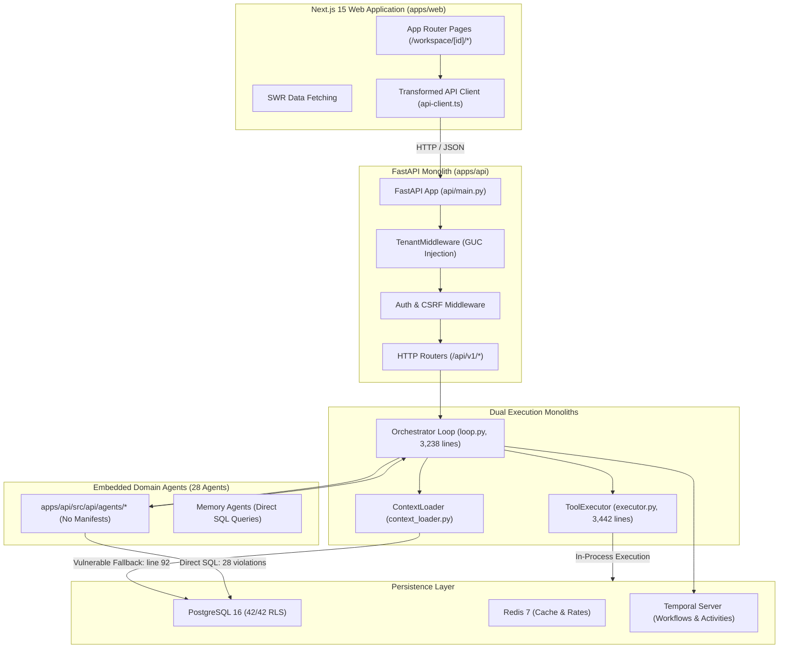

# Current Monolithic Architecture: Reverse-Engineered Topology

## 1. Executive Summary

This document provides a reverse-engineered architectural topology of the
Vaeloom monorepo as it exists today, mapping caller/callee flows, shared memory
access, and monolithic bottlenecks.

---

## 2. End-to-End System Topology (Current State)

---

## 3. Critical Monolithic Bottlenecks Identified

1. **Dual Monoliths**:
   - `loop.py` (3,238 lines) and `executor.py` (3,442 lines) form a tightly
     coupled core holding all routing, state persistence, tool dispatch, and
     approval handling.
2. **Absence of Service Boundaries**:
   - Domain agents call each other recursively in-process without going through
     network or queue boundaries.
3. **Coupled Business Services**:
   - Deterministic calculations (ATS score, resume layout, salary estimate) are
     tangled inside the API web service.
