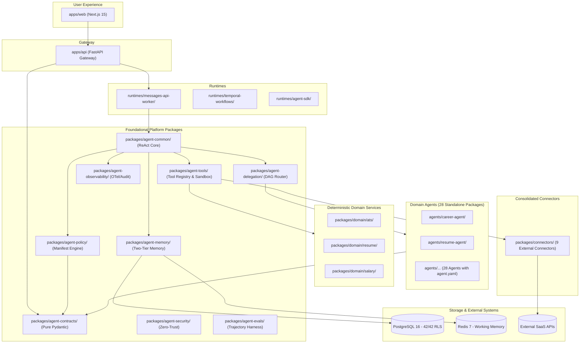

# Comprehensive System Dependency Graphs & Boundary Maps

## 1. Current Monolithic Architecture & Prohibited Cross-Layer Calls

```mermaid
flowchart TD
    subgraph Presentation ["Presentation Layer"]
        Web["Next.js 15 (apps/web)"]
    end

    subgraph Gateway ["API Gateway (apps/api)"]
        Router["FastAPI Routers (/api/v1/*)"]
        AuthMiddleware["Auth & Tenant Middleware"]
    end

    subgraph CoreMonolith ["Dual Execution Monoliths"]
        Loop["Orchestrator Loop (loop.py, 3,238 lines)"]
        Context["ContextLoader (context_loader.py)"]
        Executor["ToolExecutor (executor.py, 3,442 lines)"]
    end

    subgraph AgentsLayer ["Domain Agents (28 Agents)"]
        AgentCore["BaseAgent Subclasses"]
        MemoryAgents["Memory Consolidator & Retrieval"]
    end

    subgraph DomainServices ["Tangled Domain Services"]
        ATS["semantic_ats.py"]
        DocBuilder["document_builder.py"]
        Salary["salary_service.py"]
    end

    subgraph Persistence ["Persistence & External Layer"]
        DB[(PostgreSQL 16 / Supabase)]
        Redis[(Redis 7)]
        ExternalAPIs[(Google / GitHub / Slack)]
    end

    Web --> Router
    Router --> Loop
    Loop --> Context
    Context -->|VULNERABLE FALLBACK (line 92)| DB
    Loop --> AgentCore
    Loop --> Executor
    Executor --> DomainServices
    Executor --> ExternalAPIs
    DomainServices --> DB

    %% PROHIBITED DEPENDENCY FLOWS
    MemoryAgents -.->|ILLEGAL DIRECT DB (28 imports)| DB
    AgentCore -.->|ILLEGAL DIRECT CONFIG| Gateway
    Executor -.->|CIRCULAR IMPORT| Loop
```

---

## 2. Target Decoupled Enterprise Architecture (Strict Acyclic DAG)


