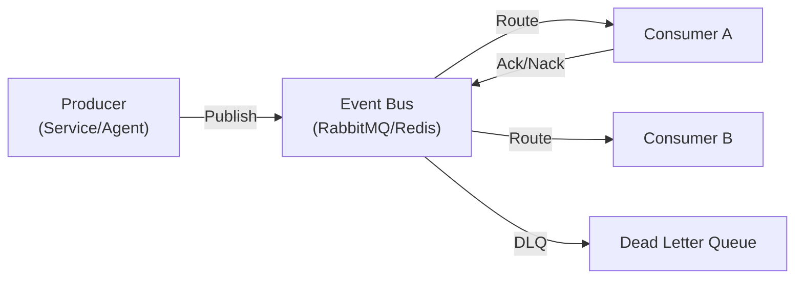

# Event Schemas

> **Purpose:** Define the event-driven architecture, event catalog, and message schemas
> **Status:** ✅ Upgraded to enterprise quality
> **Owner:** Platform Team
> **Version:** 2.0
> **Last Updated:** 2026-07-17

## Event Architecture

## Event Categories

| Category | Prefix | Description |
|---|---|---|
| Memory | `memory.` | Memory CRUD, indexing, search events |
| Agent | `agent.` | Agent lifecycle, execution, error events |
| Auth | `auth.` | Login, logout, token refresh events |
| Billing | `billing.` | Subscription, usage, invoice events |
| System | `system.` | Health, config, deployment events |
| Sync | `sync.` | Integration sync, connector events |
| User | `user.` | User action, preference events |

## Core Event Types

| Event | Schema | Priority | Retention |
|---|---|---|---|
| `memory.created` | `{id, type, tenantId, userId, metadata}` | Normal | 90 days |
| `memory.updated` | `{id, changes, tenantId}` | Normal | 90 days |
| `memory.deleted` | `{id, tenantId}` | Normal | 90 days |
| `agent.execution.started` | `{agentId, executionId, input}` | High | 30 days |
| `agent.execution.completed` | `{agentId, executionId, output, tokensUsed}` | High | 30 days |
| `agent.execution.failed` | `{agentId, executionId, error}` | Critical | 90 days |
| `auth.login` | `{userId, tenantId, provider, ip}` | Low | 30 days |
| `auth.login.failed` | `{email, ip, reason}` | High | 90 days |
| `billing.usage.threshold` | `{tenantId, metric, value, threshold}` | High | 30 days |
| `system.health.warning` | `{service, metric, value, threshold}` | Critical | 7 days |

## Related Documents

- [Event Catalog](../../docs/Backend/Event-Catalog.md)
- [Event Architecture](../../docs/Architecture/Event-Architecture.md)
