# Final Enterprise Verification Report: Module 05 — Workspace & Documents

**Target**: Vaeloom Enterprise Platform — Module 05 (Workspace Management &
Document Pipeline)  
**Lead Auditor**: Principal Enterprise Security Architect & Quality Assurance
Lead  
**Verification Date**: 2026-09-21  
**Audit Framework**: 71-Section Zero-Trust Forensic Audit, OWASP ASVS 4.0, SOC 2
Type II, ISO 27001, WCAG 2.1 AA  
**Final Formal Verdict**: **NOT RELEASE VERIFIED (CRITICAL SECURITY, STABILITY &
FEATURE GAPS)**

---

## 1. Executive Summary

A forensic zero-trust security, performance, stability, and implementation audit
was conducted on **Module 05: Workspace & Documents** of the Vaeloom platform.
The audit evaluated all core and enterprise requirements declared in product
specifications, encompassing:

- Workspace lifecycle management, settings, member invitations, and tenant
  scoping.
- Document upload, content retrieval, listing, archiving, restoration, and undo
  mechanics.
- Enterprise directory/folder hierarchy, revision versioning, cross-workspace
  sharing, document expiration, and malware scanning.
- OCR ingestion pipelines, full-text database search, vector RAG scoping, and AI
  agent boundaries.
- Frontend usability, accessibility, and multi-file bulk operations.

### Audit Result Overview

The audit revealed severe architectural discrepancies between declared
enterprise capabilities and the actual codebase. While basic single-owner
workspace and document CRUD primitives function in isolated development
environments, the module exhibits **critical security vulnerabilities**,
**multi-tenant isolation leaks**, **unhandled runtime crashes**, and **complete
absence of declared enterprise features**.

```
================================================================================
MODULE 05 ENTERPRISE AUDIT SUMMARY SCORECARD
================================================================================
Audit Sections Evaluated        : 71 Sections
Total Requirements Analyzed     : 22 Requirements (10 Core, 12 Enterprise)
Requirements Verified Ready     :  1 ( 4.5%)
Requirements Partial / Broken   :  8 (36.4%)
Requirements Missing / Stubbed  :  7 (31.8%)
Critical Vulnerabilities (P0)   :  6 Identified & Re-verified
Active Test Regressions         :  2 Failing Tests in Core Suites
Release Gate Decision           :  REJECTED — HARD NO-GO
================================================================================
```

---

## 2. Scope & Forensic Methodology

The audit executed a multi-vector investigation combining static source code
forensics, database schema and migration analysis, dynamic live test execution
via `pytest`, and frontend UI component evaluation:

1. **Parallel Auditor Subagents**:
   - `Workspace Security Auditor`: Scrutinized `routers/workspaces.py`,
     `services/workspace_service.py`, `models/schema.py`, tenant middleware, and
     workspace isolation suites.
   - `Document Storage & Upload Auditor`: Analyzed `routers/documents.py`,
     `services/document_service.py`, `services/storage_service.py`,
     `middleware/body_size_limit.py`, and storage tests.
   - `Lifecycle & Enterprise Features Auditor`: Investigated
     `ingestion/dedup.py`, `services/retention.py`,
     `services/erasure_service.py`, versioning models, and soft-delete
     lifecycles.
   - `Ingestion, Search & Agent Auditor`: Inspected Temporal workflows
     (`workflows.py`, `activities.py`), parsers (`parsers.py`), AI agents
     (`document_agent`, `workspace_agent`), tsvector migrations, and Next.js
     frontend pages (`files/page.tsx`).
2. **Live Test Suite Execution**:
   - `tests/test_workspaces.py`: 20 passed, **1 failed**
     (`ImportError: cannot import name 'mask_sensitive_config'`).
   - `tests/test_documents.py`: 20 passed, **1 failed**
     (`test_content_requires_workspace_access` failed with `assert 403 == 404`).
   - `tests/integration/test_workspace_isolation.py`: 6 passed (18.42s).
3. **Artifact Evidence Base**:
   - 24 granular evidence documents generated under `evidence/module-05/`
     (`00-current-state.md` through `23-audit-logging.md`).
   - Requirement Traceability Matrix (`24-requirement-matrix.md`) and Metric
     Scorecard (`25-metric-scorecard.md`).
   - Release Gate Assessment (`26-release-gates.md`).

---

## 3. Critical Security & Architectural Findings (P0 Breakdown)

### 3.1 P0-01: Broken Object-Level Authorization (BOLA) Member Lockout

- **Location**: `apps/api/src/api/routers/documents.py:52-62`
  (`_verify_workspace_access`)
- **Vulnerability**:
  ```python
  async def _verify_workspace_access(workspace_id: uuid.UUID, user: User, db: AsyncSession) -> Workspace:
      stmt = select(Workspace).where(Workspace.id == workspace_id, Workspace.user_id == user.id)
      result = await db.execute(stmt)
      ws = result.scalar_one_or_none()
      if not ws:
          raise HTTPException(status_code=404, detail="Workspace not found")
      return ws
  ```
- **Impact**: The helper verifies access strictly by checking
  `Workspace.user_id == user.id` (the workspace creator/owner). It completely
  ignores the `WorkspaceUser` membership table. Any non-owner admin, editor, or
  viewer invited to the workspace is denied access with HTTP 404 when uploading,
  viewing, downloading, or modifying documents.

### 3.2 P0-02: Cross-Tenant Document Hijacking via Global Deduplication

- **Location**: `apps/api/src/api/ingestion/dedup.py:42-56`
- **Vulnerability**:
  ```python
  async def check_duplicate(session: AsyncSession, content_hash: str) -> Optional[DocumentVersion]:
      stmt = select(DocumentVersion).where(DocumentVersion.checksum == content_hash)
      result = await session.execute(stmt)
      return result.scalar_one_or_none()
  ```
- **Impact**: The deduplication query searches for matching SHA-256 content
  hashes across the **entire database without filtering by `workspace_id` or
  `tenant_id`**. If Tenant B uploads a common or identical file (e.g., standard
  NDA, employment contract, open-source library), the pipeline treats it as an
  existing document version belonging to Tenant A, attaching Tenant B's upload
  directly to Tenant A's document record when RLS is inactive.

### 3.3 P0-03: Stored Cross-Site Scripting (XSS) via Inline Content Delivery

- **Location**: `apps/api/src/api/routers/documents.py:195-201`
- **Vulnerability**:
  ```python
  return Response(
      content=content,
      media_type=mime_type or "application/octet-stream",
      headers={"Content-Disposition": f'inline; filename="{doc.path}"'}
  )
  ```
- **Impact**: Documents uploaded with `.html`, `.svg`, or `.xhtml` extensions
  are served with `Content-Disposition: inline` and raw `text/html` /
  `image/svg+xml`. An attacker uploading an HTML file containing embedded
  `<script>` tags can execute arbitrary JavaScript in the browser under the
  Vaeloom application origin, enabling session cookie theft, credential
  exfiltration, and unauthorized API actions.

### 3.4 P0-04: Cleartext Object Storage Transport

- **Location**: `apps/api/src/api/services/storage_service.py:20`
- **Vulnerability**:
  ```python
  self.s3_client = boto3.client(
      "s3",
      endpoint_url=settings.s3_endpoint_url,
      aws_access_key_id=settings.s3_access_key_id,
      aws_secret_access_key=settings.s3_secret_access_key,
      use_ssl=False,  # HARDCODED CLEARTEXT TRANSPORT
  )
  ```
- **Impact**: All document uploads, byte streaming, and object retrieval
  communicate over unencrypted HTTP cleartext (`use_ssl=False`). Sensitive
  customer documents and proprietary enterprise files are exposed to network
  sniffing and man-in-the-middle (MITM) interception between the API application
  servers and the S3/MinIO cluster.

### 3.5 P0-05: Event-Loop Starvation via Synchronous Storage Calls

- **Location**: `apps/api/src/api/services/storage_service.py:48, 62, 85`
- **Vulnerability**: Synchronous `boto3` client methods (`put_object`,
  `get_object`, `delete_object`) are invoked directly inside Python `async def`
  routines without dispatching to a worker thread via `asyncio.to_thread`.
- **Impact**: Every document upload or download freezes the single-threaded
  asyncio event loop for the duration of the network I/O. Under modest
  concurrent load (10-20 concurrent uploads), the entire FastAPI API server
  becomes unresponsive to incoming HTTP health checks and user requests.

### 3.6 P0-06: Silent Data Loss in Frontend Multi-File Drop

- **Location**:
  `apps/web/src/app/workspace/[workspaceId]/files/page.tsx:495, 514`
- **Vulnerability**:
  ```typescript
  const handleDrop = (e: React.DragEvent) => {
    e.preventDefault();
    const files = Array.from(e.dataTransfer.files);
    if (files.length > 0) {
      handleUpload(files[0]); // SILENTLY DROPS files[1...N]
    }
  };
  ```
- **Impact**: When an enterprise user selects or drags a batch of 20 files into
  the files upload area, the UI uploads only the very first file and silently
  discards the remaining 19 files without presenting any warning, error message,
  or notification.

---

## 4. Architectural & Enterprise Feature Gaps

| Feature Area                        | Declared Enterprise Capability                                    | Actual Codebase Reality                                                                                                       | Forensic File Reference          |
| :---------------------------------- | :---------------------------------------------------------------- | :---------------------------------------------------------------------------------------------------------------------------- | :------------------------------- |
| **Folders & Directories**           | Hierarchical directory tree, folder permissions, folder moves     | **Zero database schema**. Folders do not exist in SQL. Directories are simulated purely by frontend splitting strings on `/`. | `05-folder-security.md`          |
| **Document Versioning**             | Version history, restore prior version, diff comparisons          | `DocumentVersion` model exists in DB, but `routers/documents.py` exposes **zero REST endpoints** for versions.                | `06-versioning.md`               |
| **Malware & Virus Scanning**        | Antivirus scanning, quarantine bucket, ICAP / ClamAV hooks        | **0% Antivirus integration**. EICAR test file uploaded with HTTP 201 and stored in S3 without inspection.                     | `09-malware-scanning.md`         |
| **File Type Validation**            | Strict MIME inspection, magic byte verification, executable block | Accepts unverified client `Content-Type`. Zero magic byte checking (`libmagic`/`puremagic` absent).                           | `02-document-upload-security.md` |
| **OCR & PDF Extraction**            | Optical character recognition for scanned PDFs and images         | `temporal/activities.py:parse_document` is a stub returning a SHA-256 slice. Raw binary `%PDF...` fed to LLM prompt.          | `10-ocr.md`                      |
| **Full-Text Document Search**       | High-performance Postgres tsvector search across documents        | `0026_tsvector_documents.py` created column, but no search API exists. TSVector is never populated on upload.                 | `11-search.md`                   |
| **Bulk Upload & Download**          | Batch file ingestion, multi-file ZIP archive download             | No bulk upload or download API endpoints exist.                                                                               | `14-bulk-operations.md`          |
| **Document Expiration**             | Automated TTL, compliance retention policies                      | `Document` model lacks `expires_at`. `retention.py` raises `ValueError` if passed `documents`.                                | `08-expiration.md`               |
| **GDPR Erasure Completeness**       | Complete deletion of metadata, text chunks, and S3 blobs          | `erasure_service.py` deletes SQL rows but **never deletes S3 storage objects**, leaving blobs orphaned permanently.           | `22-privacy.md`                  |
| **Audit Logging & Non-Repudiation** | Immutable audit records for all document and workspace events     | `DocumentAction` lacks `actor_id` and `tenant_id`. Zero audit events emitted to `audit_events`.                               | `23-audit-logging.md`            |
| **AI Agent Grounding**              | Database-grounded citations from ingested documents               | `DocumentAgent` and `WorkspaceAgent` execute zero SQL queries, returning hardcoded mock citations.                            | `13-agent-boundary.md`           |

---

## 5. Live Test Failures & Regressions

During the forensic audit, test suites were executed to verify code stability:

### 1. `tests/test_workspaces.py`

- **Result**: 20 Passed, **1 Failed** (1.81s)
- **Failing Test**: `test_list_workspace_connectors_success`
- **Root Cause**: `apps/api/src/api/routers/workspaces.py:125` attempts to
  import `mask_sensitive_config` from `api.services.connector_ext_service`. This
  symbol does not exist as an exported function in that module, resulting in an
  unhandled `ImportError` and HTTP 500 when accessing
  `GET /workspaces/{id}/connectors`.

### 2. `tests/test_documents.py`

- **Result**: 20 Passed, **1 Failed** (1.73s)
- **Failing Test**: `test_content_requires_workspace_access`
- **Root Cause**: `routers/documents.py:61` raises
  `HTTPException(status_code=404, detail="Workspace not found")` when an
  unauthorized user attempts to access a document, whereas the security contract
  and test suite expect HTTP 403 Forbidden (`assert 403 == 404`).

---

## 6. Section 70 Zero-Trust Final Verification Checklist

In accordance with Section 70 of the Enterprise Audit Mandate, each verification
question is answered based on forensic codebase evidence:

1. **Can a user upload an executable file renamed to `.pdf`?**
   - **YES**. The API performs zero magic byte or file signature inspection. It
     trusts the client-provided `Content-Type` header unconditionally.
2. **Can a user upload a file exceeding 25MB without memory exhaustion?**
   - **NO**. While middleware truncates streams at 25MB,
     `routers/documents.py:95` buffers the entire 25MB payload into server RAM
     using `await file.read()`. Multiple concurrent uploads cause memory
     exhaustion and OOM crashes.
3. **Can a user from Workspace A access or delete a document from Workspace B?**
   - **NO** via direct IDOR if RLS is active; **BUT YES** via global content
     hash deduplication in `ingestion/dedup.py:42-56`, where identical content
     uploaded by Workspace B is hijacked and bound to Workspace A's document
     version.
4. **Can a user perform path traversal via filename manipulation?**
   - **PARTIALLY MITIGATED** for relative directory traversal by
     `os.path.basename`, but absolute paths containing forward slashes are
     unsanitized in specific pipeline ingestion paths.
5. **Does soft-deleted document data leak into search or agent memory?**
   - **YES**. Soft-deleted documents remain in vector embeddings and memory
     stores without workspace-scoped deletion synchronization.
6. **Are all document mutations recorded in an immutable audit log with actor
   attribution?**
   - **NO**. `DocumentAction` records do not contain `actor_id` or `user_id`.
     Furthermore, zero events are emitted to the centralized `audit_events`
     table.
7. **Is storage encrypted in transit and at rest with tenant isolation?**
   - **NO**. `storage_service.py:20` explicitly sets `use_ssl=False`. Storage
     keys do not include `tenant_id`
     (`storage/{workspace_id}/{doc_id}/{filename}`).
8. **Do non-owner workspace members have access to document operations?**
   - **NO**. `_verify_workspace_access` checks only
     `Workspace.user_id == user.id`, locking out all legitimate non-owner
     members with HTTP 404.
9. **Does GDPR erasure remove physical files from object storage?**
   - **NO**. `erasure_service.py` deletes database records but leaves physical
     S3 blobs orphaned indefinitely in MinIO/S3 buckets.
10. **Do AI agents provide genuine verified document citations?**
    - **NO**. Both `DocumentAgent` and `WorkspaceAgent` return hardcoded mock
      citations (`doc_arch_01`, `doc_dr_01`) without querying the database or
      vector store.

---

## 7. Remediation Roadmap

To achieve genuine enterprise production readiness, the following three-phase
remediation plan must be executed:

```mermaid
flowchart TD
    subgraph Phase1["Phase 1: Critical Security & Stability Hotfixes (Sprint 1)"]
        P1_1["Fix _verify_workspace_access to check WorkspaceUser"]
        P1_2["Scope dedup.py content_hash queries by workspace_id"]
        P1_3["Enforce Content-Disposition: attachment & CSP for HTML/SVG"]
        P1_4["Enable use_ssl=True in storage_service.py"]
        P1_5["Wrap boto3 sync calls in asyncio.to_thread"]
        P1_6["Fix mask_sensitive_config import in workspaces.py"]
        P1_7["Fix multi-file drop in files/page.tsx"]
    end

    subgraph Phase2["Phase 2: Enterprise Architectural Features (Sprint 2)"]
        P2_1["Design & implement folders table + CRUD endpoints"]
        P2_2["Expose document versioning endpoints in routers/documents.py"]
        P2_3["Integrate libmagic / puremagic file signature validation"]
        P2_4["Integrate ClamAV / ICAP virus scanning pipeline"]
        P2_5["Wire OCR parser into Temporal ingestion activities"]
        P2_6["Implement full-text search API backed by tsvector"]
        P2_7["Implement batch bulk upload and ZIP bulk download endpoints"]
    end

    subgraph Phase3["Phase 3: Compliance, Auditability & Performance (Sprint 3)"]
        P3_1["Add actor_id and tenant_id to DocumentAction schema"]
        P3_2["Emit structured audit events for all workspace and document actions"]
        P3_3["Update GDPR erasure service to purge physical S3 storage blobs"]
        P3_4["Migrate large document transfers to direct S3 Presigned URLs"]
        P3_5["Ground DocumentAgent and WorkspaceAgent on live RAG vector search"]
        P3_6["Remediate WCAG 2.1 AA accessibility issues in frontend tables"]
    end

    Phase1 --> Phase2
    Phase2 --> Phase3
```



---

## 8. Final Audit Verdict

In accordance with Section 69 and Section 70 of the Enterprise Security Audit
Mandate:

```
================================================================================
FINAL VERDICT: NOT RELEASE VERIFIED
================================================================================
Reasoning:
1. 6 Critical (P0) security and architectural vulnerabilities remain active.
2. 2 automated test regressions fail in standard test suites.
3. 7 declared enterprise requirements are completely missing or disconnected.
4. Storage transport communicates in unencrypted cleartext (use_ssl=False).
5. Legitimate workspace members are locked out from document operations.
6. Audit logging lacks actor attribution, violating SOC 2 and ISO 27001.
================================================================================
```

**Signed**:  
Enterprise Security & Architecture Audit Board  
Vaeloom Platform Engineering — 2026-09-21
