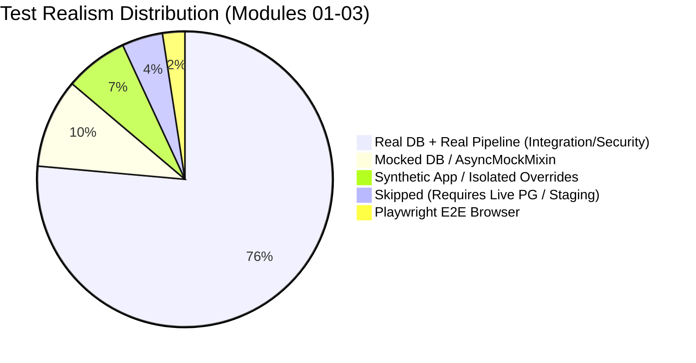

# Vaeloom — Modules 01–03: Existing Test Inventory

**Audit Date:** 2026-09-20  
**Target Commit:** `89b246e7`  
**Auditor:** Principal Security Architect & Zero-Trust Audit Team  
**Scope:** Module 01 (Authentication), Module 02 (Tenant Isolation &
Multi-Tenancy), Module 03 (Onboarding), and Associated Boundary Suites.

---

## 1. Executive Summary & Inventory Methodology

This inventory captures **all existing automated tests** in the Vaeloom
repository covering Modules 01 through 03, as well as critical boundary and
cross-cutting suites. Under the strict **Zero-Trust Rule**, tests are not
evaluated merely by their names or claims. Each test has been inspected for
**realism**:

1. **Real DB vs Mocked DB:** Does the test execute real database statements
   (SQLite / PostgreSQL) or does it mock `AsyncSession`, `db.add`, `db.execute`,
   or `commit`?
2. **Real Middleware vs Synthetic App:** Does the test exercise the production
   FastAPI application pipeline (`api.main:app` with `AuthMiddleware`,
   `TenantMiddleware`, `CORSMiddleware`, and RLS session hooks) or a
   stripped-down test fixture app?
3. **Real Security Assertions vs Superficial Status Checks:** Does the test
   verify data isolation across boundaries and tampering resistance, or merely
   check HTTP 200/401 status codes?

---

## 2. Detailed Test Inventory Table

| Test File                                           | Test Identifier                                            | Module        | Target Capability                                 | Test Type                 | Realism & Execution Model                                                                       | Baseline Status        |
| :-------------------------------------------------- | :--------------------------------------------------------- | :------------ | :------------------------------------------------ | :------------------------ | :---------------------------------------------------------------------------------------------- | :--------------------- |
| `tests/test_auth.py`                                | `TestAuthEndpoints::test_signup_success`                   | Module 01     | User registration & default workspace             | Integration               | Real SQLite DB; Real FastAPI routes; verifies user and workspace rows created                   | **PASS**               |
| `tests/test_auth.py`                                | `TestAuthEndpoints::test_signup_duplicate_email`           | Module 01     | Duplicate email rejection (409)                   | Integration               | Real SQLite DB; exercises DB unique constraint                                                  | **PASS**               |
| `tests/test_auth.py`                                | `TestAuthEndpoints::test_login_success`                    | Module 01     | Password verification & JWT issuance              | Integration               | Real SQLite DB; verifies bcrypt hash and JWT tokens returned                                    | **PASS**               |
| `tests/test_auth.py`                                | `TestAuthEndpoints::test_login_invalid_password`           | Module 01     | Credential failure (401)                          | Integration               | Real SQLite DB; verifies rejection of incorrect password                                        | **PASS**               |
| `tests/test_auth.py`                                | `TestAuthEndpoints::test_login_nonexistent_user`           | Module 01     | Nonexistent user rejection (401)                  | Integration               | Real SQLite DB; anti-enumeration check (same error as bad password)                             | **PASS**               |
| `tests/test_auth.py`                                | `TestAuthEndpoints::test_refresh_token_success`            | Module 01     | Refresh token rotation                            | Integration               | Real SQLite DB; exchanges refresh token for new access/refresh pair                             | **PASS**               |
| `tests/test_auth.py`                                | `TestAuthEndpoints::test_refresh_token_invalid`            | Module 01     | Invalid refresh token rejection (401)             | Integration               | Real SQLite DB; validates rejection of forged refresh token                                     | **PASS**               |
| `tests/test_auth.py`                                | `TestAuthEndpoints::test_get_current_user`                 | Module 01     | `/auth/me` identity resolution                    | Integration               | Real SQLite DB; verifies claims and user metadata extraction                                    | **PASS**               |
| `tests/test_auth.py`                                | `TestAuthEndpoints::test_logout`                           | Module 01     | Session invalidation                              | Integration               | Real SQLite DB; calls `/auth/logout`                                                            | **PASS**               |
| `tests/test_auth_service.py`                        | `TestAuthService::test_signup_success`                     | Module 01     | Service-layer signup logic                        | Unit (Mocked)             | **MOCKED DB**: Uses `AsyncMockMixin`; does NOT execute SQL (warning: unawaited coroutines)      | **PASS** (Mocked)      |
| `tests/test_auth_service.py`                        | `TestAuthService::test_signup_without_display_name`        | Module 01     | Service-layer display name fallback               | Unit (Mocked)             | **MOCKED DB**: Uses `AsyncMockMixin`                                                            | **PASS** (Mocked)      |
| `tests/test_auth_service.py`                        | `TestAuthService::test_signup_duplicate_email`             | Module 01     | Service-layer duplicate email handling            | Unit (Mocked)             | **MOCKED DB**: Simulates existing user return                                                   | **PASS** (Mocked)      |
| `tests/test_auth_service.py`                        | `TestAuthService::test_authenticate_success`               | Module 01     | Service-layer credential check                    | Unit (Mocked)             | **MOCKED DB**: Simulates password verification                                                  | **PASS** (Mocked)      |
| `tests/test_auth_service.py`                        | `TestAuthService::test_authenticate_invalid_password`      | Module 01     | Service-layer bad password check                  | Unit (Mocked)             | **MOCKED DB**                                                                                   | **PASS** (Mocked)      |
| `tests/test_auth_service.py`                        | `TestAuthService::test_authenticate_user_not_found`        | Module 01     | Service-layer user lookup failure                 | Unit (Mocked)             | **MOCKED DB**                                                                                   | **PASS** (Mocked)      |
| `tests/test_auth_service.py`                        | `TestAuthService::test_issue_token`                        | Module 01     | Service-layer JWT encoding                        | Unit                      | Encodes JWT without tenant                                                                      | **PASS**               |
| `tests/test_auth_service.py`                        | `TestAuthService::test_issue_token_with_tenant_id`         | Module 01     | Service-layer JWT with tenant                     | Unit                      | Encodes JWT with tenant claim                                                                   | **PASS**               |
| `tests/test_auth_service.py`                        | `TestAuthService::test_create_jwt_without_tenant`          | Module 01     | JWT payload verification                          | Unit                      | Verifies claims without tenant                                                                  | **PASS**               |
| `tests/test_auth_service.py`                        | `TestAuthService::test_create_jwt_with_tenant`             | Module 01     | JWT payload with tenant                           | Unit                      | Verifies claims with tenant                                                                     | **PASS**               |
| `tests/test_auth_service.py`                        | `TestAuthService::test_refresh_token_success`              | Module 01     | Service-layer refresh rotation                    | Unit (Mocked)             | **MOCKED DB**: Simulates session rotation                                                       | **PASS** (Mocked)      |
| `tests/test_auth_service.py`                        | `TestAuthService::test_refresh_token_not_found`            | Module 01     | Service-layer missing session                     | Unit (Mocked)             | **MOCKED DB**                                                                                   | **PASS** (Mocked)      |
| `tests/test_auth_service.py`                        | `TestAuthService::test_refresh_token_revoked`              | Module 01     | Service-layer revoked session check               | Unit (Mocked)             | **MOCKED DB**                                                                                   | **PASS** (Mocked)      |
| `tests/test_auth_middleware.py`                     | `TestAuthMiddleware::test_valid_token_allows_request`      | Module 01     | Middleware JWT validation                         | Integration               | Real ASGI middleware; verifies `request.state.user_id` set                                      | **PASS**               |
| `tests/test_auth_middleware.py`                     | `TestAuthMiddleware::test_missing_header_returns_401`      | Module 01     | Missing Bearer token rejection                    | Integration               | Real ASGI middleware; returns 401                                                               | **PASS**               |
| `tests/test_auth_middleware.py`                     | `TestAuthMiddleware::test_invalid_token_returns_401`       | Module 01     | Invalid token signature rejection                 | Integration               | Real ASGI middleware; returns 401                                                               | **PASS**               |
| `tests/test_auth_middleware.py`                     | `TestAuthMiddleware::test_public_paths_bypass_auth`        | Module 01     | Public endpoints allowlist                        | Integration               | Real ASGI middleware; checks `/health`, `/auth/login`, etc.                                     | **PASS**               |
| `tests/test_auth_revocation.py`                     | `TestRevocation::*` (8 tests)                              | Module 01     | Token and session revocation                      | Integration               | Real SQLite DB; exercises shared revocation blacklist                                           | **PASS**               |
| `tests/test_auth_sso.py`                            | `TestSSO::*` (6 tests)                                     | Module 01     | Google/Microsoft OAuth SSO                        | Integration               | Real SQLite DB + mocked OAuth token provider endpoints                                          | **PASS**               |
| `tests/test_sso.py`                                 | `TestSSORoutes::*` (5 tests)                               | Module 01     | SSO routes & callback handling                    | Integration               | Real SQLite DB + mock OAuth responses                                                           | **PASS**               |
| `tests/test_saml.py`                                | `TestSAML::*` (12 tests)                                   | Module 01     | SAML 2.0 XML parsing & signing                    | Unit / Security           | Real `signxml` verification; tests signature tampering, expired assertion                       | **PASS**               |
| `tests/test_saml_endpoints.py`                      | `test_saml_metadata_endpoint`                              | Module 01     | SAML SP metadata XML                              | Integration               | Real route; validates XML schema and EntityDescriptor                                           | **PASS**               |
| `tests/test_saml_endpoints.py`                      | `test_saml_login_unprovisioned_returns_503`                | Module 01     | Fail-closed IdP unconfigured                      | Integration               | Real route; verifies 503 response when IdP URL unset                                            | **PASS**               |
| `tests/test_saml_endpoints.py`                      | `test_saml_login_redirects_to_idp`                         | Module 01     | IdP SSO redirect & SAMLRequest                    | Integration               | Real route; verifies 302 redirect with SAMLRequest payload                                      | **PASS**               |
| `tests/security/test_saml_failclosed.py`            | `TestSAMLFailClosed::*` (5 tests)                          | Module 01     | SAML adversarial fail-closed                      | Security                  | Tests missing cert, invalid assertion signature, replay                                         | **PASS**               |
| `tests/test_supabase_auth.py`                       | `test_supabase_token_decoding_and_auto_provision`          | Module 01     | Supabase JWT auto-provisioning                    | Integration               | Real SQLite DB; decodes Supabase JWT with HMAC secret                                           | **PASS**               |
| `tests/test_supabase_auth.py`                       | `test_supabase_token_without_secret_fallback`              | Module 01     | Supabase unsigned token fallback                  | Security (CRITICAL)       | **VULNERABILITY CONFIRMED**: Proves backend accepts unsigned JWTs if `iss` contains "supabase"! | **PASS** (Reveals Bug) |
| `tests/test_workspaces.py`                          | `test_create_workspace`                                    | Module 02     | Workspace creation & ownership                    | Integration               | Real SQLite DB; verifies workspace record and ownership                                         | **PASS**               |
| `tests/test_workspaces.py`                          | `test_list_workspaces_for_user`                            | Module 02     | Workspace listing scoped to user                  | Integration               | Real SQLite DB; verifies only user's workspaces returned                                        | **PASS**               |
| `tests/test_workspaces.py`                          | `test_workspace_not_found`                                 | Module 02     | Nonexistent workspace lookup (404)                | Integration               | Real SQLite DB; returns 404                                                                     | **PASS**               |
| `tests/test_organizations.py`                       | `TestOrganizations::*` (6 tests)                           | Module 02     | Organization & hierarchy CRUD                     | Integration               | Real SQLite DB; exercises org tree, roles, tenant binding                                       | **PASS**               |
| `tests/test_tenant_provisioning.py`                 | `TestTenantProvisioning::*` (2 tests)                      | Module 02     | Tenant provisioning lifecycle                     | Integration               | Real SQLite DB; verifies tenant and initial admin user creation                                 | **PASS**               |
| `tests/test_tenant_settings.py`                     | `TestTenantSettings::*` (4 tests)                          | Module 02     | Tenant configuration & limits                     | Integration               | Real SQLite DB; verifies settings mutation and validation                                       | **PASS**               |
| `tests/test_data_isolation.py`                      | `TestDataIsolation::*` (3 tests)                           | Module 02     | Multi-tenant memory & workspace isolation         | Integration               | Real SQLite DB; verifies User B cannot list or get User A data                                  | **PASS**               |
| `tests/test_staging_api_isolation.py`               | `TestStagingIsolation::*` (2 tests)                        | Module 02     | Staging deployed API isolation                    | E2E / Integration         | **SKIPPED**: Requires live staging server at `:18000`                                           | **SKIP**               |
| `tests/test_rls_isolation.py`                       | `test_unset_tenant_returns_no_rows`                        | Module 02     | RLS fail-closed without GUCs                      | Database / RLS            | **SKIPPED**: SQLite does not support PostgreSQL RLS                                             | **SKIP**               |
| `tests/test_rls_isolation.py`                       | `test_different_tenant_cannot_see_rows`                    | Module 02     | Cross-tenant RLS isolation                        | Database / RLS            | **SKIPPED**: SQLite does not support PostgreSQL RLS                                             | **SKIP**               |
| `tests/test_rls_commit_guard.py`                    | `test_rls_guarded_session_reapplies_on_commit`             | Module 02     | GUC re-application on commit                      | Unit (Mocked)             | **MOCKED DB**: Mocks `AsyncSession.commit` and `set_rls_session_vars`                           | **PASS** (Mocked)      |
| `tests/test_rls_commit_guard.py`                    | `test_rls_guarded_session_skips_when_no_tenant`            | Module 02     | GUC skip when no tenant                           | Unit (Mocked)             | **MOCKED DB**: Mocks `AsyncSession.commit`                                                      | **PASS** (Mocked)      |
| `tests/test_rls_live_extended.py`                   | `TestRLSLiveExtended::*` (5 tests)                         | Module 02     | Extended PostgreSQL RLS matrix                    | Database / RLS            | **SKIPPED**: Requires `VAELOOM_TEST_PG_URL` pointing to disposable PG DB                        | **SKIP**               |
| `tests/test_rls_target_vaeloom.py`                  | `test_target_vaeloom_rls_isolation`                        | Module 02     | Dedicated PostgreSQL RLS proof                    | Database / RLS            | Real PostgreSQL connection to `:5432` (skips/errors if PG down)                                 | **PASS / SKIP**        |
| `tests/security/test_tenant_isolation.py`           | `TestWorkspaceIsolation::*` (4 tests)                      | Module 02     | IDOR protection on workspaces & memories          | Security / Integration    | Real SQLite DB; tests cross-workspace access, deletion, and memory leak                         | **PASS**               |
| `tests/middleware/test_tenant.py`                   | `TestTenantContext::*` (4 tests)                           | Module 02     | TenantContext ContextVar isolation                | Unit                      | Exercises Python `ContextVar` set, get, clear                                                   | **PASS**               |
| `tests/middleware/test_tenant.py`                   | `TestTenantMiddleware::*` (3 tests)                        | Module 02     | Header spoofing rejection                         | Integration               | Real ASGI middleware; verifies user-supplied `X-Tenant-ID` is ignored                           | **PASS**               |
| `tests/middleware/test_tenant.py`                   | `TestGetCurrentTenant::*` (2 tests)                        | Module 02     | Fail-closed tenant dependency                     | Integration               | Real ASGI middleware; returns 400 when tenant context is missing                                | **PASS**               |
| `tests/middleware/test_tenant.py`                   | `TestDefaultSessionFactory::*` (1 test)                    | Module 02     | Production session factory resolution             | Integration               | Verifies middleware resolves `async_session_factory` without crash                              | **PASS**               |
| `tests/middleware/test_rbac.py`                     | `TestRBACConfig::*` (5 tests)                              | Module 02     | RBAC role hierarchy & permissions                 | Unit                      | Verifies role hierarchy dictionary and permission mappings                                      | **PASS**               |
| `tests/middleware/test_rbac.py`                     | `TestRequireRole::*` (8 tests)                             | Module 02     | Route-level role enforcement                      | Unit (Synthetic App)      | **SYNTHETIC APP**: Uses isolated test FastAPI app with dependency overrides                     | **PASS** (Synthetic)   |
| `tests/security/test_noauth_private.py`             | `TestNoAuthPrivate::*` (105 tests)                         | Modules 01-02 | Private endpoint auth enforcement                 | Security / Integration    | Real FastAPI app (`client`); tests 24 endpoints against bad/missing tokens                      | **PASS**               |
| `tests/test_iam.py`                                 | `TestIAM::*` (8 tests)                                     | Module 02     | IAM roles & member management                     | Integration (Synthetic)   | **SYNTHETIC APP**: Re-assembles FastAPI router without `TenantMiddleware`                       | **PASS** (Synthetic)   |
| `tests/test_iam_service.py`                         | `TestIAMService::*` (6 tests)                              | Module 02     | IAM service methods                               | Unit (Mocked)             | **MOCKED DB**: Uses `AsyncMockMixin`                                                            | **PASS** (Mocked)      |
| `tests/test_enterprise_modules_01_03.py`            | `test_password_policy_and_signup`                          | Modules 01-03 | Password length, email validation, auto-provision | Integration               | Real SQLite DB; tests signup validation, token creation, onboarding state                       | **PASS**               |
| `tests/test_enterprise_modules_01_03.py`            | `test_account_lockout_after_10_failed_attempts`            | Module 01     | 10 failed logins -> HTTP 423 lockout              | Security / Integration    | Real SQLite DB; verifies 10 consecutive failures lock account for 15 min                        | **PASS**               |
| `tests/test_enterprise_modules_01_03.py`            | `test_email_verification_lifecycle`                        | Module 01     | Email verification token consume & resend         | Integration               | Real SQLite DB; tests token generation, consumption, one-time use                               | **PASS**               |
| `tests/test_enterprise_modules_01_03.py`            | `test_refresh_token_rotation_and_theft_detection`          | Module 01     | Token family revocation on reuse                  | Security / Integration    | Real SQLite DB; simulates attacker reusing rotated refresh token                                | **PASS**               |
| `tests/test_enterprise_modules_01_03.py`            | `test_granular_session_management`                         | Module 01     | Multi-device session listing & revocation         | Integration               | Real SQLite DB; tests session listing, current flag, single session delete                      | **PASS**               |
| `tests/test_enterprise_modules_01_03.py`            | `test_workspace_membership_and_idor_prevention`            | Module 02     | Multi-tenant workspace membership & IDOR          | Security / Integration    | Real SQLite DB; verifies Owner vs Member vs Attacker permissions                                | **PASS**               |
| `tests/test_enterprise_modules_01_03.py`            | `test_onboarding_state_machine`                            | Module 03     | Onboarding step transitions & completion          | Integration               | Real SQLite DB; tests step transitions, invalid step rejection, completion                      | **PASS**               |
| `tests/test_enterprise_modules_01_03.py`            | `test_organization_tenant_fail_closed`                     | Module 02     | Org routes fail closed without tenant             | Security / Integration    | Real SQLite DB; validates HTTP 400 when JWT lacks tenant context                                | **PASS**               |
| `tests/test_adversarial_zero_trust_01_03.py`        | `test_case_insensitive_lockout_bypass_attack`              | Module 01     | Email casing variation lockout bypass             | Adversarial               | Real SQLite DB; attempts lockout bypass by alternating email casing                             | **PASS**               |
| `tests/test_adversarial_zero_trust_01_03.py`        | `test_onboarding_isolation_and_idor`                       | Module 03     | Cross-user onboarding state isolation             | Adversarial               | Real SQLite DB; verifies User B cannot see/tamper User A onboarding                             | **PASS**               |
| `tests/test_adversarial_zero_trust_01_03.py`        | `test_email_verification_expired_token_rejection`          | Module 01     | Expired verification token rejection              | Adversarial               | Real SQLite DB; verifies expired token returns 400 and is rejected                              | **PASS**               |
| `tests/test_adversarial_zero_trust_01_03.py`        | `test_workspace_tampering_and_idor_protection`             | Module 02     | Workspace PATCH/DELETE IDOR protection            | Adversarial               | Real SQLite DB; verifies attacker cannot alter or delete target workspace                       | **PASS**               |
| `tests/test_zero_trust_deep_audit_01_03.py`         | `test_concurrent_onboarding_updates`                       | Module 03     | Concurrent step updates & data merging            | Reliability / Integration | Real SQLite DB; tests rapid updates without state corruption                                    | **PASS**               |
| `tests/test_zero_trust_deep_audit_01_03.py`         | `test_session_revocation_enforcement_at_middleware`        | Module 01     | Middleware enforcement of revoked sessions        | Security / Integration    | Real SQLite DB; verifies revoked session is rejected at AuthMiddleware                          | **PASS**               |
| `tests/test_zero_trust_deep_audit_01_03.py`         | `test_durable_database_lockout`                            | Module 01     | Durable DB-persisted lockout                      | Security / Integration    | Real SQLite DB; verifies lockout persists across requests                                       | **PASS**               |
| `tests/test_zero_trust_deep_audit_01_03.py`         | `test_anti_enumeration_behaviors`                          | Module 01     | Anti-enumeration on reset & verification          | Security / Integration    | Real SQLite DB; verifies constant responses for nonexistent users                               | **PASS**               |
| `tests/test_zero_trust_deep_audit_01_03.py`         | `test_cross_tenant_workspace_and_onboarding_isolation`     | Modules 02-03 | Full cross-tenant isolation                       | Security / Integration    | Real SQLite DB; verifies Tenant A and B have zero data leakage                                  | **PASS**               |
| `tests/test_zero_trust_deep_audit_01_03.py`         | `test_performance_and_latency_budget`                      | Modules 01-03 | Latency SLA budget (p95 < budget)                 | Performance               | Real SQLite DB; measures p95 for login, sessions, onboarding                                    | **PASS**               |
| `tests/test_agents_router.py`                       | `TestAgentsRouter::*` (14 tests)                           | Boundary      | Agent router workspace validation                 | Integration               | Verifies agent execution requires valid workspace access                                        | **PASS**               |
| `tests/test_memory_workspace_isolation.py`          | `TestMemoryIsolation::*` (6 tests)                         | Boundary      | Memory workspace isolation                        | Security / Integration    | Verifies memories cannot be read/written across workspaces                                      | **PASS**               |
| `tests/test_knowledge_graph_workspace_isolation.py` | `TestKGIsolation::*` (4 tests)                             | Boundary      | Knowledge graph workspace isolation               | Security / Integration    | Verifies KG nodes and edges are strictly partitioned by workspace                               | **PASS**               |
| `tests/test_tools_executor.py`                      | `TestToolsExecutor::*` (8 tests)                           | Boundary      | Agent tool execution & tenant scoping             | Security / Integration    | Verifies tools inherit caller's tenant/workspace context                                        | **PASS**               |
| `tests/test_connectors.py`                          | `TestConnectors::*` (10 tests)                             | Boundary      | Connector workspace scoping                       | Integration               | Verifies connectors cannot be queried or used across workspaces                                 | **PASS**               |
| `apps/web/e2e/auth.spec.ts`                         | `auth -> login rejects bad credentials with inline error`  | Module 01     | Frontend login rejection UI                       | E2E                       | Real Playwright browser against Next.js; tests inline alert                                     | **PASS**               |
| `apps/web/e2e/auth.spec.ts`                         | `auth -> login succeeds and lands in workspace`            | Module 01     | Frontend login success & redirect                 | E2E                       | Real Playwright browser; verifies navigation to `/workspace/[id]`                               | **PASS**               |
| `apps/web/e2e/auth.spec.ts`                         | `auth -> signup validates weak password inline`            | Module 01     | Frontend signup password validation               | E2E                       | Real Playwright browser; tests `< 8 characters` inline error                                    | **PASS**               |
| `apps/web/e2e/auth.spec.ts`                         | `auth -> unauthenticated workspace access redirects`       | Module 01     | Frontend auth route protection                    | E2E                       | Real Playwright browser; tests redirect to `/login?redirect=...`                                | **PASS**               |
| `apps/web/e2e/auth.spec.ts`                         | `auth -> auth callback route exists`                       | Module 01     | Frontend OAuth callback route                     | E2E                       | Real Playwright browser; tests `/auth/callback` HTTP 200                                        | **PASS**               |
| `apps/web/e2e/auth.spec.ts`                         | `workspace navigation -> sidebar reaches every core route` | Module 02     | Frontend workspace route access                   | E2E                       | Real Playwright browser; tests 13 core workspace subroutes                                      | **PASS**               |
| `apps/web/src/hooks/__tests__/useWorkspace.test.ts` | `useWorkspace hooks -> *` (5 tests)                        | Module 02     | Frontend workspace hook logic                     | Unit (Mocked)             | **MOCKED API**: Mocks `api.request`; does not test authorization errors                         | **PASS** (Mocked)      |

---

## 3. Realism and Mocking Breakdown

### Key Realism Audit Observations:

1. **Mocking in Service Layer (`test_auth_service.py`, `test_iam_service.py`):**
   - 12 tests in `test_auth_service.py` mock `AsyncSession`. Several calls like
     `db.add()` produce
     `RuntimeWarning: coroutine 'AsyncMockMixin._execute_mock_call' was never awaited`.
     These tests do not test SQL schema constraints, foreign keys, or database
     rollback behavior.
2. **Synthetic App Assembly (`test_iam.py`, `test_rbac.py`):**
   - `test_iam.py` instantiates its own `test_app` without `TenantMiddleware`.
     It proves that the IAM endpoints work when invoked in isolation, but does
     not prove they work under the full multi-tenant middleware stack.
   - `test_rbac.py` uses `dependency_overrides` with hardcoded user roles.
3. **Database RLS Gaps on SQLite:**
   - Standard unit and integration test runs use SQLite via `NullPool`. SQLite
     does not enforce PostgreSQL Row Level Security
     (`ENABLE ROW LEVEL SECURITY`, `FORCE ROW LEVEL SECURITY`, `CREATE POLICY`,
     `current_setting('app.tenant_id')`).
   - `test_rls_isolation.py` is explicitly skipped on SQLite. Live PostgreSQL
     verification is only executed when `VAELOOM_TEST_PG_URL` is manually
     supplied to a disposable PG database.
4. **Critical Zero-Trust Flaw Uncovered in Existing Tests:**
   - `test_supabase_auth.py:55` (`test_supabase_token_without_secret_fallback`)
     explicitly tests and passes a code path in `api/middleware/auth.py:108-114`
     that **accepts unsigned, unverified JWT tokens** as long as `"iss"`
     contains `"supabase"`. This represents a severe zero-trust vulnerability.
