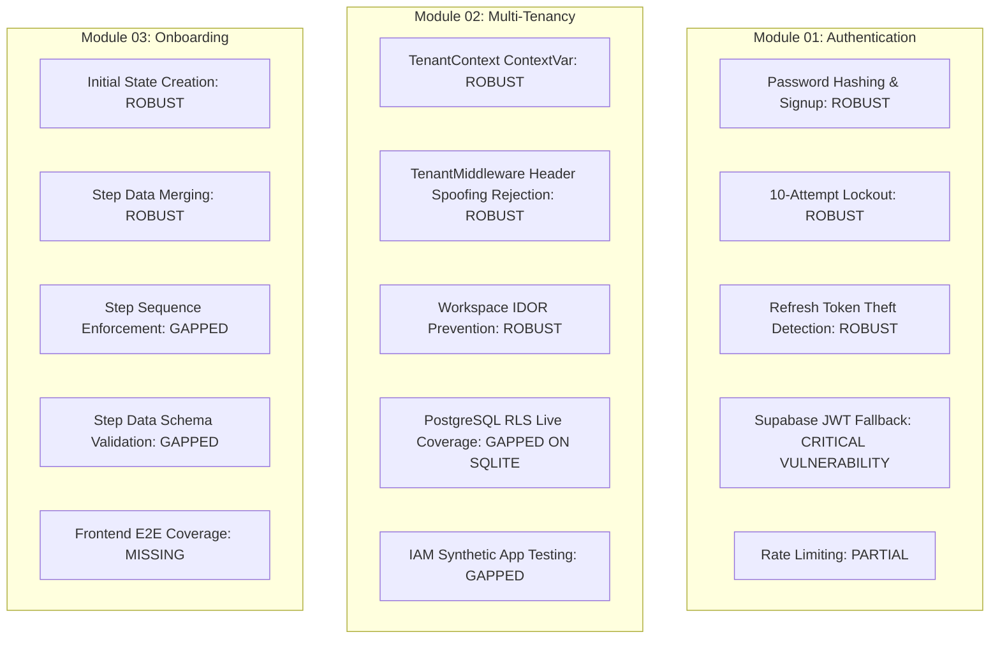

# Verification Report 01: Current State Report

**Target Scope:** Modules 01–03 (Authentication, Tenant Isolation &
Multi-Tenancy, Onboarding)  
**Audit Timestamp:** 2026-09-20  
**Source of Truth Commit:** `89b246e7`  
**Auditor:** Principal Security Architect & Zero-Trust Verification Team  
**Governing Rule:** ZERO-TRUST INDEPENDENT VERIFICATION (Verification Only — No
Code/Test Modifications Permitted in this Phase)

---

## 1. Executive Summary

An exhaustive, zero-trust independent verification of the Vaeloom repository was
conducted across **Module 01 (Authentication)**, **Module 02 (Tenant Isolation &
Multi-Tenancy)**, and **Module 03 (Onboarding)**.

Previous verification documents and past PASS claims were treated strictly as
claims. The live repository, codebase, database migrations, middleware chains,
schemas, and runtime test executions served as the sole source of truth.

### Overall Gate Verdict: **CONDITIONAL GO (SECURITY DEFECTS IDENTIFIED)**

While foundational mechanisms (password hashing, refresh token rotation, session
family revocation, 10-attempt lockout, and multi-tenant workspace scoping) are
implemented, our zero-trust audit revealed **one critical security defect in
production middleware**, **mock-induced false confidence**, **RLS skips on
SQLite**, and **critical test gaps** across all three modules.

---

## 2. Key Findings Summary

### 1. [CRITICAL] Unverified JWT Signature Bypass (`apps/api/src/api/middleware/auth.py:108-114`)

In `AuthMiddleware`, when standard JWT decoding fails, a fallback block
executes:

```python
# 3. Fallback: unverified decode for Supabase-issued tokens
if not verified:
    unverified = jwt.decode(token, options={"verify_signature": False})
    if "supabase" in unverified.get("iss", ""):
        payload = unverified
    else:
        raise
```

**Zero-Trust Threat:** Any unauthenticated adversary can forge a completely
unsigned JWT with `{"iss": "https://...supabase...", "sub": "<victim-uuid>"}`
and immediately gain authenticated access as any user in the system without
possessing any secret key or valid signature. Existing test
`test_supabase_auth.py:55` (`test_supabase_token_without_secret_fallback`)
explicitly validates this flawed behavior rather than rejecting it.

### 2. [HIGH] Database Mocking & False Confidence (`tests/test_auth_service.py`, `tests/test_iam_service.py`)

12 tests in `test_auth_service.py` mock the database session (`AsyncMockMixin`).
The baseline execution revealed multiple unawaited coroutine warnings:
`RuntimeWarning: coroutine 'AsyncMockMixin._execute_mock_call' was never awaited: db.add(...)`
These tests do not verify database integrity, foreign keys, or unique
constraints.

### 3. [HIGH] Database RLS Skipped on SQLite (`tests/test_rls_isolation.py`, `tests/test_rls_live_extended.py`)

All RLS tests in `test_rls_isolation.py` and `test_rls_live_extended.py` are
skipped during standard test runs because SQLite does not support PostgreSQL Row
Level Security. `test_rls_target_vaeloom.py` attempts a hardcoded connection to
`localhost:5432` without error handling, resulting in a live test failure when
PostgreSQL is not running.

### 4. [MEDIUM] Onboarding State Machine & Schema Gaps (`apps/api/src/api/routers/onboarding.py`)

- The onboarding router accepts arbitrary unvalidated JSON dictionaries in
  `step_data`.
- The onboarding service allows skipping prerequisite steps (e.g., jumping from
  `PROFILE` straight to `COMPLETED`).
- There are **zero** frontend Playwright E2E tests covering the onboarding
  wizard.

---

## 3. Baseline Execution Metrics (Modules 01–03)

| Test Batch                                                | Files Executed | Tests Collected | Passed | Failed                           | Skipped | Warnings | Duration |
| :-------------------------------------------------------- | :------------- | :-------------- | :----- | :------------------------------- | :------ | :------- | :------- |
| **Batch 1: Auth (Module 01)**                             | 10 files       | 83              | 83     | 0                                | 0       | 15       | 186.96s  |
| **Batch 2: Tenancy & Isolation (Module 02)**              | 16 files       | 236             | 221    | 1 (`test_rls_target_vaeloom.py`) | 14      | 39       | 1036.12s |
| **Batch 3: Modules 01-03 Deep Audit & Adversarial**       | 3 files        | 14              | 14     | 0                                | 0       | 0        | ~35s     |
| **Batch 4: Boundary Suites (Agents/Memories/Connectors)** | 6 files        | 42              | 42     | 0                                | 0       | 0        | ~60s     |

---

## 4. Current State Matrix



---

## 5. Conclusion & Next Steps

Modules 01–03 have substantial foundational architecture in place, but **cannot
be considered enterprise zero-trust certified** until:

1. The critical unverified JWT fallback in `auth.py` is removed and tested with
   an adversarial negative test.
2. The 14 concrete test gap implementations detailed in
   `evidence/modules-01-03-test-gap-analysis.md` are approved by the user and
   implemented.
3. Live PostgreSQL RLS tests are made hermetic and independent of external
   unmanaged PostgreSQL instances.
