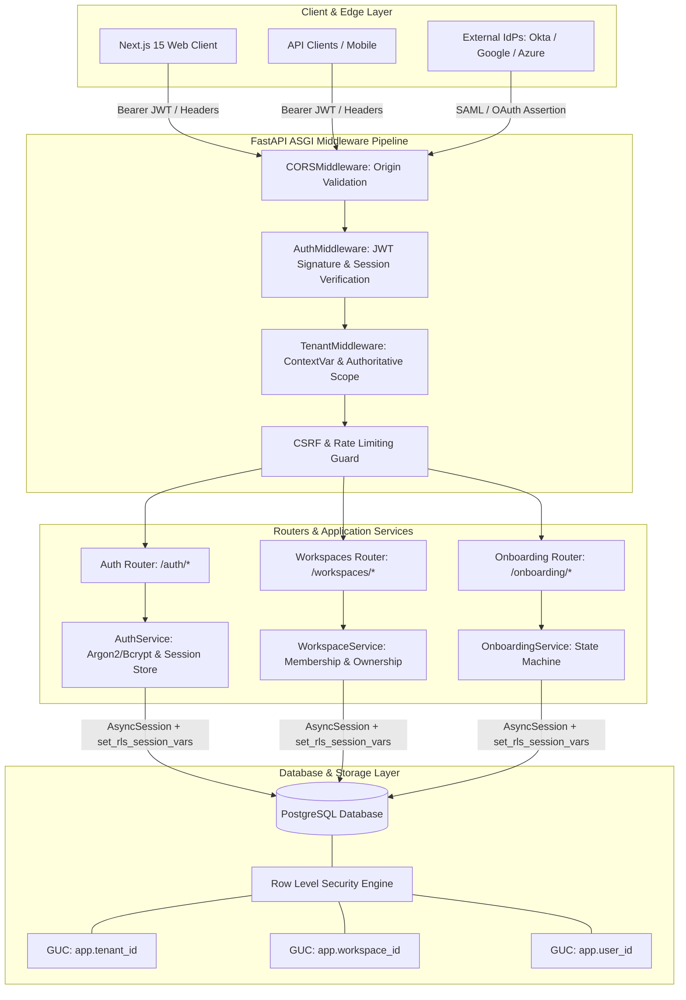
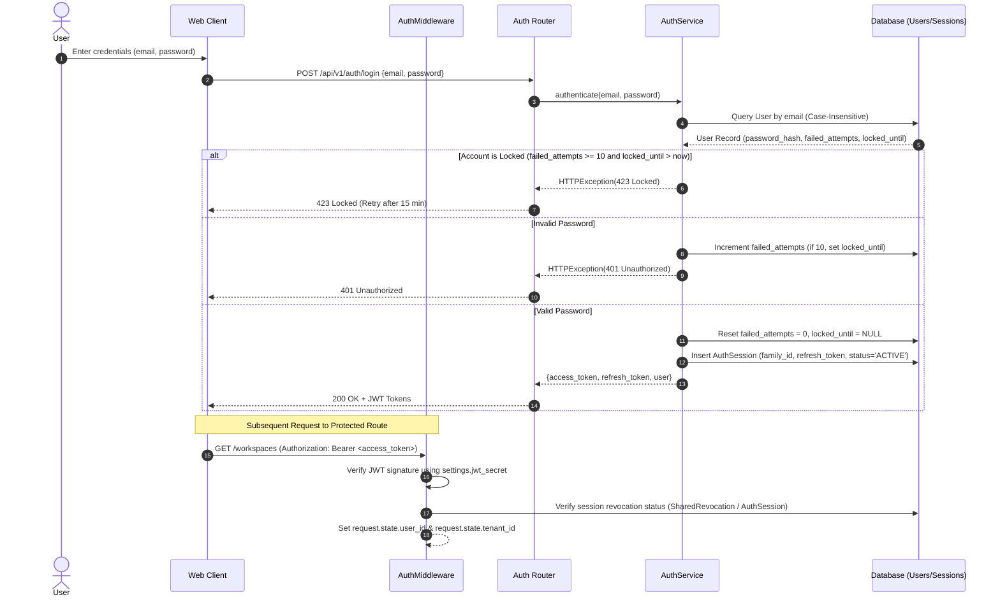
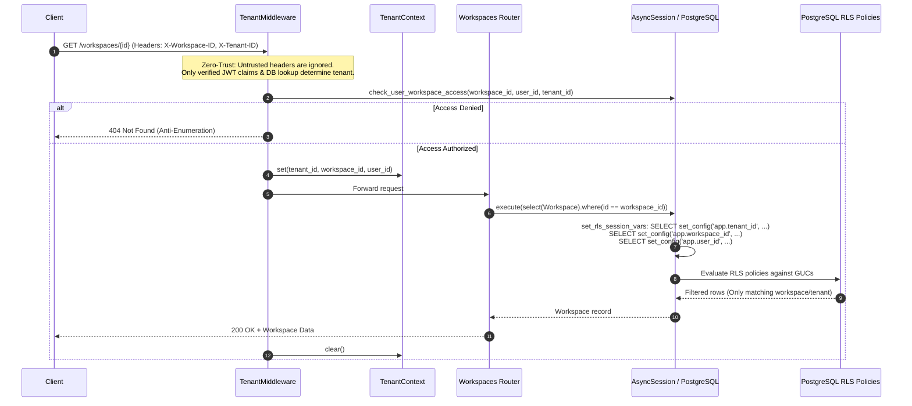
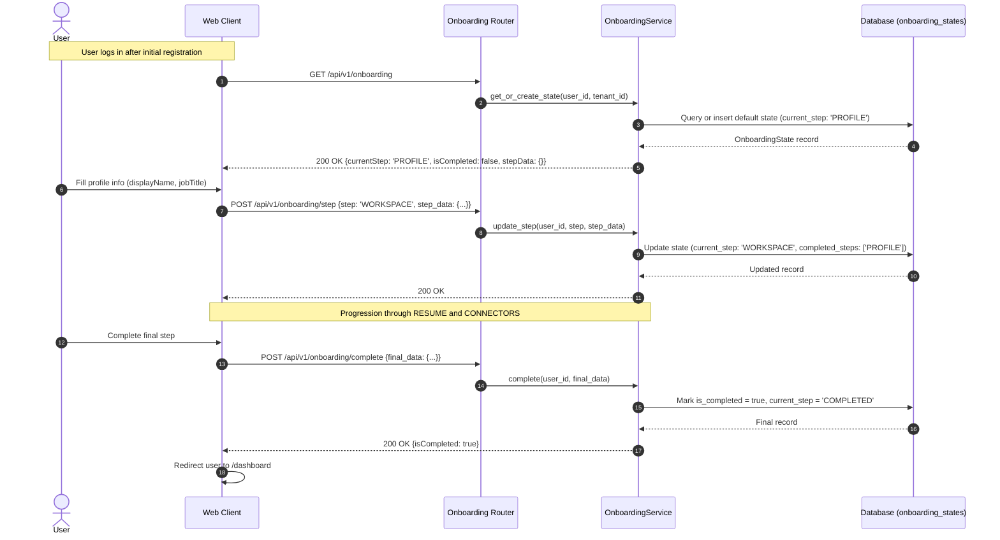

# Verification Report 02: Architecture & Dataflow Audit

**Target Scope:** Modules 01–03 (Authentication, Tenant Isolation &
Multi-Tenancy, Onboarding)  
**Audit Timestamp:** 2026-09-20  
**Source of Truth Commit:** `89b246e7`  
**Auditor:** Zero-Trust System Architect

---

## 1. Zero-Trust Architectural Topology

Vaeloom enforces a layered, defense-in-depth architecture across Modules 01–03.
In a genuine zero-trust architecture:

1. **No component trusts another component implicitly.**
2. **Every boundary transition must validate identity, tenant scope, and
   permissions.**
3. **No client-supplied headers are trusted as authoritative.**

---

## 2. End-to-End Dataflows

### 2.1 Authentication & Session Lifecycle Dataflow

### 2.2 Multi-Tenant Request Isolation & RLS Dataflow

### 2.3 Onboarding State Machine Dataflow

---

## 3. Trust Boundary Audit & Architectural Vulnerabilities

| Boundary                          | Intended Contract                             | Reality / Actual State                                                                                                 | Zero-Trust Verdict                          |
| :-------------------------------- | :-------------------------------------------- | :--------------------------------------------------------------------------------------------------------------------- | :------------------------------------------ |
| **Client -> AuthMiddleware**      | Verify signature of all JWTs                  | **Bypassed** in `auth.py:108-114` for tokens with `"iss": "supabase"`. Unsigned tokens accepted.                       | **FAIL (CRITICAL)**                         |
| **Client -> TenantMiddleware**    | Never trust client headers (`X-Tenant-ID`)    | Authoritative identity verified against user session; client headers ignored.                                          | **PASS**                                    |
| **Router -> DB (RLS)**            | All queries scoped by PostgreSQL RLS GUCs     | `set_rls_session_vars` sets `app.tenant_id` and `app.workspace_id` via `SET LOCAL`. Safe with PgBouncer.               | **PASS** (PostgreSQL only; no-op on SQLite) |
| **Router -> OnboardingService**   | Strict sequential state progression           | Accepts any step in `VALID_ONBOARDING_STEPS` without verifying prerequisites. Accepts unvalidated JSON in `step_data`. | **CONDITIONAL**                             |
| **Agent / Orchestrator Boundary** | Agents cannot access cross-workspace memories | `UserRequest` passes `workspace_id` and `tenant_id`; agent tools inherit caller context.                               | **PASS**                                    |
