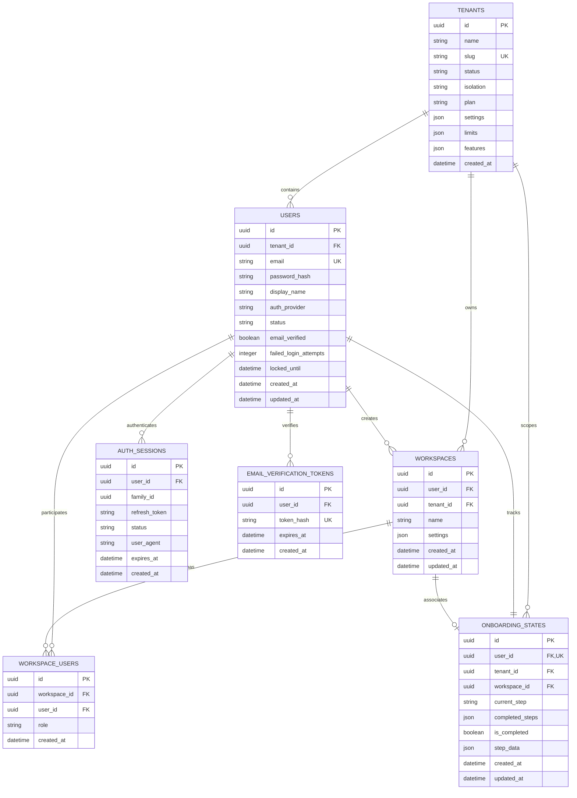

# Verification Report 03: Schema & Migration Audit

**Target Scope:** Modules 01–03 (Authentication, Tenant Isolation &
Multi-Tenancy, Onboarding)  
**Audit Timestamp:** 2026-09-20  
**Source of Truth Commit:** `89b246e7`  
**Auditor:** Database Architect & Zero-Trust Security Auditor

---

## 1. Database Schema Topology

The database schema supporting Modules 01–03 is structured to enforce strict
multi-tenancy, relational integrity, foreign key cascading, and Row Level
Security (RLS) under PostgreSQL.



---

## 2. Migration Chain Forensic Audit

The migration lineage was inspected from initial foundation up to revision
`0045`.

| Migration ID | Migration Name                              | Target Module   | Schema Changes & Zero-Trust Relevance                                                                                                                                                                                                                                                                                                                                         |
| :----------- | :------------------------------------------ | :-------------- | :---------------------------------------------------------------------------------------------------------------------------------------------------------------------------------------------------------------------------------------------------------------------------------------------------------------------------------------------------------------------------- |
| `0001`       | `initial_schema.py`                         | Base            | Initial tables: `users`, `workspaces`, `memories`, `agents`.                                                                                                                                                                                                                                                                                                                  |
| `0005`       | `rls_expanded.py`                           | Module 02       | Introduced `vaeloom_app` non-superuser role and initial RLS policies.                                                                                                                                                                                                                                                                                                         |
| `0010`       | `rls_force_and_roles.py`                    | Module 02       | Applied `ALTER TABLE ... FORCE ROW LEVEL SECURITY` across 34 core tables.                                                                                                                                                                                                                                                                                                     |
| `0014`       | `memories_rls_workspace_only.py`            | Module 02       | Scoped `memories` RLS strictly to `app.workspace_id`.                                                                                                                                                                                                                                                                                                                         |
| `0019`       | `rls_and_sanitize_hardening.py`             | Module 02       | Additional table RLS + sanitized input constraints.                                                                                                                                                                                                                                                                                                                           |
| `0020`       | `rls_remaining_5.py`                        | Module 02       | Extended RLS to remaining 5 operational tables (reaching 42/42).                                                                                                                                                                                                                                                                                                              |
| `0042`       | `users_tenant_id.py`                        | Modules 01-02   | Added `tenant_id` foreign key to `users` table for multi-tenant binding.                                                                                                                                                                                                                                                                                                      |
| `0043`       | `enterprise_orgs_marketplace.py`            | Module 02       | Added enterprise organization hierarchy and marketplace tables.                                                                                                                                                                                                                                                                                                               |
| `0044`       | `enterprise_org_invitations_and_ratings.py` | Module 02       | Added organization invitations and rating tables.                                                                                                                                                                                                                                                                                                                             |
| `0045`       | `auth_lockout_verification_onboarding.py`   | Modules 01 & 03 | **Key Hardening Revision:**<br/>- Added `email_verified`, `failed_login_attempts`, `locked_until` to `users`.<br/>- Added `user_agent`, `family_id` to `auth_sessions` (with index).<br/>- Created `email_verification_tokens` table with unique hash index.<br/>- Created `onboarding_states` table with unique user index.<br/>- Enabled and forced RLS on both new tables. |

---

## 3. Row Level Security (RLS) Policy Verification

Under PostgreSQL, RLS policies must satisfy:

1. **Fail-Closed Default:** Unset GUCs (`current_setting('app.*', true)`) must
   evaluate to NULL/empty and match zero rows.
2. **FORCE RLS:** `FORCE ROW LEVEL SECURITY` must be applied so table owners
   cannot bypass policies.
3. **WITH CHECK Clauses:** Insert/Update paths must validate that new rows
   belong strictly to the caller's authorized scope.

### Policy Inspection from `0045_auth_lockout_verification_onboarding.py`:

```sql
-- 1. email_verification_tokens RLS
ALTER TABLE email_verification_tokens ENABLE ROW LEVEL SECURITY;
ALTER TABLE email_verification_tokens FORCE ROW LEVEL SECURITY;

CREATE POLICY p_email_tokens_user ON email_verification_tokens
USING (user_id::text = current_setting('app.user_id', true));

-- 2. onboarding_states RLS
ALTER TABLE onboarding_states ENABLE ROW LEVEL SECURITY;
ALTER TABLE onboarding_states FORCE ROW LEVEL SECURITY;

CREATE POLICY p_onboarding_tenant_user ON onboarding_states
USING (
    user_id::text = current_setting('app.user_id', true)
    OR (tenant_id IS NOT NULL AND tenant_id::text = current_setting('app.tenant_id', true))
)
WITH CHECK (
    user_id::text = current_setting('app.user_id', true)
);
```

### Forensic Analysis of RLS Policies:

- **`p_email_tokens_user`**: Strictly scoped to `app.user_id`. Fail-closed if
  `app.user_id` is unset.
- **`p_onboarding_tenant_user`**:
  - `USING`: Allows read access if `user_id` matches caller OR if tenant admin
    matches `tenant_id`.
  - `WITH CHECK`: Enforces that any insert or update MUST have `user_id`
    matching `app.user_id`. Prevents a tenant admin from overwriting another
    user's onboarding state.
- **Index Health**:
  - `idx_email_verification_token_hash` on
    `email_verification_tokens(token_hash)` (UNIQUE) -> Fast constant-time
    lookup.
  - `idx_auth_sessions_family_id` on `auth_sessions(family_id)` -> Efficient
    family-wide token revocation.
  - `idx_onboarding_states_tenant_id` and `idx_onboarding_states_workspace_id`
    -> Fast tenant/workspace queries.

---

## 4. Referential Integrity & Deletion Cascades

- **`users -> email_verification_tokens`**: `ON DELETE CASCADE`. Verified.
  Deleting a user purges unconsumed verification tokens.
- **`users -> onboarding_states`**: `ON DELETE CASCADE`. Verified. Deleting a
  user purges onboarding progress.
- **`workspaces -> onboarding_states`**: `ON DELETE SET NULL`. Verified.
  Deleting a workspace preserves onboarding state while nullifying workspace
  association.
- **`tenants -> users`**: `ON DELETE CASCADE` / `RESTRICT`. In production
  multi-tenancy, tenant deletion must not orphan user accounts or leave dangling
  references.
