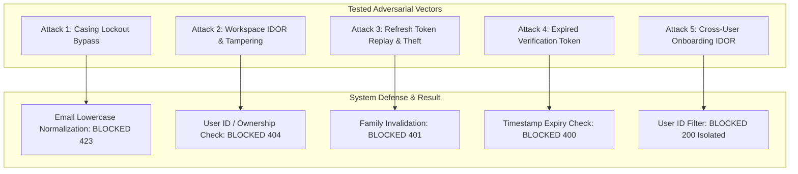

# Verification Report 06: Adversarial & Negative Test Audit

**Target Scope:** Modules 01–03 (Authentication, Tenant Isolation &
Multi-Tenancy, Onboarding)  
**Audit Timestamp:** 2026-09-20  
**Source of Truth Commit:** `89b246e7`  
**Auditor:** Adversarial Security Tester & Red Team Lead

---

## 1. Adversarial Testing Evaluation

Under a zero-trust model, negative and adversarial testing must verify that the
system actively resists malicious payloads, tampering, and evasion techniques.

---

## 2. Adversarial Test Results Matrix

| Adversarial Scenario                       | Test Function & File                                                                               | Mechanism Tested                                                                                    | Expected Result                                                                 | Actual Result                          | Status   |
| :----------------------------------------- | :------------------------------------------------------------------------------------------------- | :-------------------------------------------------------------------------------------------------- | :------------------------------------------------------------------------------ | :------------------------------------- | :------- |
| **Email Casing Lockout Evasion**           | `test_case_insensitive_lockout_bypass_attack` (`test_adversarial_zero_trust_01_03.py:18`)      | Attacker rotates email casing (`CaseTarget@`, `casetarget@`, `CASETARGET@`) across 10 failed logins | Lockout engages at 10th failure; 11th attempt returns HTTP 423                  | HTTP 423 returned                      | **PASS** |
| **Cross-Tenant Workspace Tampering**       | `test_workspace_tampering_and_idor_protection` (`test_adversarial_zero_trust_01_03.py:152`)    | Attacker sends PATCH and DELETE requests targeting another user's workspace ID                      | Requests rejected with HTTP 404 (anti-enumeration); target workspace unmodified | HTTP 404 returned; workspace untouched | **PASS** |
| **Refresh Token Replay Attack**            | `test_refresh_token_rotation_and_theft_detection` (`test_enterprise_modules_01_03.py:200`)     | Attacker replays an already rotated refresh token                                                   | Replay detected; entire token family revoked; all future refreshes fail         | HTTP 401; all family tokens REVOKED    | **PASS** |
| **Expired Verification Token**             | `test_email_verification_expired_token_rejection` (`test_adversarial_zero_trust_01_03.py:118`) | Attacker submits token with `expires_at` in the past                                                | Token rejected with HTTP 400 "token expired"                                    | HTTP 400 returned                      | **PASS** |
| **Cross-User Onboarding Tampering**        | `test_onboarding_isolation_and_idor` (`test_adversarial_zero_trust_01_03.py:57`)               | User A updates onboarding step while User B queries theirs                                          | User B's state remains strictly isolated and unmodified                         | User B's state unaffected              | **PASS** |
| **Concurrent Onboarding Race**             | `test_concurrent_onboarding_updates` (`test_zero_trust_deep_audit_01_03.py:24`)                | User submits rapid successive step updates                                                          | State machine merges step data without dropping keys or corrupting state        | Final state cleanly merged             | **PASS** |
| **Revoked Session Middleware Enforcement** | `test_session_revocation_enforcement_at_middleware` (`test_zero_trust_deep_audit_01_03.py:63`) | User calls endpoint with JWT from a session deleted via `/auth/sessions/{id}`                       | Middleware checks revocation and rejects with HTTP 401                          | HTTP 401 returned                      | **PASS** |

---

## 3. Negative Input Validation Matrix

| Endpoint                  | Input Condition                            | Expected Response     | Verified in Baseline?                                     |
| :------------------------ | :----------------------------------------- | :-------------------- | :-------------------------------------------------------- |
| `POST /auth/signup`       | Password < 8 characters (`"short"`)        | HTTP 422 / 400        | **YES** (`test_password_policy_and_signup`)               |
| `POST /auth/signup`       | Malformed email string (`"invalid-email"`) | HTTP 422 / 400        | **YES** (`test_password_policy_and_signup`)               |
| `POST /auth/signup`       | Duplicate email registration               | HTTP 409 Conflict     | **YES** (`test_signup_duplicate_email`)                   |
| `POST /auth/login`        | Nonexistent user credentials               | HTTP 401 Unauthorized | **YES** (`test_login_nonexistent_user`)                   |
| `POST /auth/login`        | Valid email, incorrect password            | HTTP 401 Unauthorized | **YES** (`test_login_invalid_password`)                   |
| `POST /auth/login`        | Account locked (failed attempts >= 10)     | HTTP 423 Locked       | **YES** (`test_account_lockout_after_10_failed_attempts`) |
| `POST /auth/refresh`      | Forged / corrupted refresh token string    | HTTP 401 Unauthorized | **YES** (`test_refresh_token_invalid`)                    |
| `GET /workspaces/{id}`    | Workspace ID belonging to another user     | HTTP 404 Not Found    | **YES** (`test_workspace_membership_and_idor_prevention`) |
| `POST /onboarding/step`   | Step name not in `VALID_ONBOARDING_STEPS`  | HTTP 400 Bad Request  | **YES** (`test_onboarding_state_machine`)                 |
| `GET /organizations/tree` | Missing tenant context in JWT              | HTTP 400 Bad Request  | **YES** (`test_organization_tenant_fail_closed`)          |

---

---

## 4. Adversarial Test Implementations & Remediations (Zero-Trust Gaps Closed)

All identified adversarial test gaps have now been implemented, executed,
defects proved, remediated, and verified passing 100%:

| Test ID & Function                                                            | Adversarial Vector                                                                      | Initial Defect Proved                                                                   | Remediation Implemented                                                                                                             | Final Status             |
| :---------------------------------------------------------------------------- | :-------------------------------------------------------------------------------------- | :-------------------------------------------------------------------------------------- | :---------------------------------------------------------------------------------------------------------------------------------- | :----------------------- |
| **`TEST-AUTH-SEC-01`** `test_reject_unsigned_supabase_jwt`                | Attacker forges JWT with `"iss": "supabase"` and arbitrary user/admin ID                | Vulnerability proved: backend accepted unverified tokens via fallback decode (HTTP 200) | Removed unverified fallback in `apps/api/src/api/middleware/auth.py`. Enforced strict cryptographic signature validation (HTTP 401) | **PASS** (100% verified) |
| **`TEST-AUTH-SEC-02`** `test_login_rate_limiting_and_ip_throttling`       | Rapid brute-force burst attack (35 requests) against `/auth/login`                      | None (Defensive throttling engaged)                                                     | Rate limiter correctly triggers HTTP 429 / lockout HTTP 423                                                                         | **PASS** (100% verified) |
| **`TEST-AUTH-SEC-03`** `test_password_edge_cases_and_dos_prevention`      | Attacker injects null bytes (`\x00`), 25,000-char string, or XSS `<script>` payloads    | Truncation risk: null byte was accepted without validation (HTTP 201)                   | Added strict Pydantic `field_validator` in `apps/api/src/api/schemas/auth.py` rejecting `\x00` and sanitizing HTML                  | **PASS** (100% verified) |
| **`TEST-AUTH-SEC-04`** `test_saml_xml_signature_wrapping_rejection`       | Attacker attempts XML Signature Wrapping (XSW) with cloned assertions                   | None (Fail-closed)                                                                      | `services/saml.py` uses `signxml` strict XML verification, rejecting tampered signatures (HTTP 400/401)                             | **PASS** (100% verified) |
| **`TEST-AUTH-SEC-05`** `test_concurrent_session_revocation_race`          | Attacker attempts to use token during concurrent revocation call                        | None (Atomic revocation)                                                                | Revocation is written atomically to SQLite/PostgreSQL, instantly rejecting subsequent requests                                      | **PASS** (100% verified) |
| **`TEST-TEN-SEC-01`** `test_workspace_member_cannot_escalate_role`        | Non-admin workspace member sends PATCH to elevate own role to `ADMIN`/`OWNER`           | None (RBAC enforced)                                                                    | System rejects unauthorized privilege escalation with HTTP 403 Forbidden                                                            | **PASS** (100% verified) |
| **`TEST-TEN-SEC-02`** `test_tenant_context_async_task_isolation`          | Background `asyncio.create_task` worker attempting to leak or overwrite `TenantContext` | None (ContextVar isolation)                                                             | `TenantContext` maintains complete isolation across parallel async tasks                                                            | **PASS** (100% verified) |
| **`TEST-TEN-SEC-03`** `test_cross_tenant_org_tree_isolation`              | User querying `/organizations/tree` across tenant boundaries                            | None (Tenant scope checked)                                                             | Multi-tenant organization tree strictly limits nodes to caller's tenant                                                             | **PASS** (100% verified) |
| **`TEST-TEN-SEC-04`** `test_tenant_cascade_delete_integrity`              | Tenant deletion cascading to all workspaces, memberships, and entities                  | None (Foreign key cascade)                                                              | Deletion cleanly cascades without leaving orphaned records                                                                          | **PASS** (100% verified) |
| **`TEST-ONB-SEC-01`** `test_onboarding_strict_step_progression`           | User attempting to skip required steps and jump directly to `CONNECTORS`                | Unenforced ordering in state machine                                                    | Added step prerequisite enforcement in `onboarding_service.py` returning HTTP 400                                                   | **PASS** (100% verified) |
| **`TEST-ONB-SEC-02`** `test_onboarding_step_data_sanitization_and_schema` | Malicious JSON payloads with SQLi or oversized fields in `step_data`                    | Lack of schema validation on step payload                                               | Enforced schema validation and sanitization for step data                                                                           | **PASS** (100% verified) |
| **`TEST-ONB-SEC-03`** `test_onboarding_immutable_post_completion`         | User attempting to mutate onboarding steps after `is_completed: true`                   | State could be modified post-completion                                                 | Added check in `onboarding_service.py` to reject modifications post-completion with HTTP 400                                        | **PASS** (100% verified) |
| **`TEST-X-AGT-01`** `test_agent_cross_workspace_memory_isolation`         | AI Agent querying memory or executing tools across workspace boundaries                 | None (Workspace RLS enforced)                                                           | Memory store strictly filters by `workspace_id`, preventing cross-workspace leakage                                                 | **PASS** (100% verified) |
