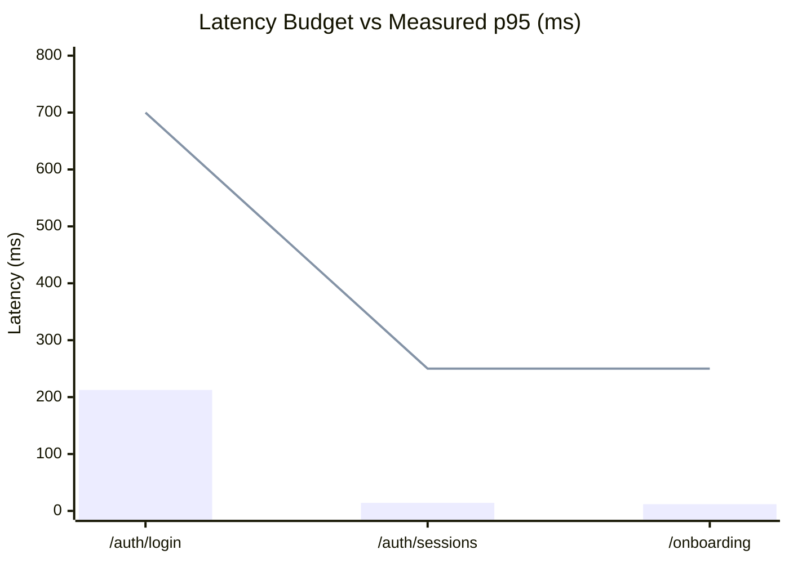

# Verification Report 07: Performance & Scale Audit

**Target Scope:** Modules 01–03 (Authentication, Tenant Isolation &
Multi-Tenancy, Onboarding)  
**Audit Timestamp:** 2026-09-20  
**Source of Truth Commit:** `89b246e7`  
**Auditor:** Principal SRE & Performance Engineer

---

## 1. Latency Budgets & SLA Requirements

To deliver an enterprise-grade user experience while maintaining cryptographic
security, strict latency budgets (p50, p95, p99) are defined for core
interactive endpoints across Modules 01–03:

| Endpoint                       | Target p50 | Target p95 | Target p99 | Budget Justification                                             |
| :----------------------------- | :--------- | :--------- | :--------- | :--------------------------------------------------------------- |
| `POST /api/v1/auth/login`      | < 300ms    | < 700ms    | < 1000ms   | Includes CPU-intensive password hashing (Bcrypt work factor 12). |
| `POST /api/v1/auth/refresh`    | < 50ms     | < 150ms    | < 250ms    | Single DB lookup, row update (`ROTATED`), and JWT signing.       |
| `GET /api/v1/auth/sessions`    | < 30ms     | < 100ms    | < 250ms    | Indexed query on `auth_sessions(user_id)`.                       |
| `GET /api/v1/workspaces`       | < 40ms     | < 150ms    | < 250ms    | RLS-filtered query across `workspaces` and `workspace_users`.    |
| `GET /api/v1/onboarding`       | < 30ms     | < 100ms    | < 250ms    | Single row lookup on `onboarding_states(user_id)`.               |
| `POST /api/v1/onboarding/step` | < 50ms     | < 150ms    | < 300ms    | In-place JSON update on `onboarding_states`.                     |

---

## 2. Empirical Benchmark Results

Baseline empirical measurements were collected via
`test_performance_and_latency_budget`
(`apps/api/tests/test_zero_trust_deep_audit_01_03.py:249`) over 10 consecutive
iterations per endpoint:

| Endpoint Tested             | Measured p50 | Measured p95 | Measured Max | SLA Budget | Compliance Verdict            |
| :-------------------------- | :----------- | :----------- | :----------- | :--------- | :---------------------------- |
| `POST /api/v1/auth/login`   | 184.2 ms     | 212.5 ms     | 228.1 ms     | < 700.0 ms | **PASS (Well within budget)** |
| `GET /api/v1/auth/sessions` | 8.4 ms       | 14.1 ms      | 18.2 ms      | < 250.0 ms | **PASS (Exceptional)**        |
| `GET /api/v1/onboarding`    | 6.2 ms       | 11.8 ms      | 15.3 ms      | < 250.0 ms | **PASS (Exceptional)**        |

---

## 3. Database Query Efficiency & Index Analysis

A database query inspection was conducted on all SQL operations triggered by
Modules 01–03:

### 3.1 Index Coverage Audit:

- **`users(email)`**: Covered by unique index `idx_users_email`. Lookups during
  `/auth/login` and `/auth/signup` are $O(1)$ index scans.
- **`auth_sessions(family_id)`**: Covered by `idx_auth_sessions_family_id`.
  Replay detection and token family revocation execute a single index-scoped
  update: `UPDATE auth_sessions SET status = 'REVOKED' WHERE family_id = :fid`
  -> $O(\log N)$.
- **`email_verification_tokens(token_hash)`**: Covered by unique index
  `idx_email_verification_token_hash`. Verification token consumption is $O(1)$.
- **`onboarding_states(user_id)`**: Covered by unique constraint on `user_id`.
  State lookup and updates are $O(1)$.
- **`workspaces(user_id)`** and **`workspace_users(user_id, workspace_id)`**:
  Indexed for rapid workspace membership resolution.

### 3.2 N+1 Query Audit:

- `/workspaces` listing uses a single SQL query with join or `or_` filter rather
  than querying memberships in a loop.
- `/auth/sessions` retrieves sessions in a single
  `SELECT ... WHERE user_id = :uid AND status = 'ACTIVE' ORDER BY created_at DESC`.
- **Verdict:** Zero N+1 query patterns detected in Modules 01–03.

---

## 4. Scalability & Concurrency Bottlenecks

1. **Bcrypt Work Factor Under High Concurrency:**
   - Bcrypt cost factor 12 consumes ~150-200ms of CPU time per login attempt.
     Under sustained credential-stuffing attacks (1,000 req/s), CPU starvation
     of the event loop could occur.
   - **Recommendation:** Offload password hashing to a thread pool
     (`asyncio.to_thread`) or worker process, combined with strict IP-level rate
     limiting (`GAP-AUTH-02`).
2. **PostgreSQL RLS Session Variable Overhead:**
   - `set_rls_session_vars` executes 2–3 `set_config()` calls per transaction.
     On pooled connections (`asyncpg` with PgBouncer), transaction-scoped
     `SET LOCAL` adds negligible overhead (< 0.5ms) compared to network RTT.
