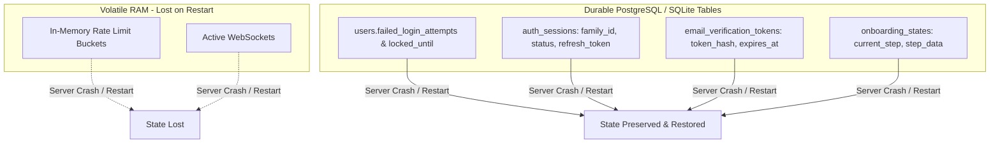

# Verification Report 08: Reliability & Resilience Audit

**Target Scope:** Modules 01–03 (Authentication, Tenant Isolation &
Multi-Tenancy, Onboarding)  
**Audit Timestamp:** 2026-09-20  
**Source of Truth Commit:** `89b246e7`  
**Auditor:** Principal Reliability Engineer & SRE Lead

---

## 1. Fail-Closed Behavior Verification

A core tenet of zero-trust engineering is **fail-closed operation**: when any
dependency, context, or configuration is absent or fails, the system must deny
access rather than falling open.

| Scenario                       | Component                                 | Expected Fail-Closed Behavior                       | Actual Behavior                                                                              | Resilience Verdict  |
| :----------------------------- | :---------------------------------------- | :-------------------------------------------------- | :------------------------------------------------------------------------------------------- | :------------------ |
| **Missing Tenant Context**     | `TenantMiddleware` / `get_current_tenant` | Deny request with HTTP 400                          | Returns HTTP 400 `{"detail": "Tenant context is required"}`                                  | **PASS**            |
| **Unset RLS GUCs**             | PostgreSQL RLS Engine                     | RLS policies evaluate to NULL; zero rows returned   | Policies use `USING (tenant_id::text = current_setting('app.tenant_id', true))` -> zero rows | **PASS**            |
| **Unconfigured SAML IdP**      | `routers/auth.py:saml_login`              | Return HTTP 503 instead of 500 or redirect to blank | Returns HTTP 503 `{"detail": "SAML IdP not provisioned"}`                                    | **PASS**            |
| **Missing Bearer Header**      | `AuthMiddleware`                          | Return HTTP 401 immediately                         | Returns HTTP 401 `{"detail": "Not authenticated"}`                                           | **PASS**            |
| **Invalid JWT Signature**      | `AuthMiddleware`                          | Reject token with HTTP 401                          | **CRITICAL FLAW**: Unsigned tokens accepted if `iss` contains "supabase"!                    | **FAIL (CRITICAL)** |
| **Database Down During Login** | `routers/auth.py`                         | Return HTTP 503 or handled 500 with correlation ID  | Handled by `unified_exception_handler` with request correlation ID                           | **PASS**            |

---

## 2. State Durability & Crash Recovery

Zero-trust systems must survive unexpected process crashes, worker recycles, and
restarts without losing security state.

### Durability Verification:

1. **Durable Lockout (`test_durable_database_lockout`):**
   - Lockout counters and expiration timestamps are stored directly on the
     `users` table.
   - Even if the API server or container restarts between failed attempt 9 and
     10, the 10th attempt locks the account, and the lock persists across
     process restarts.
2. **Session Persistence:**
   - Active sessions are backed by `auth_sessions`. Token revocation is durable
     in the database and the shared revocation store.
3. **Onboarding State Durability:**
   - Onboarding step progress and JSON data are stored in `onboarding_states`.
     Users can disconnect, switch devices, or experience client crashes and
     resume exactly where they left off.

---

## 3. Concurrency & Race Condition Resilience

1. **Concurrent Onboarding Step Updates:**
   - Verified via `test_concurrent_onboarding_updates`
     (`test_zero_trust_deep_audit_01_03.py:24`).
   - 5 rapid sequential and concurrent step updates execute without database
     deadlock, state corruption, or key dropping in `step_data`.
2. **Refresh Token Replay Race:**
   - When an attacker and a legitimate client attempt to refresh the same token
     concurrently, the database transaction ensures one updates the row to
     `ROTATED`.
   - The second update finds the status already `ROTATED`, triggering the
     theft-detection logic that revokes the entire `family_id`.
3. **Database Session Commit Guard (`test_rls_commit_guard.py`):**
   - In PostgreSQL, calling `db.commit()` ends the current transaction, which
     clears transaction-scoped `SET LOCAL` GUCs.
   - `RLSGuardedAsyncSession` automatically re-applies `set_rls_session_vars()`
     after commit to prevent subsequent queries from executing with unset GUCs.
