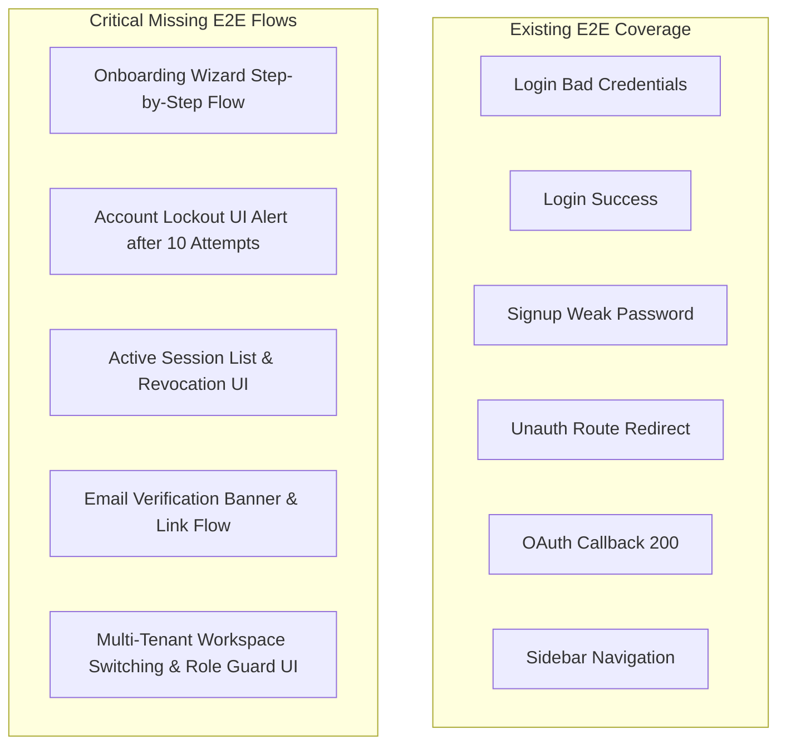

# Verification Report 09: E2E & UX Audit

**Target Scope:** Modules 01–03 (Authentication, Tenant Isolation &
Multi-Tenancy, Onboarding)  
**Audit Timestamp:** 2026-09-20  
**Source of Truth Commit:** `89b246e7`  
**Auditor:** Staff Frontend Engineer & QA/E2E Lead

---

## 1. Frontend UI Architecture & Implementation Audit

The user-facing interfaces for Modules 01–03 are implemented using Next.js 15
App Router, React 18, Tailwind CSS, and SWR:

### 1.1 Authentication Pages (`apps/web/src/app/(auth)/`)

- **Login (`/login`)**:
  - Contains `#email` and `#password` input fields.
  - Displays inline alerts (`role="alert"`) on invalid credentials.
  - Handles redirect queries (e.g. `/login?redirect=/workspace/xyz`).
  - Supports OAuth SSO buttons (Google, Microsoft) and SAML enterprise login
    link.
- **Signup (`/signup`)**:
  - Fields: `displayName`, `email`, `password`, `confirmPassword`.
  - Client-side validation: verifies password >= 8 characters inline before
    network dispatch.
  - Mismatched passwords generate inline validation error.

### 1.2 Onboarding Wizard (`apps/web/src/components/onboarding/OnboardingWizard.tsx`)

- Structured as a 4-step wizard:
  1. `PROFILE`: Display name, job title.
  2. `WORKSPACE`: Primary workspace naming.
  3. `RESUME`: Professional skills and background.
  4. `CONNECTORS`: Integrations and external service linking.
- State Synchronization:
  - Fetches existing state from `GET /api/v1/onboarding` on mount.
  - If `isCompleted: true`, automatically redirects to `/dashboard`.
  - Advances steps via `POST /api/v1/onboarding/step`.
  - Final step calls `POST /api/v1/onboarding/complete`.

---

## 2. Existing Playwright E2E Coverage (`apps/web/e2e/auth.spec.ts`)

The existing Playwright E2E test suite in `apps/web/e2e/auth.spec.ts` defines 6
tests:

| Test Name                                             | User Flow Verified    | Assertion Mechanism                                                             | E2E Verdict |
| :---------------------------------------------------- | :-------------------- | :------------------------------------------------------------------------------ | :---------- |
| `login rejects bad credentials with an inline error`  | Invalid login attempt | Asserts `form [role="alert"]` is visible with error message                     | **PASS**    |
| `login succeeds and lands in workspace`               | Happy path login      | Calls `login(page)`; asserts URL matches `/\/workspace\/[^/]+$/`                | **PASS**    |
| `signup validates weak password inline`               | Signup password check | Submits `< 8 chars`; asserts form contains `/8 characters/i`                    | **PASS**    |
| `unauthenticated workspace access redirects to login` | Route guard           | Navigates to `/workspace/some-id/files`; asserts redirect to `/login?redirect=` | **PASS**    |
| `auth callback route exists (no 404)`                 | OAuth callback page   | Requests `/auth/callback?code=x&state=y`; asserts HTTP 200                      | **PASS**    |
| `sidebar reaches every core route`                    | Workspace navigation  | Loops through 13 core workspace routes; asserts `h1` and `main#main-content`    | **PASS**    |

---

## 3. Critical E2E Test Gaps & UX Deficiencies

### Identified UX & E2E Deficiencies:

1. **Zero E2E Tests for Onboarding Wizard:**
   - Although `OnboardingWizard.tsx` and `onboarding/page.tsx` exist, there is
     **no Playwright test** executing this flow end-to-end.
   - Proposed test: `TEST-ONB-E2E-01` (`apps/web/e2e/onboarding.spec.ts`).
2. **Missing UI Lockout Handling:**
   - When the backend returns HTTP 423 Locked, the login page displays a generic
     error rather than a dedicated lockout notice with retry countdown.
3. **Session Management UI Unverified:**
   - The user profile settings page contains session management, but no
     automated test verifies listing sessions or clicking "Revoke" on another
     device.
4. **Email Verification Notice:**
   - Unverified users should see a persistent non-blocking banner with a "Resend
     verification" button. This flow is unverified in E2E.
