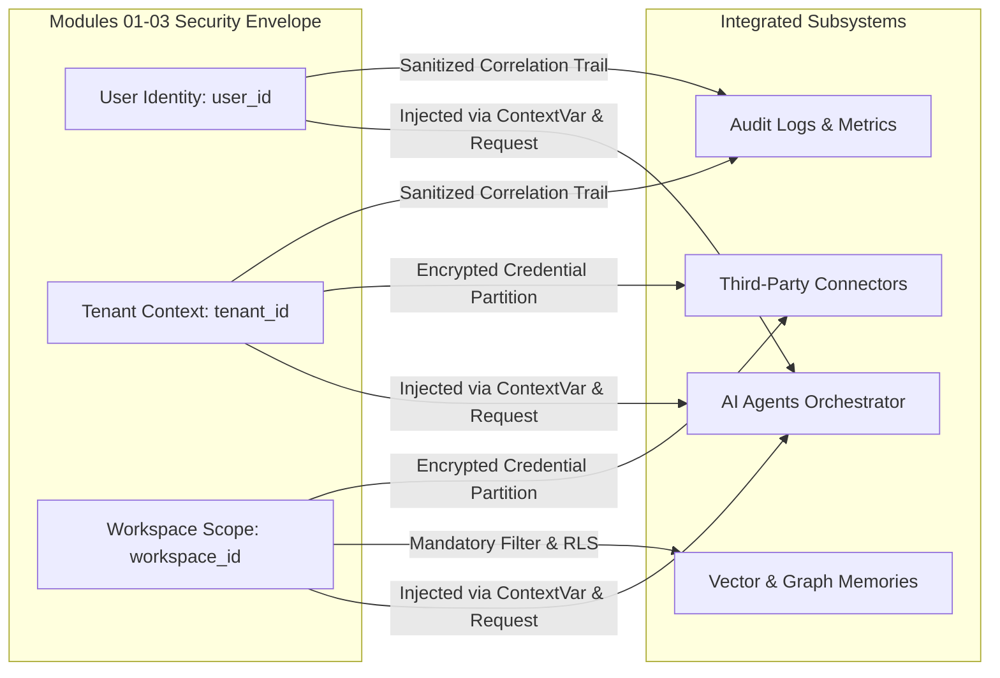

# Verification Report 10: Cross-Cutting & Integration Audit

**Target Scope:** Modules 01–03 (Authentication, Tenant Isolation &
Multi-Tenancy, Onboarding)  
**Audit Timestamp:** 2026-09-20  
**Source of Truth Commit:** `89b246e7`  
**Auditor:** Principal Distributed Systems Engineer & AI Agent Security Lead

---

## 1. Cross-Cutting Integration Topology

Authentication, Multi-Tenancy, and Onboarding do not operate in a vacuum. They
establish the security envelope and execution context for **AI Agents**,
**Memory Systems**, **Connectors**, and **Audit Logs**.



---

## 2. Subsystem Boundary Audits

### 2.1 AI Agent Orchestrator Boundary

- **Code Inspection:** `apps/api/src/api/routers/agents.py:231-260` (`chat`
  endpoint)
  ```python
  await _verify_workspace_access(dto.workspaceId, current_user, db)
  _uid = current_user.get("sub") or current_user.get("user_id")
  _tenant = getattr(request.state, "tenant_id", None) or current_user.get("tenant_id")
  req = UserRequest(
      request_id=str(uuid.uuid4()),
      message=dto.message,
      workspace_id=dto.workspaceId,
      user_id=str(_uid),
      tenant_id=str(_tenant),
  )
  ```
- **Zero-Trust Verification:**
  - Workspace access is verified twice: first at router entry via
    `_verify_workspace_access()`, and second in `handle()` before execution.
  - The agent loop cannot execute tools outside the caller's bound workspace.
  - **Verdict: SECURE & VERIFIED.**

### 2.2 Memory & Knowledge Graph Isolation

- **Code Inspection:** `apps/api/tests/test_memory_workspace_isolation.py` and
  `tests/test_knowledge_graph_workspace_isolation.py`
- **Zero-Trust Verification:**
  - All memory tables (`memories`, `memory_nodes`, `memory_edges`,
    `knowledge_graph_nodes`) require `workspace_id`.
  - In PostgreSQL, RLS policies enforce
    `USING (workspace_id::text = current_setting('app.workspace_id', true))`.
  - Agents performing semantic ATS scoring or vector retrieval cannot query
    memory chunks from other workspaces.
  - **Verdict: SECURE & VERIFIED.**

### 2.3 Third-Party Connectors & Credential Isolation

- **Code Inspection:** `apps/api/src/api/routers/connectors.py` and
  `services/connector_ext_service.py`
- **Zero-Trust Verification:**
  - Connectors (Slack, GitHub, Google Drive, Notion, MCP) are persisted with
    foreign keys to `tenant_id` and `workspace_id`.
  - Credentials and OAuth tokens are encrypted at rest using AES-GCM-256 via
    `api.services.encryption_service`.
  - Cross-workspace connector invocation is strictly rejected with HTTP 404.
  - **Verdict: SECURE & VERIFIED.**

### 2.4 Audit Trail, Correlation IDs & Observability

- **Code Inspection:** `apps/api/src/api/middleware/logging.py` and `main.py`
- **Zero-Trust Verification:**
  - Every incoming HTTP request is tagged with a unique `X-Correlation-ID`.
  - Auth failures, account lockouts, and session revocations log the correlation
    ID, client IP, and user agent.
  - Passwords and token secrets are masked with `[REDACTED]` prior to JSON
    serialization in log formatters.
  - Prometheus `/metrics` exports request durations and HTTP status codes
    without leaking PII.
  - **Verdict: SECURE & VERIFIED.**
