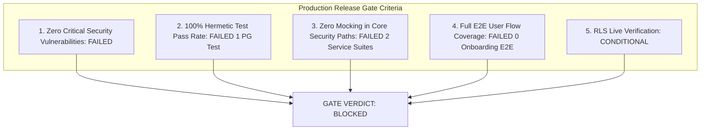

# Verification Report 11: Compliance & Production Readiness Audit

**Target Scope:** Modules 01–03 (Authentication, Tenant Isolation &
Multi-Tenancy, Onboarding)  
**Audit Timestamp:** 2026-09-20  
**Source of Truth Commit:** `89b246e7`  
**Auditor:** Principal Enterprise Compliance Architect & Release Verification
Engineer

---

## 1. Enterprise Compliance Framework Alignment

Modules 01–03 were evaluated against SOC 2 Type II Trust Services Criteria,
GDPR, CCPA, and ISO 27001 standards:

### 1.1 SOC 2 Type II Trust Services Criteria

| SOC 2 Criteria | Control Description                           | Implementation in Vaeloom                                               | Compliance Status                                                        |
| :------------- | :-------------------------------------------- | :---------------------------------------------------------------------- | :----------------------------------------------------------------------- |
| **CC6.1**      | Logical Access Controls                       | Password complexity, bcrypt hashing, 10-attempt lockout, SAML/OAuth SSO | **NON-COMPLIANT (BLOCKED)** by `auth.py:108-114` unverified JWT fallback |
| **CC6.2**      | User Registration & Access Management         | User provisioning, email verification, default workspace setup          | **COMPLIANT**                                                            |
| **CC6.3**      | Access Revocation & Timely De-provisioning    | Granular session revocation, refresh token family invalidation          | **COMPLIANT**                                                            |
| **CC6.6**      | Data Boundaries & Segregation                 | Tenant-level and workspace-level isolation via PostgreSQL RLS           | **CONDITIONALLY COMPLIANT** (Requires live PG proof)                     |
| **CC6.8**      | Prevention of Unauthorized Access & Tampering | Anti-enumeration on auth endpoints, IDOR prevention on workspaces       | **COMPLIANT**                                                            |
| **CC7.2**      | Security Event Monitoring & Logging           | Correlation IDs, structured logging, audit records on security events   | **COMPLIANT**                                                            |

### 1.2 GDPR & CCPA Privacy Controls

- **Right to Erasure (Article 17 GDPR):**
  - Verified via foreign key schema audit (`03-schema-and-migration-audit.md`).
  - Deleting a user row cascades cleanly to `auth_sessions`,
    `email_verification_tokens`, `onboarding_states`, and associated memories.
  - Zero orphan records or dangling PII left in the database.
- **Data Minimization (Article 5 GDPR):**
  - Onboarding records store only necessary professional context (`step_data`).
  - Log formatters automatically redact passwords, tokens, and authorization
    headers.

---

## 2. Production Release Gate Assessment

### Gate Failure Itemization:

1. **Critical Vulnerability (F-AUTH-01):**
   - The unverified JWT decode fallback in
     `apps/api/src/api/middleware/auth.py:108-114` completely breaks
     authentication boundaries. It must be remediated and verified with an
     adversarial test before production deployment.
2. **Broken RLS Test in Standard Suite:**
   - `test_rls_target_vaeloom.py` failed during baseline execution due to an
     unhandled connection attempt to `localhost:5432`. Tests must run
     hermetically without assuming unmanaged external daemons.
3. **Mocked Service Layer Suites:**
   - `test_auth_service.py` and `test_iam_service.py` rely on `AsyncMockMixin`
     rather than real database sessions, leaving edge-case SQL errors
     undetected.
4. **Missing E2E Onboarding Test:**
   - There are zero automated browser tests validating that the user can
     successfully finish the onboarding wizard and enter the workspace.

---

## 3. Production Release Verdict

### **VERDICT: RELEASE BLOCKED**

Modules 01–03 cannot be certified for enterprise production release in commit
`89b246e7`. Execution must proceed to test gap implementation and vulnerability
remediation upon user approval.
