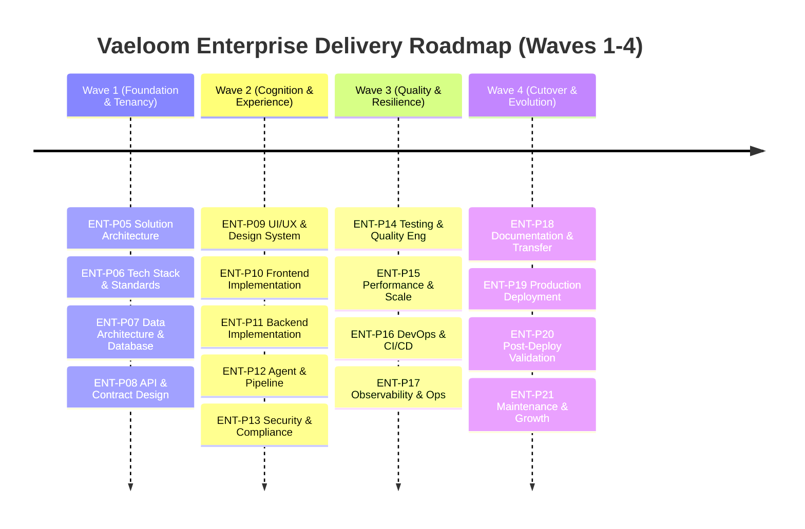

# ENT-P04 — 01 Integrated Roadmap — Enterprise Delivery Baseline

> **Phase:** `ENT-P04` (Project Planning and Delivery Governance)  
> **Deliverable:** `DEL-ENT-P04-01` (v1.0)  
> **Owner:** Program Delivery Director & Enterprise Product Manager  
> **Date:** 2026-09-29 | **Commit:** HEAD (`592db98e`)

---

## 1. Executive Roadmap Summary

The Vaeloom Enterprise Delivery Roadmap establishes the strategic execution path
across Phase `ENT-P05` through `ENT-P21`. Grounded in the requirements baseline
defined in `ENT-P03` and the forensic domain research of `ENT-P02`, this roadmap
organizes delivery into **four sequential, evidence-gated waves**. Each wave
culminates in an immutable stage gate, requiring a verified score $\ge 95.0/100$
and zero mandatory blockers before advancing downstream.

---

## 2. Four Phased Enterprise Delivery Waves

### Wave 1: Architectural Foundation & Multi-Tenant Core (Phases ENT-P05 – ENT-P08)

- **Primary Objective:** Establish the distributed multi-tenant cell
  architecture, typed contract specifications, database schema for the 22-memory
  type taxonomy, and SCIM/SSO protocol integration.
- **Phase Sequence:**
  - **`ENT-P05` (Solution Architecture):** Cell topology design, Global Control
    Plane routing, data residency boundary definitions, and C4 architectural
    models.
  - **`ENT-P06` (Tech Stack & Engineering Standards):** Monorepo build
    standards, linting/typing policies, SDK pinning, and secure coding
    baselines.
  - **`ENT-P07` (Data Architecture & Database Design):** Relational schema
    migration for 22 memory types, pgvector HNSW indexing, RLS policy
    enforcement, and temporal decay functions.
  - **`ENT-P08` (API Integration & Contract Design):** OpenAPI 3.2.0 generation,
    SCIM v2.0 endpoints, ATS connector MCP bridges, and event schemas.
- **Exit Milestone:** `M-W1-CORE` — Verified database migrations, schema
  contracts, and multi-tenant isolation proven on PostgreSQL 16.

### Wave 2: Experience, Cognitive Pipeline & Security Hardening (Phases ENT-P09 – ENT-P13)

- **Primary Objective:** Build out institutional advisor workspaces, implement
  the two-tier cognitive router (Jev S1 + Ollama Gemma 4 S2), harden zero-trust
  security, and certify candidate consent vaults.
- **Phase Sequence:**
  - **`ENT-P09` (UI/UX & Design System):** WCAG 2.1 AA accessible component
    primitives, advisor intervention queue views, and visual diff cards.
  - **`ENT-P10` (Frontend Implementation):** Next.js 15 App Router pages, SWR
    data fetching, WebSocket real-time event subscriptions, and responsive
    layout polish.
  - **`ENT-P11` (Backend Implementation):** FastAPI service endpoints, BullMQ
    background job processing, Redis queue management, and rate limiting.
  - **`ENT-P12` (AI Agent Memory & Data Pipeline):** 28-agent ReAct
    orchestration, 22-memory retrieval pipelines, XML context fencing, and
    circuit breaker fallbacks.
  - **`ENT-P13` (Security, Privacy & Compliance):** Cryptographic erasure (GDPR
    Art. 17), FERPA role enforcement, EU AI Act explainability audit logs, and
    red-team penetration testing.
- **Exit Milestone:** `M-W2-COGNITION` — Full cognitive document generation
  under 5000ms with zero cross-tenant memory leakage.

### Wave 3: Quality Engineering, Resilience & Operations (Phases ENT-P14 – ENT-P17)

- **Primary Objective:** Comprehensive test coverage, multi-region load testing,
  infrastructure-as-code automation, and distributed OpenTelemetry
  observability.
- **Phase Sequence:**
  - **`ENT-P14` (Testing & Quality Engineering):** Full monorepo integration
    test suites, fuzz testing, chaos fault injection, and automated Playwright
    E2E coverage.
  - **`ENT-P15` (Performance, Reliability & Scalability):** 1,000 concurrent
    candidate load testing, pgvector query profiling, and multi-cell disaster
    recovery drills.
  - **`ENT-P16` (DevOps, Infrastructure & CI/CD):** Terraform IaC for multi-cell
    cloud deployments, Docker image hardening, and SLSA v1.2 provenance
    attestation.
  - **`ENT-P17` (Observability & Operations):** Grafana dashboards, Prometheus
    alerting rules, OpenTelemetry trace propagation, and incident response
    runbooks.
- **Exit Milestone:** `M-W3-PRODUCTION-READY` — 99.95% uptime proven under peak
  load with p95 API response $\le 120\text{ ms}$.

### Wave 4: Release Cutover, Validation & Continuous Evolution (Phases ENT-P18 – ENT-P21)

- **Primary Objective:** Knowledge transfer, institutional customer pilot
  cutovers, post-deployment operational validation, and long-term evolutionary
  governance.
- **Phase Sequence:**
  - **`ENT-P18` (Documentation & Knowledge Transfer):** Administrator onboarding
    guides, advisor video playbooks, API reference portals, and compliance
    whitepapers.
  - **`ENT-P19` (Release Readiness & Production Deployment):** Blue/green
    production deployment, smoke validation, design-partner pilot cutover, and
    customer sign-off.
  - **`ENT-P20` (Post-Deployment Validation):** 30-day telemetry monitoring,
    SLI/SLO compliance verification, advisor satisfaction surveying, and bug
    remediation.
  - **`ENT-P21` (Maintenance & Continuous Improvement):** Quarterly cognitive
    model evaluation, cost optimization, memory pruning policies, and
    marketplace expansions.
- **Exit Milestone:** `M-W4-ENTERPRISE-GA` — Full General Availability
  certification for institutional university and outplacement clients.

---

## 3. Milestone Schedule & Delivery Dependencies

| Milestone ID   | Target Phase | Milestone Description                 | Critical Dependency  | Target Date |          Gate Condition           |
| :------------- | :----------: | :------------------------------------ | :------------------- | :---------: | :-------------------------------: |
| **M-04-PLAN**  |  `ENT-P04`   | Delivery Governance Baseline Approved | `ENT-P03` Full GO    | 2026-09-29  |   Score $\ge 95.0$, 0 blockers    |
| **M-05-ARCH**  |  `ENT-P05`   | Solution Architecture Approved        | M-04-PLAN            | 2026-10-06  |     Cell topology & C4 signed     |
| **M-08-API**   |  `ENT-P08`   | Contracts & Database Migrations Final | `ENT-P07`, `ENT-P06` | 2026-10-20  |  OpenAPI 3.2.0 & DB schema live   |
| **M-12-AI**    |  `ENT-P12`   | Cognitive Pipeline & 22 Memory Types  | `ENT-P08`, `ENT-P11` | 2026-11-10  |   Live Jev S1 + Gemma 4 proven    |
| **M-13-SEC**   |  `ENT-P13`   | Security & Privacy Certification      | `ENT-P12`            | 2026-11-17  |    Zero-trust & GDPR verified     |
| **M-15-SCALE** |  `ENT-P15`   | Multi-Cell Load & Resilience Pass     | `ENT-P14`            | 2026-12-01  | p95 $\le 120\text{ ms}$ at 1k RPS |
| **M-17-OPS**   |  `ENT-P17`   | Production Observability & Runbooks   | `ENT-P16`            | 2026-12-15  |      Prometheus/OTel active       |
| **M-19-PILOT** |  `ENT-P19`   | Production Cutover & Design Pilots    | `ENT-P18`, `ENT-P17` | 2027-01-12  |      Blue/Green live traffic      |
| **M-21-GA**    |  `ENT-P21`   | Enterprise Platform GA Certification  | `ENT-P20`            | 2027-02-15  |   30-day zero-defect telemetry    |

---

## 4. Governance & Steering Checkpoints

To ensure continuous executive alignment and risk oversight, the following
recurring governance cadence is established:

1. **Weekly Program Delivery Standup (PMO + Tech Leads):** Review phase
   workstreams, track velocity, review pull request queues, and triage emerging
   blockers.
2. **Bi-Weekly Architecture Review Board (ARB):** Review all proposed schema
   alterations, contract changes, and third-party integration adapters.
3. **Monthly Security & Compliance Council (CISO + DPO):** Audit access control
   logs, review privacy consent metrics, verify AI explainability logs, and
   inspect external dependency vulnerability reports.
4. **Phase Gate Approval Board:** Convened at the conclusion of each phase
   prompt to formally evaluate deliverables against the 12-category weighted
   scorecard (§28). Progression requires unanimous sign-off with veto retained
   by Security, Privacy, and Architecture leads.

_Signed: Program Delivery Director & Enterprise Product Manager — 2026-09-29_
