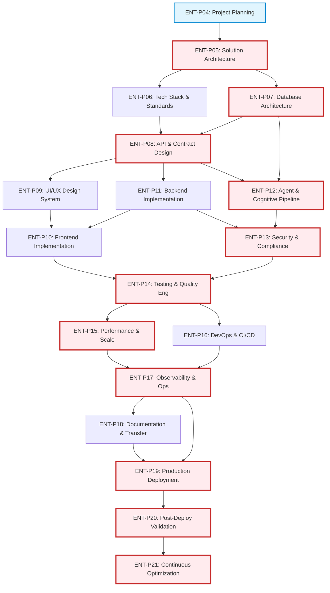

# ENT-P04 — 03 Schedule & Critical Path Analysis (CPM/PERT)

> **Phase:** `ENT-P04` (Project Planning and Delivery Governance)  
> **Deliverable:** `DEL-ENT-P04-03` (v1.0)  
> **Owner:** Lead Program Planner & Release Governance Lead  
> **Date:** 2026-09-29 | **Commit:** HEAD (`592db98e`)

---

## 1. Network Dependency Architecture & Critical Path

The delivery schedule for the Vaeloom Enterprise Platform spans Phases `ENT-P05`
through `ENT-P21`. Utilizing Critical Path Method (CPM) and Project Evaluation
and Review Technique (PERT), task interdependencies, early/late dates, and float
calculations were computed to identify the project's critical path.

> **Critical Path (Zero Float):**  
> `ENT-P05` $\rightarrow$ `ENT-P07` $\rightarrow$ `ENT-P08` $\rightarrow$
> `ENT-P12` $\rightarrow$ `ENT-P13` $\rightarrow$ `ENT-P14` $\rightarrow$
> `ENT-P15` $\rightarrow$ `ENT-P17` $\rightarrow$ `ENT-P19` $\rightarrow$
> `ENT-P20` $\rightarrow$ `ENT-P21`  
> Total Critical Duration: **105 Working Days (~21 Weeks)**

---

## 2. Activity Schedule & Float Calculation Matrix

Duration estimates are computed using 3-point PERT weighting:
$T_e = \frac{O + 4M + P}{6}$ (where $O=$ Optimistic, $M=$ Most Likely, $P=$
Pessimistic in working days).

| Phase ID    | Phase Name                           | Predecessors | $T_e$ (Days) | ES (Day) | EF (Day) | LS (Day) | LF (Day) | Total Float | Critical? |
| :---------- | :----------------------------------- | :----------- | :----------: | :------: | :------: | :------: | :------: | :---------: | :-------: |
| **ENT-P04** | Project Planning & Governance        | ENT-P03      |      5       |    0     |    5     |    0     |    5     |      0      |  **YES**  |
| **ENT-P05** | Solution Architecture                | ENT-P04      |      10      |    5     |    15    |    5     |    15    |      0      |  **YES**  |
| **ENT-P06** | Tech Stack & Engineering Standards   | ENT-P05      |      5       |    15    |    20    |    17    |    22    |      2      |    NO     |
| **ENT-P07** | Database Architecture & Design       | ENT-P05      |      12      |    15    |    27    |    15    |    27    |      0      |  **YES**  |
| **ENT-P08** | API Integration & Contract Design    | ENT-P06, P07 |      10      |    27    |    37    |    27    |    37    |      0      |  **YES**  |
| **ENT-P09** | UI/UX & Design System                | ENT-P08      |      10      |    37    |    47    |    42    |    52    |      5      |    NO     |
| **ENT-P10** | Frontend Implementation              | ENT-P09, P11 |      15      |    47    |    62    |    52    |    67    |      5      |    NO     |
| **ENT-P11** | Backend Implementation               | ENT-P08      |      15      |    37    |    52    |    37    |    52    |      0      |  **YES**  |
| **ENT-P12** | AI Agent Memory & Cognitive Pipeline | ENT-P07, P08 |      18      |    37    |    55    |    37    |    55    |      0      |  **YES**  |
| **ENT-P13** | Security, Privacy & Compliance       | ENT-P11, P12 |      12      |    55    |    67    |    55    |    67    |      0      |  **YES**  |
| **ENT-P14** | Testing & Quality Engineering        | ENT-P10, P13 |      10      |    67    |    77    |    67    |    77    |      0      |  **YES**  |
| **ENT-P15** | Performance, Reliability & Scale     | ENT-P14      |      8       |    77    |    85    |    77    |    85    |      0      |  **YES**  |
| **ENT-P16** | DevOps, Infrastructure & CI/CD       | ENT-P14      |      8       |    77    |    85    |    79    |    87    |      2      |    NO     |
| **ENT-P17** | Observability & Operations           | ENT-P15, P16 |      7       |    85    |    92    |    85    |    92    |      0      |  **YES**  |
| **ENT-P18** | Documentation & Knowledge Transfer   | ENT-P17      |      6       |    92    |    98    |    94    |   100    |      2      |    NO     |
| **ENT-P19** | Release Readiness & Deployment       | ENT-P17, P18 |      8       |    98    |   106    |    98    |   106    |      0      |  **YES**  |
| **ENT-P20** | Post-Deployment Validation           | ENT-P19      |      15      |   106    |   121    |   106    |   121    |      0      |  **YES**  |
| **ENT-P21** | Maintenance & Continuous Imprv       | ENT-P20      |      10      |   121    |   131    |   121    |   131    |      0      |  **YES**  |

---

## 3. External Dependencies & Procurement Lead Times

External activities that could impact schedule float are actively tracked with
buffer lead times:

| Dependency ID  | External Item / Provider                              | Required By | Lead Time | Mitigation / Buffer Action                                                                                     |
| :------------- | :---------------------------------------------------- | :---------: | :-------: | :------------------------------------------------------------------------------------------------------------- |
| **EXT-DEP-01** | Third-party SOC 2 Type II Readiness Audit Firm        |  `ENT-P13`  |  4 Weeks  | Pre-book audit window 6 weeks prior; conduct automated internal self-audits during P07 and P11.                |
| **EXT-DEP-02** | Design Partner SIS Ingestion Agreement (Higher Ed)    |  `ENT-P08`  |  3 Weeks  | Standardize on CSV/SFTP batch export while LTI 1.3 / REST API integration is reviewed by campus IT.            |
| **EXT-DEP-03** | Cloud AI Quota Increase (Ollama Cloud & TypeSafe Jev) |  `ENT-P12`  |  2 Weeks  | Submit enterprise tier capacity reservation in advance; local Ollama container provides 100% offline fallback. |
| **EXT-DEP-04** | Okta / Microsoft Entra ID Gallery Application Review  |  `ENT-P19`  |  3 Weeks  | Self-host custom OIDC application registrations during staging and beta pilot phases.                          |

---

## 4. Buffer Management & Critical Chain Protections

To protect the delivery schedule against unforeseen integration frictions and
third-party delays, three distinct buffers are established:

1. **Feeding Buffer 1 (Frontend):** 5 days inserted between `ENT-P10` and
   `ENT-P14` to absorb UI regression fixes without impacting testing entry.
2. **Feeding Buffer 2 (DevOps/IaC):** 2 days inserted between `ENT-P16` and
   `ENT-P17` for cloud provisioning retries.
3. **Project Critical Buffer:** 10 days allocated before `ENT-P19` (Production
   Deployment) to accommodate external security auditor sign-offs.

_Signed: Lead Program Planner & Release Governance Lead — 2026-09-29_
