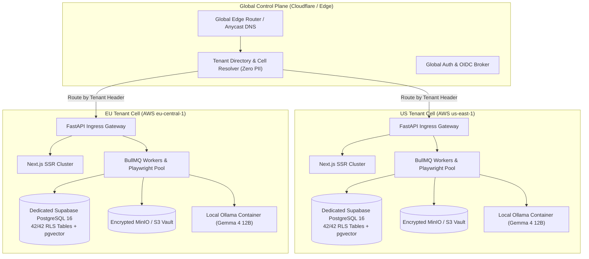

# ENT-P04 — 04 Architecture Framing — Delivery & Cutover Architecture

> **Phase:** `ENT-P04` (Project Planning and Delivery Governance)  
> **Deliverable:** Supporting Architecture Framing Specification  
> **Owner:** Chief Enterprise Architect & Platform Infrastructure Lead  
> **Date:** 2026-09-29 | **Commit:** HEAD (`592db98e`)

---

## 1. Multi-Tenant Cell Deployment Topology

To ensure strict data residency, isolation, and blast-radius containment, the
delivery plan provisions an architecture composed of a lightweight **Global
Control Plane** and multiple **Regional Tenant Cells** (US, EU, India).

---

## 2. Zero-Downtime Blue/Green Production Cutover

Production upgrades and database migrations follow a strict zero-downtime
blue/green deployment strategy:

1. **Parallel Ingress:** The production Kubernetes cluster runs two identical
   environments: Blue (Active) and Green (Staging/Candidate).
2. **Backward-Compatible Database Migrations (Expand/Contract Pattern):**
   - **Phase 1 (Expand):** New columns, tables, and RLS policies are added as
     nullable or default-valued. Existing application code continues to operate
     seamlessly.
   - **Phase 2 (Dual-Write / Deploy Green):** Green deployment is activated,
     writing to both old and new schema fields.
   - **Phase 3 (Traffic Cutover):** Edge load balancers shift 100% of tenant
     traffic to Green over a 5-minute canary window.
   - **Phase 4 (Contract):** Once telemetry confirms zero errors, deprecated
     columns or tables are retired in a subsequent maintenance cycle.
3. **Instant Automated Rollback:** If the green environment triggers more than
   0.1% 5xx errors or p95 latency exceeds 250ms during canary evaluation, the
   load balancer automatically reverts traffic to Blue within 15 seconds.

---

## 3. Feature Flagging & Progressive Rollout Architecture

Risky capabilities (such as new agent tools, external ATS connectors, or
high-volume PDF compilers) are gated behind fine-grained, database-backed
feature flags:

- **Flag Evaluation:** Scoped dynamically at the `tenant_id`, `cohort_id`, or
  `user_id` level via `features.py`.
- **Default State:** All experimental features default to `FALSE` (fail-closed).
- **Kill Switch Capabilities:** Every external connector or LLM integration
  includes an instantaneous kill switch that immediately falls back to safe
  cached heuristics without requiring code deployment or pod restart.
- **Audit Logging:** Every flag toggle is written to the immutable
  `audit_events` log with actor identity, previous value, new value, and
  timestamp.

---

## 4. Multi-Track Monorepo CI/CD Pipeline

To support concurrent work across MVP maintenance, migration continuity, and
enterprise tracks without collision:

1. **Isolated Nx Workspace Caches:** Next.js frontend builds and Python API test
   runs utilize isolated Nx caching boundaries.
2. **Mandatory Merge Verification:**
   - Pre-merge checks require 100% green pass on all unit tests, security
     suites, and Playwright E2E suites.
   - Changes touching database schemas must execute live migration checks
     against ephemeral PostgreSQL test containers.
3. **Supply Chain Provenance:** Every Docker container artifact is built with
   SLSA v1.2 provenance attestations and signed using Sigstore Cosign keys
   before being pushed to the enterprise registry.

_Signed: Chief Enterprise Architect & Platform Infrastructure Lead — 2026-09-29_
