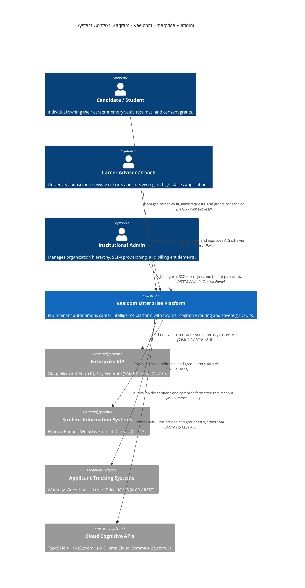
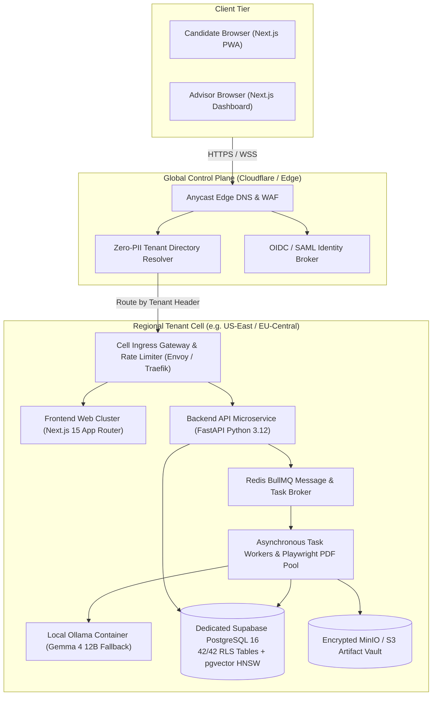
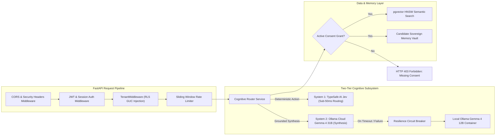
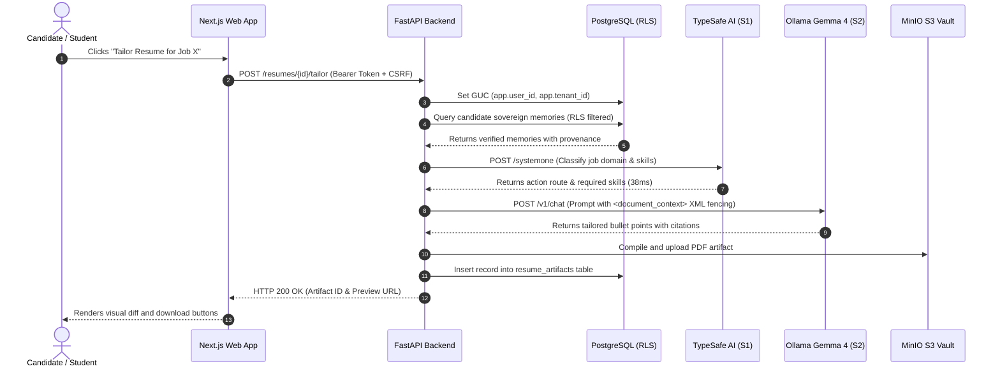
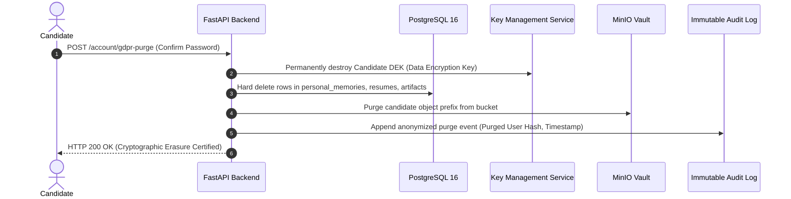

# ENT-P05 — 01 C4 Architecture, Trust Boundaries & Data Flow Models

> **Phase:** `ENT-P05` (Solution Architecture)  
> **Deliverable:** `DEL-ENT-P05-01` (v1.0)  
> **Owner:** Principal Enterprise Architect & Systems Design Board  
> **Date:** 2026-09-29 | **Commit:** HEAD (`592db98e`)

---

## 1. C4 Context Architecture Diagram (System in Scope)

The Vaeloom Enterprise Platform bridges individual candidates with educational
institutions and corporate employers while maintaining cryptographic candidate
data sovereignty.

---

## 2. C4 Container Diagram (Distributed Cell Architecture)

The system decomposes into a lightweight **Global Control Plane** and isolated
**Regional Tenant Cells** (US, EU, India).

---

## 3. C4 Component Diagram (Backend API & Cognitive Engine)

Inside the FastAPI backend service (`apps/api`), requests flow through strict
security and cognitive filters:

---

## 4. Trust Boundaries & Security Enclaves

Security is architected around five concentric security enclaves:

| Enclave Level | Enclave Name                          | Components Included                          | Security Controls Enforced                                                                                                            |
| :-----------: | :------------------------------------ | :------------------------------------------- | :------------------------------------------------------------------------------------------------------------------------------------ |
|  **Level 0**  | **Public Edge Enclave**               | Cloudflare Edge, Anycast DNS, Global WAF     | DDoS mitigation, TLS 1.3 termination, bot protection, zero PII retention.                                                             |
|  **Level 1**  | **DMZ Ingress Enclave**               | Cell Ingress Gateways, Next.js Web SSR       | Strict CORS, CSRF double-submit cookies, CSP headers, rate-limiting tokens.                                                           |
|  **Level 2**  | **Regional Application Enclave**      | FastAPI Services, BullMQ Workers             | Mutual TLS (mTLS) workload identity, non-root containers, read-only root filesystems.                                                 |
|  **Level 3**  | **Data & Memory Enclave**             | PostgreSQL 16 DB, pgvector, MinIO            | Database-level FORCE Row-Level Security (42/42 tables), AES-256 encryption at rest.                                                   |
|  **Level 4**  | **Candidate Sovereign Vault Enclave** | Candidate personal memories, resume raw text | **Candidate Sovereign Vault**: Encrypted per-user DEK (Data Encryption Key); zero institutional access without active `ConsentGrant`. |

---

## 5. End-to-End Data Flow Models

### Data Flow 1: Candidate Resume Tailoring & Consent Verification

### Data Flow 2: GDPR Article 17 Cryptographic Erasure

_Signed: Principal Enterprise Architect & Systems Design Board — 2026-09-29_
