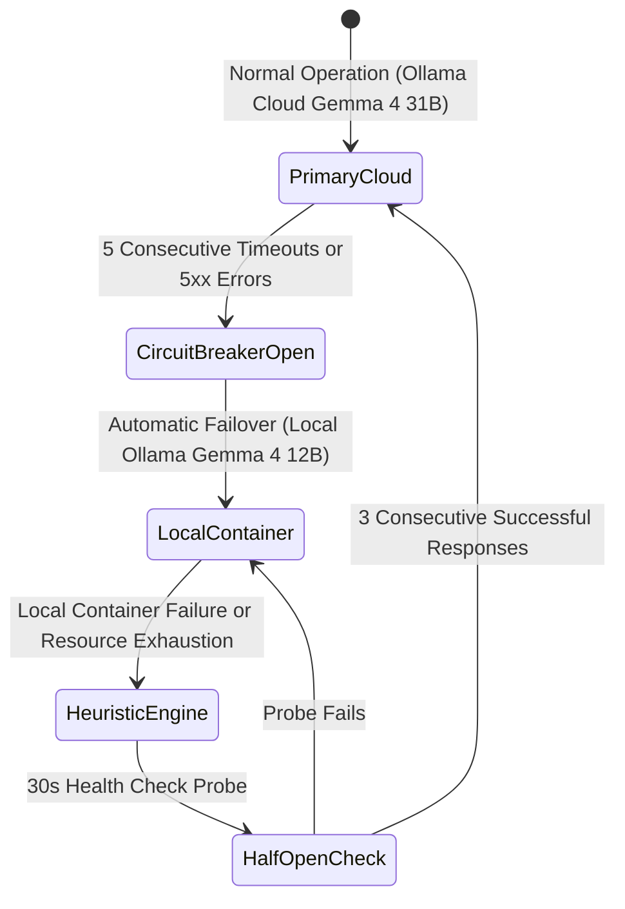

# ENT-P05 — 05 Failure Behavior, Resilience & Evolutionary Architecture

> **Phase:** `ENT-P05` (Solution Architecture)  
> **Deliverable:** `DEL-ENT-P05-05` (v1.0)  
> **Owner:** Principal Reliability Architect & SRE Lead  
> **Date:** 2026-09-29 | **Commit:** HEAD (`592db98e`)

---

## 1. Failure Modes & Graceful Degradation Taxonomy

The Vaeloom Enterprise Platform is engineered to maintain partial service
availability even during catastrophic upstream vendor or infrastructure outages:

| Component                     | Failure Mode                     | Trigger Condition                       | Graceful Degradation Behavior                                                                                 | User Impact                                                                   |
| :---------------------------- | :------------------------------- | :-------------------------------------- | :------------------------------------------------------------------------------------------------------------ | :---------------------------------------------------------------------------- |
| **System 2 Generative AI**    | Cloud API Outage (Ollama Cloud)  | 5 consecutive timeouts or 503 responses | Divert prompts immediately to local containerized Ollama (`gemma4:12b`); queue complex PDF styling for retry. | Subtle style simplification; tailoring completes within normal latency.       |
| **System 1 Decision Engine**  | TypeSafe AI Jev Endpoint Failure | HTTP 5xx or latency $>200\text{ ms}$    | Fallback to deterministic regex-based ATS keyword parser and cosine similarity gazetteer.                     | Routing continues with zero downtime; non-destructive actions proceed.        |
| **Playwright Rendering Pool** | Chromium OOM / Crash             | Container process termination           | Restart worker pool pod; fallback to python-docx compile or formatted HTML preview.                           | Candidate receives clean DOCX artifact with note that PDF is compiling.       |
| **Redis / Message Broker**    | Redis Broker Unavailability      | Connection refusal on port 6379         | Synchronous worker thread execution with rate-limit throttling to prevent thread exhaustion.                  | Asynchronous job queuing paused; interactive requests complete synchronously. |
| **PostgreSQL Read Replica**   | Database Read Replica Lag        | Replication lag $>5000\text{ ms}$       | Read queries fail over immediately to primary database cluster; alert SRE on-call.                            | Slight increase in primary DB CPU load; zero data staleness.                  |

---

## 2. Disaster Recovery (DR) & Business Continuity Targets

| Metric                             |       Target SLA        | Architecture & Recovery Mechanism                                                                                      | Verification Mechanism                                           |
| :--------------------------------- | :---------------------: | :--------------------------------------------------------------------------------------------------------------------- | :--------------------------------------------------------------- |
| **Recovery Time Objective (RTO)**  | $\le 15\text{ Minutes}$ | Multi-region automated DNS failover via Cloudflare Edge; Terraform IaC spins up standby cell pods.                     | Semi-annual chaos engineering disaster recovery drill.           |
| **Recovery Point Objective (RPO)** |  $\le 1\text{ Minute}$  | Continuous PostgreSQL Write-Ahead Log (WAL) streaming to multi-region S3 with automated Point-In-Time-Recovery (PITR). | Automated daily snapshot restoration checks to staging database. |
| **System Availability SLA**        |        $99.95\%$        | Multi-AZ Kubernetes pod redundancy (min 3 replicas across 3 availability zones); health-check auto-healing.            | Continuous synthetic probing via Prometheus and Grafana alerts.  |

---

## 3. Evolutionary Architecture & Long-Term Roadmap

The solution architecture is designed for modular evolution without requiring
breaking rewrites:

### A. Model & Provider Portability

- The cognitive interface decouples agent logic from specific model providers
  using generic completion adapters (`BaseLLMClient`).
- Switching or blending models (e.g. Anthropic Claude 3.7 Sonnet, OpenAI GPT-4o,
  DeepSeek V3, or Mistral Large) requires only adding a configuration profile in
  `services/llm_router.py` without touching agent state machines or tool
  contracts.

### B. Geographic Regional Expansion

- Adding new regional tenant cells (e.g. `cell-ap-southeast-1` in Singapore or
  `cell-eu-west-1` in Dublin) utilizes parameterized Terraform modules
  (`infra/terraform/cells/`).
- Regional cells operate autonomously with their own localized PostgreSQL
  databases and MinIO storage, ensuring immediate compliance with local data
  sovereignty laws.

### C. Agent Marketplace & Enterprise Plugin Ecosystem

- External partners will be permitted to publish governed MCP tools via an
  enterprise marketplace.
- Sandboxing protocols (ADR-036) isolate third-party connectors into ephemeral
  gVisor/Wasm containers with strictly monitored network egress and
  per-workspace permission toggles.

_Signed: Principal Reliability Architect & SRE Lead — 2026-09-29_
