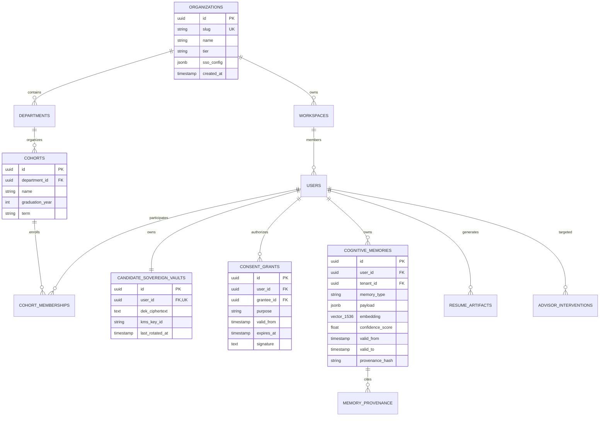

# ENT-P07 — 01 Data Models & Comprehensive Data Dictionary

> **Phase:** `ENT-P07` (Data Architecture and Database Design)  
> **Deliverable:** `DEL-ENT-P07-01` (v1.0)  
> **Owner:** Principal Data Architect & Lead Database Engineer  
> **Date:** 2026-09-29 | **Commit:** HEAD (`592db98e`)

---

## 1. Enterprise Entity-Relationship Architecture (ERD)

The enterprise data architecture strictly models institutional multi-tenancy,
academic cohort structures, candidate sovereign vaults, and the 22-memory type
cognitive graph:

---

## 2. The 22 Cognitive Memory Types Taxonomy

Every candidate memory stored in `cognitive_memories` is assigned one of the 22
standardized memory types, carrying explicit temporal validity windows and
provenance references:

| Category          | Memory Type Slug       | Description & Schema Definition                                                |   Temporal Default   |
| :---------------- | :--------------------- | :----------------------------------------------------------------------------- | :------------------: |
| **Experience**    | `work_history`         | Verified employment, positions, accomplishments, dates, and employers.         | Valid until updated  |
| **Experience**    | `project_artifacts`    | Personal/academic code repositories, portfolios, case studies, and live links. | Valid until updated  |
| **Experience**    | `writing_samples`      | Published articles, research papers, whitepapers, and technical essays.        |      Permanent       |
| **Education**     | `academic_records`     | Degree programs, universities, GPA (consented), coursework, and honors.        |      Permanent       |
| **Education**     | `certifications`       | Professional licenses, AWS/GCP certifications, and expiration dates.           | Dynamic (`valid_to`) |
| **Competencies**  | `skill_graph`          | Self-declared and inferred technical/soft skills with proficiency levels.      |   12 Months decay    |
| **Competencies**  | `assessment_scores`    | Standardized test scores, coding challenge results, and psychometric profiles. |   24 Months decay    |
| **Behavioral**    | `interview_responses`  | STAR-method stories, recorded behavioral interview transcripts, and answers.   |      Permanent       |
| **Behavioral**    | `recommendations`      | Letters of recommendation, supervisor quotes, and peer endorsements.           | Valid until updated  |
| **Preferences**   | `career_preferences`   | Desired job titles, remote/hybrid status, target compensation, and locations.  |    6 Months decay    |
| **Preferences**   | `target_companies`     | Tiered wishlist of dream employers and industry sectors.                       |    6 Months decay    |
| **Preferences**   | `professional_goals`   | 1-year and 5-year career objectives, mentorship goals, and learning tracks.    |   12 Months decay    |
| **Institutional** | `advisor_feedback`     | Counselor coaching notes, action plans, and milestone sign-offs.               |    Academic Year     |
| **Institutional** | `cohort_benchmarks`    | Anonymized percentile performance against university cohort milestones.        |   Term / Semester    |
| **Application**   | `tailored_resumes`     | Versioned LaTeX/HTML resume drafts compiled for specific job descriptions.     |       Snapshot       |
| **Application**   | `cover_letters`        | Company-specific personalized motivation and introductory letters.             |       Snapshot       |
| **Application**   | `application_pipeline` | Submitted applications, stages (Interview, Offer, Rejection), and follow-ups.  |   Active Pipeline    |
| **Market Data**   | `ats_match_history`    | Historical ATS match scores, missing keyword extractions, and radar scores.    |   Job Requisition    |
| **Market Data**   | `salary_negotiations`  | Offer compensation breakdowns, equity grants, and negotiation counters.        |    Offer Horizon     |
| **Network**       | `networking_contacts`  | Recruiters, alumni connections, mentors, and informational interview logs.     | Valid until updated  |
| **Agent State**   | `cognitive_reflection` | Multi-agent self-critique, trajectory planning logs, and goal decomposition.   |       30 Days        |
| **Agent State**   | `system_inferences`    | Latent semantic inferences derived from candidate document uploads.            |    90 Days decay     |

---

## 3. Comprehensive Data Dictionary (Core Tables)

### Table: `organizations`

- **Purpose:** Top-level multi-tenant enterprise customer container (University
  or Corporate Sponsor).
- **Columns:**
  - `id` (`UUID`, Primary Key, Default: `gen_random_uuid()`)
  - `slug` (`VARCHAR(64)`, Unique, Indexed): URL-friendly institutional
    identifier.
  - `name` (`VARCHAR(255)`, Not Null): Legal entity name.
  - `tier` (`VARCHAR(32)`, Default: `'enterprise'`): Subscription plan tier
    (`standard`, `enterprise`, `sovereign`).
  - `sso_config` (`JSONB`, Default: `'{}'`): SAML 2.0 metadata, entity ID, and
    SCIM bearer token hashes.
  - `status` (`VARCHAR(32)`, Default: `'active'`): Status (`active`,
    `suspended`, `deprovisioned`).
  - `created_at` (`TIMESTAMPTZ`, Default: `NOW()`)

### Table: `candidate_sovereign_vaults`

- **Purpose:** Cryptographic vault container enforcing candidate ownership over
  raw career records.
- **Columns:**
  - `id` (`UUID`, Primary Key, Default: `gen_random_uuid()`)
  - `user_id` (`UUID`, Foreign Key $\rightarrow$ `users.id`, Unique, Indexed):
    Sovereign candidate owner.
  - `dek_ciphertext` (`TEXT`, Not Null): AES-256 Data Encryption Key encrypted
    under cloud KMS master key.
  - `kms_key_id` (`VARCHAR(255)`, Not Null): Regional KMS key ARN / identifier.
  - `status` (`VARCHAR(32)`, Default: `'active'`): Vault status (`active`,
    `locked`, `purged`).
  - `last_rotated_at` (`TIMESTAMPTZ`, Default: `NOW()`)

### Table: `consent_grants`

- **Purpose:** Granular, cryptographically signed permissions authorizing
  institutional advisor access.
- **Columns:**
  - `id` (`UUID`, Primary Key, Default: `gen_random_uuid()`)
  - `user_id` (`UUID`, Foreign Key $\rightarrow$ `users.id`, Indexed): Candidate
    granting consent.
  - `grantee_id` (`UUID`, Foreign Key $\rightarrow$ `users.id`, Indexed):
    Institutional advisor receiving access.
  - `purpose` (`VARCHAR(64)`, Not Null): Purpose constraint (`career_coaching`,
    `application_review`, `audit`).
  - `valid_from` (`TIMESTAMPTZ`, Default: `NOW()`): Grant effective timestamp.
  - `expires_at` (`TIMESTAMPTZ`, Not Null): Grant expiration timestamp (max 180
    days).
  - `signature` (`TEXT`, Not Null): Cryptographic digital signature of candidate
    consent.

### Table: `cognitive_memories`

- **Purpose:** Relational and vector storage for candidate career facts across
  the 22 memory types.
- **Columns:**
  - `id` (`UUID`, Primary Key, Default: `gen_random_uuid()`)
  - `user_id` (`UUID`, Foreign Key $\rightarrow$ `users.id`, Indexed): Candidate
    owner.
  - `tenant_id` (`UUID`, Foreign Key $\rightarrow$ `organizations.id`, Indexed):
    Associated institutional tenant.
  - `memory_type` (`VARCHAR(64)`, Not Null, Indexed): One of the 22 approved
    memory slugs.
  - `payload` (`JSONB`, Not Null): Structured fact attributes, entities, and
    citations.
  - `embedding` (`VECTOR(1536)`, Indexed via HNSW): Dense vector embedding for
    semantic search.
  - `confidence_score` (`FLOAT`, Default: `1.0`): Cognitive extraction
    confidence ($0.0 - 1.0$).
  - `valid_from` (`TIMESTAMPTZ`, Default: `NOW()`): Fact activation timestamp.
  - `valid_to` (`TIMESTAMPTZ`): Fact invalidation or temporal decay timestamp.
  - `provenance_hash` (`CHAR(64)`, Not Null): SHA-256 hash of original source
    document.

_Signed: Principal Data Architect & Lead Database Engineer — 2026-09-29_
