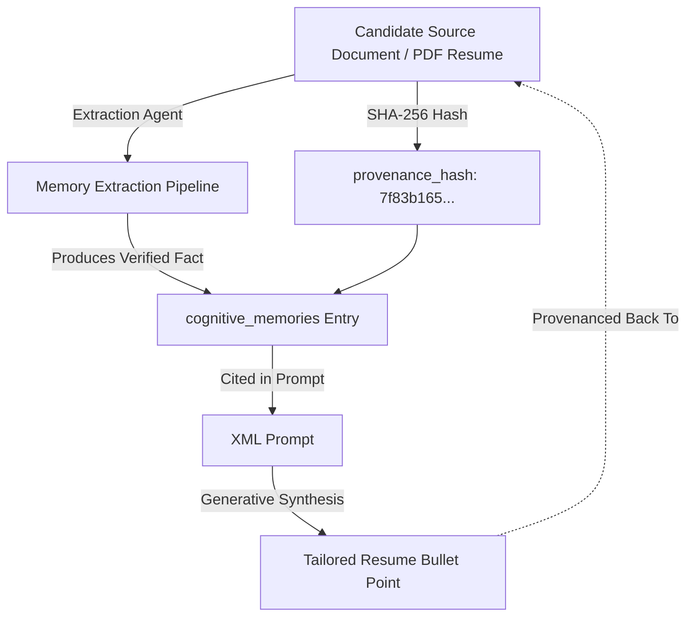
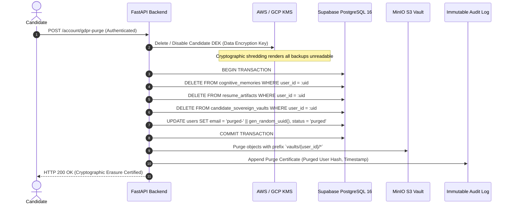

# ENT-P07 — 04 Data Provenance, Temporal Lifecycle & Cryptographic Erasure

> **Phase:** `ENT-P07` (Data Architecture and Database Design)  
> **Deliverable:** `DEL-ENT-P07-04` (v1.0)  
> **Owner:** Data Protection Officer (DPO) & Lead Data Governance Architect  
> **Date:** 2026-09-29 | **Commit:** HEAD (`592db98e`)

---

## 1. Data Provenance & Citation Graph Architecture

To comply with EU AI Act Annex III transparency requirements and prevent LLM
hallucinations, every fact stored in `cognitive_memories` carries immutable
provenance metadata linking it to authentic candidate source documents:



### Provenance Payload Structure (`payload.provenance`):

```json
{
  "source_artifact_id": "art_991823ab-e8d1-4122",
  "source_sha256": "7f83b1657ff1fc53b92dc18148a1d65dfc2d4b1fa3d677284addd200126d9069",
  "source_page_number": 2,
  "source_line_range": [45, 52],
  "extracting_agent": "CareerHistoryAgent",
  "extraction_model": "typesafe-jev-s1@v1.2",
  "extraction_timestamp": "2026-09-29T16:20:00Z"
}
```

---

## 2. Temporal Validity Windows & Exponential Decay Scoring

Candidate career facts evolve over time. To ensure that stale skills or outdated
career goals do not pollute future AI recommendations, memory queries
incorporate an exponential temporal decay function:

$$C(t) = C_0 \times e^{-\lambda \Delta t}$$ Where:

- $C_0$ is the initial confidence score ($0.0 - 1.0$).
- $\Delta t$ is elapsed time in months since `valid_from`.
- $\lambda$ is the decay constant calibrated per memory type.

| Memory Category                               | Half-Life ($t_{1/2}$) | Decay Constant ($\lambda$) | Invalidation Trigger                                                     |
| :-------------------------------------------- | :-------------------: | :------------------------: | :----------------------------------------------------------------------- |
| **Technical Skill (`skill_graph`)**           |       12 Months       |  $0.0577\text{ mo}^{-1}$   | Skill not referenced in recent project or work history within 12 months. |
| **Certifications (`certifications`)**         |      Hard Expiry      |            N/A             | Hard expiration when current timestamp exceeds `valid_to`.               |
| **Career Preferences (`career_preferences`)** |       6 Months        |  $0.1155\text{ mo}^{-1}$   | Explicit update in candidate settings or 6 months inactivity.            |
| **Target Companies (`target_companies`)**     |       6 Months        |  $0.1155\text{ mo}^{-1}$   | User modification or application submission closure.                     |
| **Academic Records (`academic_records`)**     |       Permanent       |          $0.0000$          | Permanent (historical record).                                           |
| **Work History (`work_history`)**             |       Permanent       |          $0.0000$          | Permanent (historical record).                                           |

---

## 3. GDPR Article 17 Cryptographic Erasure & Deletion Workflow

When a candidate requests account deletion under GDPR Article 17 ("Right to
Erasure") or India DPDP Section 12, the platform executes a comprehensive
cryptographic erasure workflow:



### Guarantees of Cryptographic Erasure:

1. **Irreversible Data Shredding:** Destroying the candidate's Data Encryption
   Key (DEK) ensures that even if encrypted database snapshots or tape backups
   persist in cold storage, the underlying candidate records cannot be
   decrypted.
2. **Cascading Row Removal:** Active transactional tables permanently remove
   candidate records via foreign key cascading rules (`ON DELETE CASCADE`).
3. **Audit Non-Repudiation:** The audit certificate contains only a
   cryptographic SHA-256 hash of the deleted user's ID, fulfilling compliance
   proof requirements without retaining personal data.

_Signed: Data Protection Officer (DPO) & Lead Data Governance Architect —
2026-09-29_
