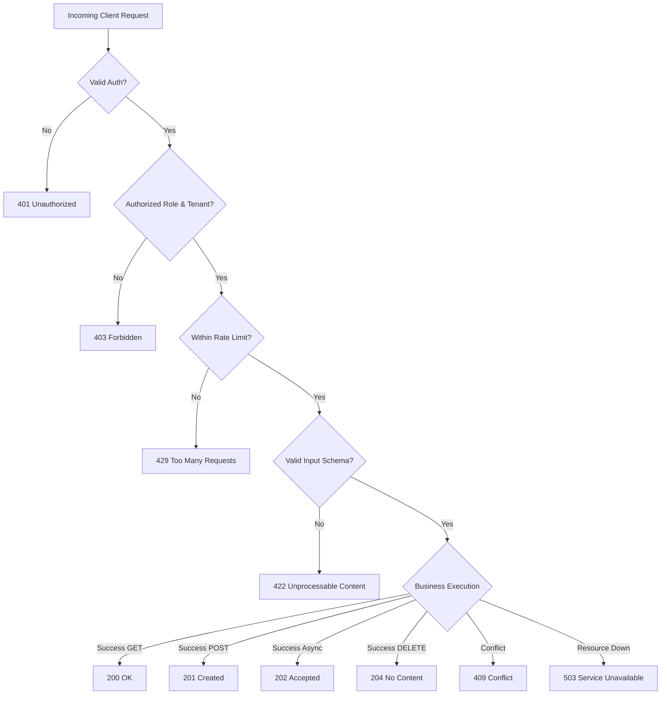

# ENT-P08 — 01 OpenAPI 3.2.0 Contract Architecture & Endpoint Topology

> **Phase:** `ENT-P08` (API Integration and Contract Design)  
> **Deliverable:** `DEL-ENT-P08-01` (v1.0)  
> **Owner:** Principal API Architect & Systems Integration Lead  
> **Date:** 2026-09-29 | **Commit:** HEAD (`592db98e`)

---

## 1. OpenAPI 3.2.0 Contract Architecture & Metadata

Vaeloom enforces strict, machine-readable API contracts across all microservices
using the OpenAPI 3.2.0 specification. Contracts are auto-generated from FastAPI
Pydantic v2 models and verified in CI to guarantee zero schema drift:

```yaml
openapi: 3.2.0
info:
  title: Vaeloom Enterprise Platform API
  version: 0.2.0
  description: >
    Governed Multi-Tenant Enterprise Career Orchestration Platform API. Enforces
    Row-Level Security, Sovereign Candidate Vaults, 28 Governed Agents, and
    Two-Tier Cognitive Architecture.
  contact:
    name: Vaeloom API Engineering
    email: api-governance@vaeloom.com
  license:
    name: Proprietary
servers:
  - url: https://api.vaeloom.com/v1
    description: Production Regional Gateway (Global Anycast)
  - url: https://api-staging.vaeloom.com/v1
    description: Staging Integration Gateway
  - url: http://127.0.0.1:8000
    description: Local Development & E2E Test Gateway
```

---

## 2. API Domain Routing & Endpoint Topology (241 Paths / 294 Operations)

The enterprise API surface is partitioned into 8 cohesive functional domains:

```
┌────────────────────────────────────────────────────────────────────────┐
│                        VAELOOM API GATEWAY (/v1)                       │
├────────────────────────────────────────────────────────────────────────┤
│  1. /auth          ── Authentication, PKCE OAuth, Session, MFA, CSRF   │
│  2. /workspaces    ── Multi-Tenant Workspaces, Roles, Team Invites     │
│  3. /resumes       ── Resume Builder, Tailoring, ATS Score, Artifacts  │
│  4. /agents        ── 28-Agent Invocations, ReAct Streams, HITL Queues │
│  5. /memories      ── 22-Type Cognitive Memory, HNSW Vector Queries    │
│  6. /connectors    ── Third-Party OAuth, Webhooks, MCP Server Bridges  │
│  7. /admin & /scim ── Institutional Control Plane, Audit, SCIM Sync    │
│  8. /billing       ── Entitlements, Quotas, Usage Meters, Invoicing    │
└────────────────────────────────────────────────────────────────────────┘
```

### Detailed Route Specifications:

#### A. Authentication & Identity (`/auth`)

| Method | Path                  | Auth Required  | Description                                                               |    Status Codes    |
| :----- | :-------------------- | :------------: | :------------------------------------------------------------------------ | :----------------: |
| `POST` | `/auth/login`         |      None      | Authenticates candidate or institutional user; issues JWT & CSRF cookies. | 200, 400, 401, 429 |
| `POST` | `/auth/register`      |      None      | Candidate registration and sovereign vault provisioning.                  | 201, 400, 409, 422 |
| `POST` | `/auth/refresh`       | Refresh Cookie | Rotates refresh token and issues new short-lived access JWT.              |   200, 401, 403    |
| `GET`  | `/auth/csrf-token`    |      None      | Issues cryptographically signed anti-CSRF double-submit token.            |        200         |
| `POST` | `/auth/mfa/challenge` |  Partial Auth  | Validates TOTP/WebAuthn second-factor challenge.                          |   200, 401, 429    |
| `POST` | `/auth/logout`        | Authenticated  | Revokes current session tokens and clears secure cookies.                 |      200, 401      |

#### B. Sovereign Resumes & Document Compilation (`/resumes`)

| Method | Path                                |  Auth Required   | Description                                                    |      Status Codes       |
| :----- | :---------------------------------- | :--------------: | :------------------------------------------------------------- | :---------------------: |
| `GET`  | `/resumes`                          | Workspace Member | Lists resumes scoped to active workspace.                      |      200, 401, 403      |
| `POST` | `/resumes`                          | Workspace Member | Creates structured resume instance with JSONB sections.        |   201, 400, 401, 403    |
| `GET`  | `/resumes/templates`                |       None       | Lists 5 standard industry resume templates.                    |           200           |
| `POST` | `/resumes/{id}/tailor`              | Workspace Member | AI agent tailoring with provenance citations and XML context.  |   200, 401, 403, 422    |
| `POST` | `/resumes/{id}/compile`             | Workspace Member | Playwright Chromium PDF / DOCX compilation with page-fit loop. | 200, 401, 403, 429, 503 |
| `GET`  | `/resumes/{id}/artifacts`           | Workspace Member | Lists binary artifacts generated for resume.                   |      200, 401, 403      |
| `GET`  | `/resumes/artifacts/{aid}/download` | Workspace Member | Streams binary PDF/DOCX artifact with disposition header.      |   200, 401, 403, 404    |

#### C. Cognitive Agents & Orchestration (`/agents`)

| Method | Path                            |  Auth Required   | Description                                                  |      Status Codes       |
| :----- | :------------------------------ | :--------------: | :----------------------------------------------------------- | :---------------------: |
| `POST` | `/agents/{slug}/run`            | Workspace Member | Dispatches task to named agent from 28-agent roster.         | 202, 400, 401, 403, 422 |
| `GET`  | `/agents/runs/{run_id}/stream`  | Workspace Member | Server-Sent Events (SSE) stream of ReAct reasoning thoughts. |   200, 401, 403, 404    |
| `GET`  | `/agents/approvals`             | Workspace Member | Lists pending Human-In-The-Loop (HITL) destructive actions.  |      200, 401, 403      |
| `POST` | `/agents/approvals/{id}/action` | Workspace Admin  | Approves or rejects gated destructive agent action.          | 200, 400, 401, 403, 404 |

#### D. Institutional Admin & SCIM Synchronization (`/admin` & `/scim/v2`)

| Method   | Path                  | Auth Required | Description                                                   | Status Codes  |
| :------- | :-------------------- | :-----------: | :------------------------------------------------------------ | :-----------: |
| `GET`    | `/admin/audit-logs`   | Tenant Admin  | Scoped search over immutable partitioned agent audit logs.    | 200, 401, 403 |
| `GET`    | `/scim/v2/Users`      |  SCIM Bearer  | RFC 7644 user directory search with pagination.               | 200, 401, 403 |
| `POST`   | `/scim/v2/Users`      |  SCIM Bearer  | Provisions new enterprise user account via IdP sync.          | 201, 400, 409 |
| `PUT`    | `/scim/v2/Users/{id}` |  SCIM Bearer  | Updates enterprise user profile attributes.                   | 200, 400, 404 |
| `DELETE` | `/scim/v2/Users/{id}` |  SCIM Bearer  | Deprovisions enterprise user; suspends organizational access. | 204, 401, 404 |
| `GET`    | `/scim/v2/Groups`     |  SCIM Bearer  | RFC 7644 group directory listing for RBAC role mapping.       | 200, 401, 403 |

---

## 3. Strict HTTP Status Code Semantics

Every API endpoint enforces standardized HTTP response semantics:



### Standardized Error Envelope:

All `4xx` and `5xx` responses adhere to RFC 7807 (Problem Details for HTTP
APIs):

```json
{
  "type": "https://api.vaeloom.com/errors/RESOURCE_LOCKED",
  "title": "Resource Locked by Concurrent Operation",
  "status": 409,
  "detail": "Resume res_99812 is currently undergoing active compilation.",
  "instance": "/resumes/res_99812/tailor",
  "correlation_id": "req_01J8ZX7K9A4B3C2D1E0F",
  "timestamp": "2026-09-29T16:30:00Z"
}
```

---

## 4. Contract Testing & Schema Verification in CI

To ensure zero drift between API contracts and code:

1. `scripts/gen_openapi.py` exports the active FastAPI OpenAPI schema to
   `specs/api/openapi.yaml`.
2. `spectral lint specs/api/openapi.yaml` validates adherence to OpenAPI 3.2.0
   style guides.
3. CI job fails if `git status --porcelain specs/api/openapi.yaml` detects
   uncommitted modifications.

_Signed: Principal API Architect & Systems Integration Lead — 2026-09-29_
