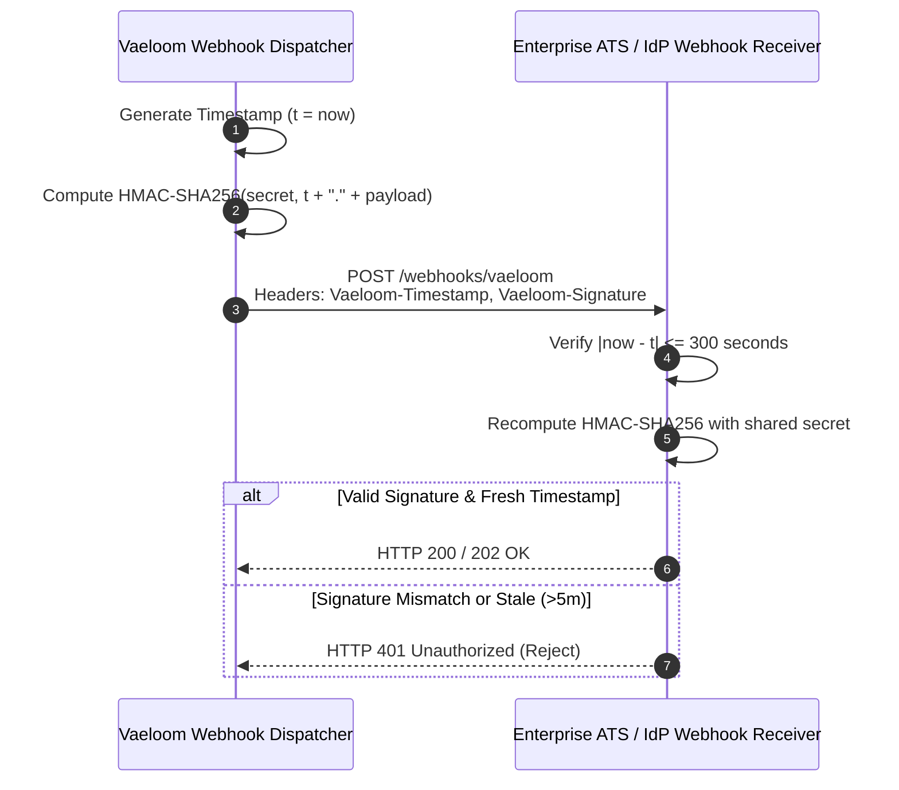
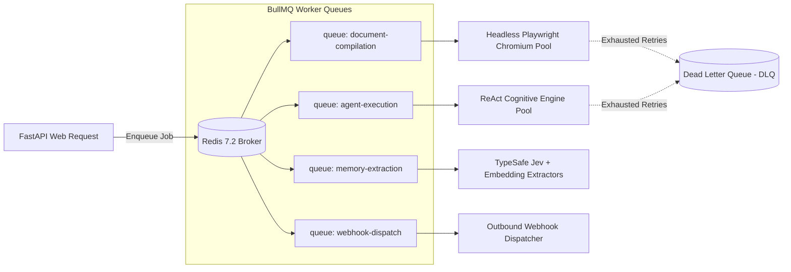

# ENT-P08 — 02 Event, Webhook & Async Job Schemas

> **Phase:** `ENT-P08` (API Integration and Contract Design)  
> **Deliverable:** `DEL-ENT-P08-02` (v1.0)  
> **Owner:** Lead Distributed Systems Engineer & Integration Architect  
> **Date:** 2026-09-29 | **Commit:** HEAD (`592db98e`)

---

## 1. Enterprise Event Catalog

Vaeloom publishes typed enterprise domain events conforming to CloudEvents v1.0
specifications. These events notify institutional systems, external ATS
integrations, and internal microservices of critical state transitions:

| Event Type (`type`)      | Subject Area | Trigger Condition                                        | Payload Summary                                        |
| :----------------------- | :----------- | :------------------------------------------------------- | :----------------------------------------------------- |
| `candidate.registered`   | Identity     | Candidate completes sovereign vault registration         | `user_id`, `sovereign_vault_id`, `timestamp`           |
| `resume.tailored`        | Resumes      | AI agent tailors resume against target job description   | `resume_id`, `job_id`, `provenance_citations_count`    |
| `resume.compiled`        | Artifacts    | PDF/DOCX page-fit compilation succeeds                   | `artifact_id`, `format`, `page_count`, `checksum`      |
| `agent.action_required`  | Governance   | Agent hits destructive boundary requiring human approval | `run_id`, `agent_name`, `tool_name`, `approval_id`     |
| `agent.action_completed` | Governance   | Gated action approved/rejected and executed              | `approval_id`, `verdict`, `executor_id`, `duration_ms` |
| `memory.extracted`       | Cognition    | Verified career fact extracted from candidate document   | `memory_id`, `memory_type`, `provenance_sha256`        |
| `audit.security_alert`   | SecOps       | Suspicious tenant boundary or SSRF attempt blocked       | `source_ip`, `tenant_id`, `violation_code`, `severity` |

---

## 2. Standard Webhook Delivery Protocol & Cryptographic Signatures

Outbound webhooks adhere to the Standard Webhooks specification, guaranteeing
payload integrity, authenticity, and replay prevention:



### Signature Header Format (`Vaeloom-Signature`):

```http
Vaeloom-Timestamp: 1727627400
Vaeloom-Signature: t=1727627400,v1=5d41402abc4b2a76b9719d911017c592384f937fe5d8eb87680a6cfcd12ff314
```

### Verification Algorithm (Pseudocode):

```python
import hmac
import hashlib
import time

def verify_webhook_signature(raw_payload: bytes, signature_header: str, secret: str) -> bool:
    # 1. Parse header parts
    parts = dict(item.split("=") for item in signature_header.split(","))
    timestamp = int(parts.get("t", 0))
    signature = parts.get("v1", "")

    # 2. Prevent replay attacks (max 5 minutes tolerance)
    if abs(time.time() - timestamp) > 300:
        return False

    # 3. Recompute expected signature
    signed_payload = f"{timestamp}.".encode("utf-8") + raw_payload
    expected = hmac.new(secret.encode("utf-8"), signed_payload, hashlib.sha256).hexdigest()

    # 4. Constant-time comparison
    return hmac.compare_digest(expected, signature)
```

### Retry Schedule & Circuit Breaker:

- **Exponential Backoff:** If consumer returns non-`2xx` or times out (5s SLA),
  retries occur at: **10s, 30s, 2m, 15m, 1h**.
- **Circuit Breaker:** 50 consecutive delivery failures automatically
  transitions the webhook subscription to `SUSPENDED` and triggers an email
  notification to the institutional administrator.

---

## 3. BullMQ Distributed Asynchronous Task Queue Architecture

Asynchronous, resource-heavy operations are processed via BullMQ 5.12 backed by
Redis 7.2:



### Queue Configurations:

| Queue Name             |  Concurrency  | Timeout |                  Priority Tiers                  |  Dead Letter Queue (DLQ)   |
| :--------------------- | :-----------: | :-----: | :----------------------------------------------: | :------------------------: |
| `document-compilation` | 4 per worker  |   30s   |    High (Candidate Tailor), Low (Bulk Export)    | `dlq:document-compilation` |
| `agent-execution`      | 8 per worker  |   60s   | High (Interactive Chat), Normal (Batch Research) |   `dlq:agent-execution`    |
| `memory-extraction`    | 12 per worker |   20s   |    Normal (Resume Upload), Low (Sync Import)     |  `dlq:memory-extraction`   |
| `webhook-dispatch`     | 20 per worker |   5s    |          Realtime (All Webhook Events)           |   `dlq:webhook-dispatch`   |

### Standard BullMQ Job Payload Envelope:

```json
{
  "job_id": "job_01J8ZY3M1A5B6C7D8E9F",
  "name": "compile_resume_pdf",
  "queue": "document-compilation",
  "data": {
    "tenant_id": "ten_881923ab",
    "workspace_id": "ws_110923ef",
    "user_id": "usr_449123bc",
    "resume_id": "res_998123cd",
    "template_id": "tmpl_executive_modern",
    "options": {
      "max_pages": 2,
      "color_scheme": "corporate_slate"
    }
  },
  "opts": {
    "attempts": 3,
    "backoff": {
      "type": "exponential",
      "delay": 2000
    },
    "removeOnComplete": true,
    "removeOnFail": false
  },
  "created_at": "2026-09-29T16:35:00Z"
}
```

---

_Signed: Lead Distributed Systems Engineer & Integration Architect — 2026-09-29_
