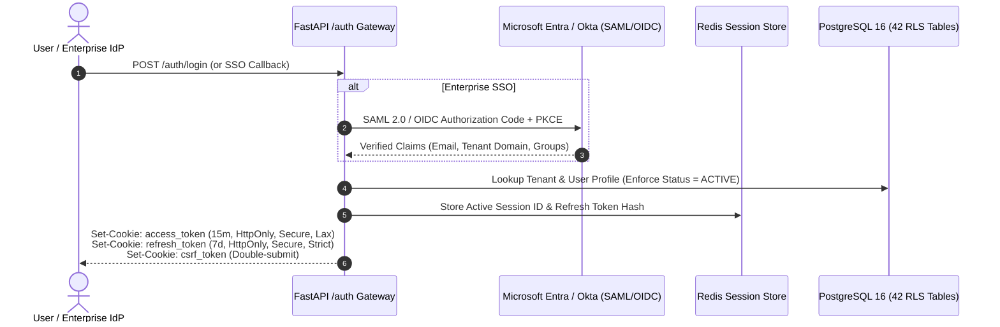
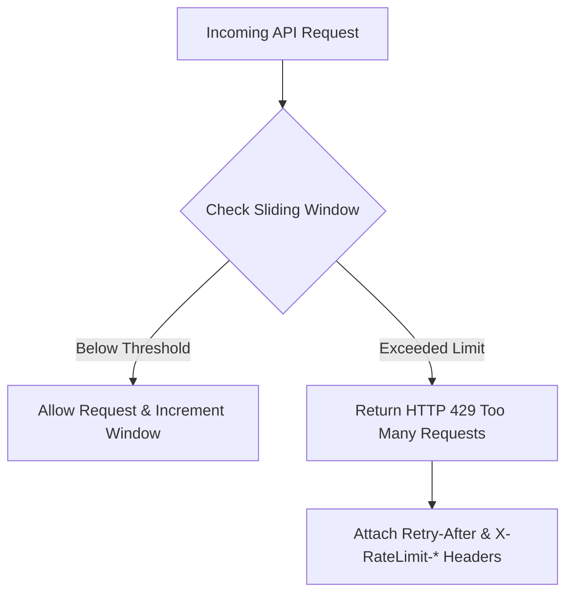

# ENT-P08 — 04 Multi-Tenant Authentication, Authorization & Rate Limiting

> **Phase:** `ENT-P08` (API Integration and Contract Design)  
> **Deliverable:** `DEL-ENT-P08-04` (v1.0)  
> **Owner:** Principal AppSec Lead & Identity Governance Architect  
> **Date:** 2026-09-29 | **Commit:** HEAD (`592db98e`)

---

## 1. Multi-Tenant Authentication & Token Lifecycle

Vaeloom enforces strict zero-trust identity verification across candidate users,
institutional administrators, and machine workloads:



### Key Token Parameters:

- **Access JWT:** 15-minute validity window signed with RS256. Payload contains
  `sub` (user_id), `tenant_id`, `workspace_id`, `roles`, and `scope`.
- **Refresh Token:** 7-day rolling validity stored as SHA-256 hash in Redis.
  Rotated upon every refresh call; reuse of a previous refresh token invalidates
  the entire session family immediately.
- **Double-Submit CSRF:** Cryptographically random 256-bit token issued via
  `/auth/csrf-token`; verified against `X-CSRF-Token` request header for all
  state-mutating HTTP methods (`POST`, `PUT`, `PATCH`, `DELETE`).

---

## 2. SCIM v2.0 Automated Enterprise Identity Provisioning

To enable zero-touch user lifecycle management from enterprise identity
providers (Microsoft Entra ID, Okta, PingFederate), Vaeloom implements RFC 7643
/ RFC 7644 SCIM v2.0 endpoints:

| Endpoint              |  Method  | RFC 7644 Specification      | Action Performed                                                       |
| :-------------------- | :------: | :-------------------------- | :--------------------------------------------------------------------- |
| `/scim/v2/Users`      |  `GET`   | Core Schema User Search     | Returns paginated list of enterprise users filtered by tenant ID.      |
| `/scim/v2/Users`      |  `POST`  | Core User Resource Creation | Provisions user in enterprise organization; sends invite email.        |
| `/scim/v2/Users/{id}` |  `GET`   | User Resource Retrieval     | Returns user SCIM attributes, active status, and group memberships.    |
| `/scim/v2/Users/{id}` |  `PUT`   | Full Resource Replacement   | Synchronizes user profile fields (name, email, title, department).     |
| `/scim/v2/Users/{id}` | `PATCH`  | Partial Modification        | Toggles user status (`active: false` suspends all active sessions).    |
| `/scim/v2/Users/{id}` | `DELETE` | Deprovisioning              | Suspends institutional access; initiates sovereign consent revocation. |
| `/scim/v2/Groups`     |  `GET`   | Group Resource Search       | Lists institutional groups mapped to Vaeloom workspace roles.          |

---

## 3. Role-Based & Contextual Attribute Access Control (RBAC + ABAC)

Authorization is enforced via dependency injection helpers in FastAPI coupled
with database Row-Level Security:

| Role Name                |  Scope Key   | Permitted Operations                                                            |      Sovereign Candidate Vault Access      |
| :----------------------- | :----------: | :------------------------------------------------------------------------------ | :----------------------------------------: |
| **`PlatformSuperAdmin`** |    Global    | Cross-cell infrastructure telemetry, billing overrides, system audits.          |        **DENIED** (0 rows via RLS)         |
| **`TenantAdmin`**        |    Tenant    | Manage enterprise organization, configure SCIM/SSO, view aggregate reports.     |        **DENIED** (0 rows via RLS)         |
| **`CareerAdvisor`**      |  Workspace   | View candidate resumes, review AI tailoring suggestions, submit notes.          | **GATED** (Requires active `ConsentGrant`) |
| **`Candidate`**          | User / Vault | Create, tailor, compile resumes; own 22-memory types; revoke consent.           |         **FULL SOVEREIGN ACCESS**          |
| **`ServiceAccount`**     |  M2M / API   | Machine-to-machine integration (scoped to declared webhook/export permissions). |   **DENIED** unless explicitly delegated   |

---

## 4. Tiered Sliding-Window Rate Limiting & Quotas

API abuse prevention and fair resource distribution are enforced via
Redis-backed sliding-window rate limiters:



### Entitlement Tier Thresholds:

| Tier Level               | General API Limits | Document Compilation Limits | AI Agent Invocations | Webhook Subscriptions |
| :----------------------- | :----------------: | :-------------------------: | :------------------: | :-------------------: |
| **Free / Candidate**     |    60 req / min    |     20 compiles / hour      |    30 runs / hour    |      2 endpoints      |
| **Institutional Pro**    |   600 req / min    |     200 compiles / hour     |   300 runs / hour    |     10 endpoints      |
| **Enterprise Dedicated** |  3,000 req / min   |    1,000 compiles / hour    |  1,500 runs / hour   |     50 endpoints      |

### Standard Rate Limit Response Headers:

```http
HTTP/1.1 429 Too Many Requests
Content-Type: application/problem+json
Retry-After: 34
X-RateLimit-Limit: 60
X-RateLimit-Remaining: 0
X-RateLimit-Reset: 1727627434
```

---

_Signed: Principal AppSec Lead & Identity Governance Architect — 2026-09-29_
