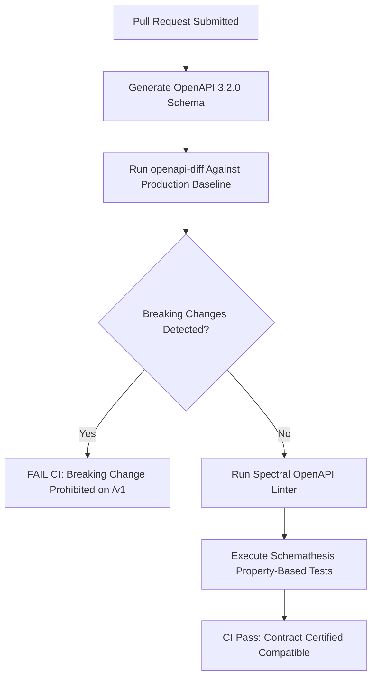

# ENT-P08 — 05 API Compatibility, Deprecation & Versioning Policy

> **Phase:** `ENT-P08` (API Integration and Contract Design)  
> **Deliverable:** `DEL-ENT-P08-05` (v1.0)  
> **Owner:** Principal API Standards Lead & Developer Experience Architect  
> **Date:** 2026-09-29 | **Commit:** HEAD (`592db98e`)

---

## 1. API Versioning Strategy & SemVer 2.0 Rules

Vaeloom adheres strictly to Semantic Versioning 2.0.0 across all public and
institutional API surfaces:

```
https://api.vaeloom.com/v{MAJOR}/{resource}
Example: https://api.vaeloom.com/v1/resumes
```

### Version Increment Classification:

| Change Type                 | Impact Description                                                           |     Version Action     | Example Scenario                                               |
| :-------------------------- | :--------------------------------------------------------------------------- | :--------------------: | :------------------------------------------------------------- |
| **Additive / Non-Breaking** | Adding optional fields, new query parameters, or new endpoints.              |     Minor / Patch      | Adding `job_match_score` optional field to resume response.    |
| **Bug Fix / Hardening**     | Fixing internal logic without modifying schema contracts.                    |         Patch          | Improving rate limiter sliding window accuracy.                |
| **Breaking Change**         | Removing fields, renaming fields, altering types, or adding required fields. | **MAJOR BUMP** (`/v2`) | Renaming `ats_score` to `semantic_score` or removing endpoint. |

---

## 2. 12-Month Enterprise Deprecation Lifecycle

Enterprise institutions rely on stable API contracts. Breaking changes require a
minimum 12-month formal deprecation notice:

```mermaid
chronology
    title 12-Month Enterprise API Deprecation Timeline
    0 Month : Formal Deprecation Announcement & RFC 8594 Sunset Headers Enabled
    3 Month : Targeted Outreach to Active Integrations Using Deprecated Endpoints
    6 Month : Brownout Drill 1 (15-Minute Synthetic 410 Gone Test on Staging)
    9 Month : Brownout Drill 2 (1-Hour Synthetic 410 Gone Test on Staging)
    11 Month : Final Critical Notification to Tenant IT Administrators
    12 Month : Formal Sunset: Endpoint Permanently Removed (Hard 410 Gone)
```

### Deprecation Notification Protocol:

1. **RFC 8594 HTTP Response Headers:** Every request to a deprecated route
   automatically returns standard sunset headers:
   ```http
   Deprecation: @1727627400
   Sunset: Wed, 30 Sep 2027 00:00:00 GMT
   Link: <https://docs.vaeloom.com/api/deprecations/v1-legacy-ats>; rel="sunset"
   ```
2. **Dashboard & Telemetry Alerts:** Institutional tenant admins receive weekly
   digest summaries listing API keys or integrations invoking deprecated
   endpoints.

---

## 3. Automated Contract Testing & Breaking Change Prevention in CI

To prevent accidental breaking changes from reaching production, CI runs
automated backward-compatibility validation tools:



### Automated Tooling Stack:

- **`openapi-diff`:** Compares current branch OpenAPI spec with the `main`
  branch contract. Any removed property, modified status code, or tightened
  validation regex fails the build immediately.
- **`schemathesis`:** Executes property-based fuzz testing against live FastAPI
  endpoints to verify that responses strictly conform to defined schemas.
- **`spectral`:** Lints OpenAPI definitions against enterprise naming
  conventions (camelCase JSON properties, kebab-case URL paths).

---

## 4. Policy Exceptions & Security Emergency Fast-Track

In the event of an actively exploited zero-day vulnerability (e.g., unauthorized
data exfiltration or critical RCE), the Chief Information Security Officer
(CISO) possesses emergency veto authority to truncate the 12-month deprecation
window:

- Immediate patch applied within 24 hours.
- Emergency notice dispatched to affected enterprise customers within 4 hours of
  deployment.
- Formal incident retrospective and postmortem published within 5 business days.

---

_Signed: Principal API Standards Lead & Developer Experience Architect —
2026-09-29_
